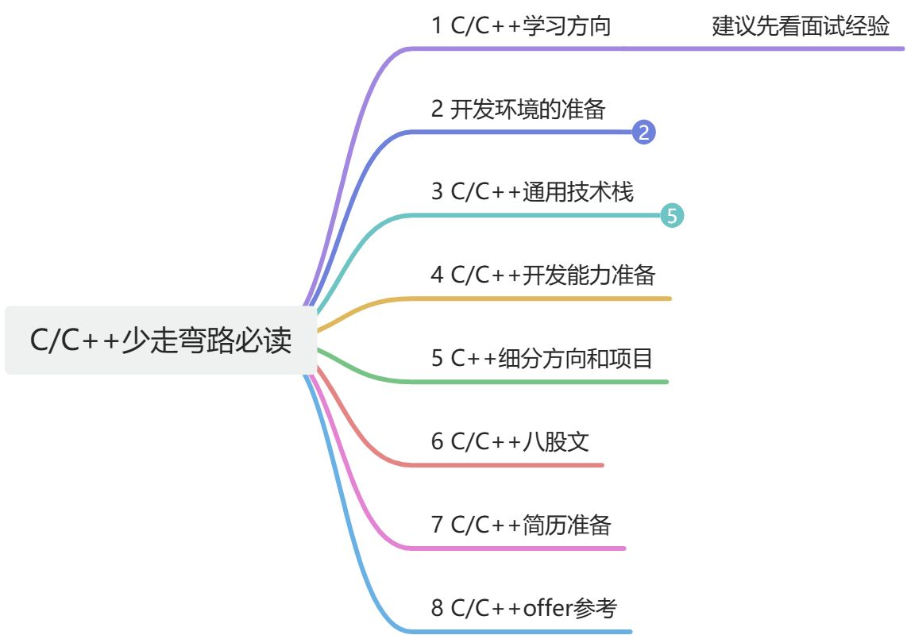

# C/C++该如何学才能找到工作-最新2024版本

C/C++该如何学才能找到工作

# 1 学习方向
+ 面试经验
    - 先学习过来人的经验
+ 发展方向
    - 避免踩坑

# 2 C/C++开发环境的准备
+ VMware
    - 虚拟机：可以通过它来安装Ubuntu
+ Linux系统（Ubuntu）
    - 一般建议初学者安装在虚拟机
    - 也可以考虑购买云服务器
+ vscde
    - 远程Linux写代码
    - 也可以集成C/C++编译器进行单步调试
    - vscode结合AI写代码
        * 豆包Marscode体验官
+ xshell
    - 通过ssh连接Linux系统
    - 可以拖文件传输到Linux系统
+ surceinsight
    - 阅读大型项目利器
+ beynd cmpare
    - 文件比较
+ everything
    - 文件查找利器
+ MySQL安装
    - 不同的版本有不同的坑
+ Java安装
    - 比如kafka需要Java环境
+ Git配置SSH密钥
    - 减少重复输入密码
+ 

# 3 C/C++核心技术栈准备
+ 数据结构算法
+ C++
+ 设计模式
+ 操作系统原理
+ Linux命令
+ Linux系统编程
+ Linux网络编程

# 4 C/C++开发能力准备
+ 需求分析能力	
+ 代码构建能力
+ 错误调试能力
+ 项目优化能力
+ 大型源码阅读能力
    - redis
    - workflow等

# 5 C/C++细分方向和项目准备
+ C++后台方向
    - webserver
    - 仿写redis缓存开发
    - 仿写leveldb
    - 即时通讯项目
+ 音视频方向
    - 播放器
    - 录屏推流
    - 音视频通话等
+ QT方向
    - QT基础
    - QT高级内容
    - QT开源项目

# 6 C/C++八股文准备
+ 八股文准备误区
+ 八股文准备有效方法
+ 可编辑的C++八股文

# 7 C/C++简历准备
+ 简历准备
+ 简历修改
+ 面试复盘

> 更新: 2025-05-17 19:45:41  
> 原文: <https://www.yuque.com/linuxer/gscfv1/nfa0gpmtotngte7o>