# 第03章 Linux文件 IO

**<font style="color:blue;background-color:#FFFF00;">B站 程序员老廖</font>** **编辑整理**， **需要配套代码加我微信**：**<font style="color:red;background-color:#FFFF00;">laoliao6668</font>** **获取。**


**<font style="color:red;background-color:#FFFF00;">一站式从0快速学习Linux编程，比视频更高效的Linux图文学习教程。</font>** 


# 3 Linux文件IO
“万物皆文件”（[Everything](https://so.csdn.net/so/search?q=Everything&spm=1001.2101.3001.7020) is a file）是Linux系统中的一种哲学思想和[设计原则](https://so.csdn.net/so/search?q=设计原则&spm=1001.2101.3001.7020)。它表达了在Linux系统中，所有设备、进程、网络连接、文件和目录等各种实体都被抽象为**文件的概念**，通过文件系统进行统一管理和访问的思想。

文件IO也称为系统调用IO，是操作系统为"用户态"运行的进程和硬件交互提供的一组接口，即操作系统内核留给用户程序的一个接口，按照操作系统的结构划分，Linux系统自上而下依次是：**用户进程、Linux内核、物理硬件**。其中Linux内核包括系统调用接口和内核子系统两部分。Linux内核处于“承上启下”的关键位置，向下管理物理硬件，向上为操作系统和应用程序提供接口，**这里的接口就是系统调用**。

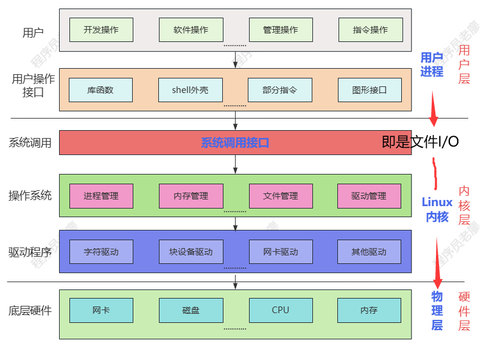


## 3.1 文件描述符
在对文件进行读写操作之前，首先需要打开文件。内核会为每个进程维护一个打开文件的列表，该列表称为文件表(file table)。文件表是由一些非负整数进行索引， 这些非负整数称为**文件描述符(**file descriptors, 简称fds)。

文件描述符用于定位所要操作的文件，位于 虚拟内存空间中的内核区。调用系统IO函数open会返回打开的文件的文件描述符。  
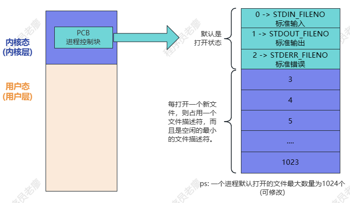


打开文件会返回文件描述符，而后续操作(读写等)都把文件描述 符作为基本参数。

 文件描述符使用C语言的int类型表示。 每个Linux进程可打 开的文件数是有上限的。文件描述符的范围从0开始，到上限值减1。默认情况下，上限值为1024，但是可以对它进行配置，可以通过查看`/proc/sys/fs/file-max` 文件来获取系统级的建议值。 当函数出错时通常会返回-1。

 按照惯例，每个进程都至少包含三个文件描述符：0、1和2，文件描述符：

+ 0表示标准输入(sdtin)  -> STDIN_FILENO
+ 1表示标准输出(stdout) -> STDOUT_FILENO
+ 2表示标 准错误(stderr) -> STDERR_FILENO。


一般而言：

+ stdin是连接到终端的输入设备(通常是用户键盘)
+ stdout和stderr是终端的屏幕。

用户可以重定向这些文件描述符，甚至可以通过管道把一个程序的输出作为另一个程序的输入(管道章节进一步讲解)。


值得注意的是，文件描述符并非局限于访问普通文件。实际上，**文件描述符也可以访问**：

+ 设备文件
+ 管道
+ 快速用户空间互斥(futexes)
+ 先进先出缓冲区(FIFOs) 
+ 套接字(socket)。
+ ....


**遵循一切皆文件的理念**，几乎任何能够读写的东西都可以通 过文件描述符来访问。

默认情况下，子进程会维护一份父进程的文件表副本。在该副本中，打开文件列表及其访问模式、当前文件位置以及其他元数据，都和父进程维护的文件表相同，但是存在一点区别：即当子进程关闭一个文件时，不会影响到父进程的文件表。

虽然一般情况下子进程会自己持有一份文件表，但是子进程和父进程也可以共享文件表(类似于线程间共享),在后续章节将对此进行更详细的介绍。

## 3.2 打开文件
最基本的文件访问方法是系统调用read()和write()。但是，在访问文件之前，必须先通过open()或create()打开该文件。一旦完成文件读写，还应该调用系统调用close()关闭该文件。


### 3.2.1 open函数
在Linux中，使用`open`函数进行文件操作时，需要包含`<fcntl.h>`和`<unistd.h>`头文件。

`open`函数的原型为：

```c
#include <fcntl.h>
#include <unistd.h>
int open(const char *pathname, int flags, mode_t mode);
```

`pathname` 是要打开或创建的文件的路径。

`flags` 参数用于指定打开文件的方式，常见的标志有（**不用一一记忆，用到再查询**）：

+ `O_RDONLY` ：以只读方式打开。 RD是read简写
+ `O_WRONLY` ：以只写方式打开。WR是write简写
+ `O_RDWR` ：以读写方式打开。
+ `O_CREAT` ：如果文件不存在则创建。
+ `O_EXCL` ：与 `O_CREAT` 一起使用，如果文件已存在则出错。
+ `O_TRUNC`：使用该标志O_TRUNC的时候，调用open函数打开文件的时候会将文件原本的内容全部丢弃，文件大小变为0。
+ `O_APPEND`：使用O_APPEND标志方法，如果open函数携带并使用了O_APPEND标志，调用open函数打开文件，当每次使用write()函数对文件进行读写操作时，都会自动把文件当前位置偏移量移动到文件末尾，从文件末尾开始写入数据，也就是意味着每次写入数据都是从文件末尾开始。
+ `O_NONBLOCK`： 如果路径名指向 FIFO/块文件/字符文件，则把文件的打开和后继 I/O设置为非阻塞模式。

`mode` 参数用于指定新建文件的权限（仅当使用 `O_CREAT` 标志创建文件时有效）。权限可以使用八进制数表示，例如 `0644` 表示**文件所有者有读写权限**，**同组用户和其他用户有读权限**。mode参数常见的宏定义有**(这个不建议去记忆，用到的时候再查文档**)：

+ `S_IRUSR`：所有者具有读权限。
+ `S_IWUSR`：所有者具有写权限。
+ `S_IXUSR`：所有者具有执行权限。
+ `S_IRGRP`：组用户具有读权限。
+ `S_IWGRP`：组用户具有写权限。
+ `S_IXGRP`：组用户具有执行权限。
+ `S_IROTH`：其他用户具有读权限。
+ `S_IWOTH`：其他用户具有写权限。
+ `S_IXOTH`：其他用户具有执行权限。


#### O_CREAT|O_WRONLY标志使用
演示如何使用 `open` 函数创建一个只写的新文件（文件存在则删除原文件）：

范例：3-open_creat_wronly.c

```c
#include <fcntl.h>
#include <unistd.h>
#include <stdio.h>

int main() {
    int fd = open("new_file.txt", O_CREAT | O_WRONLY, 0644);
    //等价于 int fd = open("new_file.txt", O_CREAT | O_WRONLY, (S_IRUSR | S_IWUSR) | (S_IRGRP) | (S_IROTH));
    // S_IRUSR S_IWUSR 所有者读写权限， S_IRGRP用户组读权限，S_IROTH其他用读权限
    if (fd == -1) {//如果 open 调用失败，它会返回 -1
        perror("open");
        return 1;
    }
    printf("fd = %d\n", fd);
    // 在此处可以对文件进行读写操作
    // 先写入数据
    //向文件描述符 fd 指向的文件写入字符串 "Hello, world!"，写入的字节数应该是 13。
    int len =  write(fd, "Hello, world!", 13);
    if(len == -1 || len!= 13) { //如果写入失败（返回值为 -1）或者写入的字节数不等于 13
        perror("write");
        return 1;
    }
    // 尝试读取数据
    char buf[1024];
    len = read(fd, buf, sizeof(buf));
    if(len == -1) {//由于文件是以只写模式打开的，这个读取操作会失败，read 会返回 -1
        perror("read");     // 读取失败，因为这个文件是只写的属性O_WRONLY
    }  

    close(fd);  //关闭文件描述符 fd 对应的文件，释放相关资源。
    printf("close(%d)\n", fd);
    return 0;
}
```

在上述示例中，使用 `O_CREAT` 标志创建了一个名为 `new_file.txt` 的新文件，文件的权限被设置为 `0644` 。如果 `open` 函数调用失败，会通过 `perror` 函数输出错误信息。最后，使用 `close` 函数关闭文件描述符。

编译命令：gcc -o 3-open_creat_wronly 3-open_creat_wronly.c 

运行输出：


#### O_CREAT | O_EXCL | O_WRONLY标志使用
 以下是一个在 Linux 中使用 `open` 函数结合 `O_EXCL` 选项的编程范例（如果原文件存在则报错）：

范例：3-open_creat_excl_wronly.c

```c
#include <stdio.h>
#include <fcntl.h>
#include <unistd.h>
#include <errno.h>
#include <sys/stat.h>

int main() {
    int fd;
    // 定义权限模式
    mode_t mode = (S_IRUSR | S_IWUSR) | (S_IRGRP) | (S_IROTH);
    // 尝试以 O_CREAT 和 O_EXCL 打开文件
    fd = open("example.txt", O_CREAT | O_EXCL | O_WRONLY, mode);
    if (fd == -1) {
        perror("open");
        // 如果文件已存在，会返回错误
        if (errno == EEXIST) {
            printf("文件已存在\n");
        }
        return 1;
    } else {
        printf("文件创建成功\n");
    }
    // 关闭文件
    close(fd);
    return 0;
}
```

在上述代码中：

1. 首先，包含了必要的头文件。
2. 然后，在 `main` 函数中，定义了一个 `mode_t` 类型的变量 `mode` ，并通过位运算将所需的权限宏组合起来。
3. 接着，使用 `open` 函数尝试打开或创建一个名为 `example.txt` 的文件。`O_CREAT` 表示如果文件不存在则创建，`O_EXCL` 表示如果文件已存在则返回错误。`O_WRONLY` 表示以只写方式打开。
4. 如果 `open` 函数调用失败（返回 `-1` ），则通过 `perror` 函数输出错误信息。如果错误码是 `EEXIST` ，表示文件已存在。
5. 最后，使用 `close` 函数关闭文件。

**需要重点关注的是：**`O_EXCL`** 选项的作用是在文件已存在时返回错误，这有助于避免意外覆盖已有的文件。**

编译命令：gcc -o 3-open_creat_excl_wronly 3-open_creat_excl_wronly.c 

运行输出：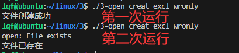


#### O_CREAT | O_WRONLY | O_APPEND标志使用
以下是一个在 Linux 中使用 `open` 函数以**O_APPEND追加模式**打开文件的编程范例：

范例：3-open_wronly_append.c

```c
#include <stdio.h>
#include <fcntl.h>
#include <sys/stat.h>
#include <sys/types.h>

int main() {
    int fd;
    // 定义权限模式
    mode_t mode = (S_IRUSR | S_IWUSR) | (S_IRGRP) | (S_IROTH);
    // 以追加模式打开文件
    fd = open("example.txt", O_CREAT | O_WRONLY | O_APPEND, mode);
    if (fd == -1) {
        perror("open");
        return 1;
    }
    // 关闭文件
    close(fd);
    return 0;
}
```

在上述代码中：

1. 在 `main` 函数中，定义了一个 `mode_t` 类型的变量 `mode` ，并通过位运算将所需的权限宏组合起来，得到常见的权限模式。
2. 接着，使用 `open` 函数以追加模式（`O_APPEND`）打开或创建一个名为 `example.txt` 的文件。`O_CREAT` 表示如果文件不存在则创建，`O_WRONLY` 表示以只写方式打开。
3. 如果 `open` 函数调用失败（返回 `-1` ），则通过 `perror` 函数输出错误信息并返回 `1` 。
4. 使用`write`函数写入字符串。
5. 最后，使用 `close` 函数关闭文件。

**需要重点关注的是 **`O_APPEND`** 这个标志，它实现了追加模式的打开。**


编译命令：gcc -o 3-open_wronly_append 3-open_wronly_append.c 

运行输出：


#### O_TRUNC | O_WRONLY标志使用
以下是一个在 Linux 中使用 `open` 函数并结合 `O_TRUNC` 选项的编程范例：

范例：3-open_wronly_trunc.c

```c
#include <stdio.h>
#include <fcntl.h>
#include <unistd.h>

int main() {
    // 文件名
    // 不使用 O_TRUNC, 使用O_APPEND 以只写方式打开文件
    int fd_without_trunc = open("example_without_trunc.txt", O_WRONLY | O_APPEND, 0644);
    if (fd_without_trunc!= -1) {
        write(fd_without_trunc, "This is new content\n", 21);
        close(fd_without_trunc);
    } else {
        perror("open without trunc");
    }

    // 使用 O_TRUNC 以只写方式打开文件
    int fd_with_trunc = open("example_with_trunc.txt",  O_WRONLY | O_TRUNC, 0644);
    if (fd_with_trunc!= -1) {
        write(fd_without_trunc, "This is new content\n", 21);
        close(fd_with_trunc);
    } else {
        perror("open with trunc");
    }

    return 0;
}
```

其中：

+ `O_TRUNC` 表示如果文件存在则截断其长度为 0 。
+ `O_WRONLY` 表示以只写方式打开。
+ `0644` 是设置的文件权限。

**需要重点关注的是 **`O_TRUNC`** 选项的作用，它会截断文件的长度。**

编译命令： gcc -o 3-open_wronly_trunc 3-open_wronly_trunc.c 

运行输出：

1. 先创建两个测试文件

```plain
touch example_without_trunc.txt | echo "darren" > example_without_trunc.txt
touch example_with_trunc.txt | echo "darren" > example_with_trunc.txt

# 命令查看文件创建情况
ls -al example_*
-rw-rw-r-- 1 lqf lqf 7 Sep 18 22:13 example_without_trunc.txt
-rw-rw-r-- 1 lqf lqf 7 Sep 18 22:13 example_with_trunc.txt
```

2. 运行程序：  


### 3.2.2 creat函数
**（了解就行，不需要运行）**

在 Linux 中，使用 `creat` 函数进行文件操作时，需要包含 `<fcntl.h>` 头文件。


函数原型：

```plain
#include <fcntl.h>
int creat(const char *pathname, mode_t mode);
```

`creat` 函数只能以只写方式创建新文件，**如果文件已存在则会将其截断为 0 长度**（一定要谨慎使用）：

+ `pathname`：要创建的文件的路径名。
+ `mode`：指定创建文件的权限模式，与 `open` 函数中的 `mode` 参数类似。
+ 和 `open` 的区别：
    - 典型的creat()调用如下：  
int fd;  
fd =creat(filename,0644); 
    - 这段代码等效于：  
int fd;  
fd =open(filename, O_WRONLY |O_CREAT | O_TRUNC,0644);

范例：3-creat.c

```c
#include <stdio.h>
#include <fcntl.h>
#include <unistd.h>

int main() 
{
    int fd;
    fd = creat("newfile.txt", 0644);
    if (fd == -1) {
        perror("creat");
        return 1;
    }
    // 关闭文件
    close(fd);
    return 0;
}
```

**需要重点关注的是：**`creat`** 函数的功能相对单一，而 **`open`** 函数更灵活，在实际使用中要根据具体需求选择。**


### 3.2.3 返回值错误码
`open` 函数成功时返回一个文件描述符（非负整数），失败时返回 `-1` 。


范例：

```c
#include <stdio.h>
#include <fcntl.h>
#include <errno.h>
#include <string.h>
#include <unistd.h>
int main() 
{
    int fd;
    fd = open("nonexistent.txt", O_RDONLY);
    if (fd == -1) {
        printf("Error: %s\n", strerror(errno));  //相当于perror("Error");
        perror("2 Error"); //这里的2只是用来区分当前两次错误打印
        return 1;
    }
    close(fd);
    return 0;
}
```

在上述代码中，通过 `strerror(errno)` 函数将 `errno` 转换为对应的错误字符串并打印输出。


## 3.3 通过read()读文件
最基础、最常见的读取文件机制是调用read()，

函数原型： 

```c
#include <unistd.h>
ssize_t read(int fd, void *buf, size_t count);
```

每次调用read()函数，会从fd指向的文件的当前偏移开始读取len字节到buf所指 向的内存中。

参数说明：

+ `fd`：文件描述符，指定要读取的文件。
+ `buf`：指向用于存储读取数据的缓冲区。
+ `count`：指定要读取的最大字节数。

返回值说明：

+ 成功读取到数据时，返回实际读取的字节数。
+ 到达文件末尾时（不再有数据可读），返回 0 。
+ 出错时，返回-1，此时可以通过 `errno` 获取错误码，。

fd的文件位置指针会向前移动，移动的长度由读取到的字节数决定。如果fd 所指向的对象不支持seek操作(比如字符设备文件),则读操作总是从“当前” 位置开始。


### 3.3.1 返回值
对于read()而言，**返回小于len的非零正整数是合法的**。在很多情况下会出现该现象：

+ 可用的字节数少于len；
+ 系统调用可能被信号打断；
+ 管道可能被破坏(如果fd指向的是管道)等。


使用read()时，还需要考虑返回值为0的情况。**当到达文件末尾(end-of-file, EOF) 时**，read()返回0，在这种情况下，没有读取任何字节。EOF并不表示出错，它仅仅表示文件位置已经到达文件结尾，因此没有数据可读了。


但是，如果调用是要读取len个字节，但是没有一个字节可读，调用会阻塞, 直到有数据可读(假定文件描述符**以阻塞模式打开的**)才返回。 

+ 注意，这种阻塞模式和返回EOF不同。也就是说，“没有数据可读”和“到达数据结尾”是两个不同的概念。对于EOF,表示到达了文件的结尾。对于阻塞模式， 表示读操作在等待更多的数据，例如从socket或设备文件读取数据。


**有些错误是可以恢复的（不能认为返回-1就一定是要退出程序，需要判断errno值）**。比如，当read()调用在读取任何字节之前被信号打断，它会返回-1，并把errno值设置成EINTR。 在这种情况下，可以且应该重新调用read继续请求读取数据。


 实际上，调用read()有很多可能结果：

+ 调用返回值等于len。读取到的所有len个字节都被存储在buf中。结果和预期的一致。
+ 调用返回值小于len但大于0。读取到的字节被存储到buf中。这种情况有很多原因：
    - 比如在读取过程中信号中断或在读取中出错，可读的数据大于0字节小于len字节，在读取len字节之前到达EOF。
+ 调用返回0，表示EOF，没有更多可读的数据。
+ 阻塞模式下，由于当前没有数据可读取会进入阻塞状态**（如果不知道什么是阻塞和非阻塞，百度下阻塞和非阻塞IO）**。
+ 调用返回-1：并把errno设置成EINTR。这表示在读取任何字节之前接收到信号。调用可以重新执行。
+ 调用返回-1，并把errno设置成EAGAIN。这表示由于当前没有数据可读取， 这种情况只在非阻塞模式下发生。
+ 调用返回-1，并把errno设置成非EINTR或EAGAIN的一个值。这表示更严重的错误。重新执行读操作也不会成功，这种情况下就认为是异常出错了。


以下是 Linux `read` 函数判断返回值并处理 `errno` 为 `EINTR`、`EAGAIN` 等情况的范例代码。

范例：3-read_return.c

```c
#include <stdio.h>
#include <fcntl.h>
#include <unistd.h>
#include <errno.h>

int main() {
    int fd;
    char buf[1024];
    ssize_t n;

    fd = open("your_file.txt", O_RDONLY);
    if (fd < 0) {
        perror("Open error");
        return 1;
    }
    // 正常读取到内容的时候不会进入while循环内部
    //这种是非常严谨的写法，就是文件有内容并一定要读取到的时候才这么写
    while ((n = read(fd, buf, sizeof(buf))) < 0) {
        if (errno == EINTR) {
            printf("Interrupted by signal\n");
            continue;
        } else if (errno == EAGAIN) {
            // 处理可重试的情况
            // 例如等待一段时间后再尝试读取
            sleep(1);
            continue;
        } else {
            perror("Read error");
            break;
        }       
    }
    printf("Read %zd bytes: %s", n, buf);
    close(fd);
    return 0;
}
```


编译命令：gcc -o 3-read_return 3-read_return.c

运行输出：  
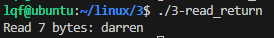


### 3.3.2 读入所有字节
 诚如前面所描述的，由于调用read()会有很多不同情况，如果希望处理所有错误并且真正每次读入len个字节(至少读到EOF)，那么之前简单“粗暴”的read()调用并不合理。要实现这一点，需要有个循环和一些条件语句。

范例：3-read_all.c

```c
#include <stdio.h>
#include <fcntl.h>
#include <unistd.h>
#include <errno.h>

int main() {
    int fd;
    char buf[1024];
    ssize_t n;
 

    fd = open("your_file.txt", O_RDONLY);

    while ((n = read(fd, buf, sizeof(buf)))!= 0) {
        if (n < 0) {
            if (errno == EINTR) {
                printf("Interrupted by signal\n");
                continue;
            } else if (errno == EAGAIN) {
                // 处理可重试的情况
                // 例如等待一段时间后再尝试读取
                sleep(1);
                continue;
            } else {
                perror("Read error");
                break;
            }
        }  
        // 处理读取到的数据
        printf("Read %zd bytes: %s", n, buf);
    }

    close(fd);
    return 0;
}
```


### 3.3.3 非阻塞读
有时，开发人员不希望read()调用在没有数据可读时阻塞在那里。相反地，他们希望调用立即返回，表示没有数据可读。这种方式称为非阻塞I/O,它支持应用以非阻塞模式执行I/O操作。

设置非阻塞模式的方式：open()调用中指定参数为O_NONBLOCK。非阻塞模式下如果没有数据可读取，read()直接返回-1并将errno 值为EAGAIN，所以此时必须检查EAGAIN, 否则可能因为丢失数据导致严重错误。

范例：3-read_nonblock.c

```c
#include <stdio.h>
#include <fcntl.h>
#include <unistd.h>
#include <errno.h>

int main() {
    int fd;
    char buf[1024];
    ssize_t n;
 

    fd = open("your_file.txt", O_RDONLY | O_NONBLOCK);

    while ((n = read(fd, buf, sizeof(buf)))!= 0) { 
        if (n < 0) {
            if (errno == EINTR) {
                printf("Interrupted by signal\n");
                continue;
            } else if (errno == EAGAIN) {   //比如网络没有可读数据，或者是网络拥塞
                printf("Resource temporarily unavailable, try again later.\n");
                // 处理可重试的情况
                // 例如等待一段时间后再尝试读取
                sleep(1);
                continue;
            } else {
                perror("Read error");
                break;
            }
        }  
        // 处理读取到的数据
        printf("Read %zd bytes: %s", n, buf);
    }

    close(fd);
    return 0;
}
```


  **非阻塞I/O的意义在于捕捉EAGAIN 的情况，并执行其他逻辑。**

编译命令：gcc -o 3-read_nonblock 3-read_nonblock.c

运行输出：  


### 2.2.4其他错误码
其他错误码指的是编程错误或(对EIO而言)底层问题。read()调用执行失败后， 可能的errno值包括：

+ EBADF：给定的文件描述符非法或不是以可读模式打开。 
+ EFAULT：buf指针不在调用进程的地址空间内。 
+ EINVAL：文件描述符所指向的对象不允许读。 
+ EIO：底层I/O错误。


## 3.4 通过write()写文件
 写文件，最基础最常见的系统调用是write()。

**函数原型：**

```c
#include<unistd.h>
ssize_t write(int fd,const void*buf,size_t count);
```

write()调用会从文件描述符fd指向的文件的当前位置开始，将buf中至多count个 字节写入到文件中。不支持seek的文件(如字符设备)总是从起始位置开始写。

**参数说明：**

+ fd:是文件描述符（write所对应的是写，即就是1）
+ buf:通常是一个字符串，需要写入的字符串
+ count：是每次写入的字节数

**返回值：**

成功：返回写入的字节数，并更新文件位置。如果返回0则只是表示写入0个字节。  
失败：返回-1并设置errno，  
注意：写常规文件时，write的返回值通常等于请求写的字节数count，而向终端设备或者网络写时则不一定。

```c
#include <stdio.h>
#include <unistd.h>
#include <fcntl.h>
#include <errno.h>

int main() {
    int fd;
    char buf[] = "Hello, World!";
    ssize_t n;

    fd = open("your_file.txt", O_WRONLY | O_CREAT, 0644);

    n = write(fd, buf, sizeof(buf));

    if (n < 0) {
        if (errno == EINTR) {
            // 处理被中断的情况
        } else {
            perror("Write error");
        }
    } else if (n < sizeof(buf)) {
        // 处理写入数量小于传入数量的情况，比如网络的时候，需要把还没有传入的数据缓存起来等后续再写入
    }

    close(fd);
    return 0;
}
```

 编译命令： gcc -o 3-write 3-write.c 

运行输出：  
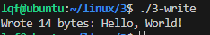


可以`cat your_file.txt`   查看文件写入情况。


### 3.4.1 部分写
和read()调用的部分读场景相比，write()调用不太可能会返回部分写。此外，write() 系统调用不存在EOF的场景。对于普通文件，除非发生错误，write()操作保证会执行整个写请求。  
因此，对于普通文件，不需要执行循环写操作。

但是，对于其他的文件类型，比如 **socket**，需要循环来保证写了所有请求的字节。使用循环的另一个好处是第二次调用write()可能会返回错误值，说明第一次调用为什么只执行了部分写(虽然这种情况并不常见)。以下是write()调用示例代码（**这里只是先了解有这么一回事**，在socket编程时，如果write只写入部分数据可以考虑先缓存到用户FIFO，等该fd可写事件产生的时候再写入数据）：

```c
ssize_t ret, nr;
while (len!= 0 && (ret = write(fd, buf, len))!= 0) {
    if (ret == -1) {
        if (errno == EINTR) {
            continue;
        }
        perror("write");
        break;
    }
    len -= ret;
    buf += ret;
}
```


### 3.4.2 append（追加模式）
当以Append模式(参数设置O_APPEND)打开文件描述符时，**写操作不是从文件描述符的当前位置开始，而是从当前文件的末尾开始**。

举个例子，假设有两个进程都想从文件的末尾开始写数据。这种场景很常见：比如很多进程共享的事件日志。刚开始，这两个进程的文件位置指针都正确地指向文件末尾。

+ 第一个进程开始写，如果不采用Append模式，一旦第二个进程也开始写， 它就不是从“当前”文件末尾开始写，而是从“之前”文件末尾(刚开始指向的文件末尾，即第一个进程开始写数据之前)开始写。这意味着如果缺乏显式的同步机制，多个进程由于会发生竞争问题，不能同时向同一个文件追加写。
+ Append模式可以避免这个问题。它保证了**文件位置指针总是指向文件末尾**，因此即使存在多个写进程，所有的写操作还是能够保证是追加写。Append模式可以理 解成在每次写请求之前的文件位置更新操作是个原子操作。更新文件位置，指向新写入的数据末尾。这和下一次write()调用无关，因为更新文件位置是自动完成的，但如果由于某些原因下一次执行的是read()调用，那会有些影响。


### 3.4.3 非阻塞写
以非阻塞模式(参数设置O_NONBLOCK)打开文件，当发起写操作时，系统调用write()会返回-1,并设置errno值为EAGAIN。请求可以稍后重新发起。一般而言：

+ 对于普通文件，不会出现这种情况
+ 但对于socket就有可能返回-1，并设置errno值为EAGAIN。


范例：3-write_nonblock.c

```c
#include <stdio.h>
#include <fcntl.h>
#include <unistd.h>
#include <errno.h>

int main() {
    int fd = open("example.txt", O_WRONLY | O_NONBLOCK | O_CREAT, 0644);
    if (fd == -1) {
        perror("open");
        return -1;
    }

    char buffer[] = "This is a test data for non-blocking write.";
    ssize_t bytes_written = write(fd, buffer, sizeof(buffer) - 1);

    if (bytes_written == -1) {
        if (errno == EAGAIN || errno == EWOULDBLOCK) {
            printf("Write would block. Try again later.\n");
        } else {
            perror("write");
        }
    } else {
        printf("%zd bytes written successfully.\n", bytes_written);
    }

    close(fd);

    return 0;
}
```

编译命令：gcc -o 3-write_nonblock 3-write_nonblock.c 

运行输出：  
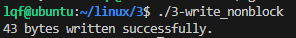


### 3.4.4 其他错误码
其他值得注意的errno值包括**（了解下就行）**：

+ EBADF：给定的文件描述符非法或不是以写方式打开。
+ EFAULT：buf指针指向的位置不在进程的地址空间内。
+ EFBIG：写操作将使文件大小超过进程的最大文件限制或内部设置的限制。EINVAL给定文件描述符指向的对象不支持写操作。
+ EIO：底层I/O错误。
+ ENOSPC：给定文件描述符所在的文件系统没有足够的空间。
+ EPIPE：给定的文件描述符和管道或socket关联，读端被关闭。进程还接收SIGPIPE信号。SIGPIPE信号的默认行为是终止信号接收进程。因此，只有当进程显式选择忽略、阻塞或处理该信号时，才会收到该errno值。


### 3.4.5 write()行为


当write()调用返回时，内核已经把数据从提供的缓冲区中拷贝到**内核缓冲区**中，**但不保证数据已经写到目的地**。 

然后，在后台，内核收集所有这样的“脏”缓冲区(即内核缓冲区存储的数据比磁盘上的数据新)，进行排序优化，然后把这些缓冲区写到磁盘上(这个过程称为回写writeback)。通过这种方式，write()可以频繁调用并立即返回。这种方式还支持内核把写操作**推迟**到系统空闲时期，**批处理很多写操作**（**批量写能提升吞吐量，但副作用是带来延迟**）。

延迟写并没有改变POSIX语义。举个例子，假设要对一份刚写到缓冲区但还没写到磁盘的数据执行读操作，请求响应时会直接读取缓冲区的数据，而不是读取磁盘上的“陈旧”数据。这种方式进一步提高了效率，因为对于这个读请求，是从内存缓冲区而不是从硬盘中读的。如期望的那样，读写请求相互交织，而结果也和预期一致——当然，前提是在数据写到磁盘之前，系统没有崩溃!虽然应用可能认为写操作已经成功了，在系统崩溃情况下，数据却没有写入到磁盘。


延迟写的另一个问题是对某些I/O错误的提示信息不准确。在回写时产生的任何I/O错误，比如物理磁盘驱动出错，都不能报告给发起写请求的进程。实际上，内核内“脏”缓冲区和进程无关。**多个进程可能会“弄脏”(即更新)同一片缓冲区中的数据**，进程可能在数据仅被写到缓冲区尚未写到磁盘的时候就退出了。进程操作失败，如何“事后”与之通信呢?

对于这些潜在问题，内核试图最小化延迟写带来的风险。为了保证数据按时写入，**内核设置了“最大缓存时效”(maximum buffer age**)，并在超出给定时效前将所有脏缓存的数据写入磁盘。用户可以用过/proc/sys/vm/dirty_expire_centisecs来配置这个值（以百分之一秒为单位（微妙us））默认是3000，换算成秒为0.003秒。

**大白话：write()函数的调用不能保证数据百分百写入到磁盘。但也只有在系统异常或者磁盘异常的情况下才会发生数据丢失的问题。**

知识扩展：[Linux cache参数调优 - 知乎 (zhihu.com)](https://zhuanlan.zhihu.com/p/136237953)


## 3.5  同步I/O
同步IO的定义：某一IO操作，要么已成功完成到磁盘的数据传递，要么被诊断为不成功。

Linux定义的两种同步IO完成类型（此处用英文，因为译者也忍无可忍用了原文…）

+ synchronized IO data integrity completion：确保针对文件的一次更新传递了**足够的信息（部分文件元数据）**到磁盘，以便于之后对数据的获取。
+ synchronized IO file integrity completion：确保针对文件的一次更新传递了**所有的信息（所有文件元数据）**到磁盘，即使有些在后续对文件数据的操作并不需要。

**什么是部分文件元数据？**


写缓冲（批量写）带来了极大的写性能提升 ，然而，**有时应用**希望能够控制何时把数据写到磁盘（比如word编辑文件**点击保存文档时**）。在这种场景下，Linux内核提供了一些选择，可以牺牲性能换来同步操作，Unix系统提供了sync、fsync和fdatasync三个函数来实现相应的功能。


### 3.5.1 fsync()和fdatasync()
为了确保数据写入磁盘，最简单的方式是使用系统调用fsync(),在POSIX.1b标准 中定义如下：

```c
#include <unistd.h> 

int fsync(int fd);
```

系统调用fsync()可以确保和文件描述符fd所指向的文件相关的所有脏数据都会回写到磁盘上。文件描述符fd必须以写方式打开。该调用会回写数据和元数据（元数据：比如创建的时间戳以及索引节点中的其他属性）。该调用在硬件驱动器确认**回写数据和元数据**已经全部写到磁盘之前不会返回。


**对于包含写缓存的硬盘**，fsync()无法知道数据是否已经真正在物理磁盘上了。硬盘会报告说数据已经写完了，但是实际上数据还在硬盘驱动器的写缓存上。好在，在硬盘驱动器缓存中的数据会很快写入到磁盘上。


Linux还提供了系统调用fdatasync():

```c
#include <unistd.h> 

int fdatasync(int fd);
```

 fdatasync()的功能和 fsync()类似，其区别在于 fdatasync()只会写入数据以及以后要访问文件所需要的元数据。例如，调用fdatasync()会写文件的大小，因为以后要读该文件需要文件大小这个属性。**fdatasync()不保证非基础的元数据也写到磁盘上**， 因此一般而言，它执行更快。对于大多数使用场景，除了最基本的事务外，不会考虑元数据如文件修改时间戳，因此fdatasync()就能够满足需求，而且执行更快。


sync还会同步文件的描述信息（metadata，包括size、访问时间st_atime & st_mtime等等），因为文件的数据和metadata通常存在硬盘的不同地方，因此fsync至少需要两次IO写操作：一是回写修改的数据，二是更 新索引节点的修改时间戳。因为索引节点和文件数据在磁盘上可能不 是紧挨着———因而会带来代价很高的seek操作——在很多场景下，关 注正确的事务顺序，但不包括那些对于以后访问文件无关紧要的元数 据(比如修改时间戳),使用 fdatasync()是提高性能的简单方式。


fdatasync的功能与fsync类似，但是仅仅在必要的情况下才会同步metadata，因此可以减少一次IO写操作。那么，什么是“必要的情况”呢？根据man page中的解释：

> "fdatasync does not flush modified metadata unless that metadata is needed in order to allow a subsequent data retrieval to be corretly handled."
>

举例来说，文件的大小（st_size）如果变化，是需要立即同步的，否则OS一旦崩溃，即使文件的数据部分已同步，由于metadata没有同步，依然读不到修改的内容。而最后访问时间(atime)/修改时间(mtime)是不需要每次都同步的，只要应用程序对这两个时间戳没有苛刻的要求，基本无伤大雅。

**PS：open时的参数O_SYNC/O_DSYNC有着和fsync/fdatasync类似的语义：使每次write都会阻塞等待硬盘IO完成**。（实际上，Linux对O_SYNC/O_DSYNC做了相同处理，没有满足Posix的要求，而是都实现了fdatasync的语义）相对于fsync/fdatasync，这样的设置不够灵活，应该很少使用。


**PS：需要同步的时候优先使用fsync，只有当fsync性能不足的时候再考虑使用fdatasync，实际测试两个函数性能差别不大。**


**返回值和错误码**

成功时，两个调用都返回0。失败时，都返回-1,并设置errno 值为以下三个值之一（了解即可，不用背）： 

+ EBADF：给定文件描述符不是以写方式打开的合法描述符。 
+ EINVAL：给定文件描述符所指向的对象不支持同步。
+ EIO：在同步时底层I/O出现错误。这表示真正的I/O错误，经常在发生错误处被捕获。


在 POSIX  标准中，fsync() 是必要的，而 fdatasync()  是可选的，因此在所有常见的 Linux文件系统上，都应该为普通文件实现fsync()系统调用。但是，特殊的文件类 型(比如那些不需要同步元数据的)或不常见的文件系统可能只实现了fdatasync() 系统调用。


### 3.5.2  sync()
sync()系统调用用来对磁盘上的**所有缓冲区进行同步**，虽然它效率不高，但还是被广泛应用：

```c
#include  <unistd.h>
void  sync(void);
```


该函数没有参数，也没有返回值。它总是成功返回，并确保所有的缓冲区：包括数据和元数据，都能够写入磁盘。


对于 Linux 而言，sync()一定是等到所有缓冲区都写入了才返回。

 In the Linux implementation, sync() returns only after all data has been transferred  
to the disk device (or at least to its cache).


还是需要提一下：硬盘可能会“撒谎”,通知内核缓冲区已经写到磁盘上了，而实际上它们还在**磁盘的缓存**中。


描述符指定的数据同步到磁盘中。注意，当系统繁忙时，sync()  操作可能需要几分钟甚至更长的时间才能完成。

**老廖注：这里存在一定的争论，有技术文档说sync要等磁盘的缓存都写入才返回，也有技术文档说sync已经和fsync语义一直，就是触发回写就返回。**  

+ 从3.5.3的测试结果上看，sync()性能更差，应该是等磁盘的缓存写入了才返回。


### 3.5.3 fsync()/fdatasync()/sync()性能测试
再说一次，一般使用fsync()即可，不用考虑那么多。

性能测试范例：3-write_fsync_fdatasync.c

```c
#include <stdio.h>
#include <stdlib.h>
#include <time.h>
#include <unistd.h>
#include <fcntl.h>

#define BUFFER_SIZE 4096
#define NUM_WRITES 10000

int main() {
    char buffer[BUFFER_SIZE];
    int fd;
    int ret;
    clock_t start, end;
    double cpu_time_used;

    // 不使用 fsync 的情况
    fd = open("no_fsync_file.txt", O_WRONLY | O_CREAT | O_TRUNC, 0644);
    if (fd == -1) {
        perror("open");
        return 1;
    }

    start = clock();    // 开始计时,单位一般是微妙
    for (int i = 0; i < NUM_WRITES; i++) {
        write(fd, buffer, BUFFER_SIZE);
    }
    close(fd);
    end = clock();
    cpu_time_used = ((double) (end - start)) / CLOCKS_PER_SEC;
    printf("不使用 fsync，写入 %d 次耗时：%f 秒\n", NUM_WRITES, cpu_time_used);

    // 使用 fsync 的情况
    fd = open("with_fsync_file.txt", O_WRONLY | O_CREAT | O_TRUNC, 0644);
    if (fd == -1) {
        perror("open");
        return 1;
    }

    start = clock();
    for (int i = 0; i < NUM_WRITES; i++) {
        write(fd, buffer, BUFFER_SIZE);
        ret = fsync(fd);
        if (ret == -1) {
            perror("fsync for with_fsync_file.txt");
            close(fd);
            return 1;
        }
    }
    close(fd);
    end = clock();
    cpu_time_used = ((double) (end - start)) / CLOCKS_PER_SEC;
    printf("使用 fsync，写入 %d 次耗时：%f 秒\n", NUM_WRITES, cpu_time_used);

    // 使用 fdatasync 的情况
    fd = open("with_fdatasync_file.txt", O_WRONLY | O_CREAT | O_TRUNC, 0644);
    if (fd == -1) {
        perror("open");
        return 1;
    }

    start = clock();
    for (int i = 0; i < NUM_WRITES; i++) {
        write(fd, buffer, BUFFER_SIZE);  
        ret = fdatasync(fd);
        if (ret == -1) {
            perror("fdatasync for with_fdatasync_file.txt");
            close(fd);
            return 1;
        }
    }
    close(fd);
    end = clock();
    cpu_time_used = ((double) (end - start)) / CLOCKS_PER_SEC;
    printf("使用 fdatasync %d 次耗时：%f 秒\n", NUM_WRITES, cpu_time_used);

    // 使用 sync 的情况
    fd = open("with_sync_file.txt", O_WRONLY | O_CREAT | O_TRUNC, 0644);
    if (fd == -1) {
        perror("open");
        return 1;
    }

    start = clock();
    for (int i = 0; i < NUM_WRITES; i++) {
        write(fd, buffer, BUFFER_SIZE);  
        sync();
    }
    close(fd);
    end = clock();
    cpu_time_used = ((double) (end - start)) / CLOCKS_PER_SEC;
    printf("使用 sync %d 次耗时：%f 秒\n", NUM_WRITES, cpu_time_used);

    return 0;
}
```

编译命令：gcc -o 3-write_fsync_fdatasync 3-write_fsync_fdatasync.c

运行输出：  


## 3.6 直接I/O
`O_DIRECT` 标志在 Linux 的 `open` 函数中常用于对磁盘 I/O 性能和数据一致性有严格要求的场景，**如数据库、高性能存储系统等**。技术要点包括内存对齐、缓冲区管理等。

高性能的应用可能希望越过这个复杂的层次结构，进行独立的I/O 管理。但是，创建一个自己的I/O系统往往会事倍功半，实际上，操作系统层的工具往往比应用层的工具有更好的性能。此外，数据库系统往往倾向于使用自己的缓存，以尽可能减少操作系统带来的开销。

**大白话**：**应用层缓存好完整的一块或多块数据后**调用write接口写入磁盘。

**这个平时开发用的少，开发数据库/高性能存储才需要考虑，先了解有这么一回事就行。**

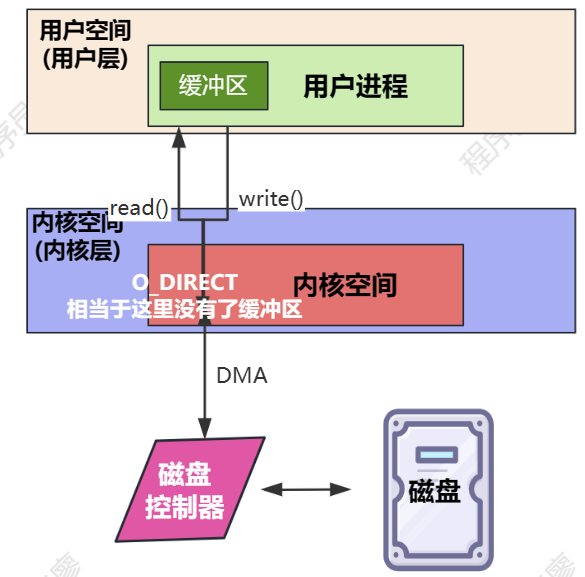


## 3.7 关闭文件
当程序完成对某个文件的操作后，可以通过系统调用close()取消文件描述符到对应文件的映射：

```c
#include <unistd.h> 

int close(int fd);
```

系统调用close()会取消当前进程的文件描述符fd与其关联的文件之间的映射。调用后，先前给定的文件描述符fd不再有效，内核可以随时重用它，当后续有open()调用或creat()调用时，重新把它作为返回值。close()调用在成功时返回0,出错时返回-1,并相应设置errno值。close()的用法很简单：

```c
if(close(fd)==-1)
    perror("close")
```

值得一提的是，关闭文件操作并非意味着该文件的数据已经被写到磁盘。如果应用希望保证关闭文件之前数据已经写入磁盘，它需要使用先前在3.5节中讨论的同步选项。


## 3.8 用lseek()查找
一般情况下，I/O 是线性的，由于读写引发的隐式文件位置更新都需要seek操作。但是，某些应用要跳跃式读取文件，需要随机访问而不是线性访问。lseek()系统调用能够将文件描述符的位置指针设置成指定值。Iseek()只更新文件位置，没有执行其他操作，也并不初始化任何I/O:

```c
//头文件
#include <sys/types.h> 
#include  <unistd.h>
//函数定义
off_t  lseek(int  fd,off_t  pos,int origin);
```

我们打开一个文件时，需要一个读写位置，一般打开时这个读写位置指向文件的开头，而`lseek`用来控制文件的读写位置这个函数允许程序在文件中向前或向后移动读写指针，而不需要实际读取或写入数据，在处理大型文件或需要随机访问文件时非常有用。

参数说明：

+ `fd`：文件描述符，是一个非负整数，表示要操作的文件。
+ `offset`：偏移量，表示从`whence`指定的位置开始移动的字节数。它可以是正数（向前移动），负数（向后移动），或者0（在`whence`指定的位置）。
+ `whence`：指定`offset`的起始位置，可以是以下三个值之一：
    - `SEEK_SET`：文件的开头，`offset`从文件开头计算。
    - `SEEK_CUR`：当前位置，`offset`从当前文件位置计算。
    - `SEEK_END`：文件的末尾，`offset`从文件末尾计算。
    - 当`whence`值为`SEEK_CUR`或`SEEK_END`时,参数`offset`允许负值的出现.

返回值：

+ 成功时，`lseek`返回新的文件偏移量，即从文件开头到当前位置的字节数。
+ 失败时，返回`（off_t）-1`，并设置`errno`以指示错误。

### 使用特例
+ `lseek(int fd, 0, SEEK_SET)` ：读写位置移到文件开头
+ `lseek(int fd, 0, SEEK_END)` ：读写位置移到文件尾
+ `lseek(int fd, 0, SEEK_CUR)` ：获取当前文件的读写位置

使用`lseek`时需要注意的几点：

+ `lseek`不会改变文件的实际内容，只改变文件描述符的内部偏移量。
+ 如果`lseek`用于输出文件描述符，并且偏移量超出了当前文件的大小，文件大小将被扩展到新的偏移量。
+ 某些文件类型（如管道、设备文件）可能不支持`lseek`操作。

`lseek`是进行高效文件I/O操作的重要工具，特别是在需要随机访问文件数据时。


以下是使用 `lseek` 函数的 `SEEK_SET`、`SEEK_END` 和 `SEEK_CUR` 的范例代码。

范例：3-lseek.c

```c
#include <stdio.h>
#include <stdlib.h>
#include <fcntl.h>
#include <unistd.h>
#include <string.h>

int main() {
    int fd = open("data.txt", O_RDWR | O_CREAT, 0644);
    if (fd == -1) {
        perror("open");
        return 1;
    }

    // 写入一些数据
    const char *data = "0123456789";
    ssize_t bytesWritten = write(fd, data, strlen(data));

    if (bytesWritten == -1) {
        perror("write");
        close(fd);
        return 1;
    }
    // 使用 SEEK_SET 从文件开头读取
    off_t new_offset = lseek(fd, 1, SEEK_SET);
    if (new_offset == -1) {
        perror("lseek with SEEK_SET");
        close(fd);
        return 1;
    }
    char buffer[11];
    ssize_t bytesRead = read(fd, buffer, 10);
    buffer[bytesRead] = '\0';
    printf("Using SEEK_SET, offset: %zd, read: %s\n", new_offset, buffer);

    // 使用 SEEK_END 从文件末尾读取
    new_offset = lseek(fd, -5, SEEK_END);
    if (new_offset == -1) {
        perror("lseek with SEEK_END");
        close(fd);
        return 1;
    }
    bytesRead = read(fd, buffer, 2);   
    buffer[bytesRead] = '\0';
    printf("Using SEEK_END, offset: %zd, read: %s\n", new_offset, buffer);

    // 使用 SEEK_CUR 从当前位置读取
    new_offset = lseek(fd, 2, SEEK_CUR);
    if (new_offset == -1) {
        perror("lseek with SEEK_CUR");
        close(fd);
        return 1;
    }
    bytesRead = read(fd, buffer, 10);
    buffer[bytesRead] = '\0';
    printf("Using SEEK_CUR, offset: %zd, read: %s\n", new_offset, buffer);

    close(fd);
    return 0;
}
```


编译命令：gcc -o 3-lseek 3-lseek.c 

运行输出：  
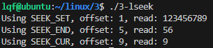


### 错误码（不用背，先了解）
lseek()调用出错时，返回-1,并将errno 值设置成如下四个值之一： 

+ EBADF：给定的文件描述符没有指向任何打开的文件描述符。 
+ EINVAL：origin的值不是设置成SEEK_SET 、SEEK_CUR 或 SEEK_END,  或者结果文件位置是负值。对于EINVAL, 如果同时出现以上两种错误就太糟了。前者几乎可以肯定是个编译时错误，后者则是不太明显的运行时逻辑错误。
+ EOVERFLOW：结果文件偏移不能通过off_t表示。只有在32位的体系结构上才会发生这种错误。 当前文件位置已经更新，该错误表示无法返回更新的值。
+ ESPIPE：给出的文件描述符和不支持查找操作的对象关联，比如管道、FIFO 或 socket.


## 3.9 文件截短
truncate()和 ftruncate()系统调用将文件大小设置为length参数指定的值，头文件和原型如下所示：

```c
#include <unistd.h>
#include <sys/types.h>

int truncate(const char *path, off_t length);
int ftruncate(int fd, off_t length);
```

若文件当前长度大于参数 length，调用将丢弃超出部分，若小于参数 length，调用将在文件尾部添加一系列空字节（扩展出的字节都是用0填充）。

这两个操作都不会修改当前文件位置。

举个例子，假设文件pirate.txt的长度是74字节，内容如下：

Edward Teach was a notorious English pirate, He was nicknamed Blackbeard.

在相同目录下，运行以下代码：

```c
#include <stdio.h>
#include <stdlib.h>
#include <fcntl.h>
#include <unistd.h>
#include <string.h>

int main() 
{
   int fd = open("pirate.txt", O_WRONLY | O_CREAT, 0644);
   if (fd == -1) {
       perror("open");
       return 1;
   }

   // 写入一些数据
   const char *data = "Edward Teach was a notorious English pirate, He was nicknamed Blackbeard.";
   ssize_t bytesWritten = write(fd, data, strlen(data)+1); // 注意要加上 1，因为字符串末尾还有一个空字符
   if (bytesWritten == -1) {
       perror("write");
       close(fd);
       return 1;
   }
   printf("bytesWritten: %zd\n", bytesWritten);
   close(fd);

   int ret;
   ret = truncate("pirate.txt", 45);
   if (ret == -1) {
       perror("truncate");
       return -1;
   }

   // 再次打开文件进行读取
   fd = open("pirate.txt", O_RDONLY);
   if (fd == -1) {
       perror("open");
       return 1;
   }

   char buffer[1024];
   ssize_t bytesRead = read(fd, buffer, sizeof(buffer));
   if (bytesRead == -1) {
       perror("read");
       close(fd);
       return 1;
   }

   buffer[bytesRead] = '\0';
   printf("Read: %s\n", buffer);
   close(fd);

   return 0;
}
```

编译命令：./3-truncate 

运行输出：其执行结果是生成了一个45字节的文件，内容如下： Edward Teach was a noterious English pirate,

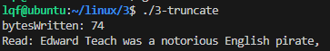


## 3.10 删除文件
在 Linux 中，删除文件主要使用`remove`函数。以下是其用法及示例：

**函数原型**：

```c
    #include <unistd.h>
    int unlink(const char *pathname);
```

**功能**：`pathname`：这是一个字符串类型的参数，表示要删除的文件的路径。需要确保调用进程对包含该文件的目录具有足够的访问权限，以便能够删除文件。

**返回值**：

+ 如果删除成功，函数返回 0。
+ 如果删除失败，函数返回 -1，并设置相应的错误码，可以使用`errno`全局变量来获取错误码。常见的错误原因包括文件不存在、权限不足、文件正在被其他进程使用等

**与其他函数的比较**:

+ 与`remove`函数类似，在 Linux 下开发时经常用于删除文件。当`remove`函数的`pathname`参数指定为文件时，相当于调用`unlink`删除文件链接；当`remove`的`pathname`指定为目录时，相当于调用`rmdir`删除目录。
+ 下个章节缓存I/O再讲解`remove`。

**示例代码**：

```c
#include <stdio.h>
#include <unistd.h>
#include <fcntl.h>

int main() {
    const char *filename = "test.txt";
    int fd = open(filename, O_WRONLY | O_CREAT, 0644);
    if (fd == -1) {
        perror("open");
        return 1;
    }
    close(fd);

    
    int ret = unlink(filename);
    if (ret == 0) {
        printf("1 文件 %s 已成功删除。\n", filename);
    } else {
        perror("1 删除文件时出现错误");
    }

    ret = unlink(filename);
    if (ret == 0) {
        printf("2 文件 %s 已成功删除。\n", filename);
    } else {
        perror("2 删除文件时出现错误");
    }

    return 0;
}
```

编译命令：gcc -o 3-unlink 3-unlink.c 

运行输出：  
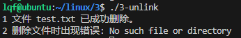


## 3.11 其他函数
opendir：打开目录

closedir：关闭目录

rmdir：删除目录

mkdir：创建目录

readdir：读取目录

这些需要用到的时候再看了。


## 3.12 工程案例
这里的工程案例只是了解，不需要做过多的记忆。

### Linux如何监听某个目录下有新文件产生
**应用场景：**

1. **视频监控系统**：
    - **场景描述**：视频监控摄像头会不断地录制视频，并将视频文件保存到一个特定的存储目录中。监控系统需要及时检测到新的视频文件产生，以便进行存储、分析或者报警等操作。
    - **案例**：一个工厂的视频监控系统由多个摄像头组成，这些摄像头将录制的视频文件保存到一个服务器的存储目录中。监控软件会监听这个目录，当有新的视频文件产生时，软件会自动对视频进行分析，检测是否有异常情况，如人员闯入、设备故障等。如果检测到异常，会立即触发报警通知安保人员进行处理。
2. **图片处理服务**：
    - **场景描述**：在一个图片处理系统中，用户可以将图片上传到一个特定的目录中。系统需要自动检测到新的图片文件产生，并进行一系列的处理操作，如图片压缩、格式转换、添加水印等。
    - **案例**：一个在线图片分享平台允许用户上传图片。当用户上传图片到平台的服务器目录时，平台的图片处理服务会监听这个目录。一旦有新的图片文件出现，服务会自动对图片进行处理，包括调整图片大小以适应不同的设备显示、进行图片压缩以减少存储空间和加载时间、添加平台的水印等操作。处理后的图片会被存储在另一个目录中，供用户浏览和分享。


**使用**`poll`**或**`select`**结合文件描述符监控**

1. **基本原理**：
    - 可以通过打开要监听的目录，并使用`poll`或`select`函数来监控目录的文件描述符是否有可读事件。当有新文件创建时，目录的内容会发生变化，导致文件描述符变为可读状态。
    - 然后通过读取目录内容来判断是否有新文件产生。
2. **代码实现3-monitor_dir.c（该代码也能监听当前目录某个文件修改）**

```c
#include <stdio.h>
#include <stdlib.h>
#include <sys/inotify.h>
#include <sys/types.h>
#include <sys/stat.h>
#include <fcntl.h>
#include <unistd.h>
#include <errno.h>

#define EVENT_SIZE  ( sizeof (struct inotify_event) )
#define BUF_LEN     ( 1024 * ( EVENT_SIZE + 16 ) )
#define EVENT_NUM  12

const char *event_str[EVENT_NUM] =
{
    "IN_ACCESS",
    "IN_MODIFY",
    "IN_ATTRIB",
    "IN_CLOSE_WRITE",
    "IN_CLOSE_NOWRITE",
    "IN_OPEN",
    "IN_MOVED_FROM",
    "IN_MOVED_TO",
    "IN_CREATE",
    "IN_DELETE",
    "IN_DELETE_SELF",
    "IN_MOVE_SELF"
};

void monitor_directory(int inotify_fd, const char *dir_path) {
    int wd = inotify_add_watch(inotify_fd, dir_path, IN_ALL_EVENTS);  

    if (wd < 0) {
        perror("inotify_add_watch for directory");
        return;
    }

    char buffer[BUF_LEN];
    int length, i = 0;
    while (1) {
        length = read(inotify_fd, buffer, BUF_LEN);
        if (length < 0) {
            perror("read for directory");
            break;
        }

        while (i < length) {
            struct inotify_event *event = (struct inotify_event *)&buffer[i];
            if (event->mask & IN_CREATE) {
                if (event->len) {
                    printf("New file created in directory: %s\n", event->name);
                }
            } else if (event->mask & IN_DELETE_SELF) {
                if (event->len) {
                    printf("Directory deleted: %s\n", event->name);
                }
            } else  if (event->mask & IN_DELETE) {
                if (event->len) {
                    printf("File deleted in directory: %s\n", event->name);
                }
            } else {
                printf("no handle event [0x%08x] in directory: %s, len = %d, name = %s \n",event->mask, event->name, event->len, event->name);
            }
            i += EVENT_SIZE + event->len;
        }
        i = 0;
    }

    inotify_rm_watch(inotify_fd, wd);
}


int main(int argc, char *argv[])
{	
    if(argc < 2)
    {
        fprintf(stderr, "Usage: %s path\n", argv[0]);
        
        return -1;
    }
    printf("inotifyTask argv[1] = %s\n", argv[1]);
    int inotify_fd = inotify_init();
    if (inotify_fd < 0) {
        perror("inotify_init");
        return 1;
    }
    monitor_directory(inotify_fd, argv[1]);
    printf("inotifyTask inotify_fd = %d\n", inotify_fd);
    close(inotify_fd);

    return 0;
} 
```

编译命令：gcc -o 3-monitor_dir 3-monitor_dir.c 

运行输出：  
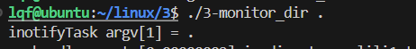


其中 . 代表当前的目录，可以使用touch命令在当前命令创建文件查看打印。


> 更新: 2025-04-28 15:14:40  
> 原文: <https://www.yuque.com/linuxer/gscfv1/rlc09yopy9s5hcse>