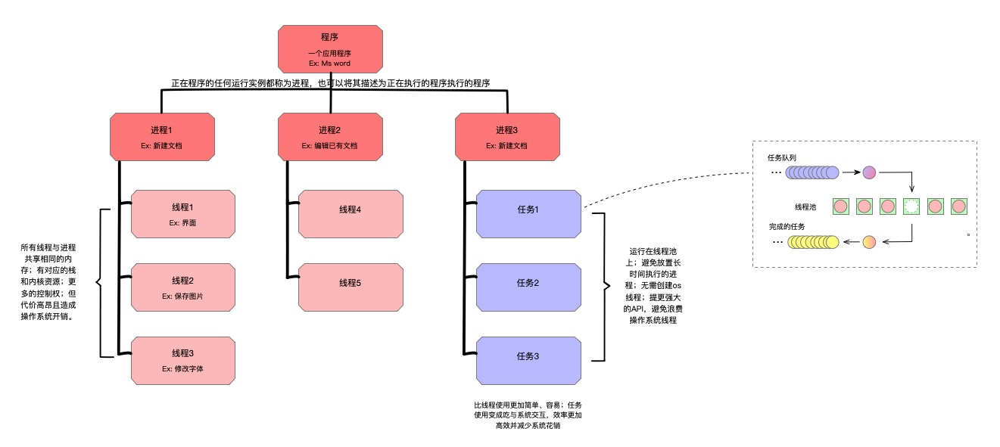

# 第05章 Linux进程管理

**<font style="color:blue;background-color:#FFFF00;">B站 程序员老廖</font>** **编辑整理**， **需要配套代码加我微信**：**<font style="color:red;background-color:#FFFF00;">laoliao6668</font>** **获取。**


**<font style="color:red;background-color:#FFFF00;">一站式从0快速学习Linux编程，比视频更高效的Linux图文学习教程。</font>** 


进程是Linux系统中仅次于文件的基本抽象概念。当目标代码执行时，正在运行的进程不仅仅是汇编代码，而是由数据、资源、状态和虚拟的计算机组成。

# 1 程序、进程和线程


图来自于：[程序、进程、线程和任务之间关系 | iBit程序猿](https://ibit.tech/archives/program-process-thread-task-relation)


### 程序（Program）
程序是静态的概念，它是编译后的可执行二进制代码文件，存放在磁盘等存储介质上，不具备运行的动态特性。例如你提到的 `/bin/ls` 是一个用于列出目录内容的命令程序，`/usr/bin/X11` 这里可能表述不太准确，`/usr/bin/X11` 通常是一个目录路径，而在这个目录下会包含许多和 X Window 系统相关的二进制程序，像用于图形界面显示和交互的一些工具程序。程序本身就像一份 “菜谱”，放在那里等待被执行。

### 进程（Process）
进程是程序在操作系统中的一次执行过程，是系统进行资源分配和调度的基本单位，是动态的概念。当你执行一个程序时，操作系统会为其创建一个进程。进程包含以下几个重要组成部分：

+ **二进制镜像**：也就是程序的可执行代码，被加载到内存中准备运行。
+ **虚拟内存实例**：每个进程都有自己独立的虚拟地址空间，操作系统通过虚拟内存管理机制将虚拟地址映射到物理内存上，这样每个进程感觉自己拥有整个内存空间，互不干扰。
+ **内核资源**：进程可能会打开一些文件、网络套接字等，这些资源由内核进行管理和分配，例如进程使用 `open` 系统调用打开一个文件，内核会为其分配文件描述符来管理该文件。
+ **安全上下文**：进程会关联一个用户和用户组，以此来确定其访问权限，例如不同用户的进程对文件和系统资源的读写权限不同。
+ **线程**：线程是进程内的执行单元，每个线程包含自己的虚拟存储器，包括栈、进程状态如寄存器，以及指令指针。单线程进程中只有一个线程负责执行程序代码，多线程进程中则有多个线程并行或并发执行。

### 线程（Thread）
线程是进程中的一个执行流，是 CPU 调度和分派的基本单位。

+ **单线程进程**：在单线程进程中，进程和线程基本等同，进程内只有一个执行流，按顺序执行程序的指令。例如一个简单的 C 语言程序，没有使用多线程库，它运行时就是一个单线程进程。
+ **多线程进程**：多线程进程允许在一个进程内同时执行多个任务。**所有线程共享进程的虚拟内存地址空间**，这意味着**它们可以访问相同的全局变量和堆内存**，方便数据共享和通信。但同时也带来了一些问题，比如多个线程同时访问和修改共享数据可能会导致数据不一致，需要使用同步机制（如互斥锁、信号量等）来保证线程安全。每个线程有自己独立的栈空间，用于存储局部变量和函数调用信息，还有自己的寄存器状态和指令指针，以记录当前的执行位置。


# 2 进程ID
在 Linux 系统中，每个进程都由一个唯一的正整数来标识，这个数就是进程 ID（Process ID，简称 PID）。PID 是操作系统用来区分不同进程的重要标识，系统会确保在任意时刻，**每个 PID 只对应一个进程**，从而保证系统能够准确地对各个进程进行管理和调度。

## 2.1 进程 ID 的分配规则
+ **分配范围**：PID 通常是一个正整数，一般从 1 开始分配。PID 为 1 的进程是 `init` 进程（在较新的系统中是 `systemd`），它是系统启动后的第一个进程，负责初始化系统环境、启动其他系统服务等，是所有其他进程的祖先。
+ **循环使用**：当进程结束后，其对应的 PID 会被释放，之后可以被重新分配给新创建的进程。系统会优先使用较小的可用 PID 进行分配。不过，为了避免新创建的进程和刚结束的进程使用相同的 PID 而导致混淆，系统会有一定的延迟机制，确保在一段时间内不会重复使用刚释放的 PID。

## 2.2 查看进程 ID 的方法
在 Linux 系统中，可以使用多种命令来查看进程的 PID。

+ `ps`** 命令**：`ps` 命令用于显示当前系统中运行的进程信息。例如，使用 `ps -ef` 可以列出所有进程的详细信息，其中包括 PID。

```bash
ps -ef | grep my_program
```

这个命令会列出所有进程信息，并通过 `grep` 过滤出包含 `my_program` 的进程信息，其中会显示该进程的 PID。

+ `top`** 命令**：`top` 命令是一个动态的进程监控工具，它会实时显示系统中各个进程的资源使用情况，包括 PID。启动 `top` 命令后，在输出界面中可以看到每个进程的 PID 以及其他相关信息。
+ `pgrep`** 命令**：`pgrep` 命令可以根据进程名直接查找对应的 PID。例如：

```bash
pgrep my_program
```

该命令会返回名为 `my_program` 的进程的 PID。


## 2.3 进程体系
**创建新进程的那个进程称为父进程，而新进程被称为子进程**。**每个进程都是由其他进程创建的(除了 init  进程),** 因此每个子进程都有一个父进程。这种关系保存在 每个进程的父进程ID 号 (**ppid**)  中。

PS: init 进程由内核启动的用户级进程，Linux系统中的第一个用户级进程，负责初始化系统环境和启动其他进程。它的作用类似于操作系统的引导程序，是系统的起点和管理者。


## 2.4 pid_t
从编程角度看，进程ID 是由数据类型pid_t来表示的，pid_t 在头文件`<sys/types.h>`  中定义。pid_t 对应的具体的C 语言类型是与机器的体系结构相关的，并且在任何C  语言标准中都没有定义它。但是，在Linux中 ，pid_t 通常定义为C 语言的int类型。


## 2.5 获取进程ID和父进程ID
系统调用getpid() 会返回调用进程的进程ID, 用法如下：

```c
#include <sys/types.h>
#include <unistd.h> 

pid_t getpid(void);
```


系统调用getppid() 会返回调用进程的父进程ID, 用法如下：

```c
#include <sys/types.h>
#include <unistd.h>  

pid_t getppid(void);
```


这两个系统调用都不会返回错误，因此，使用很简单：

```c
#include <stdio.h>
#include <unistd.h>

int main() {
    pid_t pid = getpid();
    pid_t ppid = getppid();

    printf("当前进程 ID：%d\n", pid);
    printf("父进程 ID：%d\n", ppid);

    return 0;
}
```


# 3 运行新进程
在 Linux中，把程序载入内存并执行程序映像的操作与创建新进程的操作是分离的。一次系统调用会把二进制程序加载到内存中，替换地址空间原来的内容，并开始执行。这个过程称为“执行 (executing)”   **一个新的程序，是通过一系列 exec 系统调用来完成。**


同时，另一个不同的系统调用是用于创建一个新的进程，**它基本上相当于复制其父进程。**

通常情况下，新的进程会立即执行新的程序。创建新进程的操作称为派生 (fork)，是系统调用**fork()**来完成这个功能。在新进程中执行一个新的程序需要两个步骤：

+ 首先，创建一个新的进程，
+ 然后，通过 exec 系统调用把新的二进制程序加载到该进程中。

下面，我们先来讲解 exec 系统调用，然后再探讨fork()。


## 3.1 exec系统调用
**这些函数先大致了解就行了，真正用到深入看看函数说明。**


实际上在Linux中，并不存在exec()的函数形式，exec指的是一组函数，一共有6个，分别是：

```plain
int execl(const char *path, const char *arg, ...);
int execlp(const char *file, const char *arg, ...);
int execv(const char *path, char *const argv[]);
int execle(const char *path, const char *arg, ..., char *const envp[]);
int execve(const char *path, char *const argv[], char *const envp[]);
int execvp(const char *file, char *const argv[]);
```


它们在头文件unistd.h中定义。其中只有**execve**是真正意义上的系统调用，其它都是在此基础上经过包装的库函数。

参数说明：

+ path：可执行文件的路径名字
+ arg：可执行程序所带的参数，第一个参数为可执行文件的名字，没有带路径且必须以NULL结束
+ file：如果file中包含/，则将其视为路径名，否则就将其按环境变量处理，在它所指定的目录中搜寻可执行文件。

返回值：  
exec函数族的**执行成功后，不会返回**。调用失败时，会设置errno并返回-1，然后从源程序的调用点接着往下执行。

 **范例**

1. 使用 `execl`：

```c
#include <unistd.h>

int main() {
    // 使用 execl 执行 ls 命令
    execl("/bin/ls", "ls", "-l", NULL);
    perror("execl failed");
    return 1;
}
```

2. 使用 `execlp`：

```c
#include <unistd.h>

int main() {
    // 使用 execlp 在环境变量 PATH 中搜索 ls 命令并执行
    execlp("ls", "ls", "-l", NULL);
    perror("execlp failed");
    return 1;
}
```

3. 使用 `execv`：

```c
#include <unistd.h>

int main() {
    char *args[] = {"ls", "-l", NULL};
    // 使用 execv 执行 ls 命令
    execv("/bin/ls", args);
    perror("execv failed");
    return 1;
}
```

4. 使用execle：

```c
#include <unistd.h>

int main() {
    // 设置新程序的环境变量
    char *envp[] = {"MYVAR=myvalue", NULL};
    // 使用 execle 执行 /bin/echo 命令，并传递参数和环境变量
    execle("/bin/echo", "echo", "Hello, World!", NULL, envp);
    perror("execle failed");
    return 1;
}
```

5. 使用execve：

```c
#include <unistd.h>

int main() {
    char *argv[] = {"ls", "-l", NULL};
    char *envp[] = {"MYVAR=myvalue", NULL};

    // 使用 execve 执行 ls -l 命令，并设置环境变量
    execve("/bin/ls", argv, envp);
    perror("execve failed");
    return 1;
}
```


6. 使用 `execvp`：

```c
#include <unistd.h>

int main() {
    char *args[] = {"ls", "-l", NULL};
    // 使用 execvp 在环境变量 PATH 中搜索 ls 命令并执行
    execvp("ls", args);
    perror("execvp failed");
    return 1;
}
```

注意，当一个 `exec` 函数成功执行时，它不会返回。**只有在发生错误时，才会返回 -1**，并设置 `errno` 来指示错误类型。同时，在执行新程序之前，**应该确保新程序的路径和参数正确，并且当前进程有足够的权限执行新程序。**


## 3.2 fork()系统调用
通过fork()系统调用，可以创建一个和当前进程映像一样的进程：

```c
#include <sys/types.h> 

#include <unistd.h>

pid_t fork(void);
```

当fork()调用成功时，会创建一个新的进程，它几乎与调用fork()的进程完全相同。 这两个进程都会继续运行，调用者进程从 fork()返回后，还是照常运行。


新进程称为原进程的“子进程”,原进程称为“父进程”。在子进程中，成功的fork() 调用会返回0。在父进程中，fork()会返回子进程的pid。除了一些本质性区别，父 进程和子进程之间在其他各个方面都完全相同：

● 子进程的 pid是新分配的，与父进程不同。

●  子进程的ppid会设置为父进程的pid。

● 子进程中的资源统计信息(Resource statistics) 会清零。

●  所有挂起的信号都会清除，也不会被子进程继承

● 所有文件锁也都不会被子进程所继承。


出错时，不会创建子进程，fork()返回-1,并相应设置errno 值。errno 有两种可能值：

+ EAGAIN  表示系统资源不足，无法创建新的进程。例如，可能是系统打开的文件描述符数量达到上限；
+ ENOMEM   内核内存不足，无法满足所请求的操作。


fork()系统调用的用法如下：

```c
#include <stdio.h>
#include <unistd.h>

int main() {
    pid_t pid = fork();

    if (pid == -1) {
           // 判断错误类型并输出
        switch (errno) {
            case EAGAIN:
                fprintf(stderr, "Fork failed due to insufficient resources.\n");
                break;
            case ENOMEM:
                fprintf(stderr, "Fork failed due to insufficient memory.\n");
                break;
            default:
                perror("Fork failed");
                break;
        }
        return 1;
    } else if (pid == 0) {
        // 子进程代码
        printf("I am the child process. My PID is %d.\n", getpid());
    } else {
        // 父进程代码
        printf("I am the parent process. My PID is %d. Child PID is %d.\n", getpid(), pid);
    }

    return 0;
}
```

在这个例子中，首先调用`fork`函数创建一个子进程。`fork`函数返回值有三种情况：

+ 如果返回值为 -1，表示创建子进程失败。
+ 如果返回值为 0，表示当前是子进程在执行代码。
+ 如果返回值为一个正整数，表示当前是父进程在执行代码，这个正整数是子进程的进程 ID。

子进程和父进程都会继续执行后续的代码，但可以通过判断`fork`的返回值来执行不同的逻辑。在这个例子中，子进程和父进程分别输出不同的信息来表明自己的身份。


最常见的fork()用法是创建一个新的进程，**载入新的二进制映像**   类似shell 为用 户创建一个新进程，或者一个进程创建了一个辅助进程。首先，该进程创建了新的 进程，而这个新建的子进程会执行一个新的二进制可执行文件的映像。这种“派生 /执行”的方式很常见，而且非常简单。下面的例子创建了一个新的进程来运行/bin/ls:

```c
#include <stdio.h>
#include <unistd.h>
#include <sys/wait.h>

int main() {
    pid_t pid = fork();

    if (pid == -1) {
        perror("Fork failed");
        return 1;
    } else if (pid == 0) {
        // 子进程执行代码
        char *args[] = {"ls", "-l", NULL};
        execv("/bin/ls", args);
        perror("Execv failed");
        return 1;
    } else {
        // 父进程执行代码
        int status;
        wait(&status);
        if (WIFEXITED(status)) {
            printf("Child process exited with status %d.\n", WEXITSTATUS(status));
        }
    }

    return 0;
}
```


除了创建了一个子进程外，父进程会照常继续运行。调用 execv()会使子进程运行 /bin/ls。


## 3.3 写时复制
在早期的Linux系统中，创建进程很简单，甚至有些过于简单。调用 fork()时，内核会复制所有的内部数据结构，复制进程的页表项，然后把父进程的地址空间按页(page-by-page)复制到子进程的地址空间中。糟糕的是，这种按页复制方式是十分耗时的。


现代Linux系统采取了更优的实现方式，采用了写 时复制 (copy-on-write,COW)   的方式，而不是对父进程空间进行整体复制。


写时复制是一种基于惰性算法的优化策略，为了避免复制时的系统开销。其前提假 设很简单：如果有多个进程要读取它们自己那部分资源的副本，那么复制是不必要 的。每个进程只要保存一个指向这个资源的指针就可以了。只要没有一个进程修改 自己的“副本”,每个进程就好像独占那个资源，从而避免了复制带来的开销。如 果某个进程想要修改自己的那份资源“副本”,就会开始复制该资源，并把副本提 供给这个进程。复制过程对进程而言是“透明”的。这个进程后面就可以反复修改 其持有的副本，而其他进程还是共享原来那份没有修改过的资源。这就是“写时复 制”这个名称的由来：只有在写入时才执行复制。


写时复制的主要好处在于：如果进程从未修改资源，则都不需要执行复制。一般来 说，惰性算法的好处就在于它们会尽量延迟代价高的操作，直到必要时才执行。

在使用虚拟内存的场景下，写时复制 (Copy-on-write) 是以页为基础执行的。所以， 只要进程没有修改其全部地址空间，就不需要复制整个地址空间。在 fork() 调用结 束后，父进程和子进程都以为自己有唯一的地址空间，实际上它们共享父进程的原 始页，这些页后面可能又会被其他的父进程或子进程共享。


写时复制在内核中的实现非常简单。这些页被标记为只读，并对内核页相关的数据 结构实现写时复制。如果有进程试图修改某个页，就会产生缺页中断。内核处理缺 页中断的处理方式就是对该页执行一次透明复制。这时，会清空该页的写时复制属 性，表示这个页不再被共享。现代的计算机结构体系中都在内存管理单元 (MMU) 提供了硬件级别的写时复制支持，所以实现是很容易的。


对于调用fork()创建进程的场景，写时复制有更大的优势。由于大量的fork 创建之 后都会紧接着执行 exec, 因此把整个父进程地址空间中的内容复制到子进程的地址 空间往往只是纯属浪费：如果子进程立刻执行一个新的二进制可执行文件的映像， 它先前的地址空间就会被交换出去。写时复制可以对这种情况进行优化。


## 3.4 vfork()
**知道有这么个函数就行。**

在实现对页写时复制之前，Linux的设计者们就一直很关注在fork 后立刻执行 exec 所造成的地址空间的浪费。因此，BSD的开发者们在BSD 3.0 系统中引入了vfork() 系统调用。

```c
#include <sys/types.h>
#include <unistd.h>   
pid_t vfork(void);
```

vfork()调用成功时，其执行结果和fork()是一样的，除了子进程会立即执行一次exec 系统调用，或者调用 exit()退出(将在下面的章节中讨论)。vfork()系统调用会通 过挂起父进程，直到子进程终止或执行新的二进制镜像，从而避免地址空间和页表 拷贝。在这个过程中，父进程和子进程共享相同的地址空间和页表项，并不使用写 时复制。实际上，vfork()调用只完成了一件事：复制内部的内核数据结构。因此， 子进程也就不能修改地址空间中的任何内存。


系统调用vfork() 是个历史遗留，Linux 系统本不应该实现它，虽然需要注意的是， 即使提供了写时复制机制，vfork()也比fork()快，因为它没有进行页表项的复制。 然而，写时复制的出现减弱了以vfork()替换fork()的争论。实际上，在Linux 内核 2.2.0之前，vfork()只是简单的fork()封装。由于对vfork()的需求要小于 fork(), 所 以vfork()的这种实现方式是可行的。


严格来讲，vfork()的所有实现都是有bug 的：考虑一下这种情况，如果 exec 调用 失败了，父进程将被一直挂起，直到子进程采取措施或退出。程序应该更倾向于使 用简单明了的fork()调用。


# 4 终止进程（大致了解）
## 4.1 exit终止进程
POSIX和C89 都定义了一个标准函数，可以终止当前进程：

```c
#include  <stdlib.h>

void  exit(int  status);
```

对 exit()的调用通常会执行一些基本的关闭步骤，然后通知内核终止这个进程。这 个函数无法返回错误值——实际上它也从不返回。因此在 exit()之后执行任何指令 都没有意义。


参数status **用于标识进程的退出状态**。其他程序比如shell用户，可以检查这个值。 具体来说，会返回给父进程status  &0377这个值。在本章后面，我们会具体讨论如 何获取这个返回值。

EXIT_SUCCESS 和EXIT_FAILURE这两个宏分别表示成功和失败，而且是可移植的。


在Linux中，0通常表示成功；非0值，如1或-1,表示失败。 因此，成功退出时，只需要简单地写上类似这样的一行代码：

exit(EXIT  SUCCESS);

在终止进程之前，C 库会按顺序执行以下关闭进程的步骤。

1. 调用任何由atexit()  或 on_exit() 注册的函数，和在系统中注册时顺序相反(我们 将在本章后面讨论这些函数)。
2. 清空所有已打开的标准I/O 流。
3. 删除由tmpfile() 函数创建的所有临时文件。


这些步骤完成了在用户空间需要做的所有工作，最后exit()会调用系统调用 exit(), 内核可以处理终止进程的剩余工作：

#include <unistd.h>

void  _exit(int  status);

当进程退出时，内核会清理进程所创建的、不再使用的所有资源。这包括但不局限 于：分配内存、打开文件和System V的信号量。清理完成后，内核会摧毁进程， 并告知父进程其子进程已经终止。


 exit()与_exit()函数最大的区别在于：

+ exit()函数在调用exit系统之前要检查文件的打开情况，把文件缓冲区的内容写回文件。由于Linux标准函数中，“缓冲I/O”的操作，其特征即对应每一个打开的文件，在内存中都有一片缓冲区。每次读文件时，会连续读出若干条记录，在下次读文件时就可以直接从内存的缓冲区读取；同样每次写文件的时候也仅仅是写入内存的缓冲区，等满足了一定的条件（如达到了一定数量或遇到特定字符等）,再将缓冲区中的内容一次性写入文件。这种技术大大增加了文件读写的速度。
+ 这时如果用_exit()函数直接将进程关闭，缓冲区的数据将会丢失。


范例

```c
#include
#include
int main()
{
   printf("第一条 hello\n");
   printf("第二条 hello");
   exit(0);
}
```


```plain
#include
#include
int main()
{
   printf("第一条 hello\n");
   printf("第二条 hello");
   _exit(0);
}
```

说明:printf函数就是使用缓冲I/O的方式，该函数在遇到“\n”换行符时自动的从缓冲区中将记录读出，所以exit()将缓冲区的数据写完后退出，而_exit()函数直接退出。 所以第二个代码 只打印了一条记录。


## 4.2 终止进程的其他方式
终止进程的典型方式不是通过显式系统调用，而是采用“直接跳到结束 (falling off the end)” 的方式。在C 和 C++语言中，当main()函数返回时会发生这种情况。然 而，这种直接跳到结束的方式还是会执行系统调用：编译器会在最后关闭代码后插 入隐式exit()调用。在main()函数返回时显式给出返回状态值，或者调用exit()函数， 这是一个良好的编程习惯。shell  会根据这个返回值来判断命令是否成功执行。注 意，成功时返回exit(0),  或者是从main()函数返回0。

### 通过信号终止
如果进程收到一个信号，并且这个信号对应的处理函数是终止进程，进程也会终止。

这样的信号包括SIGTERM  和 SIGKILL 。

最后一种进程终止方式是被内核强制终止。内核可以杀死执行非法指令、引起段错 误、耗尽内存、消耗资源过多的任何进程。

比如 kill命令发送SIGKILL 

```plain
kill -9 进程pid
```


### atexit()
系统调用 atexit() 是由POSIX 1003.1-2001所定义，Linux 也实现了该函数。它是用

来注册一些在进程结束时要调用的函数： 

```c
#include  <stdlib.h>
int atexit(void (*func)(void))
```

atexit()调用成功时，会注册指定的函数作为终止函数，在程序正常结束时(即进程 通过调用 exit()或从main()函数中返回)运行。如果进程调用了exec 函数，会清空 所注册的函数列表(这些函数不再存在于新进程的地址空间中)。如果进程是通过 信号结束，就不会调用这些注册的函数。


指定函数必须是无参的，且没有返回值。函数形式如下： void my_function(void);

函数调用的顺序和函数注册的顺序相反。也就是说，这些函数是存储在栈中，以后 进先出的方式调用 (LIFO) 。 注册的函数不能调用exit(), 否则会导致递归调用死 循环。如果需要提前结束进程，应该调用 exit()。一般不推荐这种行为，因为它会 使得一些重要的关闭函数不会被调用到。

```c
#include <stdio.h>
#include <stdlib.h>

void functionA ()
{
  printf("这是函数A\n");
}

int main ()
{
  /* 注册终止函数 */
  atexit(functionA );
  
  printf("启动主程序...\n");

  printf("退出主程序...\n");

  return(0);
}

```

很多时候我们需要在程序退出的时候做一些诸如释放资源的操作，但程序退出的方式有很多种，比如main()函数运行结束、在程序的某个地方用exit()结束程序、用户通过Ctrl+C或Ctrl+break操作来终止程序等等，因此需要有一种与程序退出方式无关的方法来进行程序退出时的必要处理。方法就是用atexit()函数来注册程序正常终止时要被调用的函数。


## 4.3 SIGCHLD
当一个进程终止时，内核会向其父进程发送 SIGCHILD 信号。默认情况下，父进程会忽略此信号量，也不会采取任何操作。但是，进程也可以选择通过signal() 或 sigaction() 系统调用来处理这个信号。这些系统调用和信号处理的精彩内容将会在后续章节讲解。


SIGCHILD 信号可能会在任意时刻产生，并在任意时刻被传递给父进程，因为对于 父进程而言，子进程的终止是异步的。通常情况下，父进程都希望能更多地了解到 子进程的终止，或者显式等待子进程终止。这可以通过系统调用来实现，我们将在 后面讨论这些调用。

**（这里先简单了解，在信号章节再深入）**

```c
#include <stdio.h>
#include <stdlib.h>
#include <unistd.h>
#include <sys/wait.h>
#include <signal.h>

void sigchld_handler(int signum) {
    printf("Received SIGCHLD signal.\n");
    // 在这里可以进行子进程终止后的清理工作
}

int main() {
    pid_t pid;

    // 设置 SIGCHLD 信号处理函数
    signal(SIGCHLD, sigchld_handler);

    pid = fork();
    if (pid == -1) {
        perror("Fork failed");
        return 1;
    } else if (pid == 0) {
        // 子进程
        printf("Child process with PID %d is running.\n", getpid());
        sleep(2);
        printf("Child process is exiting.\n");
        exit(0);
    } else {
        // 父进程
        printf("Parent process with PID %d is running.\n", getpid());
        // 父进程等待一段时间，以便接收 SIGCHLD 信号
        sleep(5);
    }

    return 0;
}
```

在这个例子中，父进程设置了`SIGCHLD`信号的处理函数。当子进程终止时，内核会向父进程发送`SIGCHLD`信号，触发信号处理函数的执行。父进程在子进程退出后继续运行一段时间，以便观察信号的接收情况


## 4.4 等待子进程终止
可以通过信号通知父进程，但是很多父进程想知道关于子进程终止的更多信息：**比如子进程的返回值**。


如果终止时，子进程完全消失了，父进程就无法获取关于子进程的任何信息。所以，Linux的最初设计者们做了这样的决定：如果子进程在父进程之前结束，内核应该把该子进程设置成特殊的进程状态。处于这种状态的进程称为僵尸(zombie) 进程。 僵尸进程只保留最小的概要信息：一些基本内核数据结构，保存可能有用的信 息。僵尸进程会等待父进程来查询自己的状态(这个过程称为在僵尸进程上等待)。 只有当父进程获取到了已终止的子进程的信息，这个子进程才会正式消失，不再处 于僵尸状态。


Linux内核提供了一些接口，可以获取已终止子进程的信息。其中最简单的一个是 wait(), 它 由POSIX所定义：

```c
#include <sys/types,h>

#include <sys/wait.h>

pid_t wait(int *status);
```

**调用wait()成功时，会返回已终止子进程的pid;  出错时，返回-1。**

如果没有子进程 终止，调用会阻塞，直到有一个子进程终止。如果有个子进程已经终止了，调用会立即返回。因此，当得到子进程终止信息后：比如接收到SIGCHLD信号，调用 wait()函数，就会立即返回，不会被阻塞。


出错时，errno 有两种可能的值：

+ ECHILD   调用进程没有任何子进程。
+ EINTR  在等待子进程结束时收到信号，调用提前返回。


简单范例：

```c
#include <stdio.h>
#include <stdlib.h>
#include <unistd.h>
#include <sys/wait.h>

int main() {
    pid_t pid;
    int status;

    pid = fork();
    if (pid == -1) {
        perror("Fork failed");
        return 1;
    } else if (pid == 0) {
        // 子进程
        printf("Child process running. PID: %d\n", getpid());
        sleep(2);
        printf("Child process exiting.\n");
        exit(42);
    } else {
        // 父进程
        printf("Parent process running. PID: %d\n", getpid());
        wait(NULL);
    }

    return 0;
}
```


**我们先学简单范例，以下复杂的范例先了解**

如果status 指针不是NULL, 那它包含了关于子进程的一些其他信息。由于POSIX 允许实现可以根据需要给status 定义一些合适的比特位来表示附加信息，POSIX标 准提供了一些宏来解释status 参数：

 **宏说明**

1. `WIFEXITED(status)`：
    - 如果子进程正常退出，即通过调用`exit`或`_exit`，或者从`main`函数中返回，这个宏会返回真。
    - 可以使用`WEXITSTATUS(status)`来获取子进程的退出状态码。
2. `WIFSIGNALED(status)`：
    - 如果子进程是被信号终止的，这个宏会返回真。
    - 可以使用`WTERMSIG(status)`来获取导致子进程终止的信号编号。
3. `WIFSTOPPED(status)`：
    - 如果子进程被停止（例如，通过信号`SIGSTOP`、`SIGTSTP`等），这个宏会返回真。
    - 可以使用`WSTOPSIG(status)`来获取导致子进程停止的信号编号。
4. `WIFCONTINUED(status)`：
    - 如果子进程因收到`SIGCONT`信号而继续执行，这个宏会返回真。


下面，让我们来看一个示例程序，它使用 wait()来确定其子进程的状态：

```c
#include <stdio.h>
#include <stdlib.h>
#include <unistd.h>
#include <sys/wait.h>

int main() {
    pid_t pid;
    int status;

    pid = fork();
    if (pid == -1) {
        perror("Fork failed");
        return 1;
    } else if (pid == 0) {
        // 子进程
        printf("Child process running. PID: %d\n", getpid());
        // 模拟不同情况
        // sleep(2);
        // exit(42);
        // raise(SIGTERM);
        // raise(SIGSTOP);
        // raise(SIGCONT);
    } else {
        // 父进程
        printf("Parent process running. PID: %d\n", getpid());
        wait(&status);
        if (WIFEXITED(status)) {
            printf("Child process exited normally with status: %d\n", WEXITSTATUS(status));
        } else if (WIFSIGNALED(status)) {
            printf("Child process was terminated by signal: %d\n", WTERMSIG(status));
        } else if (WIFSTOPPED(status)) {
            printf("Child process was stopped by signal: %d\n", WSTOPSIG(status));
        } else if (WIFCONTINUED(status)) {
            printf("Child process was continued.\n");
        }
    }

    return 0;
}
```

在这个例子中，可以通过注释和取消注释子进程中的不同代码来模拟子进程正常退出、被信号终止、被停止以及被继续等不同情况，父进程使用`wait`获取子进程状态，并根据不同的宏进行判断和输出相应的信息。


## 4.5 等待特定进程
监视子进程的行为是很重要的。但是，一个进程通常会有很多子进程，而且需要等 待所有子进程的结束，父进程只想等待其中一个特定的子进程。一种解决方式就是 多次调用 wait(),每次根据返回值来判断是不是那个特定的进程。这个办法十分笨 重——但是，假设这样一种情况，如果后面要检测另一个子进程的状态呢?父进程 必须保存wait()的所有返回值，以备将来会用到。


如果知道需要等待的进程的pid, 可以使用系统调用waitpid():

```c
#include <sys/types.h> 
#include <sys/wait.h>

pid_t    waitpid(pid_t     pid,int     *status,int     options);
```


比 起 wait() 来 ，waitpid()  是一个更强大的系统调用。它额外的参数可以支持细粒度调整。

**参数解析**：

+ `pid`：
    - 它指定要等待的子进程的进程 ID。有以下几种取值情况：
        * `>0`：等待进程 ID 等于`pid`的子进程。比如，传递参数值500,表示等待pid为500 的子进程。
        * `-1`：等待任意子进程退出，行为和wait()一致。。
            + 注意下面wait()的用法： wait(&status);它和以如下方式使用waitpid()的效果是完全一样的： waitpid(-1,&status,0);
        * `0`：等待与调用进程同组的任意子进程。
        * `< -1`：等待组 ID 等于`pid`绝对值的进程组中的任意子进程。
+ `status`：
    - 这是一个整数指针，用于存储子进程的状态信息。可以通过各种宏来检查这个状态值以确定子进程的终止方式和退出状态等。
    - 例如，可以使用`WIFEXITED(status)`来检查子进程是否正常退出，`WEXITSTATUS(status)`获取正常退出的状态码；`WIFSIGNALED(status)`检查子进程是否被信号终止，`WTERMSIG(status)`获取终止子进程的信号编号等。
+ `options`：
    - 这是一个位掩码，用于控制`waitpid`的行为。可以是以下值的组合（通过按位或操作）：
        * `WNOHANG`：如果没有子进程状态改变，则立即返回（不阻塞）。
        * `WUNTRACED`：报告处于停止状态的子进程的状态。
        * `WCONTINUED`：如果子进程因收到`SIGCONT`信号而继续执行，则报告其状态。

**返回值解析**：

1. 如果成功等待到子进程，返回子进程的进程 ID。
2. 如果设置了`WNOHANG`且没有子进程状态改变，返回 0。
3. 如果发生错误，返回 -1，并设置`errno`来指示错误类型。常见的错误包括：
    - `ECHILD`：指定的子进程不存在或不是当前进程的子进程。
    - `EINTR`：等待被信号中断。


```c
#include <stdio.h>
#include <stdlib.h>
#include <unistd.h>
#include <sys/wait.h>

int main() {
    pid_t child_pid1, child_pid2;
    int status1, status2;

    // 创建第一个子进程
    child_pid1 = fork();
    if (child_pid1 == -1) {
        perror("Fork for child 1 failed");
        return 1;
    } else if (child_pid1 == 0) {
        // 子进程 1 的代码
        printf("Child process 1 running. PID: %d\n", getpid());
        sleep(2);
        printf("Child process 1 exiting with status 42.\n");
        exit(42);
    }

    // 创建第二个子进程
    child_pid2 = fork();
    if (child_pid2 == -1) {
        perror("Fork for child 2 failed");
        return 1;
    } else if (child_pid2 == 0) {
        // 子进程 2 的代码
        printf("Child process 2 running. PID: %d\n", getpid());
        sleep(3);
        printf("Child process 2 exiting due to signal SIGTERM.\n");
        raise(SIGTERM);
    }

    // 父进程等待子进程 1
    pid_t waited_pid1 = waitpid(child_pid1, &status1, 0);
    if (waited_pid1 == -1) {
        perror("Wait for child 1 failed");
        return 1;
    }
    if (WIFEXITED(status1)) {
        printf("Child process 1 exited normally with status: %d\n", WEXITSTATUS(status1));
    } else if (WIFSIGNALED(status1)) {
        printf("Child process 1 was terminated by signal: %d\n", WTERMSIG(status1));
    }

    // 父进程等待子进程 2
    pid_t waited_pid2 = waitpid(child_pid2, &status2, 0);
    if (waited_pid2 == -1) {
        perror("Wait for child 2 failed");
        return 1;
    }
    if (WIFEXITED(status2)) {
        printf("Child process 2 exited normally with status: %d\n", WEXITSTATUS(status2));
    } else if (WIFSIGNALED(status2)) {
        printf("Child process 2 was terminated by signal: %d\n", WTERMSIG(status2));
    }

    printf("Parent process finished waiting for all children.\n");

    return 0;
}
```

这个范例创建了两个子进程，每个子进程以不同的方式退出（一个正常退出，一个被信号终止）。父进程分别使用`waitpid`等待这两个子进程，并根据子进程的退出状态输出相应的信息。它展示了如何使用`waitpid`函数来准确地等待特定的子进程，并检查它们的退出状态和终止方式。


# 5 创建并等待新进程
ANSI和POSIX 都定义了 一个用于创建新进程并等待它结束的函数： 可以把它想象成是同步创建进程。如果一个进程创建了新进程并立即开始等待它的结束，那就很适合使用下面这个接口：

```c
#define_XOPEN_SOURCE    /*if  we  want  WEXITSTATUS,etc.*/

#include  <stdlib.h>

int system(const char *command);
```


**参数解析**：

+ `command`：是一个指向以 '\0'结尾的字符串的指针，这个字符串代表要执行的 shell 命令。

**返回值解析**：

+ 如果`command`为`NULL`，则`system`仅检查是否可以调用`/bin/sh`（通常是 Bourne shell），如果可以则返回非零值，否则返回零。
+ 如果command不为NULL，返回值如下：
    - 如果`command`被成功执行，返回值是命令的退出状态（如同在 shell 中执行命令后查看的退出码）。
    - 如果无法启动 shell 来执行命令，返回值为 **127**。
    - 如果出现其他错误，返回值为 -1，并设置`errno`来指示错误类型。

**使用场景**：

+ 当需要在程序中执行一个外部命令时，可以使用`system`函数。例如，执行一些系统管理任务、调用其他程序等。它提供了一种方便的方式来利用 shell 的功能执行复杂的命令序列。

**范例**：


```c
#include <stdio.h>
#include <stdlib.h>

int main() {
    int result = system("ls -l");
    if (result == -1) {
        perror("system call failed");
    } else if (result == 127) {
        fprintf(stderr, "Could not start shell to execute command.\n");
    } else {
        printf("Command executed successfully. Exit status: %d\n", result);
    }
    return 0;
}
```

在这个例子中，使用`system`函数执行了`ls -l`命令来列出当前目录下的文件详细信息。根据`system`函数的返回值，程序输出相应的错误信息或表示命令执行成功及退出状态码。


# 6 僵尸进程
正如前面所提到的那样，一个进程已经终止了，但是它的父进程还没有获取到其状 态，那么这个进程就叫做僵尸进程。僵尸进程还会消耗一些系统资源，虽然消耗很 少：仅仅够描述进程之前状态的一些概要信息。保留这些概要信息主要是为了在 父进程查询子进程的状态时可以提供相应的信息。一旦父进程得到了想要的信息， 内核就会清除这些信息，僵尸进程就不存在了。


然而任何用过Linux系统的人都会或多或少地看到过僵尸进程。通常称这些进程为 “幽灵进程(ghosts)”,   这些进程没有相应的父进程。如果进程创建了一个子进程， 那么它就有责任去等待子进程(除非它的生命周期很短，这种情况你很快就会看 到)，即使会丢弃得到的子进程信息。否则，如果父进程没有等待子进程，其所有 子进程就会成为幽灵进程，并一直存在，占满系统的进程列表，导致应用非常慢， 让人讨厌。


然而，如果父进程在子进程结束之前就结束了呢？或者父进程还没有机会等待其僵尸的子进程，就先结束了呢？无论何时，只要有进程结束了，内核就会遍历它的所有子进程，并且把它们的父进程重新设为init 进程(即pid 为1的那个进程)。这 保证了系统中不存在没有父进程的进程。init 进程会周期性地等待所有子进程，确保不会有长时间存在的僵尸进程：没有幽灵进程!因此，当父进程在子进程之前 结束，或者在退出前没有等待子进程，那么 init 进程会被指定为这些子进程的父进程，从而确保了它们最终会退出。这种处理方式受到人们的推崇，不过这种安全措施也意味着生命周期短的进程没有必要等待它所有的子进程结束。


# 7 守护进程
守护进程运行在后台，不与任何控制终端相关联。守护进程通常在系统启动时就运 行，它们以root 用户或者其他特殊的用户(例如apache 和 postfix) 运行，并处理

一些系统级的任务。习惯上守护进程的名字通常以d 结尾(就像crond和sshd), 但这不是必需的，甚至不是通用的。

这个名字的由来源于Maxwell's demon,它是物理学家James Maxwell 在1867年进行的一个思想实验。Daemon 这个词也是希腊神话中的鬼 怪，它存在于人类和神之间，拥有占卜的能力。与Judeo-Christian 神 话中的daemon 不同，希腊神话中的daemon 不是邪恶的。实际上，神话中的 daemon 是神的助手，做一些奥林匹斯山的居民自己不愿做的 事——很像Linux中的守护进程，完成前端用户不愿做的事。

对于守护进程，有两个基本要求：一是必须作为 init 进程的子进程运行，一是不与 任何控制终端交互。

一般来讲，进程可以通过以下步骤成为守护进程。

1. 调用fork(), 创建新的进程，**该进程将会成为守护进程**。
2. 在守护进程的父进程中调用 exit()。这会确保父进程的父进程(即守护进程的 祖父进程)在其子进程结束时会退出，保证了守护进程的父进程不再继续运行，而 且守护进程不是首进程。最后一点是成功完成下一步骤的前提。
3. 调用setsid(),  使得守护进程有一个新的进程组和新的会话，并作为二者的首进 进程。这也保证不存在和守护进程相关联的控制终端(因为守护进程刚创建了新的 会话，不会给它分配一个控制终端)。
4. 通过调用chdir(),  将当前工作目录改为根目录。因为守护进程是通过调用fork() 创建来创建，它继承来的当前工作目录可能在文件系统中的任何地方。而守护进程 往往会在系统开机状态下一直运行，我们不希望这些随机目录一直处于打开状态， 导致管理员无法卸载守护进程工作目录所在的文件系统。
5. 关闭所有的文件描述符。我们不希望继承任何打开的文件描述符，不希望这些 描述符一直处于打开状态而自己没有发现。
6. 打开文件描述符0、1和2(标准输入、标准输出和标准错误),并把它们重定 向到/dev/null。

下面这个程序遵循了以上这些规则，可以成为守护进程：

```c
#include <stdio.h>
#include <stdlib.h>
#include <unistd.h>
#include <sys/types.h>
#include <sys/stat.h>
#include <fcntl.h>
#include <time.h>

#define DAEMON_LOG_FILE "/var/log/mydaemon.log"

void log_message(const char *message) {
    FILE *log_file = fopen(DAEMON_LOG_FILE, "a");
    if (log_file) {
        time_t now = time(NULL);
        struct tm *tm_info = localtime(&now);
        char time_str[20];
        strftime(time_str, sizeof(time_str), "%Y-%m-%d %H:%M:%S", tm_info);
        fprintf(log_file, "%s: %s\n", time_str, message);
        fclose(log_file);
    }
}
void daemonize() {
    pid_t pid;

    // 第一步：创建子进程，父进程退出
    pid = fork();
    if (pid < 0) {
        perror("Fork failed");
        exit(1);
    } else if (pid > 0) {
        exit(0);
    }

    // 第二步：创建新会话，脱离控制终端
    if (setsid() < 0) {
        perror("setsid failed");
        exit(1);
    }

    // 第三步：改变工作目录
    if (chdir("/") < 0) {
        perror("chdir failed");
        exit(1);
    }

    // 第四步：重设文件权限掩码
    umask(0);

    // 第五步：关闭文件描述符
    int fd;
    fd = open("/dev/null", O_RDWR);
    if (fd!= -1) {
        dup2(fd, STDIN_FILENO);
        dup2(fd, STDOUT_FILENO);
        dup2(fd, STDERR_FILENO);
        if (fd > 2) {
            close(fd);
        }
    }
}

int main() {
    daemonize();

    // 守护进程的业务逻辑，可以在这里添加
    while (1) {
        // 例如，可以在这里进行一些后台任务
        // 模拟一些后台任务
        log_message("Daemon is running.");
        sleep(3);
    }

    return 0;
}
```

这个守护进程会每隔 3 秒在指定的日志文件中记录一条消息，表明它正在运行。

上述代码通过一系列步骤将程序转变为守护进程：

1. 首先创建一个子进程，父进程退出，这样可以确保守护进程不是进程组的组长，从而可以成功创建新的会话。
2. 创建新会话，脱离控制终端，使得守护进程不会因为控制终端的关闭而受到影响。
3. 改变工作目录到根目录，通常是为了确保守护进程不会因为工作目录的删除或不可访问而出现问题。
4. 重设文件权限掩码，以确保守护进程创建的文件具有预期的权限。
5. 关闭标准输入、输出和错误流，并将它们重定向到`/dev/null`，以避免守护进程在没有明确输出目的地的情况下产生不必要的输出。

在实际应用中，可以根据具体需求在守护进程的循环中添加实际的业务逻辑。


# 8 结束语
在本章中，我们介绍了Linux系统中进程管理的基本知识，包括从创建进程到结束 进程。


> 更新: 2025-04-18 16:50:19  
> 原文: <https://www.yuque.com/linuxer/gscfv1/nyw1i2ab4a764gbn>