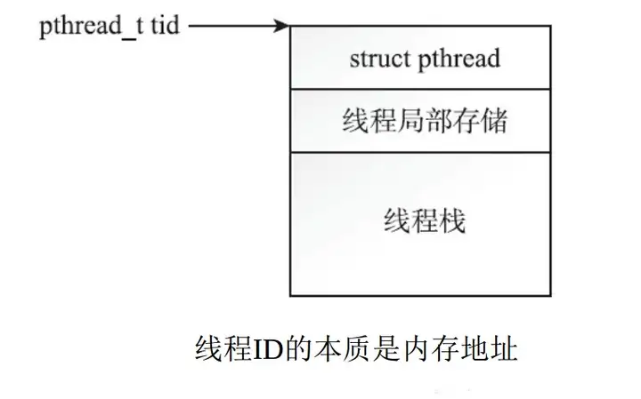
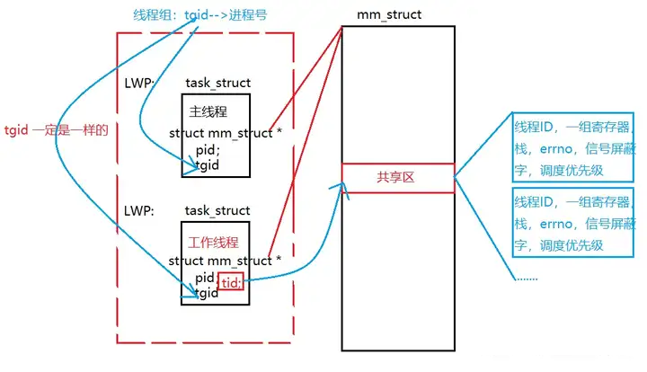
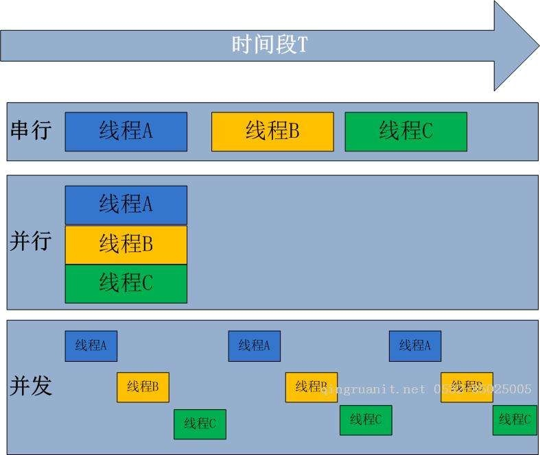
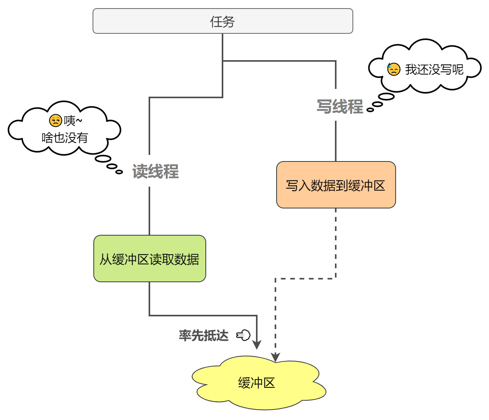
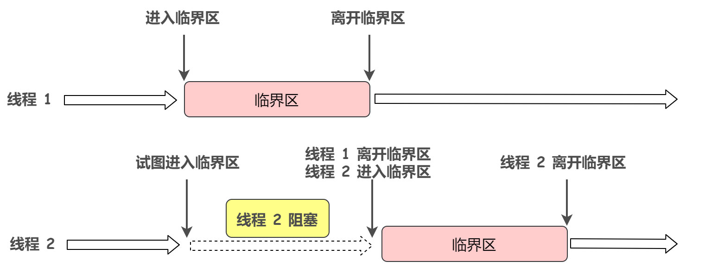
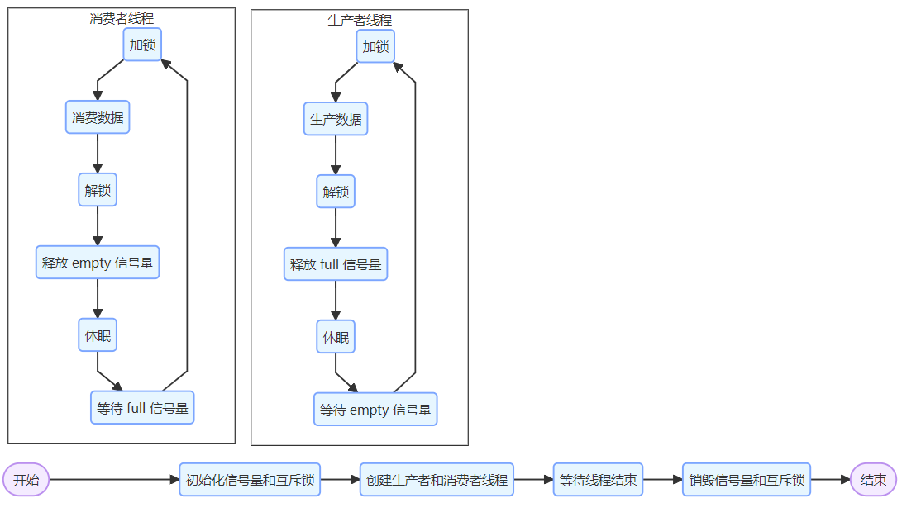

# 第06章 Linux线程和并发

**<font style="color:blue;background-color:#FFFF00;">B站 程序员老廖</font>** **编辑整理**， **需要配套代码加我微信**：**<font style="color:red;background-color:#FFFF00;">laoliao6668</font>** **获取。**


**<font style="color:red;background-color:#FFFF00;">一站式从0快速学习Linux编程，比视频更高效的Linux图文学习教程。</font>** 


线程 (threading)  是指在单个进程内，多路并行执行的创建和管理单元。 


# 1 二进制程序、进程和线程
二进制程序 (binaries) 是指保存在存储介质上的程序，以给定操作系统和计算机 体系结构可访问的格式编译生成，可以运行但尚未开始。进程 (processes) 是操作 系统对运行的二进制程序的抽象，包括：加载的二进制程序、虚拟内存、内核资源 如打开的文件、关联的用户等。线程 (threads)  是进程内的执行单元，具体包括： 虚拟处理器、堆栈、程序状态。换句话说：

+ 进程是资源分配的基本单位；
+ 线程是操作系统调度器可以调度的最小执行单元。


一个进程包含一个或多个线程。如果一个进程只包含一个线程，则该进程只有一个 执行单元，每次只有一个操作在运行。我们称这种进程为“单线程”。如果一个进程包含多个线程，每个会有多个操作在同时执行。我们 称这种进程为“多线程”。


现代操作系统包括了两种对用户空间的基础的虚拟抽象：

+ 虚拟内存
+ 和虚拟处理器。

它们使得进程“感觉”自己独占机器资源。虚拟内存为每个进程提供独立的内存地址空间，该内存地址连续映射到物理RAM 或磁盘存储(通过分页实现)。实际上， 系统的RAM中可能有100个不同的正在运行的进程，但是每个进程都“感觉”所 有的内存都是自己独占的。虚拟处理器使得进程“感觉”只有自己正在运行，操作系统对其“隐藏”了事实：多个进程在多个处理器(可能)以多任务方式同时运行。


**虚拟内存是和进程相关的**，与线程无关。因此，每个进程有独立的内存空间，而进程中的所有线程共享这份空间。

相反地，**虚拟处理器是和线程相关的**，与进程无关。 每个线程都是可独立调度的实体，支持单个进程每次“处理”多个操作。很多程序员会把虚拟内存和虚拟处理器混淆在一起，但从线程角度看，它们是完全不一样的。 和进程一样，线程也“感觉”自己独占一个处理器。但是，和进程不同的是，线程 并没有“感觉”自己独占内存：进程中的所有线程共享全部内存地址空间。


# 2 多线程
有了进程为什么还要有线程，因为多线程机制提供了五大好处：

1. **编程抽象**把工作切分成多个模块，并为每个分块分配一个执行单元(线程)是解决很多问题的常见方式。例如，在一个网络应用程序中，可以使用一个线程来接收网络数据，另一个线程来处理数据，这样可以提高程序的响应性和效率。同时，线程还可以方便地实现生产者 - 消费者模式、任务队列等并发编程模式，使得程序的结构更加清晰和易于维护。
2. **并发性**对于有多个处理器的计算机，线程提供了一种实现“真正并发”的高效方式。每个线程有自己的虚拟处理器，是作为独立的调度实体，因此在多个处理器上可以同时运行多个线程，从而提高系统的吞吐量。
3. **提高响应能力**即使是在单处理器的计算机上，多线程也可以提高进程的响应能力。在单线程的进程中，一个长时间运行的任务会影响应用对用户输入的响应，导致应用看起来“僵死”了。有了多线程机制，这些操作可以委托给 worker 线程，至少有一个线程可以响应用户输入并执行UI 操作。 I/O阻塞这和前一项“提高响应能力”紧密相关。如果没有线程，I/O 阻塞会影响整个进程。 这对吞吐量和延迟都是灾难。
4. **上下文切换**在同一个进程中，从一个线程切换到另一个线程的代价要显著低于进程间的上下文切换。线程的一大性能优势在于同一个进程内的线程之间的上下文切换代价很低(进程 内切换)。在任何系统上，进程内切换的代价低于进程间切换。主要是计算机体系结构对进程切换有影响，而线程不存在这个问题，因为进程切换涉及把一个虚拟地址空间切换到另一个虚拟地址空间。举个例子，在x86 系统上，转换后备缓冲器 (translation  lookaside   buffer,TLB)，即用于把虚拟内存地址映射到物理内存地址的缓存，当切换到虚拟地址空间时，必须都清空。在某些负载场景下，TLB 丢失对系统性能有极大损伤。
5. **内存保存**线程提供了一种可以共享内存，并同时利用多个执行单元的高效方式。从这个角度 看，多线程在某些场景下可以取代多进程。


基于以上这些原因，**多线程是操作系统以及应用的较常见的特性**。在某些系统上， 如 Android, 几乎每个进程都是多线程的。现在，即使是在很小的计算机上都有多个处理器——甚至连手机都有多个处理器——而某些技术如多核和同步线程 (SMT)  更使得线程成为最大化系统吞吐量的工具。现在，难以想象会存在一个高性能的 Web服务不是运行在多核的多线程上。


# 3 线程模型（大致了解）
在一个系统上实现线程模型的方式有好几种，因内核和用户空间提供的支持而有一定程度的级别差异。

**PS**：**内核级线程模型和协程**即可。

## 3.1 内核级线程模型
内核级线程模型（1:1 线程模型）指的是操作系统内核直接对线程进行管理和调度，内核为每个用户线程创建一个对应的内核线程，用户线程和内核线程一一对应。在这种模型下，内核是线程管理的核心，负责线程的创建、调度、同步等操作。

### **特点**
+ **直接调度**：内核可以直接对线程进行调度，根据线程的优先级、资源需求等因素将其分配到不同的 CPU 核心上执行，从而充分利用多核处理器的并行计算能力。
+ **独立资源**：每个内核线程都有自己独立的内核栈、寄存器状态等资源，线程之间的切换由内核完成，开销相对较大，但可以更好地实现线程的并发执行。
+ **系统调用支持**：由于每个线程都有对应的内核线程，当线程进行系统调用时，不会阻塞整个进程中的其他线程，提高了程序的并发性能。


### **优点**
+ **并发性能高**：能够充分利用多核处理器的优势，多个线程可以在不同的 CPU 核心上并行执行，提高程序的整体性能。
+ **响应性好**：当一个线程阻塞在 I/O 操作或其他系统调用上时，内核可以调度其他线程继续执行，不会影响整个进程的运行。
+ **系统调用处理**：每个线程可以独立进行系统调用，不会因为某个线程的系统调用而阻塞其他线程。


### **缺点**
+ **开销较大**：创建和销毁线程需要内核进行大量的操作，包括分配和释放内核资源，因此线程的创建和销毁开销相对较大。
+ **内核负担重**：随着线程数量的增加，内核需要管理的线程数量也会增多，这会增加内核的负担，可能导致系统性能下降。


## 3.2 用户级线程模型
在用户级线程模型中，线程的管理和调度完全由用户空间的代码负责，内核对此一无所知。用户程序中会实现一个用户空间调度器，它决定了在一个进程内的多个线程之间如何进行切换和执行。一个进程内可以创建多个用户级线程，但这些线程只对应一个内核进程，也就是 N 个用户级线程映射到 1 个内核线程。

### **用户级线程模型的优点**
+ **上下文切换成本低**：由于线程的调度和切换完全在用户空间进行，不需要陷入内核态，避免了内核态和用户态之间的频繁切换，所以上下文切换的开销极小，几乎可以忽略不计。例如，在一些对响应时间要求极高的实时应用中，快速的上下文切换可以提高程序的整体性能。
+ **可移植性强**：用户级线程的实现不依赖于特定的操作系统内核，只要在用户空间实现了线程管理和调度的逻辑，就可以在不同的操作系统上运行，具有很好的可移植性。
+ **定制性高**：用户可以根据自己的需求设计和实现线程调度算法，以满足不同应用场景的要求，例如可以根据线程的优先级、任务类型等因素进行灵活调度。


### **用户级线程模型的缺点**
+ **无法利用多核处理器**：因为所有的用户级线程都映射到同一个内核线程，它们只能在一个 CPU 核心上依次执行，无法实现真正的并行计算。在现代多核处理器普及的情况下，这严重限制了程序的性能提升。
+ **阻塞问题**：当一个用户级线程进行阻塞式的系统调用（如 I/O 操作）时，会导致整个进程被阻塞，其他用户级线程也无法继续执行。因为内核并不知道进程内存在多个线程，它只会将整个进程挂起。
+ **内核资源利用不充分**：由于用户级线程的调度和管理完全由用户空间代码负责，无法充分利用内核提供的一些高级特性和优化机制，例如内核的负载均衡、资源分配等。


## 3.3 混合式线程模型
将内核级线程模型（1:1 线程模型）和用户级线程模型（N:1 线程模型）结合起来形成的混合式线程模型（N:M 线程模型），旨在融合二者的优势。

从原理上看，它既允许内核提供基础的线程管理功能，又让用户空间能够灵活地创建和管理大量的用户线程。用户空间（有时会和内核协作）负责将 N 个用户线程映射到 M 个内核线程上（N ≥ M）。这种映射关系可以根据不同的应用场景和系统负载进行动态调整，从而在并行性和上下文切换效率之间找到平衡。

### 优势分析
+ **并行性**：由于存在多个内核线程，多个用户线程可以分别在不同的内核线程上并行执行，因此能够充分利用多核处理器的计算能力，实现真正的并行计算，这继承了内核级线程模型的优点。
+ **上下文切换效率**：在用户空间内，用户线程之间的切换可以像用户级线程模型那样快速完成，几乎没有内核干预，上下文切换成本低。只有当需要与内核交互或进行内核线程切换时，才会涉及到较高开销的操作。

### 调度器激活（Scheduler Activation）机制
调度器激活是实现高效 N:M 线程模型的一种关键技术，它为用户级线程提供了内核支持。

#### 核心思想
调度器激活允许用户空间的线程调度器感知内核中的进程调度情况，并对用户线程进行相应的调整。具体来说，内核在某些关键事件发生时（如线程阻塞、CPU 空闲等）会向用户空间的调度器发送通知，让调度器能够及时做出反应，重新分配用户线程到可用的内核线程上。

#### 工作流程
1. **事件通知**：当内核检测到某个内核线程阻塞（例如进行 I/O 操作）或者 CPU 有空闲时，会向用户空间的调度器发送一个激活信号。
2. **调度决策**：用户空间的调度器接收到激活信号后，根据当前用户线程的状态和系统资源情况，决定如何重新分配用户线程到可用的内核线程上。例如，如果一个内核线程因为 I/O 操作被阻塞，调度器可以将其他等待的用户线程分配到空闲的内核线程上继续执行。
3. **状态同步**：用户空间的调度器在做出调度决策后，需要与内核进行状态同步，确保内核能够正确地执行调度结果。

#### 采用该机制的系统及效果
华盛顿大学提出调度器激活机制后，FreeBSD 和 NetBSD 等操作系统采用了这一技术。通过调度器激活，这些系统的混合式线程模型变得更加高效，解决了一些因内核不支持用户级线程而产生的问题，如线程阻塞导致整个进程挂起等。用户空间的调度器能够更灵活地管理用户线程，提高了系统的并发性能和资源利用率。

### 挑战与复杂性
尽管混合式线程模型有诸多优点，但实现起来非常复杂。主要挑战包括：

+ **映射策略设计**：如何设计高效的 N 个用户线程到 M 个内核线程的映射策略是一个难题，需要综合考虑线程的优先级、资源需求、负载均衡等多个因素。
+ **同步与通信**：用户空间调度器和内核之间需要频繁进行同步和通信，以确保调度决策的正确性和一致性，这增加了系统的复杂性和实现难度。
+ **调试与维护**：由于涉及用户空间和内核空间的交互，调试和维护混合式线程模型的程序变得更加困难，需要开发者对操作系统内核和用户空间编程都有深入的理解。

总体而言，混合式线程模型（N:M 线程模型）结合了内核级线程模型和用户级线程模型的优点，但实现的复杂性也带来了诸多挑战，需要精心设计和优化才能充分发挥其潜力。


## 3.4 协同程序（协程）
### 协程的定义和基本特点
协程是一种比线程更加轻量级的执行单位，它主要存在于用户空间。和线程不同，协程的调度和管理不需要内核的参与，因此创建、销毁和切换协程的开销都非常小。协程的核心特点在于其协作式调度，即协程之间通过显式的方式来控制执行权的转移。

### 协程与线程的对比
+ 开销方面
    - **线程**：线程的创建和销毁需要内核进行大量的操作，包括分配和释放内核资源，如内核栈、寄存器状态等，因此开销相对较大。而且线程的上下文切换需要从用户态切换到内核态，涉及到较多的系统调用，也会带来一定的开销。
    - **协程**：协程的创建和切换都在用户空间完成，不需要陷入内核态，因此开销极小。例如，在 Python 中使用 `asyncio` 库创建和切换协程几乎不会带来额外的性能损耗。
+ 调度方式
    - **线程**：线程的调度由操作系统内核负责，采用抢占式调度，即内核可以在任何时候暂停一个线程的执行，转而执行其他线程。这种调度方式虽然可以保证系统的公平性和资源的合理分配，但也会带来一定的不确定性。
    - **协程**：协程采用协作式调度，协程必须主动放弃执行权，将控制权交给其他协程。这种调度方式使得协程的执行顺序更加可预测，但也要求协程开发者在编写代码时手动控制协程的执行流程。
+ 并发性
    - **线程**：线程可以实现真正的并行执行，在多核处理器上，多个线程可以同时在不同的 CPU 核心上运行。
    - **协程**：协程主要侧重于程序流的控制，虽然可以实现并发执行，但并不是真正的并行。多个协程在一个线程内依次执行，通过快速切换来模拟并发的效果。


## 3.5 小结
理解：**内核级线程模型和协程**即可。


# 4 线程创建、终止、等待、分离
## 4.1 线程创建
接口：

```c
#include <pthread.h>
int pthread_create(pthread_t *thread, const pthread_attr_t *attr,void *(*start_routine) (void *), void *arg);
```


和fork() 类似，新的线程会继承绝大多数属性、功能以及父线程的状态。和 fork()不同的是， 线程会共享父进程资源，而不是接收一份拷贝。当然，最重要的共享资源是进程地址空间，但是线程也共享(通过接收拷贝)信号处理函数和打开的文件。


参数解释

+ thread：线程标识符，是一个出参
+ attr：线程属性
+ star_routine：函数指针，保存线程入口函数的地址
+ arg：给线程入口函数传参

返回值：成功返回0，失败返回error number

详解：

+ 第一个参数是pthread_t类型的指针， 线程创建成功的话，会将分配的线程ID填入该指针指向的地址。 线程的后续操作将使用该值作为线程的唯一标识。
+ 第二个参数是pthread_attr_t类型， 通过该参数可以定制线程的属性， 比如可以指定新建线程栈的大小、 调度策略等。 **如果创建线程无特殊的要求， 该值也可以是NULL， 表示采用默认属性**。
+ 第三个参数是线程需要执行的函数。 创建线程， 是为了让线程执行一定的任务。 线程创建成功之后， 该线程就会执行start_routine函数， 该函数之于线程， 就如同main函数之于主线程。
+ 第四个参数是新建线程执行的start_routine函数的入参。

pthread_create错误码及描述：

| 返回值 | 描述 |
| --- | --- |
| EAGAIN | 系统资源不够，或者创建线程的个数超过系统对一个进程中线程总数的限制 |
| EINVAL | 第二个参数attr值不合法 |
| EPERM | 没有合适的权限来设置调度策略或参数 |


### 传入参数arg的选择
| 传入参数 | 分析 | 是否可行 |
| --- | --- | --- |
| 临时变量 | 临时变量的生命周期，临时变量的值会改变，传递临时变量有可能导致越界的问题 | 不可行 |
| 结构体对象 | 和临时变量相同 | 不可行 |
| 结构体指针 | 释放时，在线程不会使用该指针以后 | 可行 |
| this指针 |  | 可行 |


**不要使用临时变量传参，使用堆上开辟的变量可以。**

范例

```c
#include <stdio.h>
#include <stdlib.h>
#include <pthread.h>
#include <unistd.h>


void *ThreadWork(void *arg)
{
  int *p = (int*)arg;
  printf("i am work thread:%p,   data:%d\n",pthread_self(),*p);
  pthread_exit(NULL);
}

int main()
{
  int i = 1;
  pthread_t tid;
  int ret = pthread_create(&tid,NULL,ThreadWork,(void*)&i);//不要传临时变量，这里是示范
  if(ret != 0)
  {
    perror("pthread_create");
    return -1;
  }
  while(1)
  {
    printf("i am main work thread\n");
    sleep(1);
  }
  return 0;
}
```


### 线程ID以及进程地址空间
线程获取自身的ID：

```c
#include <pthread.h>
pthread_t pthread_self(void);
```

判断两个线程ID是否对应着同一个线程：

```c
#include <pthread.h>
int pthread_equal(pthread_t t1, pthread_t t2);
```

返回为0时，则表示两个线程为同一个线程，非0时，表示不是同一个线程。

用户调用pthread_create函数时， 首先要为线程分配线程栈， 而线程栈的位置就落在共享区。 调用mmap函数为线程分配栈空间。 pthread_create函数分配的pthread_t类型的线程ID， 不过是分配出来的空间里的一个地址， 更确切地说是一个结构体的指针。




即：




### 线程注意点
+ 线程ID是进程地址空间内的一个地址， **要在同一个线程组内进行线程之间的比较才有意义**。 不同线程组内的两个线程， 哪怕两者的pthread_t值是一样的， 也不是同一个线程。
+ 线程ID就有可能会被复用：1.线程退出。  
2.线程组的其他线程对该线程执行了pthread_join， 或者线程退出前将分离状态设置为已分离。  
3.再次调用pthread_create创建线程。

### 线程创建出来的默认值
线程创建的第二个参数是pthread_attr_t类型的指针， pthread_attr_init函数会将线程的属性重置成默认值。

线程属性及默认值：

| 属性 | 默认值 | 说明 |
| --- | --- | --- |
| contentionscope | PTHREAD_SCOPE_SYSTEM | 进程调度相关，线程只支持在OS范围内竞争CPU资源 |
| Detach state | PTHREAD_CREATE_DETACHED | 可分离状态 |
| Stack address | NULL | 不指定线程开辟的基地址 |
| Stack size | 8196(KB) | 默认线程栈大小为8M |
| Guard size | 0 | 警戒缓冲区 |
| Scheduling priority | 0 | [进程调度](https://zhida.zhihu.com/search?content_id=166278462&content_type=Article&match_order=2&q=进程调度&zhida_source=entity)相关，优先级为0 |
| Scheduling policy | SCHED_OTHER | 进程调度相关，调度策略为SCHED_OTHER |
| Inherit scheduler | PTHREAD_EXPLICIT_SCHED | 进程调度相关，继承启动进程的调度策略 |


如果需要调整线程堆栈大小， 可以调用接口来调整线程栈的大小：

```c
#include <pthread.h>
int pthread_attr_setstacksize(pthread_attr_t *attr,size_t stacksize);
int pthread_attr_getstacksize(pthread_attr_t *attr,size_t *stacksize);
```


## 4.2 线程终止
### 主动退出线程
线程终止方法（这两种线程终止方法不会终止进程）：

+ 入口函数的return返回，线程就退出了
+ 线程调用pthread_exit(NULL)，谁调用谁退出

```c
#include <pthread.h>
void pthread_exit(void *retval);
```

参数：retval是返回信息，临终遗言，可以给可以不给

该变量不能使用临时变量。

可使用：全局变量、堆上开辟的空间、字符串常量。


“pthread_exit退出” 和 ”线程启动函数(start_routine)执行return退出“是有区别的。 在start_routine中调用的任何层级的函数执行pthread_exit() 都会引发线程退出， 而return， 只能是在start_routine函数内执行才能导致线程退出。

### 被动退出线程
+ 其它线程调用了pthread_cancel函数取消了该线程，这和通过kill()发送SIGKILL信号类似。

```c
#include <pthread.h>
int pthread_cancel(pthread_t thread);
```


thread：线程标识符

调用该函数的执行流可以取消其它线程，但是需要知道其它线程的线程标识符，也可以执行流自己取消自己，传入自己的线程标识符。

如果线程组中的任何一个线程调用了exit函数， 或者主线程在main函数中执行了return语句， 那么整个线程组内的所有线程都会终止。

## 4.3 线程等待
### 4.3.1 线程等待接口
```c
#include <pthread.h>
int pthread_join(pthread_t thread, void **retval);
```

| 参数 | 解释 |
| --- | --- |
| thread | 要等待的线程标识符 |
| retval | 接收返回值：若是return退出的，接受入口函数的返回值，pthread_exit退出的，接受该函数的参数，pthread_cancel退出的，void** 保存的是PTHREAD_CANCLED = （void *）-1 |


调用该函数，该执行流在等待线程退出的时候，该执行流是阻塞在pthread_joind当中的。

### 4.3.2 线程等待和进程等待的不同
1. 第一点不同之处是进程之间的等待只能是父进程等待子进程， 而线程则不然。线程组内的成员是对等的关系， **只要是在一个线程组内， 就可以对另外一个线程执行连接（join） 操作**。
2. 第二点不同之处是进程可以等待任一子进程的退出 ， 但是线程的连接(join)操作没有类似的接口， 即不能连接线(join)程组内的任一线程， **必须明确指明要连接(join)的线程的线程ID**。

pthread_join()错误码：

| 返回值 | 说明 |
| --- | --- |
| ESRCH | 传入的线程ID不存在，查无此线程 |
| EINVAL | 线程不是一个joinable线程 |
| EINVAL | 已有其它线程捷足先登，链接目标线程 |
| EDEADLK | 死锁，如自己链接自己 |


### 4.3.3 为什么要等待退出的线程？
如果不join已经退出的线程， 会导致资源无法释放。 所谓资源指的又是什么呢？

1. 已经退出的线程， 其空间没有被释放， 仍然在进程的地址空间之内。
2. 新创建的线程， 没有复用刚才退出的线程的地址空间。

如果不执行join操作， 线程的资源就不能被释放， 也不能被复用， 这就造成了资源的泄漏。

纵然调用了pthread_join， 也并没有立即调用munmap来释放掉退出线程的栈， 它们是被后建的线程复用了。 释放线程资源的时候， 若进程可能再次创建线程， 而频繁地munmap和mmap会影响性能， 所以将该栈缓存起来， 放到一个链表之中， 如果有新的创建线程的请求， 会首先在栈缓存链表中寻找空间合适的栈， 有的话， 直接将该栈分配给新创建的线程。

例：

```c
#include <stdio.h>
#include <stdlib.h>
#include <pthread.h>
#include <unistd.h>
#include <sys/syscall.h>

void *ThreadWork(void *arg)
{
  int *p = (int*)arg;
  printf("pid :  %d\n",syscall(SYS_gettid));
  printf("i am work thread:%p,   data:%d\n",pthread_self(),*p);
  sleep(3);
  pthread_exit(NULL);
}

int main()
{
  int i = 1;
  pthread_t tid;
  int ret = pthread_create(&tid,NULL,ThreadWork,(void*)&i);//不要传临时变量，这里是示范
  if(ret != 0)
  {
    perror("pthread_create");
    return -1;
  }
  pthread_join(tid,NULL);//线程等待
  while(1)
  {
    printf("i am main work thread\n");
    sleep(1);
  }
  return 0;
}
```

## 4.4 线程分离
接口：

```c
#include <pthread.h>
int pthread_detach(pthread_t thread);
```


默认情况下， 新创建的线程处于可连接（joinable） 的状态， 可连接状态的线程退出后， 需要对其执行连接(join)操作， 否则线程资源无法释放， 从而造成资源泄漏。

**如果其他线程并不关心线程的返回值**， 那么连接(join)操作就会变成一种负担： 你不需要它， 但是你不去执行连接(join)操作又会造成资源泄漏。 

**这时候你需要的东西只是：线程退出时， 系统自动将线程相关的资源释放掉**， 无须等待连接。

可以是线程组内其他线程对目标线程进行分离， 也可以是线程自己执行pthread_detach函数。

线程的状态之中， 可连接状态和已分离状态是冲突的， 一个线程不能既是可连接的， 又是已分离的。 因此， 如果线程处于已分离的状态， 其他线程尝试连接线程时， 会返回EINVAL错误。

pthread_detach错误码：

| 返回值 | 说明 |
| --- | --- |
| ESRCH | 传入线程的ID不存在，无此线程 |
| EINVAL | 线程不是一个joinable线程，已经处于分离状态 |


注意：这里的已分离不是指线程失去控制，不归线程组管，而是指线程退出后，系统会自动释放线程资源。若是线程组内的任意线程执行了exit函数，即使是已分离的线程，也仍会收到影响，一并退出。


# 5 并发性、并行性和竞争
线程引入了两个相关但截然不同的概念：并发性 (Concurrency)   和并行性 (Parallelism) 。 两者都是有好有坏，带来了线程代价及其收益。  



**定义：**

+ 并发性是指两个或多个线程可以在重叠的时间周期内执行。
+ 并行性是指可以同时运行两个或两个以上 的线程。

**区别：**

+ 并发不一定是并行：比如在单处理器系统上的多任务机制。并行性(有时出于强调，称为真正并行性 true Parallelism) 是一种特殊的并发。 
+ 对于并发性，多个线程都执行处理，但不一定是同时的(即不一定是并行)。对于并行性，线程实际上是并行执行的，多线程的程序可以利用多个处理器。
+ 并发性是一种编程模式，是处理问题的一种方式。
+ 并行性是一种硬件特征，可以通过并发性实现。

两者都是有用的。


## 5.1 竞争
并发性给线程编程带来了很多挑战。由于支持重叠执行 (overlapping execution),

线程以不可预测的顺序执行。在某些情况下，这不会带来问题。但是，如果线程间需要共享资源，怎么办呢？即使只是读写内存中的一个单词都会造成“竞争”，程序由于不确定哪个线程先执行而带来行为不一致。


一般而言，竞争条件是指由两个或多个线程对共享资源的非同步访问而导致错误的程序行为。共享资源可以是以下任意一种：系统硬件、内核资源或内存中的数据。 后者是最常见的，称为数据竞争 (data  race)。

竞争所发生的窗口--需要同步的代码区--称为“临界区”。竞争可以通过对临界区的同步访问来消除。在深入探讨同步机制之前，我们先来探讨一些条件竞争的例子。


## 5.2 现实世界中的竞争场景
假设有个自动取款机 (ATM)。 使用方式很简单：来到取款机前，刷卡，输入个人识别码 (PIN),   然后输入要提取的金额。然后，把钱取走。在这个过程中，银 行需要验证你的账户是否有足够金额，如果有，则从你的账户中减去要提取的金额。 算法看起来如下。

1. 账户是否有足够X 金额?
2. 如果有，从账户余额中减去X, 把 X 金额弹出给用户。
3. 如果没有，返回错误。


C 代码看起来如下：

```c
int withdraw(struct account  *account,  int amount)
{
    const int balance=account->balance; 

    if (balance<amount)
        return -1 ;

    account->balance =balance-amount; 
    disburse_money(amount);

    return 0; 
}
```

这种执行方式会产生可怕的竞争问题。想象一下，如果银行并发执行两次该函数， 会发生什么情况。可能客户正在取钱，同时银行在处理在线账单或评估异常账单。 如果这两项账户余额检查发生在同一时刻，都发生在已经弹出取款金额，并在更新 账户余额之前，结果会怎么样?会弹出两次金额，即使账户余额不够弹出两次!举 个例子，假设账户中有500美元，两次取款请求分别是200美元和400美元，这两 次取款请求都会成功，虽然这样会导致100美元坏账，当然，代码本身也不希望允许这种情况。


实际上，这个函数还存在另一个竞争问题。假设把更新的余额值保存到account字 段中。两次取款对于更新账户余额也会存在竞争。在前面给出的例子中，最后保存 的余额值可能是300美元或100美元。在这种情况下，银行不仅允许执行本不应该 支持的两次取款操作，而且还可能会导致给客户余额额外400美元。


实际上，该函数每一行操作几乎都涉及临界区。如果这家银行要通过可行的商业模 式生存下去，需要对withdraw()函数以同步方式来操作，确保即使有两个或多个线 程并发执行，整个函数还是作为原子单元来执行：银行需要加载账户余额，检查可 用的资源，并且把余额在一次不可分割的事务中记入借方。


在查看银行如何执行之前，先来考虑一个示例，它说明了竞争条件是多么基本的。 银行取款示例实际是非常高层的：甚至我们都不需要给出示例代码。银行经理理解 如果允许账户同时记账和借账，那计算就乱套了。竞争条件也都存在于最底层。


比如以下这段简单的代码：

```c
X++;// x is an integer
```

该++操作符是个后增操作符，我们都知道它会执行什么操作：获取当前的x 值，把 x 值加1,把加1后的新的值再保存到x 中，该表达式的返回值即更新后的x 值。 该操作如何编译成机器码取决于架构，它看起来可能如下：

load x into register add 1 to register   store register in x

是 的 ，x++ 也是个竞争条件。假设有两个线程并发执行x++, 其 中x=5。以下是期望的输出：

| 时间 | 线程1 | 线程2 |
| --- | --- | --- |
|  | 把 x 加 载 到 寄 存 器 ( 5 ) |  |
| 2 | 寄 存 器 值 加 1 ( 6 ) |  |
| 3 | 把寄存器值赋给x(6) |  |
| 4 |  | 把 x 加 载 到 寄 存 器 中 ( 6 ) |
| 5 |  | 寄 存 器 加 1 ( 7 ) |
| 6 |  | 把寄存器值赋给x(7) |


当然，下面这种情况也是期望的：

| 时间 | 线程1 | 线程2 |
| --- | --- | --- |
| 1 |  | 把x加载到寄存器(5) |
| 2 |  | 寄存器值加1(6) |
| 3 |  | 把寄存器值赋给x(6) |
| 4 | 把x加载到寄存器中(6) |  |
| 5 | 寄存器加1(7) |  |
| 6 | 把寄存器值赋给x(7) |  |


如果是以上两种执行方式之一，那是幸运的。但是，我们还是无法避免下面这种 情况：

| 时间 | 线程1 | 线程2 |
| --- | --- | --- |
| 1 | 把x加载到寄存器(5) |  |
| 2 | 寄存器值加1(6) |  |
| 3 |  | 把x加载到寄存器中(5) |
| 4 | 把寄存器值赋给x(6) |  |
| 5 |  | 寄存器加1(6) |
| 6 |  | 把寄存器值赋给x(6) |


很多其他组合也会带来不期望的结果。这些示例说明了并发性，而不是并行性。有了并行性，线程可以同时执行，就会带来更多的潜在错误：

| 时间 | 线程1 | 线程2 |
| --- | --- | --- |
| 1 | 把x加载到寄存器(5) | 把x加载到寄存器(5) |
| 2 | 寄存器值加1(6) | 寄存器值加1(6) |
| 3 | 把寄存器值赋给x(6) | 把寄存器值赋给x(6) |


现在，你可能已经明白了。即使是对于给变量加1的操作：一行C 或 C++代码， 一旦有多个线程并发执行，都会充满竞争条件。我们甚至不需要并行性。一台处理器就可以：而且可能会遇到这些竞争问题。条件竞争是程序员挫折感和程序 bug 的最大来源。我们一起来看看程序员是如何处理这些问题的。


# 6 多线程编程中的同步与互斥
线程同步和线程互斥是多线程编程中两个相关但又不同的概念。

+ **线程同步（Thread Synchronization）**：指的是多个线程之间协调和合作，以确保它们在特定时刻执行的顺序、时间或者条件达成。线程同步的目的是保证多个线程能够在正确的时间点上相互配合，以完成某项任务。常见的线程同步技术包括互斥锁、条件变量、信号量、屏障等。例如，在生产者-消费者问题中，需要通过同步机制确保生产者和消费者之间的数据交换是安全和有效的。




+ **线程互斥（Thread Mutual Exclusion）**：指的是通过使用互斥锁等机制，来防止多个线程同时访问临界资源，从而避免数据竞争和不一致性问题。互斥锁是一种常用的同步机制，用于保护共享资源，确保在任何时刻只有一个线程能够访问该资源。线程互斥的目的是防止多个线程同时修改共享资源，从而保证数据的完整性和一致性。




## 6.1 互斥锁（Mutex）
我们如何使用进行互斥呢？Linux系统提供了pthread_mutex_t，可以确保同一时刻只有一个线程能够访问特定的临界区（即需要保护的代码段），从而避免数据竞争和不一致的问题。

### 原理说明
`pthread_mutex_t` 是 POSIX 线程库中用于线程同步的互斥锁机制，主要用于保护共享资源，防止多个线程同时访问和修改同一资源而引发的数据不一致问题，也就是避免竞态条件。以下是其详细的工作原理：

#### 锁的状态
互斥锁有两种基本状态：锁定（locked）和未锁定（unlocked）。在初始状态下，互斥锁通常处于未锁定状态，意味着此时没有线程持有该锁，任何线程都可以尝试获取它。

#### 加锁操作
当一个线程需要访问受互斥锁保护的共享资源时，会调用加锁函数（如 `pthread_mutex_lock`）。若锁处于未锁定状态，该线程会立即获得锁，将锁的状态设置为锁定，然后可以安全地访问共享资源。若锁已经被其他线程锁定，调用加锁函数的线程会被阻塞，进入等待状态，直到持有锁的线程释放锁。

#### 解锁操作
当线程完成对共享资源的访问后，会调用解锁函数（如 `pthread_mutex_unlock`）。此操作会将锁的状态从锁定变为未锁定。如果有其他线程正在等待该锁，操作系统会从等待队列中选择一个线程唤醒，使其获得锁并继续执行。

#### 底层实现
`pthread_mutex` 的底层实现依赖于硬件的原子操作和操作系统的调度机制。原子操作确保对锁状态的修改是不可分割的，避免多个线程同时修改锁状态而导致竞争问题。操作系统负责管理线程的阻塞和唤醒，当线程需要等待锁时，操作系统会将其挂起，当锁被释放时，会唤醒等待队列中的线程。

### 函数原型
#### 1. 初始化互斥锁
```c
int pthread_mutex_init(pthread_mutex_t *restrict mutex, const pthread_mutexattr_t *restrict attr);
```

+ 参数：
    - `mutex`：指向要初始化的互斥锁对象的指针。
    - `attr`：指向互斥锁属性对象的指针，若为 `NULL`，则使用默认属性。
+ **返回值**：成功时返回 `0`，失败时返回错误码。

#### 2. 销毁互斥锁
```c
int pthread_mutex_destroy(pthread_mutex_t *mutex);
```

+ 参数：
    - `mutex`：指向要销毁的互斥锁对象的指针。
+ **返回值**：成功时返回 `0`，失败时返回错误码。

#### 3. 加锁操作
```c
int pthread_mutex_lock(pthread_mutex_t *mutex);
```

+ 参数：
    - `mutex`：指向要加锁的互斥锁对象的指针。
+ **返回值**：成功时返回 `0`，失败时返回错误码。若锁已被其他线程持有，调用线程会被阻塞。

#### 4. 尝试加锁
```c
int pthread_mutex_trylock(pthread_mutex_t *mutex);
```

+ 参数：
    - `mutex`：指向要尝试加锁的互斥锁对象的指针。
+ **返回值**：如果锁未被锁定，线程会获得锁并返回 `0`；如果锁已被锁定，函数会立即返回 `EBUSY`，而不会阻塞线程。

#### 5. 解锁操作
```c
int pthread_mutex_unlock(pthread_mutex_t *mutex);
```

+ 参数：
    - `mutex`：指向要解锁的互斥锁对象的指针。
+ **返回值**：成功时返回 `0`，失败时返回错误码。

### 范例代码
以下是一个使用 `pthread_mutex` 的示例，创建两个线程对一个共享变量进行递增操作，使用互斥锁保证线程安全：

```c
#include <stdio.h>
#include <pthread.h>

#define NUM_THREADS 2
#define COUNT 100000

// 共享变量
int shared_variable = 0;
// 互斥锁
pthread_mutex_t mutex;

// 线程函数
void* increment(void* arg) {
    for (int i = 0; i < COUNT; i++) {
        // 加锁
        pthread_mutex_lock(&mutex);
        shared_variable++;
        // 解锁
        pthread_mutex_unlock(&mutex);
    }
    return NULL;
}

int main() {
    pthread_t threads[NUM_THREADS];

    // 初始化互斥锁
    if (pthread_mutex_init(&mutex, NULL) != 0) {
        perror("pthread_mutex_init");
        return 1;
    }

    // 创建线程
    for (int i = 0; i < NUM_THREADS; i++) {
        if (pthread_create(&threads[i], NULL, increment, NULL) != 0) {
            perror("pthread_create");
            return 1;
        }
    }

    // 等待线程结束
    for (int i = 0; i < NUM_THREADS; i++) {
        if (pthread_join(threads[i], NULL) != 0) {
            perror("pthread_join");
            return 1;
        }
    }

    // 销毁互斥锁
    pthread_mutex_destroy(&mutex);

    // 输出结果
    printf("Final value of shared_variable: %d\n", shared_variable);

    return 0;
}
```

### 代码解释
1. **共享变量和互斥锁定义**：定义了一个共享变量 `shared_variable` 和一个互斥锁 `mutex`，互斥锁用于保护 `shared_variable`。
2. **线程函数 **`increment`：在该函数中，线程通过 `pthread_mutex_lock` 加锁，保证在修改 `shared_variable` 时不会被其他线程干扰，修改完成后使用 `pthread_mutex_unlock` 解锁。
3. 主函数 `main`：
    - 初始化互斥锁 `pthread_mutex_init`。
    - 创建两个线程 `pthread_create`，每个线程都会执行 `increment` 函数。
    - 使用 `pthread_join` 等待所有线程结束。
    - 销毁互斥锁 `pthread_mutex_destroy`。
    - 输出最终的共享变量值。

### 编译和运行
编译时需要链接 `pthread` 库，命令如下：

```shell
gcc -o program program.c -lpthread
```

运行程序：

```shell
./program
```

最终输出的 `shared_variable` 值应该是 `2 * COUNT`，即 `200000`，表明互斥锁成功保护了共享变量，避免了竞态条件。


## 6.2 条件变量（Condition Variable）
### 原理说明
`pthread_cond` 是 POSIX 线程库中用于线程同步的条件变量机制。条件变量主要用于线程之间的等待 - 通知机制，它允许一个或多个线程等待某个条件成立，而另一个线程在条件满足时通知等待的线程继续执行。其核心原理基于以下几个方面：

#### 等待和通知机制
+ **等待操作**：当一个线程需要等待某个条件成立时，它会调用与条件变量相关的等待函数（如 `pthread_cond_wait`）。在调用该函数时，线程会自动释放与之关联的互斥锁（因为在检查条件之前通常需要先加锁以保护共享资源），然后进入等待状态。此时，线程会被阻塞，直到收到其他线程发出的通知。
+ **通知操作**：当某个线程改变了共享资源的状态，使得等待的条件成立时，它可以调用通知函数（如 `pthread_cond_signal` 或 `pthread_cond_broadcast`）来通知等待的线程。`pthread_cond_signal` 会唤醒一个等待在该条件变量上的线程，而 `pthread_cond_broadcast` 会唤醒所有等待在该条件变量上的线程。

#### 与互斥锁的配合
条件变量通常需要和互斥锁一起使用。互斥锁用于保护共享资源，确保在检查条件和修改共享资源时的线程安全。在调用 `pthread_cond_wait` 时，线程会原子地释放互斥锁并进入等待状态，当收到通知被唤醒后，又会原子地重新获取互斥锁，从而可以继续安全地访问共享资源。

### 函数原型
#### 1. 初始化条件变量
```c
int pthread_cond_init(pthread_cond_t *restrict cond, const pthread_condattr_t *restrict attr);
```

+ **参数**：
    - `cond`：指向要初始化的条件变量对象的指针。
    - `attr`：指向条件变量属性对象的指针，若为 `NULL`，则使用默认属性。
+ **返回值**：成功时返回 `0`，失败时返回错误码。

#### 2. 销毁条件变量
```c
int pthread_cond_destroy(pthread_cond_t *cond);
```

+ **参数**：
    - `cond`：指向要销毁的条件变量对象的指针。
+ **返回值**：成功时返回 `0`，失败时返回错误码。

#### 3. 等待条件变量
```c
int pthread_cond_wait(pthread_cond_t *restrict cond, pthread_mutex_t *restrict mutex);
```

+ **参数**：
    - `cond`：指向要等待的条件变量对象的指针。
    - `mutex`：指向与条件变量关联的互斥锁对象的指针。
+ **返回值**：成功时返回 `0`，失败时返回错误码。调用该函数时，线程会释放 `mutex` 并进入等待状态，被唤醒后会重新获取 `mutex`。

#### 4. 定时等待条件变量
```c
int pthread_cond_timedwait(pthread_cond_t *restrict cond, pthread_mutex_t *restrict mutex, const struct timespec *restrict abstime);
```

+ **参数**：
    - `cond`：指向要等待的条件变量对象的指针。
    - `mutex`：指向与条件变量关联的互斥锁对象的指针。
    - `abstime`：指定等待的绝对时间，若在该时间之前未收到通知，线程会自动返回。
+ **返回值**：成功时返回 `0`，若超时返回 `ETIMEDOUT`，其他错误返回相应的错误码。

#### 5. 通知一个等待的线程
```c
int pthread_cond_signal(pthread_cond_t *cond);
```

+ **参数**：
    - `cond`：指向要通知的条件变量对象的指针。
+ **返回值**：成功时返回 `0`，失败时返回错误码。该函数会唤醒一个等待在 `cond` 上的线程。

#### 6. 通知所有等待的线程
```c
int pthread_cond_broadcast(pthread_cond_t *cond);
```

+ **参数**：
    - `cond`：指向要通知的条件变量对象的指针。
+ **返回值**：成功时返回 `0`，失败时返回错误码。该函数会唤醒所有等待在 `cond` 上的线程。

### 范例代码
以下是一个使用 `pthread_cond` 实现生产者 - 消费者模型的示例代码：

```c
#include <stdio.h>
#include <pthread.h>
#include <unistd.h>

#define BUFFER_SIZE 5

// 缓冲区
int buffer[BUFFER_SIZE];
int in = 0;
int out = 0;
int count = 0;

// 互斥锁和条件变量
pthread_mutex_t mutex;
pthread_cond_t not_full;
pthread_cond_t not_empty;

// 生产者线程函数
void* producer(void* arg) {
    for (int i = 0; i < 10; i++) {
        // 加锁
        pthread_mutex_lock(&mutex);

        // 等待缓冲区不为满
        while (count == BUFFER_SIZE) {
            pthread_cond_wait(&not_full, &mutex);
        }

        // 生产数据
        buffer[in] = i;
        in = (in + 1) % BUFFER_SIZE;
        count++;
        printf("Produced: %d\n", i);

        // 通知消费者缓冲区不为空
        pthread_cond_signal(&not_empty);

        // 解锁
        pthread_mutex_unlock(&mutex);

        sleep(1);
    }
    return NULL;
}

// 消费者线程函数
void* consumer(void* arg) {
    for (int i = 0; i < 10; i++) {
        // 加锁
        pthread_mutex_lock(&mutex);

        // 等待缓冲区不为空
        while (count == 0) {
            pthread_cond_wait(&not_empty, &mutex);
        }

        // 消费数据
        int data = buffer[out];
        out = (out + 1) % BUFFER_SIZE;
        count--;
        printf("Consumed: %d\n", data);

        // 通知生产者缓冲区不为满
        pthread_cond_signal(&not_full);

        // 解锁
        pthread_mutex_unlock(&mutex);

        sleep(1);
    }
    return NULL;
}

int main() {
    pthread_t producer_thread, consumer_thread;

    // 初始化互斥锁和条件变量
    pthread_mutex_init(&mutex, NULL);
    pthread_cond_init(&not_full, NULL);
    pthread_cond_init(&not_empty, NULL);

    // 创建生产者和消费者线程
    pthread_create(&producer_thread, NULL, producer, NULL);
    pthread_create(&consumer_thread, NULL, consumer, NULL);

    // 等待线程结束
    pthread_join(producer_thread, NULL);
    pthread_join(consumer_thread, NULL);

    // 销毁互斥锁和条件变量
    pthread_mutex_destroy(&mutex);
    pthread_cond_destroy(&not_full);
    pthread_cond_destroy(&not_empty);

    return 0;
}
```

### 代码解释
1. **全局变量**：定义了一个大小为 `BUFFER_SIZE` 的缓冲区，以及 `in`、`out` 和 `count` 用于记录缓冲区的状态。同时定义了互斥锁 `mutex` 和两个条件变量 `not_full`（表示缓冲区不满）和 `not_empty`（表示缓冲区不为空）。
2. **生产者线程函数 **`producer`：
    - 加锁以保护共享资源。
    - 检查缓冲区是否已满，如果已满则调用 `pthread_cond_wait` 等待 `not_full` 条件变量，同时释放互斥锁。
    - 生产数据并更新缓冲区状态。
    - 调用 `pthread_cond_signal` 通知消费者缓冲区不为空。
    - 解锁。
3. **消费者线程函数 **`consumer`：
    - 加锁以保护共享资源。
    - 检查缓冲区是否为空，如果为空则调用 `pthread_cond_wait` 等待 `not_empty` 条件变量，同时释放互斥锁。
    - 消费数据并更新缓冲区状态。
    - 调用 `pthread_cond_signal` 通知生产者缓冲区不为满。
    - 解锁。
4. **主函数 **`main`：
    - 初始化互斥锁和条件变量。
    - 创建生产者和消费者线程。
    - 等待线程结束。
    - 销毁互斥锁和条件变量。

### 编译和运行
编译时需要链接 `pthread` 库，命令如下：

```shell
gcc -o program program.c -lpthread
```

运行程序：

```shell
./program
```

程序会模拟生产者生产数据和消费者消费数据的过程，通过条件变量和互斥锁确保线程安全和正确的同步。 


### 增加等待超时
下面为你提供一个使用 `pthread_cond_timedwait` 的范例，该范例同样基于生产者 - 消费者模型，不过在消费者线程中使用 `pthread_cond_timedwait` 进行定时等待。

#### 代码示例
```c
#include <stdio.h>
#include <pthread.h>
#include <unistd.h>
#include <time.h>
#include <errno.h>

#define BUFFER_SIZE 5

// 缓冲区
int buffer[BUFFER_SIZE];
int in = 0;
int out = 0;
int count = 0;

// 互斥锁和条件变量
pthread_mutex_t mutex;
pthread_cond_t not_full;
pthread_cond_t not_empty;

// 生产者线程函数
void* producer(void* arg) {
    for (int i = 0; i < 10; i++) {
        // 加锁
        pthread_mutex_lock(&mutex);

        // 等待缓冲区不为满
        while (count == BUFFER_SIZE) {
            pthread_cond_wait(&not_full, &mutex);
        }

        // 生产数据
        buffer[in] = i;
        in = (in + 1) % BUFFER_SIZE;
        count++;
        printf("Produced: %d\n", i);

        // 通知消费者缓冲区不为空
        pthread_cond_signal(&not_empty);

        // 解锁
        pthread_mutex_unlock(&mutex);

        sleep(2); // 模拟生产耗时
    }
    return NULL;
}

// 消费者线程函数
void* consumer(void* arg) {
    for (int i = 0; i < 10; i++) {
        // 加锁
        pthread_mutex_lock(&mutex);

        // 设置超时时间，当前时间 + 1 秒
        struct timespec timeout;
        clock_gettime(CLOCK_REALTIME, &timeout);
        timeout.tv_sec += 1;

        // 等待缓冲区不为空，最多等待 1 秒
        while (count == 0) {
            int ret = pthread_cond_timedwait(&not_empty, &mutex, &timeout);
            if (ret == ETIMEDOUT) {
                printf("Consumer timed out waiting for data.\n");
                // 超时后可选择继续等待或做其他处理，这里选择继续循环
                clock_gettime(CLOCK_REALTIME, &timeout);
                timeout.tv_sec += 1;
                continue;
            } else if (ret != 0) {
                perror("pthread_cond_timedwait");
                pthread_mutex_unlock(&mutex);
                return NULL;
            }
        }

        // 消费数据
        int data = buffer[out];
        out = (out + 1) % BUFFER_SIZE;
        count--;
        printf("Consumed: %d\n", data);

        // 通知生产者缓冲区不为满
        pthread_cond_signal(&not_full);

        // 解锁
        pthread_mutex_unlock(&mutex);

        sleep(1); // 模拟消费耗时
    }
    return NULL;
}

int main() {
    pthread_t producer_thread, consumer_thread;

    // 初始化互斥锁和条件变量
    pthread_mutex_init(&mutex, NULL);
    pthread_cond_init(&not_full, NULL);
    pthread_cond_init(&not_empty, NULL);

    // 创建生产者和消费者线程
    pthread_create(&producer_thread, NULL, producer, NULL);
    pthread_create(&consumer_thread, NULL, consumer, NULL);

    // 等待线程结束
    pthread_join(producer_thread, NULL);
    pthread_join(consumer_thread, NULL);

    // 销毁互斥锁和条件变量
    pthread_mutex_destroy(&mutex);
    pthread_cond_destroy(&not_full);
    pthread_cond_destroy(&not_empty);

    return 0;
}
```

#### 代码解释
1. **全局变量**：和之前的生产者 - 消费者模型类似，定义了缓冲区、索引变量、计数器，以及互斥锁 `mutex` 和两个条件变量 `not_full`、`not_empty`。
2. **生产者线程函数 **`producer`：
    - 加锁保护共享资源。
    - 检查缓冲区是否已满，若满则调用 `pthread_cond_wait` 等待 `not_full` 条件变量。
    - 生产数据并更新缓冲区状态。
    - 调用 `pthread_cond_signal` 通知消费者缓冲区不为空。
    - 解锁。
3. **消费者线程函数 **`consumer`：
    - 加锁保护共享资源。
    - 设置超时时间 `timeout`，这里将超时时间设置为当前时间加上 1 秒。
    - 调用 `pthread_cond_timedwait` 等待 `not_empty` 条件变量，最多等待 1 秒。
        * 若返回值为 `ETIMEDOUT`，表示等待超时，输出超时信息并重新设置超时时间继续等待。
        * 若返回值不为 0 且不是 `ETIMEDOUT`，表示出现错误，输出错误信息并解锁返回。
    - 若未超时且缓冲区不为空，消费数据并更新缓冲区状态。
    - 调用 `pthread_cond_signal` 通知生产者缓冲区不为满。
    - 解锁。
4. **主函数 **`main`：
    - 初始化互斥锁和条件变量。
    - 创建生产者和消费者线程。
    - 等待线程结束。
    - 销毁互斥锁和条件变量。

#### 编译和运行
编译时需要链接 `pthread` 库，命令如下：

```shell
gcc -o program program.c -lpthread
```

运行程序：

```shell
./program
```

程序运行过程中，如果消费者线程在 1 秒内没有收到生产者的通知，会输出超时信息，然后继续等待。这样可以避免消费者线程无限期等待，提高程序的健壮性。 


## 6.3 信号量（Semaphore）
### 原理说明
`sem_t` 是 POSIX 标准中定义的信号量类型，信号量是一种用于线程或进程同步的机制，主要用于控制对共享资源的访问。信号量本质上是一个整数计数器，它可以用来表示可用资源的数量。

信号量有两种主要操作：

+ **P 操作（等待、减操作）**：也称为 `sem_wait` 操作，当一个线程或进程需要访问共享资源时，会调用 P 操作。如果信号量的值大于 0，则将信号量的值减 1 并继续执行；如果信号量的值为 0，则线程或进程会被阻塞，直到信号量的值大于 0。
+ **V 操作（释放、加操作）**：也称为 `sem_post` 操作，当一个线程或进程使用完共享资源后，会调用 V 操作。该操作会将信号量的值加 1，如果有其他线程或进程正在等待该信号量，其中一个等待者会被唤醒。

信号量可以分为两种类型：

+ **二进制信号量**：信号量的值只能是 0 或 1，类似于互斥锁，用于实现互斥访问。
+ **计数信号量**：信号量的值可以是任意非负整数，用于控制对多个共享资源的访问。

### 函数原型
#### 1. 初始化信号量
```c
int sem_init(sem_t *sem, int pshared, unsigned int value);
```

+ **参数**：
    - `sem`：指向要初始化的信号量对象的指针。
    - `pshared`：指定信号量的共享方式，若为 0 表示信号量在同一进程的多个线程间共享；若为非 0 表示信号量可以在不同进程间共享。
    - `value`：信号量的初始值。
+ **返回值**：成功时返回 0，失败时返回 -1，并设置 `errno`。

#### 2. 销毁信号量
```c
int sem_destroy(sem_t *sem);
```

+ **参数**：
    - `sem`：指向要销毁的信号量对象的指针。
+ **返回值**：成功时返回 0，失败时返回 -1，并设置 `errno`。

#### 3. P 操作（等待信号量）
```c
int sem_wait(sem_t *sem);
```

+ **参数**：
    - `sem`：指向要等待的信号量对象的指针。
+ **返回值**：成功时返回 0，若信号量值为 0 则线程会被阻塞；失败时返回 -1，并设置 `errno`。

#### 4. 尝试 P 操作（非阻塞等待信号量）
```c
int sem_trywait(sem_t *sem);
```

+ **参数**：
    - `sem`：指向要尝试等待的信号量对象的指针。
+ **返回值**：如果信号量值大于 0，将信号量值减 1 并返回 0；如果信号量值为 0，立即返回 -1 并设置 `errno` 为 `EAGAIN`。

#### 5. 定时 P 操作（带超时的等待信号量）
```c
int sem_timedwait(sem_t *sem, const struct timespec *abs_timeout);
```

+ **参数**：
    - `sem`：指向要等待的信号量对象的指针。
    - `abs_timeout`：指定等待的绝对时间，若在该时间之前未获取到信号量，线程会返回。
+ **返回值**：成功时返回 0；若超时返回 -1 并设置 `errno` 为 `ETIMEDOUT`；其他错误返回 -1 并设置相应的 `errno`。

#### 6. V 操作（释放信号量）
```c
int sem_post(sem_t *sem);
```

+ **参数**：
    - `sem`：指向要释放的信号量对象的指针。
+ **返回值**：成功时返回 0，失败时返回 -1，并设置 `errno`。

### 范例代码
以下是一个使用 `sem_t` 实现生产者 - 消费者模型的范例代码：

```c
#include <stdio.h>
#include <pthread.h>
#include <semaphore.h>
#include <unistd.h>

#define BUFFER_SIZE 5

// 缓冲区
int buffer[BUFFER_SIZE];
int in = 0;
int out = 0;

// 信号量
sem_t empty;  // 表示缓冲区中空槽的数量
sem_t full;   // 表示缓冲区中已填充槽的数量
pthread_mutex_t mutex;

// 生产者线程函数
void* producer(void* arg) {
    for (int i = 0; i < 10; i++) {
        // 等待缓冲区有空槽
        sem_wait(&empty);

        // 加锁
        pthread_mutex_lock(&mutex);

        // 生产数据
        buffer[in] = i;
        printf("Produced: %d\n", i);
        in = (in + 1) % BUFFER_SIZE;

        // 解锁
        pthread_mutex_unlock(&mutex);

        // 通知缓冲区有新数据
        sem_post(&full);

        sleep(1);
    }
    return NULL;
}

// 消费者线程函数
void* consumer(void* arg) {
    for (int i = 0; i < 10; i++) {
        // 等待缓冲区有数据
        sem_wait(&full);

        // 加锁
        pthread_mutex_lock(&mutex);

        // 消费数据
        int data = buffer[out];
        printf("Consumed: %d\n", data);
        out = (out + 1) % BUFFER_SIZE;

        // 解锁
        pthread_mutex_unlock(&mutex);

        // 通知缓冲区有空槽
        sem_post(&empty);

        sleep(1);
    }
    return NULL;
}

int main() {
    pthread_t producer_thread, consumer_thread;

    // 初始化信号量和互斥锁
    sem_init(&empty, 0, BUFFER_SIZE);
    sem_init(&full, 0, 0);
    pthread_mutex_init(&mutex, NULL);

    // 创建生产者和消费者线程
    pthread_create(&producer_thread, NULL, producer, NULL);
    pthread_create(&consumer_thread, NULL, consumer, NULL);

    // 等待线程结束
    pthread_join(producer_thread, NULL);
    pthread_join(consumer_thread, NULL);

    // 销毁信号量和互斥锁
    sem_destroy(&empty);
    sem_destroy(&full);
    pthread_mutex_destroy(&mutex);

    return 0;
}
```

### 范例代码解释
+ **全局变量**：定义了缓冲区、索引变量，以及两个信号量 `empty` 和 `full` 分别表示缓冲区中空槽和已填充槽的数量，还有一个互斥锁 `mutex` 用于保护对缓冲区的访问。
+ **生产者线程函数 **`producer`：
    - 调用 `sem_wait(&empty)` 等待缓冲区有空槽。
    - 加锁，将数据放入缓冲区。
    - 解锁，调用 `sem_post(&full)` 通知缓冲区有新数据。
+ **消费者线程函数 **`consumer`：
    - 调用 `sem_wait(&full)` 等待缓冲区有数据。
    - 加锁，从缓冲区取出数据。
    - 解锁，调用 `sem_post(&empty)` 通知缓冲区有空槽。
+ **主函数 **`main`：初始化信号量和互斥锁，创建生产者和消费者线程，等待线程结束，最后销毁信号量和互斥锁。

### 范例的流程图



### 流程图解释
+ **主流程**：程序开始后，先初始化信号量和互斥锁，然后创建生产者和消费者线程，等待线程执行完毕，最后销毁信号量和互斥锁，程序结束。
+ **生产者线程**：不断循环，等待 `empty` 信号量，加锁后生产数据，解锁后释放 `full` 信号量，最后休眠。
+ **消费者线程**：不断循环，等待 `full` 信号量，加锁后消费数据，解锁后释放 `empty` 信号量，最后休眠。

## 6.4 可重入与线程安全
1. 可重入  
重入：同一个函数被不同的执行流调用，当前一个进程还没有执行完，就又其他的执行流再次进入，我们称之为重入。一个函数在被重入的情况下，运行结果不会出现任何不同或者任何问题，则该函数被称为可重入函数，否则是不可重入函数。
2. 线程安全  
线程安全是指在多线程环境下，共享资源能够被多个线程安全地访问和操作，而不会导致数据不一致或不可预料的结果。
3. 小结  
可重入函数的概念是指一个函数可以被多个线程同时调用，而且不会产生竞态条件或不一致的结果。可重入函数不依赖于全局或静态变量，而是通过参数传递和局部变量来保持线程安全。
    - 线程安全函数是在多线程环境下能够被多个线程安全地调用的函数。这意味着即使多个线程同时调用该函数，也不会导致数据不一致或不可预期的结果。
    - 不可重入函数是指在执行过程中依赖于全局或静态变量的函数。这样的函数可能在并发环境中产生竞态条件，因此不适合被多个线程同时调用。
    - 如果一个函数中使用了全局变量，**并且没有适当的同步机制来保护这些全局变量**，那么这个函数既不是线程安全的，也不是可重入的。
    - 加锁可以确保临界资源的互斥访问，从而使函数成为线程安全的。但是，如果在函数内部没有正确地释放锁，可能会导致死锁等问题，因此这样的函数可能是不可重入的。
    - 因此，可重入函数是线程安全函数的一种，但线程安全函数不一定是可重入的。即，线程安全不一定是可重入的，而可重入函数则一定是线程安全的。正确地设计和实现函数，避免全局状态的依赖，使用适当的同步机制，可以确保函数在多线程环境中的安全使用。
    - 如果将临界资源的访问加上锁，则这个函数是线程安全的，但如果这个重入函数若锁未释放，则会产生死锁，因此是不可重入的。

## 6.5 死锁
死锁：是多线程把锁不合理的使用，导致代码不会继续向后正常推进的情况。

死锁是指在多线程环境中，两个或多个线程因争夺资源而造成的一种互相等待的现象，每个线程都在等待其他线程释放资源，而没有线程来释放资源，导致所有线程都无法继续执行。

死锁的四个必要条件：

+ 互斥条件：资源不能被多个线程共同使用，只能由一个线程独占。
+ 持有和等待条件：线程至少持有一个资源，并且正在等待获取额外的资源，而该资源又被其他线程持有。
+ 非抢占条件：线程持有的资源在未使用完之前不能被其他线程强行抢占。
+ 循环等待条件：存在一个线程与资源之间的循环等待链，每个线程都在等待下一个线程所持有的资源。

当以上四个条件同时满足时，就可能导致死锁的发生。一旦发生死锁，各个进程或线程之间都无法继续执行，除非外部干预打破死锁。

简单一点就是：由条件能推出结论，但由结论推不出这个条件，这个条件就是充分条件。 如果能由结论推出条件，但由条件推不出结论，此条件为必要条件。


> 更新: 2025-04-18 16:50:24  
> 原文: <https://www.yuque.com/linuxer/gscfv1/qwcut0yrkrl5icoy>