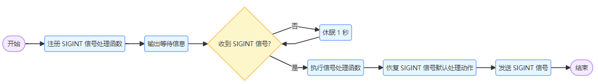
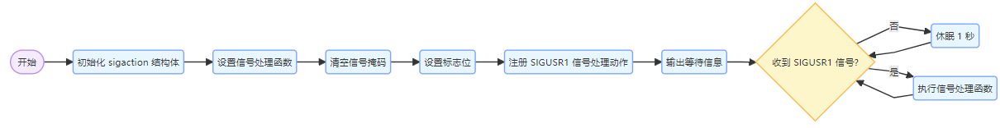
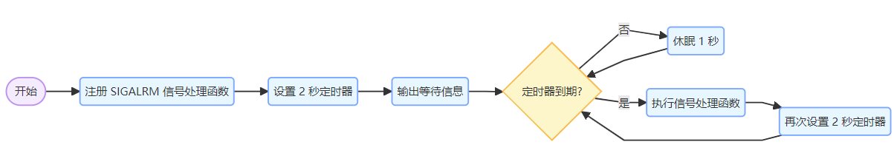
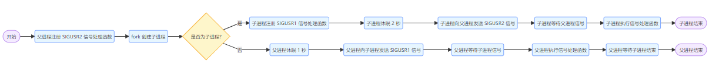
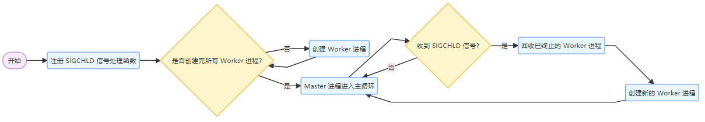

# 第07章 Linux信号

# Linux 信号机制深入解析
## 1 引言
在 Linux 操作系统中，信号（Signal）是一种软件中断机制，用于在进程间传递异步事件的通知。信号为系统和进程提供了一种简洁而有效的方式来处理各种异常情况、实现进程间通信以及进行系统管理。例如，当用户在终端按下 `Ctrl + C` 组合键时，系统会向当前运行的进程发送一个中断信号，进程接收到该信号后可以选择终止自身。本文档将详细探讨 Linux 信号的作用、分类、原理、相关函数原型，并通过范例和流程图进行深入说明。

## 2 Linux 信号的作用
### 2.1 进程控制
信号可用于控制进程的行为，如暂停、继续或终止进程。例如，`SIGSTOP` 信号可以暂停一个正在运行的进程，而 `SIGCONT` 信号则可以让暂停的进程继续执行。这些信号为系统管理员和用户提供了一种灵活的方式来管理进程的状态。

### 2.2 异常处理
当进程遇到异常情况时，系统会发送相应的信号通知进程。例如，当进程访问非法内存地址时，系统会发送 `SIGSEGV` 信号，进程可以捕获该信号并进行相应的错误处理，如记录错误日志或进行内存清理。

### 2.3 进程间通信
信号可以作为一种简单的进程间通信机制。一个进程可以向另一个进程发送信号，以传递特定的信息或请求。例如，父进程可以向子进程发送信号来通知子进程执行某些操作。

### 2.4 系统事件通知
信号还可以用于系统事件的通知。例如，当系统资源不足或发生硬件故障时，系统会发送相应的信号给相关进程，让进程做出相应的调整或处理。

## 3 Linux 信号的分类
### 3.1 可靠信号与不可靠信号
+ **不可靠信号**：早期的 Unix 信号（编号 1 - 31）是不可靠信号。不可靠信号的主要问题是信号可能会丢失，当多个相同的不可靠信号在短时间内发送给同一个进程时，进程可能只接收到一个信号。例如，`SIGHUP`（编号 1）、`SIGINT`（编号 2）等都属于不可靠信号。
+ **可靠信号**：后来引入的信号（编号 32 - 64）是可靠信号。可靠信号不会丢失，即使多个相同的可靠信号在短时间内发送给同一个进程，进程也能全部接收到。可靠信号通过信号队列来实现，确保每个信号都能被正确处理。

### 3.2 实时信号与非实时信号
+ **非实时信号**：通常指不可靠信号，它们的优先级较低，处理顺序可能会受到系统调度的影响。非实时信号主要用于处理一些常见的进程控制和异常情况。
+ **实时信号**：即可靠信号，实时信号具有较高的优先级，并且可以保证信号的顺序和不丢失。实时信号常用于对实时性要求较高的应用场景，如嵌入式系统和实时控制系统。

### 3.3 常见信号及其用途
| 信号编号 | 信号名称 | 默认动作 | 描述 |
| --- | --- | --- | --- |
| 1 | SIGHUP | 终止 | 终端挂断信号，通常在用户退出登录或终端关闭时发送给相关进程 |
| 2 | SIGINT | 终止 | 中断信号，通常由用户按下 `Ctrl + C` 产生 |
| 3 | SIGQUIT | 终止并产生核心转储文件 | 退出信号，通常由用户按下 `Ctrl + \` 产生 |
| 4 | SIGILL | 终止并产生核心转储文件 | 非法指令信号，当进程执行非法指令时发送 |
| 5 | SIGTRAP | 终止并产生核心转储文件 | 陷阱信号，常用于调试器设置断点 |
| 6 | SIGABRT | 终止并产生核心转储文件 | 异常终止信号，通常由 `abort()` 函数调用产生 |
| 7 | SIGBUS | 终止并产生核心转储文件 | 总线错误信号，当进程访问非法内存地址或内存对齐错误时发送 |
| 8 | SIGFPE | 终止并产生核心转储文件 | 浮点异常信号，当进程进行非法的浮点运算时发送 |
| 9 | SIGKILL | 终止 | 强制终止信号，该信号不能被捕获或忽略，用于强制终止进程 |
| 10 | SIGUSR1 | 终止 | 用户自定义信号 1，可由用户程序自由使用 |
| 11 | SIGSEGV | 终止并产生核心转储文件 | 段错误信号，当进程访问非法内存地址时发送 |
| 12 | SIGUSR2 | 终止 | 用户自定义信号 2，可由用户程序自由使用 |
| 13 | SIGPIPE | 终止 | 管道破裂信号，当向一个已关闭的管道写入数据时发送 |
| 14 | SIGALRM | 终止 | 闹钟信号，通常由 `alarm()` 或 `setitimer()` 函数设置定时触发 |
| 15 | SIGTERM | 终止 | 终止信号，是系统默认的终止进程信号，可被捕获或忽略 |
| 17 | SIGCHLD | 忽略 | 子进程状态改变信号，当子进程终止、暂停或继续执行时发送给父进程 |
| 18 | SIGCONT | 继续执行 | 继续信号，用于让暂停的进程继续执行 |
| 19 | SIGSTOP | 暂停 | 暂停信号，该信号不能被捕获或忽略，用于暂停进程 |
| 20 | SIGTSTP | 暂停 | 终端停止信号，通常由用户按下 `Ctrl + Z` 产生 |
| 21 | SIGTTIN | 暂停 | 后台进程从终端读取数据时发送的信号 |
| 22 | SIGTTOU | 暂停 | 后台进程向终端写入数据时发送的信号 |


## 4 Linux 信号的原理
### 4.1 信号的产生
信号可以由多种方式产生：

+ **用户操作**：用户在终端输入特定的组合键，如 `Ctrl + C` 产生 `SIGINT` 信号，`Ctrl + \` 产生 `SIGQUIT` 信号。
+ **系统调用**：程序可以通过系统调用函数（如 `kill()`、`raise()` 等）向其他进程或自身发送信号。
+ **硬件异常**：当硬件发生异常时，如除零错误、非法内存访问等，系统会自动发送相应的信号给引发异常的进程。
+ **软件事件**：某些系统事件或软件条件满足时会触发信号的发送，如定时器到期会触发 `SIGALRM` 信号。

### 4.2 信号的传递
信号的传递涉及到内核和进程之间的交互。当信号产生时，内核会将信号的信息记录在目标进程的信号队列中。信号队列是一个存储待处理信号的列表，每个进程都有自己的信号队列。内核会根据信号的类型和进程的状态来决定如何处理信号。

### 4.3 信号的处理
进程对信号的处理方式有三种：

+ **默认处理动作**：每个信号都有一个默认的处理动作，如终止进程、暂停进程、忽略信号等。例如，`SIGKILL` 的默认动作是终止进程，`SIGCHLD` 的默认动作是忽略。
+ **捕获并处理**：进程可以通过 `signal()` 或 `sigaction()` 函数来注册信号处理函数，当接收到指定的信号时，执行自定义的处理代码。
+ **忽略信号**：进程可以选择忽略某些信号，通过将信号的处理动作设置为 `SIG_IGN`。例如，进程可以忽略 `SIGHUP` 信号，以防止在终端挂断时被终止。

### 4.4 信号掩码和信号阻塞
进程可以使用信号掩码（Signal Mask）来阻塞某些信号的传递。信号掩码是一个信号集合，当某个信号被添加到信号掩码中时，该信号会被阻塞，直到从信号掩码中移除。进程可以使用 `sigprocmask()` 函数来设置和修改信号掩码。信号阻塞可以用于确保某些关键代码段在执行过程中不会被特定信号中断。

## 5 Linux 信号相关函数原型
### 5.1 `kill()` 函数
```c
#include <sys/types.h>
#include <signal.h>

int kill(pid_t pid, int sig);
```

+ **功能**：向指定进程或进程组发送信号。
+ **参数**：
    - `pid`：目标进程的进程 ID 或进程组 ID。如果 `pid > 0`，则向进程 ID 为 `pid` 的进程发送信号；如果 `pid == 0`，则向当前进程所在的进程组中的所有进程发送信号；如果 `pid == -1`，则向除了 `init` 进程和自身之外的所有进程发送信号；如果 `pid < -1`，则向进程组 ID 为 `-pid` 的所有进程发送信号。
    - `sig`：要发送的信号编号。
+ **返回值**：成功时返回 0，失败时返回 -1，并设置 `errno`。

### 5.2 `raise()` 函数
```c
#include <signal.h>

int raise(int sig);
```

+ **功能**：向当前进程发送指定信号，相当于 `kill(getpid(), sig)`。
+ **参数**：
    - `sig`：要发送的信号编号。
+ **返回值**：成功时返回 0，失败时返回非零值。

### 5.3 `signal()` 函数
```c
#include <signal.h>

typedef void (*sighandler_t)(int);

sighandler_t signal(int signum, sighandler_t handler);
```

+ **功能**：设置信号的处理函数。
+ **参数**：
    - `signum`：要设置处理函数的信号编号。
    - `handler`：信号处理函数的指针，可以是用户自定义的处理函数，也可以是 `SIG_IGN`（忽略信号）或 `SIG_DFL`（使用默认处理动作）。
+ **返回值**：成功时返回之前的信号处理函数指针，失败时返回 `SIG_ERR`。

### 5.4 `sigaction()` 函数
```c
#include <signal.h>

int sigaction(int signum, const struct sigaction *act, struct sigaction *oldact);

struct sigaction {
    void     (*sa_handler)(int);
    void     (*sa_sigaction)(int, siginfo_t *, void *);
    sigset_t   sa_mask;
    int        sa_flags;
    void     (*sa_restorer)(void);
};
```

+ **功能**：设置信号的处理动作，比 `signal()` 函数更强大和灵活。
+ **参数**：
    - `signum`：要设置处理动作的信号编号。
    - `act`：指向 `struct sigaction` 结构体的指针，用于指定新的信号处理动作。
    - `oldact`：指向 `struct sigaction` 结构体的指针，用于保存之前的信号处理动作。
+ **返回值**：成功时返回 0，失败时返回 -1，并设置 `errno`。

### 5.5 `alarm()` 函数
```c
#include <unistd.h>

unsigned int alarm(unsigned int seconds);
```

+ **功能**：设置一个定时器，当定时器到期时向当前进程发送 `SIGALRM` 信号。
+ **参数**：
    - `seconds`：定时器的时间间隔，单位为秒。如果 `seconds` 为 0，则取消之前设置的定时器。
+ **返回值**：返回之前设置的定时器剩余的时间，如果之前没有设置定时器，则返回 0。

### 5.6 `sigprocmask()` 函数
```c
#include <signal.h>

int sigprocmask(int how, const sigset_t *set, sigset_t *oldset);
```

+ **功能**：设置或修改当前进程的信号掩码。
+ **参数**：
    - `how`：指定如何修改信号掩码，可选值有 `SIG_BLOCK`（将 `set` 中的信号添加到信号掩码中）、`SIG_UNBLOCK`（从信号掩码中移除 `set` 中的信号）和 `SIG_SETMASK`（将信号掩码设置为 `set`）。
    - `set`：指向 `sigset_t` 类型的信号集合的指针，用于指定要操作的信号集合。
    - `oldset`：指向 `sigset_t` 类型的信号集合的指针，用于保存之前的信号掩码。
+ **返回值**：成功时返回 0，失败时返回 -1，并设置 `errno`。

### 5.7 `sigpending()` 函数
```c
#include <signal.h>

int sigpending(sigset_t *set);
```

+ **功能**：获取当前进程中被阻塞但尚未处理的信号集合。
+ **参数**：
    - `set`：指向 `sigset_t` 类型的信号集合的指针，用于保存被阻塞但尚未处理的信号集合。
+ **返回值**：成功时返回 0，失败时返回 -1，并设置 `errno`。

## 6 范例及流程图
### 6.1 范例 1：使用 `signal()` 函数捕获 `SIGINT` 信号
```c
#include <stdio.h>
#include <signal.h>
#include <unistd.h>

// 信号处理函数
void sigint_handler(int signum) {
    printf("Caught SIGINT signal. Exiting...\n");
    // 恢复 SIGINT 信号的默认处理动作
    signal(SIGINT, SIG_DFL);
    // 再次发送 SIGINT 信号，触发默认处理动作
    raise(SIGINT);
}

int main() {
    // 注册 SIGINT 信号的处理函数
    signal(SIGINT, sigint_handler);

    printf("Waiting for SIGINT signal...\n");
    while (1) {
        sleep(1);
    }

    return 0;
}
```

#### 流程图



### 6.2 范例 2：使用 `sigaction()` 函数捕获 `SIGUSR1` 信号
```c
#include <stdio.h>
#include <signal.h>
#include <unistd.h>

// 信号处理函数
void sigusr1_handler(int signum) {
    printf("Caught SIGUSR1 signal.\n");
}

int main() {
    struct sigaction sa;
    // 设置信号处理函数
    sa.sa_handler = sigusr1_handler;
    // 清空信号掩码
    sigemptyset(&sa.sa_mask);
    // 设置标志位
    sa.sa_flags = 0;

    // 注册 SIGUSR1 信号的处理动作
    if (sigaction(SIGUSR1, &sa, NULL) == -1) {
        perror("sigaction");
        return 1;
    }

    printf("Waiting for SIGUSR1 signal...\n");
    while (1) {
        sleep(1);
    }

    return 0;
}
```

#### 流程图



### 6.3 范例 3：使用 `alarm()` 函数设置定时器
```c
#include <stdio.h>
#include <signal.h>
#include <unistd.h>

// 信号处理函数
void alarm_handler(int signum) {
    printf("Alarm timer expired.\n");
    // 再次设置定时器
    alarm(2);
}

int main() {
    // 注册 SIGALRM 信号的处理函数
    signal(SIGALRM, alarm_handler);

    // 设置定时器，2 秒后触发 SIGALRM 信号
    alarm(2);

    printf("Waiting for alarm signal...\n");
    while (1) {
        sleep(1);
    }

    return 0;
}
```

#### 流程图



### 6.4 范例 4：父进程与子进程间使用信号通信
```c
#include <stdio.h>
#include <signal.h>
#include <unistd.h>
#include <sys/types.h>
#include <sys/wait.h>

// 子进程信号处理函数
void child_handler(int signum) {
    if (signum == SIGUSR1) {
        printf("Child process received SIGUSR1 signal from parent.\n");
    }
}

// 父进程信号处理函数
void parent_handler(int signum) {
    if (signum == SIGUSR2) {
        printf("Parent process received SIGUSR2 signal from child.\n");
    }
}

int main() {
    pid_t pid;

    // 注册父进程信号处理函数
    signal(SIGUSR2, parent_handler);

    pid = fork();
    if (pid < 0) {
        perror("fork");
        return 1;
    } else if (pid == 0) {
        // 子进程
        // 注册子进程信号处理函数
        signal(SIGUSR1, child_handler);

        // 等待一段时间
        sleep(2);

        // 向父进程发送 SIGUSR2 信号
        kill(getppid(), SIGUSR2);

        // 等待父进程信号
        pause();

    } else {
        // 父进程
        // 等待一段时间
        sleep(1);

        // 向子进程发送 SIGUSR1 信号
        kill(pid, SIGUSR1);

        // 等待子进程信号
        pause();

        // 等待子进程结束
        wait(NULL);
    }

    return 0;
}
```

#### 流程图


## 7 实际案例
### 7.1. Nginx Master - Worker 进程模型原理
Nginx 采用 Master - Worker 多进程模型，这种模型具有高并发处理能力和稳定性。其工作原理如下：

+ **Master 进程**：主要负责管理 Worker 进程，包括读取配置文件、启动 Worker 进程、处理信号（如 `SIGHUP` 用于重新加载配置，`SIGTERM` 用于优雅关闭）等。
+ **Worker 进程**：实际处理客户端请求的进程，多个 Worker 进程可以并行处理请求，提高系统的并发处理能力。

这样做的目的是，当worker进程干活崩溃时，master进程就可以自动创建新的进程。  
**master进程就类似马爸爸，worker进程就类似码农。**

#### 简化版代码示例
下面是一个简化版的 Nginx Master - Worker 进程模型的 C 代码示例：

```c
#include <stdio.h>
#include <stdlib.h>
#include <unistd.h>
#include <signal.h>
#include <sys/types.h>
#include <sys/wait.h>

#define WORKER_COUNT 2

// 处理子进程退出信号
void sigchld_handler(int signo) {
    pid_t pid;
    int status;
    // 回收所有已终止的子进程
    while ((pid = waitpid(-1, &status, WNOHANG)) > 0) {
        printf("Worker process %d exited with status %d. Creating a new one.\n", pid, status);
        // 创建新的 Worker 进程
        pid = fork();
        if (pid < 0) {
            perror("fork");
            exit(EXIT_FAILURE);
        } else if (pid == 0) {
            // 子进程
            printf("New worker process %d started.\n", getpid());
            while (1) {
                // 模拟处理请求
                sleep(1);
            }
        }
    }
}

int main() {
    pid_t pid;
    int i;

    // 注册 SIGCHLD 信号处理函数
    signal(SIGCHLD, sigchld_handler);

    // 创建多个 Worker 进程
    for (i = 0; i < WORKER_COUNT; i++) {
        pid = fork();
        if (pid < 0) {
            perror("fork");
            exit(EXIT_FAILURE);
        } else if (pid == 0) {
            // 子进程（Worker 进程）
            printf("Worker process %d started.\n", getpid());
            while (1) {
                // 模拟处理请求
                sleep(1);
            }
        }
    }

    // 主进程（Master 进程）
    printf("Master process %d is running.\n", getpid());
    while (1) {
        // 主进程可以处理其他管理任务
        sleep(1);
    }

    return 0;
}
```

#### 代码解释
+ `sigchld_handler`** 函数**：处理 `SIGCHLD` 信号，当有 Worker 进程退出时，该函数会被调用。它会回收已终止的子进程，并创建一个新的 Worker 进程来替代它。
+ `main`** 函数**：
    - 注册 `SIGCHLD` 信号处理函数。
    - 创建多个 Worker 进程，每个 Worker 进程进入一个无限循环，模拟处理客户端请求。
    - Master 进程进入一个无限循环，可用于处理其他管理任务。

#### 流程图



#### 测试方法
#### 编译代码
将上述代码保存为 `nginx_model.c`，然后使用以下命令编译：

```shell
gcc -o nginx_model nginx_model.c
```

#### 运行程序
```shell
./nginx_model
```

#### 杀死 Worker 进程
使用 `ps -ef | grep nginx_model` 命令查找 Worker 进程的 PID，然后使用 `kill -9 <worker_pid>` 命令杀死一个 Worker 进程。

#### 观察结果
在终端中，你会看到 Master 进程检测到 Worker 进程退出后，会输出相应的信息，并创建一个新的 Worker 进程。例如：

```plain
Worker process 1234 exited with status 9. Creating a new one.
New worker process 1235 started.
```

通过这种方式，你可以验证当 Worker 进程被杀死后，Master 进程会重新创建新的 Worker 进程。

需要注意的是，这只是一个简化版的实现，实际的 Nginx 代码要复杂得多，包含了更多的错误处理、配置解析和性能优化等功能。 

## 8 总结
Linux 信号机制为进程间通信和异常处理提供了一种强大而灵活的手段。通过对信号的产生、传递和处理原理的理解，以及对相关函数的熟练运用，开发者可以编写出更加健壮和可靠的程序。不同类型的信号适用于不同的场景，如进程控制、异常处理和系统事件通知等。同时，合理使用信号掩码和信号阻塞可以确保关键代码段的执行不受干扰。在实际应用中，需要根据具体需求选择合适的信号处理方式和函数，以实现高效的进程管理和通信。


> 更新: 2025-04-18 16:50:29  
> 原文: <https://www.yuque.com/linuxer/gscfv1/qal6fp9g26psgwft>