# TCP拥塞控制算法–从 CUBIC 到 BBRv2

原文地址：[TCP拥塞控制算法–从 CUBIC 到 BBRv2](https://zhuanlan.zhihu.com/p/630862812)

## 个人博客
[TCP拥塞控制算法–从 CUBIC 到 BBRv2songxwn.com/TCP_BBR/](https://link.zhihu.com/?target=https%3A//songxwn.com/TCP_BBR/)

  

RSS订阅：[https://songxwn.com/atom.xml](https://link.zhihu.com/?target=https%3A//songxwn.com/atom.xml)

  

## 介绍
Linux 默认的CUBIC算法，在高延迟、高丢包的网络情况下，单线程TCP性能会严重受限制。

BBR算法可以提高TCP传输在高延迟网络中的性能表现，可以最大程度的利用带宽。于Linux kernel 4.9开始正式加入内核。

PS：但注意只会加速上行流量。

## 前言
诞生于1974年的TCP协议（Transmission Control Protocol，传输控制协议）绝对算得上是最古老的网络协议之一，很可能是当今互联网上使用最多的网络协议。我们每个人每天不经意间就会发送和接收几十万甚至超过一百万以上的TCP数据包用来收看视频、玩游戏或者进行网络社交。

再进一步，也许你还了解目前互联网上最流行的两种传输协议UDP和TCP。UDP概括起来是一个“发送后不管”的协议。它是无状态的，没有拥塞控制或可靠的传输支持，这也导致了网络运营商会针对UDP协议的限流。我们经常看到UDP被用于DNS（域名系统）和NTP（网络时间协议）等。与之相对，TCP则像是UDP互补的孪生兄弟，提供了可靠的传输和流量控制，因此TCP协议也变得相当复杂。

人们通常认为TCP和UDP的主要区别就是TCP给我们提供了可靠的数据包传输。当然这是TCP最重要的功能之一，但TCP协议还为我们提供了流量控制。流量控制关乎网络使用的公平性，这对互联网的有效运行是至关重要的。TCP使用多种拥塞控制策略来避免拥塞。具体来讲，TCP会为每条连接维护一个“[拥塞窗口](https://link.zhihu.com/?target=https%3A//zh.wikipedia.org/wiki/TCP%25E6%258B%25A5%25E5%25A1%259E%25E6%258E%25A7%25E5%2588%25B6%23%25E6%258B%25A5%25E5%25A1%259E%25E7%25AA%2597%25E5%258F%25A3)”来限制可能在端对端间传输的未确认分组的总数量。并且，TCP在一个连接初始化或超时后使用一种“慢启动”机制来增加拥塞窗口的大小。所谓的“慢启动”，指的是初始值虽然比较低，但其增长极快：当每个分段得到确认时，拥塞窗口会增加一个MSS（Maximum segment size），使得在每次[往返时间](https://link.zhihu.com/?target=https%3A//zh.wikipedia.org/wiki/%25E4%25BE%2586%25E5%259B%259E%25E9%2580%259A%25E8%25A8%258A%25E5%25BB%25B6%25E9%2581%25B2)（Round-trip time，RTT）内拥塞窗口能高效地双倍增长。设想一下，如果没有这种形式的流量控制，互联网注定会在海量的数据传输之下不堪使用。

许多年来，不同的流量控制算法已经在各种TCP堆栈中实现和使用。你可能听说过TCP上的一些术语，例如Cubic、Tahoe、Vegas、Reno、Westwood，以及最近流行的BBR等。这些都是TCP中使用的不同拥塞控制算法。这些算法的作用是决定发送方应该以多快的速度发送数据，并同时适应网络的变化。如果没有这些算法，我们的互联网一定会被数据填满并且崩溃。

在Linux 下检查当前可用的拥塞算法可以使用如下命令：

sysctl net.ipv4.tcp_available_congestion_control

在我的这台机器上就得到了如下的结果 ：

net.ipv4.tcp_available_congestion_control = reno cubic bbr bbr2 hybla highspeed htcp veno westwood vegas

如果想了解当前使用了哪一种拥塞算法可以使用以下命令：

sysctl net.ipv4.tcp_congestion_control

得到的结果如下。可以看出当前使用的是Cubic算法

net.ipv4.tcp_congestion_control = cubic

这里提到的Cubic 是一种较为温和的拥塞算法，它使用三次函数作为其拥塞窗口的算法，并且使用函数拐点作为拥塞窗口的设置值。Linux内核在2.6.19后使用该算法作为默认TCP拥塞算法。我们今天所使用的绝大多数Linux 分发版本，例如Ubuntu、Amazon Linux 等均将Cubic作为缺省的 TCP流量控制的拥塞算法。

### BBR 算法
TCP的BBR（Bottleneck Bandwidth and Round-trip propagation time，BBR）是谷歌在2016年开发的一种新型的TCP 拥塞控制算法。在此以前，互联网主要使用基于丢包的拥塞控制策略，只依靠丢失数据包的迹象作为减缓发送速率的信号。这样做的的效果还是不错的，但随着全球化互联网的迅速普及，我们所使用的网络已经发生了巨大的变化。我们拥有了越来越大的带宽，而现在的互联网质量也越来越好。于是我们观察到了一些新的问题，比如影响延迟的缓冲区膨胀的问题。BBR尝试通过使用全新的拥塞控制来解决这个问题，它使用基于延迟而不是丢包作为决定发送速率的主要因素。下图是一个原理的演示：

  

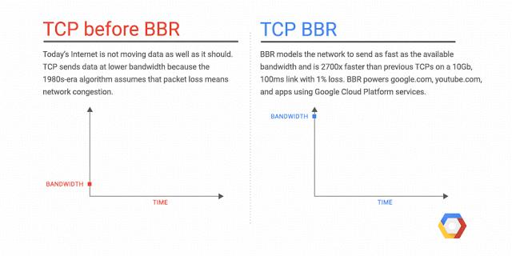

[https://cloud.google.com/blog/products/gcp/tcp-bbr-congestion-control-comes-to-gcp-your-internet-just-got-faster](https://link.zhihu.com/?target=https%3A//cloud.google.com/blog/products/gcp/tcp-bbr-congestion-control-comes-to-gcp-your-internet-just-got-faster)

### 为什么BBR会更好？
尽管我省略了很多细节，但还免不了是涉及相对复杂的概念。但需要了解的是，使用BBR，可以获得显著的网络吞吐量的提升和延迟的降低。吞吐量的改善在远距离路径上尤为明显，比如跨太平洋的文件或者大数据的传输，尤其是在有轻微丢包的网络条件下。延迟的改善主要体现在最后一公里的路径上，而这一路径经常受到缓冲膨胀（Bufferbloat）的影响。所谓“缓冲膨胀”指的网络设备或者系统不必要地设计了过大的缓冲区。当网络链路[拥塞](https://link.zhihu.com/?target=https%3A//zh.wikipedia.org/wiki/%25E6%258B%25A5%25E5%25A1%259E%25E6%258E%25A7%25E5%2588%25B6)时，就会发生缓冲膨胀，从而导致数据包在这些超大缓冲区中长时间排队。在[先进先出](https://link.zhihu.com/?target=https%3A//zh.wikipedia.org/wiki/%25E5%2585%2588%25E9%2580%25B2%25E5%2585%2588%25E5%2587%25BA%25E6%25BC%2594%25E7%25AE%2597%25E6%25B3%2595)队列系统中，过大的缓冲区会导致更长的队列和更高的延迟，并且不会提高网络吞吐量。由于BBR并不会试图填满缓冲区，所以在避免缓冲区膨胀方面往往会有更好的表现。

### 看一看BBR的表现
BBR从4.9版本开始就已经出现在Linux内核之中，可以通过一个简单的sysctl命令来启用。在我的测试中，我使用两台EC2 实例作为测试的硬件，安装的操作系统为Ubuntu 20.04。为了满足测试的要求，我将Linux 核心替换为我定制的5.8版本的核心。这两台实例运行在同一个区域的同一个可用区之下。实例的类型是c5.2xlarge，网卡为Amazon ENA，实例的网络最大带宽为10Gbps。

第一个测试是简单的带宽测试，看看我们可以从两台实例之间的单个TCP流量中得到什么。使用iperf3的测试显示了两台实例之间的带宽为4.98 Gbits/秒。这足以运行我们的实验。

  

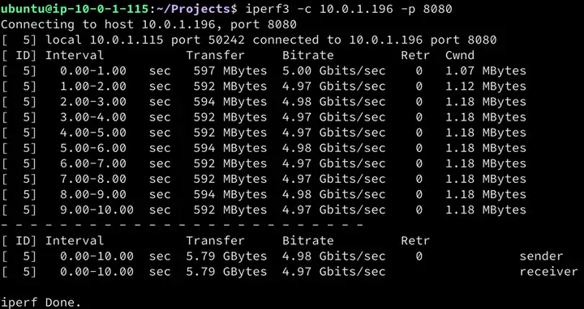

  

### 延迟对TCP吞吐量的影响
在现实的使用中，我所用到的服务器可能分布在世界的各个地区，所以我主要关心的是服务器之间的网络性能，当然网络间的延迟是在所难免的。在这个测试中，我们将使用Linux流量控制工具(tc) 在两台实例之间引入100ms的往返时间。这大致相当于从美国俄勒冈的us-west-2 访问位于日本东京的[http://github.com](https://link.zhihu.com/?target=http%3A//github.com)服务器(52.192.72.89)之间的延迟。

现在我们来看一下正常情况下两台实例的网络延迟

  

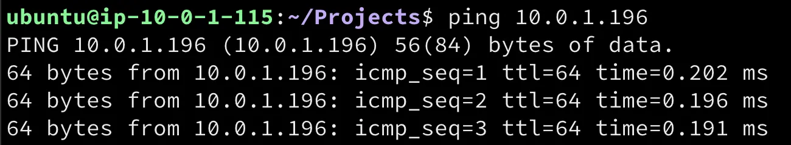

  

接下来，可以像下面这样在两台服务器的收发每个方向增加50ms的延迟。

sudo tc qdisc replace dev eth0 root netem latency 50ms

（注：取消上述的设置可以使用这个命令 sudo tc qdisc del dev eth0 root ）

如果我们用ping命令做一个检测，现在可以看到100ms的往返时间

  

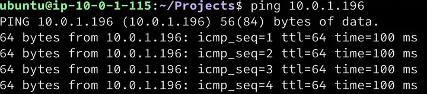

  

好了，该轮到我们的第一个测试了，我先用Cubic拥塞算法开始，因为这是目前最常用的TCP拥塞控制算法。

sudo sysctl -w net.ipv4.tcp_congestion_control=cubic

iperf3的测试显示平均传输速度为611 Mbits/秒。这是延迟对TCP吞吐量影响的第一条线索。与我们的初始测试（4.98Gbits/秒）相比，唯一发生变化的是引入了100ms的往返延迟。现在我们将拥塞控制算法设置为bbr，再进行一次测试。

sudo sysctl -w net.ipv4.tcp_congestion_control=bbr

结果与上一次很相似，约为 609 Mbits/秒，这比使用Cubic的结果略低。到目前为止，我们还没有看到真正的变化。

### 丢包对吞吐量的影响
我们要重复上面同样的测试，但要增加少量的丢包。通过下面的命令，我只在服务器（发送方）端引入1.5%的丢包量。

sudo tc qdisc replace dev eth0 root netem loss 1.5% latency 50ms

在使用Cubic算法的第一次测试中，显示出吞吐量的急剧下降；吞吐量下降到了10.5 Mbs/秒。这个下降的幅度大约是99.7%，导致这个链路的带宽基本上无法满足数据传输的需要了。

  

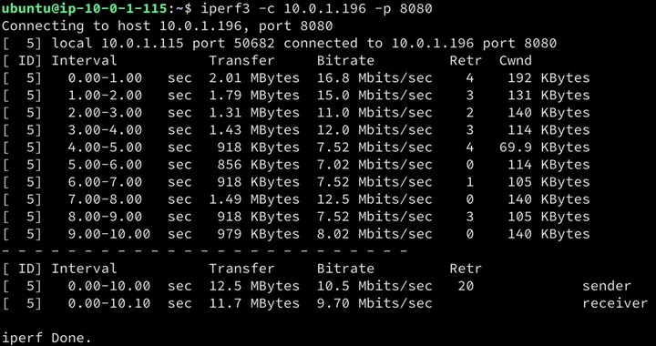

  

如果我们用BBR重复完全相同的测试，我们会看到比Cubic有显著的改善。使用BBR后，吞吐量下降到333Mbits/秒，下降了45%。

  

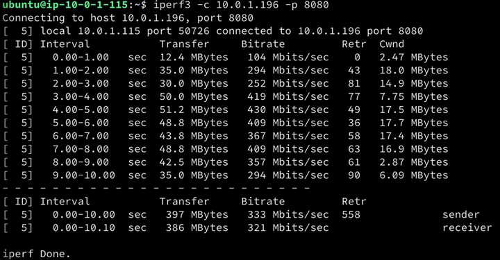

  

上面的测试显示了丢包和延迟对TCP吞吐量的巨大影响。在一个高延迟的路径上，仅仅是少量的数据包丢失（1.5%）就会产生了巨大的影响。在这些较长的路径上使用除BBR以外的任何其他技术，当出现哪怕是少量的丢包时，都会造成很大的问题。也只有BBR在任何超过1.5%的丢包损失时都能保持一个不错的吞吐量数字。

[Andree Toonk](https://link.zhihu.com/?target=https%3A//toonk.io/author/andree/index.html) 在他的[博客](https://link.zhihu.com/?target=https%3A//toonk.io/tcp-bbr-exploring-tcp-congestion-control/index.html)中验证了了使用不同拥塞控制算法、延迟和丢包参数所做的各种TCP吞吐量测试的全套测试，证明了在一定的丢包率（1.5%、3%）的情况下BBR的出色表现。结果如下图：

  

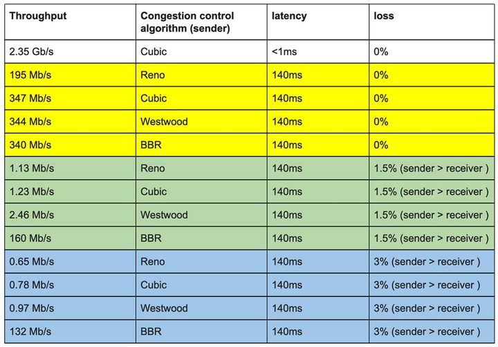

网络吞吐量 – 各种拥塞控制算法的测试结果

_注意：一个TCP__**会话使用的拥塞控制算法只与局部有关。所以，两个TCP**__系统可以在TCP__**会话的两边使用不同的拥塞控制算法。换句话说：服务器(**__发送方)__**，可以在本地启用BBR**__，而客户端不需要知道BBR__**，也不需要启用BBR**__。_

### TCP ss (socket statistics) 工具
当我们在探索调整TCP性能的时候，一定不要忘记使用_socket statistics_,

，也就是ss命令。例如下图所示，ss这个工具可以显示大量的套接字信息，包括使用的TCP流控算法，每个TCP会话的往返时间以及计算出的带宽和两个对等体之间的实际传输速率等，可以很好的用于网络监测和优化。

  

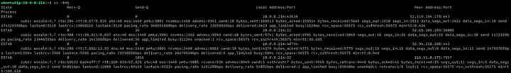

  

### 何时使用BBR
网络在没有丢包的情况下，Cubic和BBR对于这些较长时延的链路都有很好的表现。而在中度丢包的情况下，BBR的表现就非常突出了。为什么这一点很重要呢？或者换一个说法，为什么要针对丢包情况而进行优化？对于这个问题，让我们考虑一下这样的场景：我们在不同的地方放置有服务器，需要在系统或者服务器之间有源源不断的数据传输。例如日志文件、数据库同步、业务数据的异地备份等等。而在复杂的网络环境下，会因为各种原因而出现丢包的情况。在这种场景下，BBR将会大放异彩，帮助您维护更好的网络数据传输。

显而易见，BBR对所谓的“长肥网络”（带宽延迟积大、丢包率高的网络）非常有效，在CDN和视频应用等场景下也被证明有很好的表现。事实上，Youtube、Spotify和Dropbox大规模应用BBR已经有了很多的积累。这主要是因为BBR会积极地提升到最佳发送速率，使你的视频流加载或者文件下载速度更快。这是Dropbox 在2017年的一篇技术博客，非常值得我们学习。

[Optimizing web servers for high throughput and low latency](https://link.zhihu.com/?target=https%3A//dropbox.tech/infrastructure/optimizing-web-servers-for-high-throughput-and-low-latency)

### BBR的缺点
看这个标题很觉得奇怪吧。明明只要执行一个sysctl命令，你就能获得更好的吞吐量，网络用户就会获得更好的体验，有什么理由不这样做呢？好吧，BBR自出世以来已经收到了一些批评，首先，因为它倾向于抢占Cubic算法的带宽，在网络公平性上明显存在不足；其次BBR的机制会导致高重传率；第三点是在Wi-Fi环境下用户的网速明显变慢。综合来看，BBR与Cubic 相比只能说互有优劣，各有其擅长的领域。

### BBRv2 点展望
针对BBR 的问题，BBRv2的目标就是解决第一版中存在的一些主要缺点，其改进包括了还使用聚合/运行中的参数增强了网络建模，并增加了对ECN(显式拥塞通知)的支持等。为便于理解，我们可以通过这样一张表来了解这几个拥塞算法的异同。

  

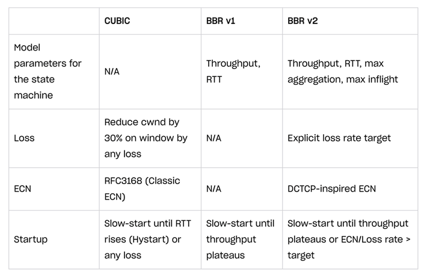

注：ECN是指网络瓶颈通知发送方在用尽缓冲区并开始“丢尾”数据包之前放慢速度的一种方式

现在我们了解了BBRv2，我们再将之前的实验重复一次，看一看BBRv2的具体表现。

我们先将拥塞算法设定为BBRv2

sudo sysctl -w net.ipv4.tcp_congestion_control=bbr2

接下来，使用iperf3 进行测速，结果如下：

  

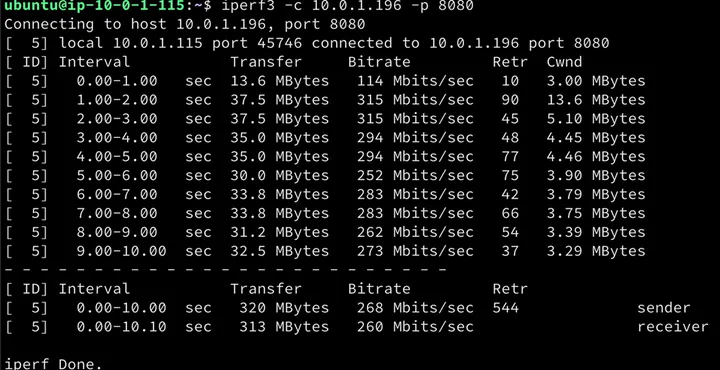

  

对比BBRv2、BBRv1的这两个实验，我们能明显的观察到BBRv2 较之BBR速度明显变“慢”了。但这可以说是一件好事，因为这或许是BBRv2广泛应用的前提。

随着BBRv2的出现，Dropbox 已经在其Dropbox Edge Network上进行了试用。在这篇博客中深入讨论了BBRv2的实践，值得一读。

[Evaluating BBRv2 on the Dropbox Edge Network](https://link.zhihu.com/?target=https%3A//dropbox.tech/infrastructure/evaluating-bbrv2-on-the-dropbox-edge-network)

这篇文章的结论对于BBRv2有很高的评价，特摘录出来：

“在我们的测试中，BBRv2显示了以下特性:

1. 对于网速较低的用户来说，带宽可以与CUBIC媲美。
2. 对于网速较高的用户来说，带宽可以与BBRv1媲美。
3. 丢包率比BBRv1低4倍；但仍然比CUBIC高2倍。
4. 传输中的数据比BBRv1低3倍；但略低于CUBIC。
5. RTTs较BBRv1低；但仍然比CUBIC高。
6. 与BBRv1相比，RTT具有更高的公平性。

总的来说，BBRv2在BBRv1基础上有了很大的改进，而且在需要更高带宽的情况下，它更接近于成为Reno/CUBIC的完全替代品。添加实验性的ECN支持，我们甚至可以看到他可以成为Datacenter TCP (DCTCP)的完全替代者。”

自2019年算法被提出， BBR2 已有了3个年头，但仍处于Alpha/Preview Release。各大主流的Linux 分发版本中并没有集成进来。有意了解这个项目不妨通过GitHub 的这个地址来关注一下, [https://github.com/google/bbr](https://link.zhihu.com/?target=https%3A//github.com/google/bbr)。但是如果想尝鲜却有点麻烦，只能通过编译Linux Kernel 来得到tcp_bbr.ko 这个内核模块。另一种选择是不妨体验一下我刚刚完成的一个基于Ubuntu 20.04 的Linux kernel，其中就包括了这个BBRv2。  

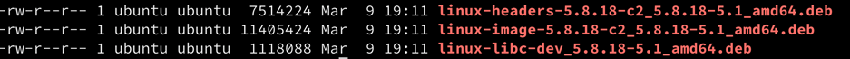

  

如果对于BBR 或者BBRv2以及这个新的Linux Kernel有兴趣需要与我讨论，可以通过这个邮箱与我联系[lianghon@amazon.com](https://link.zhihu.com/?target=http%3A//lianghon%40amazon.com/)。

### 本篇作者
### 费良宏
费良宏，AWS Principal Developer Advocate。在过去的20多年一直从事软件架构、程序开发以及技术推广等领域的工作。他经常在各类技术会议上发表演讲进行分享，他还是多个技术社区的热心参与者。他擅长Web领域应用、移动应用以及机器学习等的开发，也从事过多个大型软件项目的设计、开发与项目管理。目前他专注与云计算以及互联网等技术领域，致力于帮助中国的 开发者构建基于云计算的新一代的互联网应用。

## 转载来源
[AWS官方博客](https://link.zhihu.com/?target=https%3A//aws.amazon.com/cn/blogs/china/talking-about-network-optimization-from-the-flow-control-algorithm/)

> 更新: 2024-05-06 17:28:53  
> 原文: <https://www.yuque.com/linuxer/gscfv1/haox0rec0a19z3hs>