# 彻底搞清楚 Google BBR 拥塞控制算法原理

原文地址：[彻底搞清楚 Google BBR 拥塞控制算法原理](https://mp.weixin.qq.com/s/j88ppTUTLTOIA4RLrlC3Nw)

赵亚楠<font style="color:rgba(0, 0, 0, 0.9);"> </font>云原生实验室<font style="color:rgba(0, 0, 0, 0.9);"> </font>_2022-01-04 08:20_

## <font style="color:rgb(255, 255, 255);background-color:rgb(21, 166, 117);">译者序</font>
<font style="color:rgb(66, 75, 93);">本文翻译自 Google 2017 的论文：</font>

<font style="color:black;">Cardwell N, Cheng Y, Gunn CS, Yeganeh SH, Jacobson V.</font>**<font style="color:rgb(106, 187, 160);">BBR: congestion-based congestion control</font>**<sup>**<font style="color:rgb(106, 187, 160);">[1]</font>**</sup><font style="color:black;">. Communications of the ACM. 2017 Jan 23;60(2):58-66.</font>

<font style="color:rgb(66, 75, 93);">论文副标题：Measuring</font><font style="color:rgb(66, 75, 93);">B</font><font style="color:rgb(66, 75, 93);">ottleneck</font><font style="color:rgb(66, 75, 93);">B</font><font style="color:rgb(66, 75, 93);">andwidth and</font><font style="color:rgb(66, 75, 93);">R</font><font style="color:rgb(66, 75, 93);">ound-trip propagation time（测量瓶颈带宽和往返传输时间）。</font>

<font style="color:rgb(66, 75, 93);">BBR 之前，主流的 TCP 拥塞控制算法都是基于</font><font style="color:rgb(66, 75, 93);">丢包</font><font style="color:rgb(66, 75, 93);">（loss-based）设计的， 这一假设最早可追溯到上世纪八九十年代，那时的链路带宽和内存容量分别以 Mbps 和 KB 计，链路质量（以今天的标准来说）也很差。</font>

<font style="color:rgb(66, 75, 93);">三十年多后，这两个物理容量都已经增长了至少六个数量级，链路质量也不可同日而语。特别地，在现代基础设施中，</font><font style="color:rgb(66, 75, 93);">丢包和延迟不一定表示网络发生了拥塞</font><font style="color:rgb(66, 75, 93);">，因此原来的假设已经不再成立。Google 的网络团队从这一</font><font style="color:rgb(66, 75, 93);">根本问题</font><font style="color:rgb(66, 75, 93);">出发，（在前人工作的基础上） 设计并实现了一个</font><font style="color:rgb(66, 75, 93);">基于拥塞本身</font><font style="color:rgb(66, 75, 93);">而非基于丢包或延迟的拥塞控制新算法，缩写为 BBR。</font>

<font style="color:rgb(66, 75, 93);">简单来说，BBR 通过</font><font style="color:rgb(66, 75, 93);">应答包（ACK）中的 RTT 信息</font><font style="color:rgb(66, 75, 93);">和已发送字节数来计算</font><font style="color:rgb(66, 75, 93);">真实传输速率</font><font style="color:rgb(66, 75, 93);">（delivery rate），然后根据后者来调节客户端接下来的</font><font style="color:rgb(66, 75, 93);">发送速率</font><font style="color:rgb(66, 75, 93);">（sending rate），通过保持合理的 inflight 数据量来使</font><font style="color:rgb(66, 75, 93);">传输带宽最大、传输延迟最低</font><font style="color:rgb(66, 75, 93);">。另外，它完全运行在发送端，无需协议、 接收端或网络的改动，因此落地相对容易。</font>

<font style="color:rgb(66, 75, 93);">Google 的全球广域网（B4）在 2016 年就已经将全部 TCP 流量从 CUBIC 切换到 BBR， 吞吐提升了 2~25 倍；在做了一些配置调优之后，甚至进一步提升到了 133 倍（文中有详细介绍）。</font>

<font style="color:rgb(66, 75, 93);">Linux 实现：</font>

1. <font style="color:rgb(21, 166, 117);background-color:rgb(249, 242, 244);">include/uapi/linux/inet_diag.h</font>
2. <font style="color:rgb(21, 166, 117);background-color:rgb(249, 242, 244);">net/ipv4/tcp_bbr.c</font>

<font style="color:rgb(66, 75, 93);">翻译时适当加入了一些小标题，另外插入了一些内核代码片段（基于内核</font><font style="color:rgb(66, 75, 93);"> </font><font style="color:rgb(21, 166, 117);background-color:rgb(249, 242, 244);">5.10</font><font style="color:rgb(66, 75, 93);">），以更方便理解。</font>

**<font style="color:rgb(21, 166, 117);">由于译者水平有限，本文不免存在遗漏或错误之处。如有疑问，请查阅原文。</font>**

<font style="color:rgb(66, 75, 93);">以下是译文。</font>

---

<font style="color:rgb(66, 75, 93);">从各方面来说，今天的互联网</font><font style="color:rgb(66, 75, 93);">传输数据的速度</font><font style="color:rgb(66, 75, 93);">都不甚理想：</font>

+ <font style="color:rgb(66, 75, 93);">大部分移动用户都在忍受数秒乃至数分钟的延迟；</font>
+ <font style="color:rgb(66, 75, 93);">机场和大会场馆的共享 WIFI 信号一般都很差；</font>
+ <font style="color:rgb(66, 75, 93);">物理和气候学家需要与全球合作者交换 PB 级的数据，最后却发现精心设计的 Gbps 基础设施在</font><font style="color:rgb(66, 75, 93);">跨大洲通信时</font><font style="color:rgb(66, 75, 93);">带宽经常只能达到 Mbps</font><sup><font style="color:rgb(66, 75, 93);">6</font></sup><font style="color:rgb(66, 75, 93);">。</font>

<font style="color:rgb(66, 75, 93);">这些问题是由</font><font style="color:rgb(66, 75, 93);">TCP 的设计导致的 —— 20 世纪 80 年代设计 TCP 拥塞控制</font><font style="color:rgb(66, 75, 93);">（congestion control） 时，认为</font><font style="color:rgb(66, 75, 93);">丢包是发生了“拥塞”</font><sup><font style="color:rgb(66, 75, 93);">13</font></sup><font style="color:rgb(66, 75, 93);">。在当时的技术条件下我们可以这样认为，但它</font><font style="color:rgb(66, 75, 93);">并非第一原则</font><font style="color:rgb(66, 75, 93);">（technology limitations, not first principles）。随着网卡从 Mbps 到 Gbps、 内存从 KB 到 GB，</font><font style="color:rgb(66, 75, 93);">丢包和拥塞之间的关系也变得愈发微弱</font><font style="color:rgb(66, 75, 93);">。</font>

<font style="color:rgb(66, 75, 93);">今天，TCP 那些</font><font style="color:rgb(66, 75, 93);">基于丢包的拥塞控制</font><font style="color:rgb(66, 75, 93);">（loss-based congestion control） —— 即使是目前其中最好的 CUBIC</font><sup><font style="color:rgb(66, 75, 93);">11</font></sup><font style="color:rgb(66, 75, 93);"> </font><font style="color:rgb(66, 75, 93);">—— 是</font><font style="color:rgb(66, 75, 93);">导致这些问题的主要原因</font><font style="color:rgb(66, 75, 93);">。</font>

+ <font style="color:rgb(66, 75, 93);">链路瓶颈处的 buffer 很大时，这类算法会</font><font style="color:rgb(66, 75, 93);">持续占满整个缓冲区</font><font style="color:rgb(66, 75, 93);">，导致</font><font style="color:rgb(66, 75, 93);">bufferbloat</font><font style="color:rgb(66, 75, 93);">；</font>
+ <font style="color:rgb(66, 75, 93);">链路瓶颈处的 buffer 很小时，这类算法又会</font><font style="color:rgb(66, 75, 93);">误将丢包当作拥塞的信号</font><font style="color:rgb(66, 75, 93);">，导致</font><font style="color:rgb(66, 75, 93);">吞吐很低</font><font style="color:rgb(66, 75, 93);">。</font>

<font style="color:rgb(66, 75, 93);">解决这些问题需要一种全新的方式，而这首先需要对以下两点有深入理解：</font>

1. <font style="color:rgb(66, 75, 93);">拥塞会发生哪里</font><font style="color:rgb(66, 75, 93);">（where）</font>
2. <font style="color:rgb(66, 75, 93);">拥塞是如何发生的</font><font style="color:rgb(66, 75, 93);">（how）</font>

## <font style="color:rgb(255, 255, 255);background-color:rgb(21, 166, 117);">1 拥塞和瓶颈（Congestion and Bottlenecks）</font>
### <font style="color:rgb(66, 75, 93);">1.1 两个物理特性：传输时延（RTprop）和瓶颈带宽（BtlBw）</font>
<font style="color:rgb(66, 75, 93);">对于一个（全双工）TCP 连接，在任意时刻，它在每个方向都有且只有</font><font style="color:rgb(66, 75, 93);">一段最慢的链路</font><font style="color:rgb(66, 75, 93);">（exactly one slowest link）或称</font><font style="color:rgb(66, 75, 93);">瓶颈</font><font style="color:rgb(66, 75, 93);">（bottleneck）。这一点很重要，因为：</font>

+ <font style="color:rgb(66, 75, 93);">瓶颈</font><font style="color:rgb(66, 75, 93);">决定了连接的最大数据传输速率</font><font style="color:rgb(66, 75, 93);">。这是</font><font style="color:rgb(66, 75, 93);">不可压缩流</font><font style="color:rgb(66, 75, 93);">（incompressible flow）的一个常规特性。</font><font style="color:rgb(66, 75, 93);">例如，考虑交通高峰期的一个六车道高速公路，一起交通事故使其中一段变成了单车道， 那么这整条高速公路的吞吐就不会超过那条唯一还在正常通车的车道的吞吐。</font>
+ <font style="color:rgb(66, 75, 93);">瓶颈也是</font><font style="color:rgb(66, 75, 93);">持久队列（persistent queues）形成的地方</font><font style="color:rgb(66, 75, 93);">。</font><font style="color:rgb(66, 75, 93);">对于一条链路，只有当它的</font><font style="color:rgb(66, 75, 93);">离开速率</font><font style="color:rgb(66, 75, 93);">（departure rate）大于</font><font style="color:rgb(66, 75, 93);">到达速率</font><font style="color:rgb(66, 75, 93);">（arrival rate）时，这个队列才会开始收缩。对于一条有多段链路、运行在最大传输速率的连 接（connection），除瓶颈点之外的地方都有更大的离开速率，因此队列会朝着瓶颈 移动（migrate to the bottleneck）。</font>

<font style="color:rgb(66, 75, 93);">不管一条连接会经过多少条链路，以及每条链路的速度是多少，从 TCP 的角度来看， 任何一条复杂路径的行为，与 RTT（round-trip time）及瓶颈速率相同的单条链路的行为是一样的。换句话说，</font><font style="color:rgb(66, 75, 93);">以下两个物理特性决定了传输的性能</font><font style="color:rgb(66, 75, 93);">：</font>

+ <font style="color:rgb(21, 166, 117);background-color:rgb(249, 242, 244);">RTprop</font><font style="color:rgb(66, 75, 93);"> </font><font style="color:rgb(66, 75, 93);">(round-trip propagation time)：往返传输时间</font>
+ <font style="color:rgb(21, 166, 117);background-color:rgb(249, 242, 244);">BtlBw</font><font style="color:rgb(66, 75, 93);"> </font><font style="color:rgb(66, 75, 93);">(bottleneck bandwidth)：瓶颈带宽</font>

<font style="color:black;">如果网络路径是一条物理管道，那 RTprop 就是管道的</font><font style="color:black;">长度</font><font style="color:black;">，而 BtlBw 则是管道</font><font style="color:black;">最窄处的直径</font><font style="color:black;">。</font>

### <font style="color:rgb(66, 75, 93);">1.2 传输时延/瓶颈带宽与 inflight 数据量的关系</font>
<font style="color:rgb(66, 75, 93);">图 1 展示了</font><font style="color:rgb(66, 75, 93);">inflight 数据量</font><font style="color:rgb(66, 75, 93);">（已发送但还未被确认的数据量）不断增大时， RTT 和传输速率（delivery rate）的变化情况：</font>

<font style="color:black;">直观上，这张图想解释的是：随着</font><font style="color:black;">正在传输中的数据的不断增多，传输延迟和传输速率将如何变化</font><font style="color:black;">。难点在于二者并没有简单的关系可以表示。不仅如此，后文还将看到二者甚至不可同 时测量 —— 就像量子力学中位置和动量不可同时测量。译注。</font>

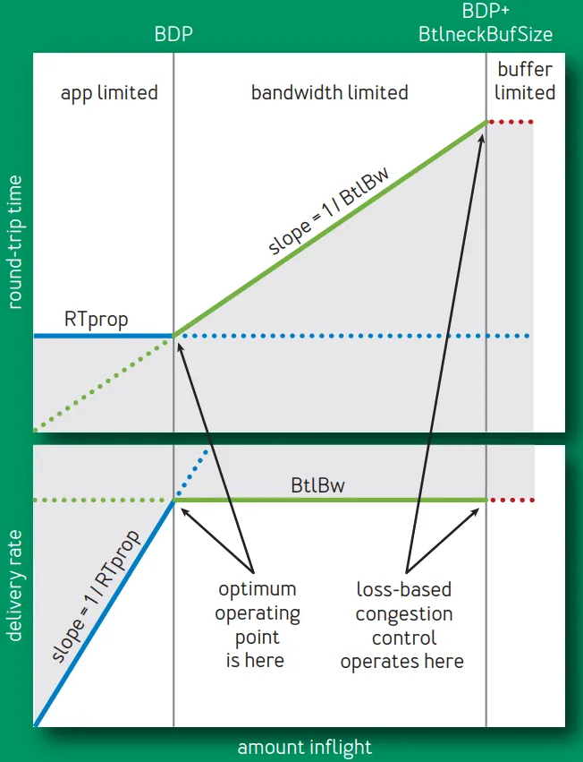

<font style="color:rgb(153, 153, 153);">Fig 1. Delivery rate and RTT vs. inflight data</font>

+ <font style="color:rgb(66, 75, 93);">蓝线展示 RTprop 限制，</font>
+ <font style="color:rgb(66, 75, 93);">绿线展示 BtlBw 限制，</font>
+ <font style="color:rgb(66, 75, 93);">红线是瓶颈缓冲区（bottleneck buffer）</font>

<font style="color:rgb(66, 75, 93);">横轴表示 inflight 数据量，关键的点有三个，依次为</font><font style="color:rgb(66, 75, 93);"> </font><font style="color:rgb(21, 166, 117);background-color:rgb(249, 242, 244);">0 -> BDP -> BDP+BtlneckBuffSize</font><font style="color:rgb(66, 75, 93);">， 后两个点做垂线，将整个空间分为了三个部分：</font>

1. <font style="color:rgb(21, 166, 117);background-color:rgb(249, 242, 244);">(0, BDP)</font><font style="color:rgb(66, 75, 93);">：这个区间内，应用（客户端）发送的数据并未占满瓶颈带宽（容量），因此称为</font><font style="color:rgb(66, 75, 93);">应用受限（app limited）</font><font style="color:rgb(66, 75, 93);">区域；</font>
2. <font style="color:rgb(21, 166, 117);background-color:rgb(249, 242, 244);">(BDP, BDP+BtlneckBuffSize)</font><font style="color:rgb(66, 75, 93);">：这个区间内，已经达到链路瓶颈容量，但还未超过</font><font style="color:rgb(66, 75, 93);">瓶颈容量+缓冲区容量</font><font style="color:rgb(66, 75, 93);">，此时应用能发送的数据量主要受带宽限制， 因此称为</font><font style="color:rgb(66, 75, 93);">带宽受限（bandwidth limited）</font><font style="color:rgb(66, 75, 93);">区域；</font>
3. <font style="color:rgb(21, 166, 117);background-color:rgb(249, 242, 244);">(BDP+BtlneckBuffSize, infinity)</font><font style="color:rgb(66, 75, 93);">：这个区间内，实际发送速率已经超过瓶颈容量+缓冲区容量 ，多出来的数据会被丢弃，缓冲区大小决定了丢包多少，因此称为</font><font style="color:rgb(66, 75, 93);">缓冲区受限（buffer limited）</font><font style="color:rgb(66, 75, 93);">区域。</font>

<font style="color:black;">以上三者，也可以更直白地称为</font><font style="color:black;">应用不足、带宽不足、缓冲区不足</font><font style="color:black;">区域。译注。</font>

### <font style="color:rgb(66, 75, 93);">1.3 以上关系的进一步解释</font>
<font style="color:rgb(66, 75, 93);">我们来更具体地看一下传输时延（RTprop）和瓶颈带宽（BtlBw）与与 inflight 数据量呈现以上关系：</font>

1. <font style="color:rgb(66, 75, 93);">inflight 数据量在</font><font style="color:rgb(66, 75, 93);"> </font><font style="color:rgb(21, 166, 117);background-color:rgb(249, 242, 244);">0 -> BDP</font><font style="color:rgb(66, 75, 93);"> </font><font style="color:rgb(66, 75, 93);">区间内时，发送的数据还未达到瓶颈容量，此时，</font><font style="color:rgb(66, 75, 93);">因此，这个阶段的行为由 RTprop 决定。</font>
    1. <font style="color:rgb(66, 75, 93);">往返时间不变</font><font style="color:rgb(66, 75, 93);">：对应上半部分图，因为此时还未达到瓶颈带宽，链路不会随数据量增加而带来额外延迟；</font>
    2. <font style="color:rgb(66, 75, 93);">传输速率线性增大</font><font style="color:rgb(66, 75, 93);">：对应下半部分图；</font>
2. <font style="color:rgb(66, 75, 93);">inflight 数据量刚好等于</font><font style="color:rgb(66, 75, 93);"> </font><font style="color:rgb(21, 166, 117);background-color:rgb(249, 242, 244);">BDP</font><font style="color:rgb(66, 75, 93);"> </font><font style="color:rgb(66, 75, 93);">时，</font>
    1. <font style="color:rgb(66, 75, 93);">两条限制线相交的点称为 BDP 点，这也是 BDP（bandwidth-delay product，</font><font style="color:rgb(66, 75, 93);">带宽-延迟乘积</font><font style="color:rgb(66, 75, 93);">）这个名称的由来；</font>
    2. <font style="color:rgb(66, 75, 93);">此时可以算出：</font><font style="color:rgb(21, 166, 117);background-color:rgb(249, 242, 244);">inflight = BtlBw × RTprop</font><font style="color:rgb(66, 75, 93);">；</font>
3. <font style="color:rgb(66, 75, 93);">inflight 大于</font><font style="color:rgb(66, 75, 93);"> </font><font style="color:rgb(21, 166, 117);background-color:rgb(249, 242, 244);">BDP</font><font style="color:rgb(66, 75, 93);"> </font><font style="color:rgb(66, 75, 93);">之后，管道就满了（超过瓶颈带宽）</font>
    1. <font style="color:rgb(66, 75, 93);">超过瓶颈带宽的数据就会形成一个队列（queue），堆积在链路瓶颈处，然后</font>
    2. <font style="color:rgb(66, 75, 93);">RTT 将随着 inflight 数据的增加而线性增加，如上半部分图所示。</font>
4. <font style="color:rgb(66, 75, 93);">inflight 继续增大，超过</font><font style="color:rgb(66, 75, 93);"> </font><font style="color:rgb(21, 166, 117);background-color:rgb(249, 242, 244);">BDP+BtlneckBuffSize</font><font style="color:rgb(66, 75, 93);"> </font><font style="color:rgb(66, 75, 93);">之后，即超过链路瓶颈所支持的最大缓冲区之后，就开始丢包。</font>

<font style="color:rgb(66, 75, 93);">灰色区域是不可达的，因为它违反了至少其中一个限制。限制条件的不同导致了三个可行区域 （app-limited, bandwidth-limited, and buffer-limited）各自有不同的行为。</font>

### <font style="color:rgb(66, 75, 93);">1.4 拥塞和拥塞控制的直观含义</font>
<font style="color:rgb(66, 75, 93);">再次给出图 1，</font>


<font style="color:rgb(153, 153, 153);">Fig 1. Delivery rate and RTT vs. inflight data</font>

<font style="color:rgb(66, 75, 93);">直观上来说，</font><font style="color:rgb(66, 75, 93);">拥塞</font><font style="color:rgb(66, 75, 93);">（congestion）就是</font><font style="color:rgb(66, 75, 93);">inflight 数据量持续向右侧偏离 BDP 线</font><font style="color:rgb(66, 75, 93);">的行为， 而</font><font style="color:rgb(66, 75, 93);">拥塞控制</font><font style="color:rgb(66, 75, 93);">（congestion control）就是各种在平均程度上</font><font style="color:rgb(66, 75, 93);">控制这种偏离程度</font><font style="color:rgb(66, 75, 93);">的方案或算法。</font>

### <font style="color:rgb(66, 75, 93);">1.5 基于丢包的拥塞控制工作机制</font>
<font style="color:rgb(66, 75, 93);">基于丢包的拥塞控制工作在 bandwidth-limited 区域的右侧，依靠：</font>

1. <font style="color:rgb(66, 75, 93);">很高的延迟</font><font style="color:rgb(66, 75, 93);">，以及</font>
2. <font style="color:rgb(66, 75, 93);">频繁的丢包</font>

<font style="color:rgb(66, 75, 93);">将连接的</font><font style="color:rgb(66, 75, 93);">传输速率维持在全速瓶颈带宽</font><font style="color:rgb(66, 75, 93);">（full bottleneck bandwidth）。</font>

+ <font style="color:rgb(66, 75, 93);">在内存很贵的年代，瓶颈链路的</font><font style="color:rgb(66, 75, 93);">缓冲区只比 BDP 略大</font><font style="color:rgb(66, 75, 93);">，这使得 基于丢包的拥塞控制导致的</font><font style="color:rgb(66, 75, 93);">额外延迟很小</font><font style="color:rgb(66, 75, 93);">；</font>
+ <font style="color:rgb(66, 75, 93);">随着内存越来越便宜，</font><font style="color:rgb(66, 75, 93);">缓冲区已经比 ISP 链路的 BDP 要大上几个数量级了</font><font style="color:rgb(66, 75, 93);">， 其结果是，bufferbloat 导致的</font><font style="color:rgb(66, 75, 93);">RTT 达到了秒级</font><font style="color:rgb(66, 75, 93);">，而不再是毫秒级</font><sup><font style="color:rgb(66, 75, 93);">9</font></sup><font style="color:rgb(66, 75, 93);">。</font>

### <font style="color:rgb(66, 75, 93);">1.6 更好的工作机制及存在的挑战</font>
<font style="color:rgb(66, 75, 93);">Bandwidth-limited 区域的</font><font style="color:rgb(66, 75, 93);">左侧边界</font><font style="color:rgb(66, 75, 93);">是比右侧更好的一个拥塞控制点。</font>

+ <font style="color:rgb(66, 75, 93);">1979 年，Leonard Kleinrock</font><sup><font style="color:rgb(66, 75, 93);">16</font></sup><font style="color:rgb(66, 75, 93);"> </font><font style="color:rgb(66, 75, 93);">证明了这个点是最优的</font><font style="color:rgb(66, 75, 93);">， 能最大化传输速率、最小化延迟和丢包，不管是对于单个连接还是整个网络</font><sup><font style="color:rgb(66, 75, 93);">8</font></sup><font style="color:rgb(66, 75, 93);">。</font>
+ <font style="color:rgb(66, 75, 93);">不幸的是，大约在同一时间，Jeffrey M. Jaffe</font><sup><font style="color:rgb(66, 75, 93);">14</font></sup><font style="color:rgb(66, 75, 93);"> </font><font style="color:rgb(66, 75, 93);">证明了</font><font style="color:rgb(66, 75, 93);">不存在能收敛到这个点的分布式算法</font><font style="color:rgb(66, 75, 93);">。这个结果使得研究方向从寻找一个能达到 Kleinrock 最佳工作点（operating point）的分布式算法，转向了对不同拥塞控制方式的研究。</font>

<font style="color:rgb(66, 75, 93);">在 Google，我们团队每天都会花数小时来分析从世界各地收集上来的 TCP 包头， 探究各种异常和反常现象背后的意义。</font>

+ <font style="color:rgb(66, 75, 93);">第一步通常是寻找基本的路径特性 RTprop 和 BtlBw。</font>
+ <font style="color:rgb(66, 75, 93);">能从跟踪信息中拿到这些数据这一事实，说明 Jaffe 的结论可能并没有看上去那么悲观。Jaffe 的结果在本质上具有测量模糊性（fundamental measurement ambiguities），例 如，测量到的 RTT 增加是由于路径长度变化导致的，还是瓶颈带宽变小导致的，还是另 一个连接的流量积压、延迟增加导致的。</font>
+ <font style="color:rgb(66, 75, 93);">虽然无法让任何单个测量参数变得很精确，但一个</font><font style="color:rgb(66, 75, 93);">连接随着时间变化的行为</font><font style="color:rgb(66, 75, 93);">还是能清晰地反映出某些东西，也预示着用于</font><font style="color:rgb(66, 75, 93);">解决这种模糊性的测量策略</font><font style="color:rgb(66, 75, 93);">是可行的。</font>

### <font style="color:rgb(66, 75, 93);">1.7 BBR：基于对两个参数（RTprop、BtlBw）的测量实现拥塞控制</font>
<font style="color:rgb(66, 75, 93);">组合这些测量指标（measurements），再引入一个健壮的</font><font style="color:rgb(66, 75, 93);">伺服系统</font><font style="color:rgb(66, 75, 93);">（基于</font><font style="color:rgb(66, 75, 93);">控制系统</font><font style="color:rgb(66, 75, 93);">领域的近期进展）</font><sup><font style="color:rgb(66, 75, 93);">12</font></sup><font style="color:rgb(66, 75, 93);">，我们便得到一个能</font><font style="color:rgb(66, 75, 93);">针对对真实拥塞 —— 而非丢包或延迟</font><font style="color:rgb(66, 75, 93);">—— 做出反应的</font><font style="color:rgb(66, 75, 93);">分布式拥塞控制协议</font><font style="color:rgb(66, 75, 93);">，能以很大概率收敛到 Kleinrock 的最优工作点。</font>

<font style="color:rgb(66, 75, 93);">我们的三年努力也正是从这里开始：试图基于对如下</font><font style="color:rgb(66, 75, 93);">刻画一条路径的两个参数</font><font style="color:rgb(66, 75, 93);">的测量， 来实现一种拥塞控制机制，</font>

+ <font style="color:rgb(66, 75, 93);">瓶颈带宽（</font><font style="color:rgb(66, 75, 93);">B</font><font style="color:rgb(66, 75, 93);">ottleneck</font><font style="color:rgb(66, 75, 93);">B</font><font style="color:rgb(66, 75, 93);">andwidth）</font>
+ <font style="color:rgb(66, 75, 93);">往返传输时间（</font><font style="color:rgb(66, 75, 93);">R</font><font style="color:rgb(66, 75, 93);">ound-trip propagation time）</font>

## <font style="color:rgb(255, 255, 255);background-color:rgb(21, 166, 117);">2 瓶颈的数学表示（Characterizing the Bottleneck）</font>
### <font style="color:rgb(66, 75, 93);">2.1 最小化缓冲区积压（或最高吞吐+最低延迟）需满足的条件</font>
<font style="color:rgb(66, 75, 93);">当一个连接满足以下两个条件时，它将运行在</font><font style="color:rgb(66, 75, 93);">最高吞吐和最低延迟</font><font style="color:rgb(66, 75, 93);">状态：</font>

1. <font style="color:rgb(66, 75, 93);">速率平衡（rate balance）</font><font style="color:rgb(66, 75, 93);">：瓶颈链路的</font><font style="color:rgb(66, 75, 93);">数据包到达速率</font><font style="color:rgb(66, 75, 93);">刚好等于瓶颈带宽</font><font style="color:rgb(66, 75, 93);"> </font><font style="color:rgb(21, 166, 117);background-color:rgb(249, 242, 244);">BtlBw</font><font style="color:rgb(66, 75, 93);">，</font><font style="color:rgb(66, 75, 93);">这个条件保证了链路瓶颈已达到 100% 利用率。</font>
2. <font style="color:rgb(66, 75, 93);">管道填满（full pipe）</font><font style="color:rgb(66, 75, 93);">：传输中的总数据（inflight）等于 BDP（</font><font style="color:rgb(21, 166, 117);background-color:rgb(249, 242, 244);">= BtlBw × RTprop</font><font style="color:rgb(66, 75, 93);">）。</font><font style="color:rgb(66, 75, 93);">这个条件保证了有恰好足够的数据，既不会产生瓶颈饥饿（bottleneck starvation）， 又不会产生管道溢出（overfill the pipe）。</font>

<font style="color:rgb(66, 75, 93);">需要注意，</font>

+ <font style="color:rgb(66, 75, 93);">仅凭 rate balance 一个条件</font><font style="color:rgb(66, 75, 93);">并不能确保没有积压</font><font style="color:rgb(66, 75, 93);">。</font><font style="color:rgb(66, 75, 93);">例如，某个连接在一个 BDP=5 的链路上，开始时它发送了 10 个包组成的 Initial Window，之后就一直稳定运行在瓶颈速率上。那么，在这个链路此后的行为就是：</font>
    - <font style="color:rgb(66, 75, 93);">稳定运行在瓶颈速率上</font>
    - <font style="color:rgb(66, 75, 93);">稳定有 5 个包的积压（排队）</font>
+ <font style="color:rgb(66, 75, 93);">类似地，仅凭 full pipe 一个条件</font><font style="color:rgb(66, 75, 93);">也无法确保没有积压</font><font style="color:rgb(66, 75, 93);">。</font><font style="color:rgb(66, 75, 93);">例如，如果某个连接以</font><font style="color:rgb(66, 75, 93);"> </font><font style="color:rgb(21, 166, 117);background-color:rgb(249, 242, 244);">BDP/2</font><font style="color:rgb(66, 75, 93);"> </font><font style="color:rgb(66, 75, 93);">的</font><font style="color:rgb(66, 75, 93);">突发方式</font><font style="color:rgb(66, 75, 93);">发送一个 BDP 的数据， 那仍然能达到瓶颈利用率，但却会产生平均 BDP/4 的瓶颈积压。</font>

<font style="color:rgb(66, 75, 93);">在链路瓶颈以及整条路径上</font><font style="color:rgb(66, 75, 93);">最小化积压的唯一方式</font><font style="color:rgb(66, 75, 93);">是同时满足以上两个条件。</font>

### <font style="color:rgb(66, 75, 93);">2.2 无偏估计（unbiased estimator）</font>
<font style="color:black;">下文会提到“无偏估计”这个统计学术语，这里先科普下：</font>

<font style="color:black;">In statistics, the bias (or bias function) of an estimator is the difference between this estimator's expected value and the true value of the parameter being estimated. An estimator or decision rule with zero bias is called unbiased.</font>

**<font style="color:rgb(106, 187, 160);">Wikipedia: Bias of an estimator</font>**<sup>**<font style="color:rgb(106, 187, 160);">[2]</font>**</sup>

<font style="color:black;">译注。</font>

### <font style="color:rgb(66, 75, 93);">2.3 传输时延（RTProp）的表示与估计</font>
<font style="color:rgb(66, 75, 93);">BtlBw 和 RTprop 在一个连接的生命周期中是不断变化的，因此必须持续对它们做出</font><font style="color:rgb(66, 75, 93);">估计</font><font style="color:rgb(66, 75, 93);">（estimation）。</font>

<font style="color:rgb(66, 75, 93);">TCP 目前跟踪了 RTT</font><font style="color:rgb(66, 75, 93);">（从发送一段数据到这段数据被确认接收的时间） ，因为检测是否有丢包要用到这个参数。在任意时刻</font><font style="color:rgb(66, 75, 93);"> </font>_<font style="color:rgb(66, 75, 93);">t</font>_<font style="color:rgb(66, 75, 93);">,</font>

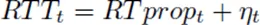

<font style="color:rgb(66, 75, 93);">其中</font>

+ _<font style="color:rgb(66, 75, 93);">𝛈 ≥ 0</font>_<font style="color:rgb(66, 75, 93);"> </font><font style="color:rgb(66, 75, 93);">表示路径上因为积压、接收方延迟应答策略、应答聚合等因素而引入的</font><font style="color:rgb(66, 75, 93);">“噪声”</font><font style="color:rgb(66, 75, 93);">；</font>
+ _<font style="color:rgb(66, 75, 93);">RTprop</font>_<font style="color:rgb(66, 75, 93);"> </font><font style="color:rgb(66, 75, 93);">是往返传输时延。</font>

<font style="color:rgb(66, 75, 93);">前面已经提到，</font><font style="color:rgb(21, 166, 117);background-color:rgb(249, 242, 244);">RTprop</font><font style="color:rgb(66, 75, 93);"> </font><font style="color:rgb(66, 75, 93);">是路径（connection's path）的一个物理特性，只有当路径发 生变化时它才会变化。由于路径变化的时间尺度远大于 RTProp，因此在时刻 T，一个无偏、高效估计是：</font>

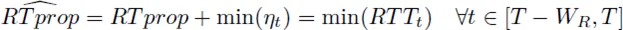

<font style="color:rgb(66, 75, 93);">例如，在时间窗口</font><font style="color:rgb(66, 75, 93);"> </font>_<font style="color:rgb(66, 75, 93);">W</font>_<sub>_<font style="color:rgb(66, 75, 93);">R</font>_</sub><font style="color:rgb(66, 75, 93);"> </font><font style="color:rgb(66, 75, 93);">内的移动最小值（running min），其中典型情况下，</font>_<font style="color:rgb(66, 75, 93);">W</font>_<sub>_<font style="color:rgb(66, 75, 93);">R</font>_</sub><font style="color:rgb(66, 75, 93);"> </font><font style="color:rgb(66, 75, 93);">的持续时间是</font><font style="color:rgb(66, 75, 93);">几十秒到几分钟</font><font style="color:rgb(66, 75, 93);">。</font>

<font style="color:black;">这里直观上的解释是：</font><font style="color:black;">一段时间内的最小 RTT</font><font style="color:black;">（可测量），就是 这条路径</font><font style="color:black;">（在一段时间内）的往返传输延迟</font><font style="color:black;">。译注。</font>

### <font style="color:rgb(66, 75, 93);">2.4 瓶颈带宽（BtlBw）的表示与估计</font>
<font style="color:rgb(66, 75, 93);">不同于 RTT，TCP 规范中并没有要求跟踪 bottleneck bandwidth，但可以通过</font><font style="color:rgb(66, 75, 93);">跟踪传输速率</font><font style="color:rgb(66, 75, 93);">（delivery rate）来得到一个对瓶颈带宽的不错估计。</font>

<font style="color:rgb(66, 75, 93);">当应答包（ACK）到达发送端时，其中除了包含 RTT 信息，还包含包离开时的 inflight data 传输情况。已传输的数据量除以传输时间，就是发送和应答之间的</font><font style="color:rgb(66, 75, 93);">平均传输速率</font><font style="color:rgb(66, 75, 93);">：</font>

_<font style="color:rgb(66, 75, 93);">deliveryRate = Δdelivered/Δt</font>_

+ <font style="color:rgb(66, 75, 93);">这个速率一定</font><font style="color:rgb(66, 75, 93);"> </font><font style="color:rgb(21, 166, 117);background-color:rgb(249, 242, 244);"><= bottleneck rate</font><font style="color:rgb(66, 75, 93);">；</font>
+ <font style="color:rgb(66, 75, 93);">到达数据量</font><font style="color:rgb(66, 75, 93);"> </font>_<font style="color:rgb(66, 75, 93);">Δdelivered</font>_<font style="color:rgb(66, 75, 93);"> </font><font style="color:rgb(66, 75, 93);">已经知道了，因此接下来需要确定的是</font><font style="color:rgb(66, 75, 93);"> </font>_<font style="color:rgb(66, 75, 93);">Δt</font>_<font style="color:rgb(66, 75, 93);">，而</font><font style="color:rgb(66, 75, 93);"> </font>_<font style="color:rgb(66, 75, 93);">Δt ≥ true arrival interval</font>_<font style="color:rgb(66, 75, 93);">；</font>
+ <font style="color:rgb(66, 75, 93);">因此，</font><font style="color:rgb(21, 166, 117);background-color:rgb(249, 242, 244);">deliveryRate <= the true delivery rate</font><font style="color:rgb(66, 75, 93);">，也就是</font><font style="color:rgb(66, 75, 93);">估计出的传输速率，不会超过真实瓶颈带宽</font><font style="color:rgb(66, 75, 93);">，后者是前者的上限。</font>

<font style="color:rgb(66, 75, 93);">因此，传输速率在一段时间窗口内的最大值（windowed-max），是 BtlBw 的一个高效、 无偏估计：</font>

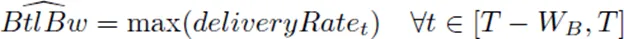

<font style="color:rgb(66, 75, 93);">其中时间窗口</font><font style="color:rgb(66, 75, 93);"> </font>_<font style="color:rgb(66, 75, 93);">W</font>_<sub>_<font style="color:rgb(66, 75, 93);">B</font>_</sub><font style="color:rgb(66, 75, 93);"> </font><font style="color:rgb(66, 75, 93);">典型情况下是 6~10 个 RTT。</font>

<font style="color:black;">这里直观上的解释是：</font><font style="color:black;">一段时间内的链路最大传输带宽</font><font style="color:black;">（可测量），就是这条链路的</font><font style="color:black;">瓶颈带宽</font><font style="color:black;">。译注。</font>

### <font style="color:rgb(66, 75, 93);">2.5 BBR 测量机制</font>
<font style="color:rgb(66, 75, 93);">TCP 记录了每个包的离开时间，再加上已传输的数据量，当</font><font style="color:rgb(66, 75, 93);">每个 ACK 包到达发送端时，将产生</font><font style="color:rgb(66, 75, 93);">：</font>

1. <font style="color:rgb(66, 75, 93);">一个 RTT 值</font>
2. <font style="color:rgb(66, 75, 93);">传输速率的一次测量值（a delivery rate measurement）</font>

<font style="color:rgb(66, 75, 93);">过滤器可以将这两个测量到的值转换成对 RTprop 和 BtlBw 的估计。</font>

<font style="color:rgb(66, 75, 93);">注意，</font><font style="color:rgb(66, 75, 93);">这两个变量是完全独立的</font><font style="color:rgb(66, 75, 93);">：</font>

+ <font style="color:rgb(66, 75, 93);">在瓶颈带宽不变的情况下，RTprop 仍可能发生变化（例如，路由变了）；</font>
+ <font style="color:rgb(66, 75, 93);">路径（path）不变的情况下（因此 RTprop 也不变），BtlBw 也可能发生变化（例如，某条无线链路速率变了）</font>

<font style="color:rgb(66, 75, 93);">这种无关性也解释了为什么</font><font style="color:rgb(66, 75, 93);">需要同时知道这两个限制条件，才能确定传输路径的发送行为</font><font style="color:rgb(66, 75, 93);">。</font>

### <font style="color:rgb(66, 75, 93);">2.6 不确定性原理</font>
<font style="color:rgb(66, 75, 93);">由于 RTprop 只对 BDP 的左侧可见，BtlBw 只对右侧可见，因此它们服从不确定性原理（ uncertainty principle）：</font><font style="color:rgb(66, 75, 93);">当测量其中一个时，另一个将不可测量</font><font style="color:rgb(66, 75, 93);">。</font>

<font style="color:rgb(66, 75, 93);">直观上的解释</font><font style="color:rgb(66, 75, 93);">是：管道整个长度被填满 —— 或称溢出（overfilled）—— 时才能达到它的 最大容量，而溢出之后会（在缓冲区中）创建一个队列（queue），后者作为管道的 延伸又</font><font style="color:rgb(66, 75, 93);">反过来模糊了管道的长度</font><font style="color:rgb(66, 75, 93);">。</font>

<font style="color:rgb(66, 75, 93);">例如，</font>

1. <font style="color:rgb(66, 75, 93);">发送请求/接收响应的的应用：可能永远无法发送足够多的数据来填满管道，因此它</font><font style="color:rgb(66, 75, 93);">只能测量到传输延迟，而无法测量到 BtlBw</font><font style="color:rgb(66, 75, 93);">。</font>
2. <font style="color:rgb(66, 75, 93);">持续几小时的大批量数据传输：可能整个生命周期都位于图中的带宽受限区域，因此它</font><font style="color:rgb(66, 75, 93);">自始至终只有一个 RTprop 样本，也就是第一个包的 RTT</font><font style="color:rgb(66, 75, 93);">（其他包 的 RTT 对这种场景来说是无效样本）。</font>

<font style="color:rgb(66, 75, 93);">这种内在的不确定性意味着，除了依靠测量值来估计（恢复）出两个路径变量之外， 必须有状态来跟踪：</font>

1. <font style="color:rgb(66, 75, 93);">从当前的工作位置可以学到什么</font><font style="color:rgb(66, 75, 93);">（what can be learned at the current operating point）</font>
2. <font style="color:rgb(66, 75, 93);">当信息失效时，</font><font style="color:rgb(66, 75, 93);">如何找到下一个</font><font style="color:rgb(66, 75, 93);">可以继续学习的工作位置（how to get to an operating point where it can be relearned）</font>

<font style="color:rgb(66, 75, 93);">这里说的</font><font style="color:rgb(66, 75, 93);">“工作位置”</font><font style="color:rgb(66, 75, 93);">，是指图 1 中的 RTProp 和 BtlBw 不同组合产生的位置。</font>

## <font style="color:rgb(255, 255, 255);background-color:rgb(21, 166, 117);">3 使数据流（Packet Flow）与传输路径（Delivery Path）相匹配</font>
<font style="color:rgb(66, 75, 93);">BBR 的核心算法分为两部分：</font>

1. <font style="color:rgb(66, 75, 93);">当收到一个 ACK 时，应该做什么操作；</font>
2. <font style="color:rgb(66, 75, 93);">当发送一段数据时，应该做什么操作。</font>

### <font style="color:rgb(66, 75, 93);">3.1 BBR 收到应答包（ACK）时的逻辑</font>
<font style="color:rgb(66, 75, 93);">每个 ACK 都为我们提供了</font><font style="color:rgb(66, 75, 93);">RTT</font><font style="color:rgb(66, 75, 93);">和</font><font style="color:rgb(66, 75, 93);">平均传输速率</font><font style="color:rgb(66, 75, 93);">的一次</font><font style="color:rgb(66, 75, 93);">测量</font><font style="color:rgb(66, 75, 93);">，二者又将分别更新对 RTprop 和 BtlBw 的估计。</font>

<font style="color:rgb(66, 75, 93);">具体来说，收到一个 ACK 时，BBR 将执行以下逻辑：</font>

```c
function onAck(packet)
    rtt = now - packet.sendtime                      // 收包时间 减去 包中记录的发包时间
    update_min_filter(RTpropFilter, rtt)             // 根据 2.2 中的方程，更新对 RTT 的估计

    delivered      += packet.size
  delivered_time =  now
  delivery_rate  =  (delivered - packet.delivered) / (delivered_time - packet.delivered_time)

    if (delivery_rate > BtlBwFilter.current_max      // 实际传输速率已经大于当前估计的瓶颈带宽，或
      || !packet.app_limited)                       // 不是应用受限（应用受限的样本对估计 BtlBw 无意义）
        update_max_filter(BtlBwFilter, delivery_rate) // 根据 2.3 中的方程，更新对 BtlBw 的估计

        if (app_limited_until > 0)                       // 达到瓶颈带宽前，仍然可发送的字节数
            app_limited_until = app_limited_until - packet.size
```

<font style="color:rgb(66, 75, 93);">几点说明：</font>

1. <font style="color:rgb(66, 75, 93);">每个包都会更新对 RTProp 的估计，但</font><font style="color:rgb(66, 75, 93);">只有部分包会更新对 BtlBw 的估计</font><font style="color:rgb(66, 75, 93);">；</font>
2. <font style="color:rgb(66, 75, 93);">应用受限的包</font>
    - <font style="color:rgb(66, 75, 93);">对于一个包，当应用（application）全速发送它而仍然没有占满瓶颈带宽时， BBR 会这个包标记为</font><font style="color:rgb(21, 166, 117);background-color:rgb(249, 242, 244);">app_limited</font><font style="color:rgb(66, 75, 93);">（见下面的</font><font style="color:rgb(66, 75, 93);"> </font><font style="color:rgb(21, 166, 117);background-color:rgb(249, 242, 244);">send()</font><font style="color:rgb(66, 75, 93);"> </font><font style="color:rgb(66, 75, 93);">伪代码）， 即</font><font style="color:rgb(66, 75, 93);"> </font><font style="color:rgb(21, 166, 117);background-color:rgb(249, 242, 244);">packet.app_limited = true</font><font style="color:rgb(66, 75, 93);">。</font>
    - <font style="color:rgb(66, 75, 93);">这将决定哪些样本会用来更新对带宽的估计。</font>
3. <font style="color:rgb(66, 75, 93);">瓶颈带宽 BtlBw 是传输速率的一个硬性上限，因此</font>
    - <font style="color:rgb(66, 75, 93);">如果测量到</font><font style="color:rgb(66, 75, 93);">当前的传输速率 > 当前对 BtlBw 估计</font><font style="color:rgb(66, 75, 93);">， 必定意味着这个估计太低了，不管样本是不是 app-limited；对应到上面的代码，就是只要</font><font style="color:rgb(21, 166, 117);background-color:rgb(249, 242, 244);">delivery_rate > BtlBwFilter.current_max</font><font style="color:rgb(66, 75, 93);">，就一定更新 BtlBw 估计；否则，</font>
    - <font style="color:rgb(66, 75, 93);">如果样本不是 app-limited（说明实际带宽已经饱和），也更新 BtlBw 估计。</font>

### <font style="color:rgb(66, 75, 93);">3.2 TCP Pacing（在每个 RTT 窗口内均匀发送数据）</font>
<font style="color:black;">科普下 TCP pacing 这个下文将用到的概念：</font>

<font style="color:black;">Paper:</font><font style="color:black;"> </font>**<font style="color:rgb(106, 187, 160);">Understanding the Performance of TCP Pacing</font>**<sup>**<font style="color:rgb(106, 187, 160);">[3]</font>**</sup>

<font style="color:black;">TCP’s congestion control mechanisms can lead to bursty traffic flows on modern high-speednetworks, with a negative impact on overall network efficiency. A pro-posed solution to this problem is to</font><font style="color:black;">evenly space, or “pace”, data sent intothe network over an entire round-trip time</font><font style="color:black;">, so that data is not sent in aburst. In this paper, we quantitatively evaluate this approach.</font>

<font style="color:black;">译注。</font>

<font style="color:rgb(66, 75, 93);">为了让</font><font style="color:rgb(66, 75, 93);">数据包的到达速率</font><font style="color:rgb(66, 75, 93);">（packet-arrival rate）能匹配到</font><font style="color:rgb(66, 75, 93);">瓶颈链路的离开速率</font><font style="color:rgb(66, 75, 93);">（departure rate）, BBR 会</font><font style="color:rgb(66, 75, 93);">对每个数据进行 pace</font><font style="color:rgb(66, 75, 93);">（在每个 RTT 窗口内均匀发送数据）。</font>

<font style="color:rgb(66, 75, 93);">有两个控制参数：</font>

1. <font style="color:rgb(21, 166, 117);background-color:rgb(249, 242, 244);">pacing_rate</font><font style="color:rgb(66, 75, 93);">：BBR 的</font><font style="color:rgb(66, 75, 93);">主要控制参数</font><font style="color:rgb(66, 75, 93);">。</font><font style="color:rgb(66, 75, 93);">要求达到速率必须匹配到瓶颈速率，意味着</font><font style="color:rgb(66, 75, 93);">pacing 是 BBR</font><font style="color:rgb(66, 75, 93);">设计以及实际操作中</font><font style="color:rgb(66, 75, 93);">必不可少的部分</font><font style="color:rgb(66, 75, 93);">。</font>
2. <font style="color:rgb(21, 166, 117);background-color:rgb(249, 242, 244);">cwnd_gain</font><font style="color:rgb(66, 75, 93);">：等于 BDP 乘以一个略大于 1 的系数， 用来容忍常见的网络和接收端异常（pathologies） (见后文 Delayed and Stretched ACKs 小节)。</font>

### <font style="color:rgb(66, 75, 93);">3.3 BBR 发送数据时的逻辑</font>
<font style="color:rgb(66, 75, 93);">TCP 发包时的 BBR 逻辑如下：</font>

```c
function send(packet)
    bdp = BtlBwFilter.current_max * RTpropFilter.current_min  // 计算 BDP
    if (inflight >= cwnd_gain * bdp)  // 如果正在传输中的数据量超过了允许的最大值
        return                  // 直接返回，接下来就等下一个 ACK，或者等超时重传

        // 能执行到这说明 inflight < cwnd_gain * bdp，即正在传输中的数据量 < 瓶颈容量

        if (now >= next_send_time)
            packet = nextPacketToSend()
            if (!packet)           // 如果没有数据要发送
                app_limited_until = inflight // 更新 “在达到瓶颈容量之前，仍然可发送的数据量”
                return

                packet.app_limited = (app_limited_until > 0)  // 如果仍然能发送若干字节才会达到瓶颈容量，说明处于 app_limited 状态
                packet.sendtime = now
     packet.delivered = delivered
     packet.delivered_time = delivered_time
     ship(packet)
                next_send_time = now + packet.size / (pacing_gain * BtlBwFilter.current_max)

                timerCallbackAt(send, next_send_time)
```

<font style="color:rgb(66, 75, 93);">在 Linux 实现中，BBR 发送过程会用到高效的</font><font style="color:rgb(66, 75, 93);">FQ/pacing qdisc</font><sup><font style="color:rgb(66, 75, 93);">4</font></sup><font style="color:rgb(66, 75, 93);">， 这使得 BBR 在多条 Gbps 链路上，单条连接的性能就能达到线速；CPU 开销几乎可以忽略 ，就能处理几千条低速 paced 连接。</font>

### <font style="color:rgb(66, 75, 93);">3.4 稳态行为（Steady-state behavior）</font>
#### <font style="color:rgb(66, 75, 93);">路径适配与控制循环</font>
<font style="color:rgb(66, 75, 93);">BBR 的</font><font style="color:rgb(66, 75, 93);">发送速率</font><font style="color:rgb(66, 75, 93);">和发送数据量只是估计出的</font><font style="color:rgb(66, 75, 93);"> </font><font style="color:rgb(21, 166, 117);background-color:rgb(249, 242, 244);">BtlBw</font><font style="color:rgb(66, 75, 93);"> </font><font style="color:rgb(66, 75, 93);">和</font><font style="color:rgb(66, 75, 93);"> </font><font style="color:rgb(21, 166, 117);background-color:rgb(249, 242, 244);">RTprop</font><font style="color:rgb(66, 75, 93);">的一个函数，过滤器（filters）除了要对瓶颈进行估计之外，还要控制</font><font style="color:rgb(66, 75, 93);">对传输路径的适配</font><font style="color:rgb(66, 75, 93);">（control adaptation）。这产生了如图 2 所示的新的控制循环，</font>

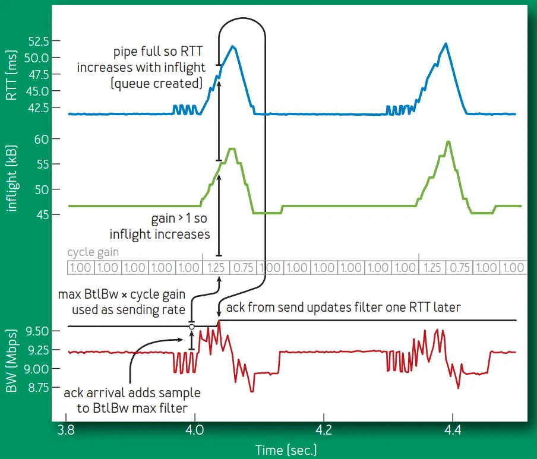

<font style="color:rgb(153, 153, 153);">Fig 2. RTT (blue), inflight (green), BtlBw max filter (black) and delivery rate (red) detail</font>

<font style="color:rgb(66, 75, 93);">从上到下四条横线：</font>

1. <font style="color:rgb(66, 75, 93);">RTT</font>
2. <font style="color:rgb(66, 75, 93);">inflight</font>
3. <font style="color:rgb(66, 75, 93);">BtlBw 的估计值（状态）</font>
    - <font style="color:rgb(66, 75, 93);">它上面的那行表格是</font><font style="color:rgb(66, 75, 93);">pacing_gain</font><font style="color:rgb(66, 75, 93);">，它是一个固定数组，不断循环；</font>
    - <font style="color:rgb(66, 75, 93);">每个时刻使用的 pacing_gain 及其效果在图中是对齐的；</font>
    - <font style="color:rgb(66, 75, 93);">每个 gain 会在发送数据时使用，因此是早一个 RTT 窗口；这可以从图中从下往上、再从上往下的整个环路看出来。</font>
4. <font style="color:rgb(66, 75, 93);">delivery rate（实际传输速率）</font>

<font style="color:rgb(66, 75, 93);">几点说明：</font>

1. <font style="color:rgb(66, 75, 93);">图中凸起的</font><font style="color:rgb(66, 75, 93);">尖峰是 BBR 使用 pacing_gain 周期切换导致</font><font style="color:rgb(66, 75, 93);">的，目的是判断 BtlBw 是否有增加。</font>
2. <font style="color:rgb(66, 75, 93);">BBR 在大部分时间都</font><font style="color:rgb(66, 75, 93);">将 inflight 数据量保持在一个 BDP</font><font style="color:rgb(66, 75, 93);">，并用 BtlBw estimate 进行 pace，以此来</font><font style="color:rgb(66, 75, 93);">最小化延迟</font><font style="color:rgb(66, 75, 93);">。这将</font><font style="color:rgb(66, 75, 93);">瓶颈从链路前移到了发送端</font><font style="color:rgb(66, 75, 93);">，因此发送端是无法看到 BtlBw 升高的。</font>

#### <font style="color:rgb(66, 75, 93);">稳态的收敛过程</font>
<font style="color:rgb(66, 75, 93);">BBR 会定期使用</font><font style="color:rgb(66, 75, 93);"> </font><font style="color:rgb(21, 166, 117);background-color:rgb(249, 242, 244);">pacing_gain > 1</font><font style="color:rgb(66, 75, 93);"> </font><font style="color:rgb(66, 75, 93);">来均分每个 RTprop interval，增大了发送速率和 inflight 数据量。下面这是如何保持（或达到新的）稳态的。</font>

<font style="color:rgb(66, 75, 93);">考虑链路瓶颈带宽 BtlBw 的两种可能情况：</font>

1. <font style="color:rgb(66, 75, 93);">继续保持恒定（大部分情况）</font>
2. <font style="color:rgb(66, 75, 93);">突然增大（例如</font><font style="color:rgb(66, 75, 93);">物理链路扩容</font><font style="color:rgb(66, 75, 93);">）</font>

<font style="color:rgb(66, 75, 93);">如果 BtlBw 恒定，</font>

+ <font style="color:rgb(66, 75, 93);">增加的数据量会在瓶颈处创建一个 queue，这会导致 RTT 变大，但</font><font style="color:rgb(66, 75, 93);"> </font><font style="color:rgb(21, 166, 117);background-color:rgb(249, 242, 244);">deliveryRate</font><font style="color:rgb(66, 75, 93);"> </font><font style="color:rgb(66, 75, 93);">此时还是恒定的；</font>
+ <font style="color:rgb(66, 75, 93);">下一个 RTprop 窗口会以</font><font style="color:rgb(66, 75, 93);"> </font><font style="color:rgb(21, 166, 117);background-color:rgb(249, 242, 244);">pacing_gain < 1</font><font style="color:rgb(66, 75, 93);"> </font><font style="color:rgb(66, 75, 93);">发送数据，从而会将这个 queue 移除。</font>

<font style="color:rgb(66, 75, 93);">如果 BtlBw 增大了，</font>

+ <font style="color:rgb(21, 166, 117);background-color:rgb(249, 242, 244);">deliveryRate</font><font style="color:rgb(66, 75, 93);"> </font><font style="color:rgb(66, 75, 93);">也会增大，那么新的最大值会立即导致 BtlBw 的估计值变大，从而增大了基础 pacing 速率。</font>
+ <font style="color:rgb(66, 75, 93);">因此，BBR 会以</font><font style="color:rgb(66, 75, 93);">指数级快速收敛到新的瓶颈速率</font><font style="color:rgb(66, 75, 93);">。</font>

<font style="color:rgb(66, 75, 93);">图 3 展示了一个原本运行在</font><font style="color:rgb(66, 75, 93);"> </font><font style="color:rgb(21, 166, 117);background-color:rgb(249, 242, 244);">10-Mbps/40-ms</font><font style="color:rgb(66, 75, 93);"> </font><font style="color:rgb(66, 75, 93);">flow，链路瓶颈突然翻倍到 20 Mbps，平稳运行 20s 之后 又重新回到 10Mbps 的效果：</font>

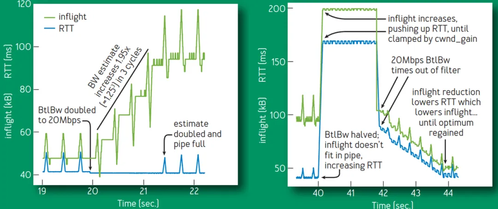

<font style="color:rgb(153, 153, 153);">Fig 3. Bandwidth change</font>

<font style="color:black;">BBR 是一个 max-plus 控制系统（一种基于</font><font style="color:black;"> </font><font style="color:rgb(21, 166, 117);background-color:rgb(249, 242, 244);">max()</font><font style="color:black;"> </font><font style="color:black;">和加法操作的代数）的一个具体使用场景，这是一种基于非标准代数进行控制的新方式</font><sup><font style="color:black;">12</font></sup><font style="color:black;">。这种方式允许 adaptation rate （由</font><font style="color:black;"> </font>_<font style="color:black;">max</font>_<font style="color:black;"> </font><font style="color:black;">gain 控制）独立于 queue growth （由</font><font style="color:black;"> </font>_<font style="color:black;">average</font>_<font style="color:black;"> </font><font style="color:black;">gain 控制）。应用到这里，得到的就是一个简单、隐含的控制循环，其中，对物理限制的变化的适应过程， 由代表这些限制的 filters 自动处理。而传统控制系统则需要通过一个复杂状态机连接 起来的多个循环，才能完成同样效果。</font>

## <font style="color:rgb(255, 255, 255);background-color:rgb(21, 166, 117);">4 BBR Flow 行为</font>
### <font style="color:rgb(66, 75, 93);">4.1 BBR 状态机</font>
<font style="color:rgb(66, 75, 93);">现有的实现使用事件相关（event-specific）的算法和代码来处理启动、关闭和丢包恢复等事件。</font>

<font style="color:rgb(66, 75, 93);">BBR 使用上一节的</font><font style="color:rgb(66, 75, 93);">两个函数</font><font style="color:rgb(21, 166, 117);background-color:rgb(249, 242, 244);">onAck()</font><font style="color:rgb(66, 75, 93);"> </font><font style="color:rgb(66, 75, 93);">和</font><font style="color:rgb(66, 75, 93);"> </font><font style="color:rgb(21, 166, 117);background-color:rgb(249, 242, 244);">send()</font><font style="color:rgb(66, 75, 93);"> </font><font style="color:rgb(66, 75, 93);">处理所有事情</font><font style="color:rgb(66, 75, 93);">， 通过序列化一组“状态”来处理事件，其中“状态”定义为一个 table，其中描述的是一组固定增益和退出条件（fixed gains and exit criteria）。</font>

```c
// include/uapi/linux/inet_diag.h

/* BBR has the following modes for deciding how fast to send: */
enum bbr_mode {
    BBR_STARTUP, /* ramp up sending rate rapidly to fill pipe */
        BBR_DRAIN, /* drain any queue created during startup */
        BBR_PROBE_BW, /* discover, share bw: pace around estimated bw */
        BBR_PROBE_RTT, /* cut inflight to min to probe min_rtt */
    };

/* The pacing_gain values for the PROBE_BW gain cycle, to discover/share bw: */
static const int bbr_pacing_gain[] = {
    BBR_UNIT * 5 / 4, /* probe for more available bw */
        BBR_UNIT * 3 / 4, /* drain queue and/or yield bw to other flows */
        BBR_UNIT, BBR_UNIT, BBR_UNIT, /* cruise at 1.0*bw to utilize pipe, */
        BBR_UNIT, BBR_UNIT, BBR_UNIT /* without creating excess queue... */
    };
```

<font style="color:rgb(66, 75, 93);">状态机：</font>

```c
// net/ipv4/tcp_bbr.c

|
    V
                          +---> STARTUP  ----+
    |        |         |
    |        V         |
    |      DRAIN   ----+
    |        |         |
    |        V         |
    +---> PROBE_BW ----+
    |      ^    |      |
    |      |    |      |
    |      +----+      |
    |                  |
    +---- PROBE_RTT <--+
```

1. <font style="color:rgb(66, 75, 93);">Startup 状态发生在连接启动时；</font>
    1. <font style="color:rgb(66, 75, 93);">为了处理跨 12 个量级的互联网链路带宽，Startup 为 BtlBw 实现了一个二分查找，随 着传输速率增加，每次用 2/ln2 增益来 double 发送速率。这会在</font><font style="color:rgb(66, 75, 93);"> </font>_<font style="color:rgb(66, 75, 93);">log</font>_<sub>_<font style="color:rgb(66, 75, 93);">2</font>_</sub>_<font style="color:rgb(66, 75, 93);">BDP</font>_<font style="color:rgb(66, 75, 93);"> </font><font style="color:rgb(66, 75, 93);">个 RTT 窗口内探测出 BDP，但过程中会导致最多两个</font>_<font style="color:rgb(66, 75, 93);">2BDP</font>_<font style="color:rgb(66, 75, 93);"> </font><font style="color:rgb(66, 75, 93);">的积压（excess queue）。</font>
    2. <font style="color:rgb(66, 75, 93);">探测出 BtlBw 之后，BBR 转入 Drain 状态。</font>
2. <font style="color:rgb(66, 75, 93);">Drain 状态发生在连接启动时；</font>
    1. <font style="color:rgb(66, 75, 93);">Drain 状态利用与 Startup 相反的增益，来排尽那些积压在缓冲区中的数据，</font>
    2. <font style="color:rgb(66, 75, 93);">inflight 数据量降低到一个 BDP 之后，转入 ProbeBW 状态；</font>
3. <font style="color:rgb(66, 75, 93);">大部分时间花在 ProbeBW 状态</font><font style="color:rgb(66, 75, 93);">，具体内容就是前面已经介绍的</font><font style="color:rgb(66, 75, 93);">“稳态行为”收敛过程</font><font style="color:rgb(66, 75, 93);">；</font>

### <font style="color:rgb(66, 75, 93);">4.2 单条 BBR flow 的启动时行为</font>
<font style="color:rgb(66, 75, 93);">图 4 展示了一个</font><font style="color:rgb(66, 75, 93);"> </font><font style="color:rgb(21, 166, 117);background-color:rgb(249, 242, 244);">10-Mbps/40-ms</font><font style="color:rgb(66, 75, 93);"> </font><font style="color:rgb(66, 75, 93);">BBR TCP flow 的前 1 秒，</font>

+ <font style="color:rgb(66, 75, 93);">发送端（绿色）和接收端（蓝色）随时间的变化。</font>
+ <font style="color:rgb(66, 75, 93);">红色是 CUBIC 发送端在完全相同条件下的行为。</font>

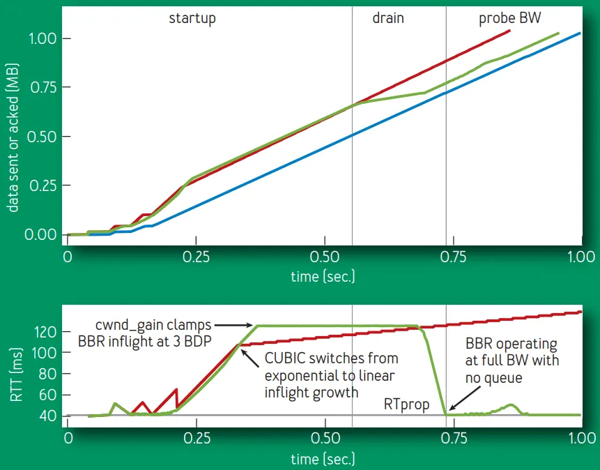

<font style="color:rgb(153, 153, 153);">Fig 4. First second of a 10-Mbps, 40-ms BBR flow.</font>

<font style="color:rgb(66, 75, 93);">几点解释：</font>

1. <font style="color:rgb(66, 75, 93);">上半部分图展示的是 BBR 和 CUBIC 连接的 RTT 随时间的变化。注意，这份数据的时 间参考是 ACK 到达（蓝色），因此，while they appear to be time shifted, events are shown at the point where BBR learns of them and acts.</font>
2. <font style="color:rgb(66, 75, 93);">下半部分图中可以看出，BBR 和 CUBIC 的初始行为是类似的，但</font><font style="color:rgb(66, 75, 93);">BBR 能完全排尽它的 startup queue 而 CUBIC 不能</font><font style="color:rgb(66, 75, 93);">。</font><font style="color:rgb(66, 75, 93);">CUBIC 算法中没有 inflight 信息，因此它后面的 inflight 还会持续增长（虽然没那么激进），直到 瓶颈 buffer 满了导致丢包，或者接收方的 inflight limit (TCP's receive window) 达到了。</font>

<font style="color:rgb(66, 75, 93);">图 5 是这条 flow 前 8 秒的详情，</font>

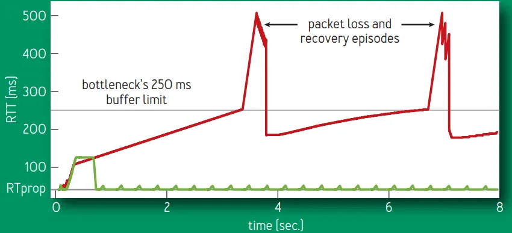

<font style="color:rgb(153, 153, 153);">Fig 5. First eight seconds of 10-Mbps, 40-ms CUBIC and BBR flows.</font>

1. <font style="color:rgb(66, 75, 93);">CUBIC (red) 填满了可用缓冲区，然后每隔几秒就会从 70% to 100%；</font>
2. <font style="color:rgb(66, 75, 93);">而 BBR（绿色）启动之后，后面运行时就</font><font style="color:rgb(66, 75, 93);">不会再出现积压</font><font style="color:rgb(66, 75, 93);">。</font>

### <font style="color:rgb(66, 75, 93);">4.3 共享同一瓶颈的多条 BBR flow 的行为</font>
<font style="color:rgb(66, 75, 93);">图 6 展示了共享同一 100-Mbps/10-ms 瓶颈的多条 BBR flow 各自的吞吐，以及如何收敛到公平份额的：</font>

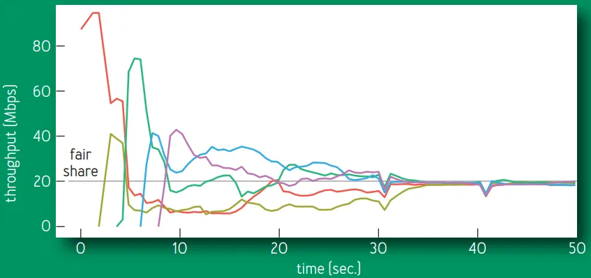

<font style="color:rgb(153, 153, 153);">Fig 6. Throughputs of 5 BBR flows sharing a bottleneck</font>

<font style="color:rgb(66, 75, 93);">图中向下的几个三角形，是 connection ProbeRTT states，它们的 self-synchronization 加速了最终收敛。</font>

+ <font style="color:rgb(66, 75, 93);">ProbeBW gain 周期性变化（见前面图 2），使</font><font style="color:rgb(66, 75, 93);">大 flow 将带宽匀给小 flow</font><font style="color:rgb(66, 75, 93);">， 最终每个 flow 都得到一个公平的份额；</font>
+ <font style="color:rgb(66, 75, 93);">整个过程非常快（</font><font style="color:rgb(66, 75, 93);">几个 ProbeBW 周期</font><font style="color:rgb(66, 75, 93);">）；</font>

<font style="color:rgb(66, 75, 93);">但如果某些 flow 已经（短时地）导致积压，后来者会过高估计 RTProp，可能一段时间内 的不公平（收敛时间超出几个 ProbeBW 周期）。</font>

+ <font style="color:rgb(66, 75, 93);">要学习到真正的 RTProp，需要通过 ProbeRTT 状态移动到 BDP 的左侧：</font>
+ <font style="color:rgb(66, 75, 93);">当 RTProp estimate 持续几秒钟未被更新时（例如，没有测量到一个更低的 RTT） BBR 进入 ProbeRTT，这会将 inflight 降低到每个 RTT 不超过 4 包，然后再返回之前的状态。</font>

<font style="color:rgb(66, 75, 93);">大 flow 进入 ProbeRTT 之后会从积压队列中 drain 很多包，因此一些 flows 就能观测 到一个新的 RTprop (new minimum RTT)。这使得它们的 RTprop estimates 在同一时间过 期，因此集中进入 ProbeRTT 状态，这会进一步使积压的数据更快消化，从而使更多 flow 看到新的 RTprop，以此类推。这种</font><font style="color:rgb(66, 75, 93);">分布式协调</font><font style="color:rgb(66, 75, 93);">（distributed coordination）是公平性和稳定性（fairness and stability）的关键。</font>

+ <font style="color:rgb(66, 75, 93);">BBR 的期望状态是</font><font style="color:rgb(66, 75, 93);">瓶颈队列零积压</font><font style="color:rgb(66, 75, 93);">（an empty bottleneck queue） ，并围绕这个目标不断同步 flow；</font>
+ <font style="color:rgb(66, 75, 93);">基于丢包的拥塞控制，期望状态是</font><font style="color:rgb(66, 75, 93);">队列的定期积压和溢出</font><font style="color:rgb(66, 75, 93);">（ periodic queue growth and overflow，这会导致延迟放大和丢包），并围绕这个目标不断同步 flow。</font>

## <font style="color:rgb(255, 255, 255);background-color:rgb(21, 166, 117);">5 部署经验</font>
### <font style="color:rgb(66, 75, 93);">5.1 Google B4 广域网（WAN）部署经验</font>
<font style="color:rgb(66, 75, 93);">B4 是 Google 用</font><font style="color:rgb(66, 75, 93);">商用交换机</font><font style="color:rgb(66, 75, 93);">（commodity switches）构建的高速广域网</font><sup><font style="color:rgb(66, 75, 93);">15</font></sup><font style="color:rgb(66, 75, 93);">。</font>

+ <font style="color:rgb(66, 75, 93);">这些</font><font style="color:rgb(66, 75, 93);">小缓冲区（shallow-buffered）交换机</font><font style="color:rgb(66, 75, 93);">的丢包主要来自</font><font style="color:rgb(66, 75, 93);">偶发的突发流量</font><font style="color:rgb(66, 75, 93);">；</font>
+ <font style="color:rgb(66, 75, 93);">2015</font><font style="color:rgb(66, 75, 93);">年，Google 开始将 B4 上的生产流量</font><font style="color:rgb(66, 75, 93);">从 CUBIC 切换到 BBR</font><font style="color:rgb(66, 75, 93);">，期间没有出现重大问题；</font>
+ <font style="color:rgb(66, 75, 93);">2016</font><font style="color:rgb(66, 75, 93);">年，</font><font style="color:rgb(66, 75, 93);">所有 B4 TCP 流量</font><font style="color:rgb(66, 75, 93);">都已经切到 BBR。</font>

<font style="color:rgb(66, 75, 93);">图 7 可以看出，</font><font style="color:rgb(66, 75, 93);">BBR 的吞吐稳定地比 CUBIC 高 2~25 倍</font><font style="color:rgb(66, 75, 93);">，</font>

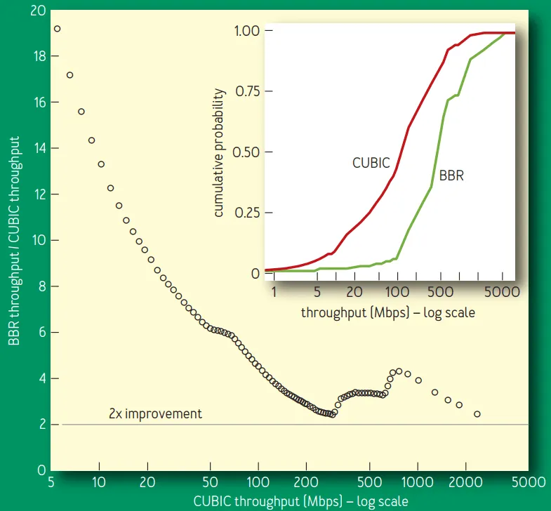

<font style="color:rgb(153, 153, 153);">Fig 7. BBR vs. CUBIC relative throughput improvement.</font>

<font style="color:rgb(66, 75, 93);">以我们某个活跃的探测器（prober）服务作为实验对象，该服务会创建到远程数据中心的持久 BBR 和 CUBIC 连接， 然后每分钟传输 8MB 数据。探测器之间会通过北美、欧洲和亚洲的多条跨洲或洲内 B4 路径通信。</font>

<font style="color:rgb(66, 75, 93);">  
</font>

<font style="color:rgb(66, 75, 93);">但按照我们的理论估计，BBR 的性能应该比这个更好</font><font style="color:rgb(66, 75, 93);">，</font>

+ <font style="color:rgb(66, 75, 93);">排查之后发现，75% 的 BBR 连接都受限于内核 TCP 的接收缓冲区，我们的网络运营团 队之前有意将这个参数调低了（设置为 8MB），目的是防止 CUBIC MB 量级的积压数据 泛洪（跨洲 8-MB/200-ms RTT 将导致最大 335-Mbps 带宽占用），</font>
+ <font style="color:rgb(66, 75, 93);">手动将 US-Europe 的一条路径上的接收缓冲区调大之后，BBR 立即达到了 2Gbps 的带宽 —— 而 CUBIC 仍然只能到达 15Mbps ——</font><font style="color:rgb(66, 75, 93);">133 倍</font><font style="color:rgb(66, 75, 93);">的提升，正如 Mathis 等人的预测</font><sup><font style="color:rgb(66, 75, 93);">17</font></sup><font style="color:rgb(66, 75, 93);">。</font>

<font style="color:rgb(66, 75, 93);">这巨大的提升是 BBR</font><font style="color:rgb(66, 75, 93);">没有将丢包作为拥塞指示器</font><font style="color:rgb(66, 75, 93);">（not using loss as a congestion indicator）的一个直接结果。为达到全速带宽，现有的基于丢包的拥塞控制，要求丢包率低于 BDP 的 inverse square</font><font style="color:rgb(66, 75, 93);"> </font><sup><font style="color:rgb(66, 75, 93);">17</font></sup><font style="color:rgb(66, 75, 93);">(e.g., 小于 one loss per 30 million packets for a 10-Gbps/100-ms path)</font>

<font style="color:rgb(66, 75, 93);">Figure 8 比较了不同丢包率下的实际吞吐量：</font>

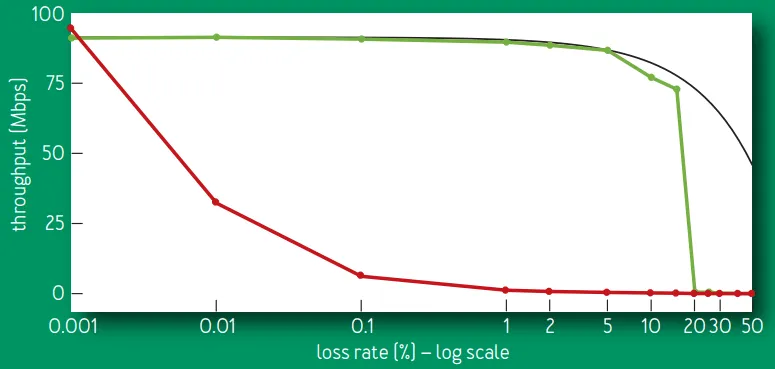

<font style="color:rgb(153, 153, 153);">Fig 8. BBR vs. CUBIC goodput for 60-second flows on a 100-Mbps/100-ms link with 0.001 to 50 percent random loss.</font>

<font style="color:rgb(66, 75, 93);">最大可能的吞吐是</font><font style="color:rgb(66, 75, 93);"> </font><font style="color:rgb(21, 166, 117);background-color:rgb(249, 242, 244);">链路速率乘以 * (1 - lossRate)</font><font style="color:rgb(66, 75, 93);">，</font>

+ <font style="color:rgb(66, 75, 93);">CUBIC 的吞吐在丢包率</font><font style="color:rgb(66, 75, 93);"> </font><font style="color:rgb(21, 166, 117);background-color:rgb(249, 242, 244);">0.1%</font><font style="color:rgb(66, 75, 93);"> </font><font style="color:rgb(66, 75, 93);">时下降到了原来的 1/10 倍，在</font><font style="color:rgb(66, 75, 93);">丢包率 1% 时完全跌零了</font><font style="color:rgb(66, 75, 93);">。  
</font>
+ <font style="color:rgb(66, 75, 93);">BBR 的吞吐</font><font style="color:rgb(66, 75, 93);">在丢包率小于 5% 时能维持在最大值</font><font style="color:rgb(66, 75, 93);">，在丢包率超过</font><font style="color:rgb(66, 75, 93);"> </font><font style="color:rgb(21, 166, 117);background-color:rgb(249, 242, 244);">15%</font><font style="color:rgb(66, 75, 93);"> </font><font style="color:rgb(66, 75, 93);">之后才开始急剧下降。</font>

<font style="color:rgb(66, 75, 93);">CUBIC 的 loss tolerance 是其算法的一个</font><font style="color:rgb(66, 75, 93);">结构特性</font><font style="color:rgb(66, 75, 93);">（structural property）， 而 BBR 中它是一个</font><font style="color:rgb(66, 75, 93);">配置参数</font><font style="color:rgb(66, 75, 93);">。当 BBR 的</font><font style="color:rgb(66, 75, 93);">丢包率接近 ProbeBW 峰值增益</font><font style="color:rgb(66, 75, 93);">时， 测量真实 BtlBw 的传输速率的概率将剧烈下降，导致最大值过滤器（the max filter）将 产生过低估计（underestimate）。</font>

### <font style="color:rgb(66, 75, 93);">5.2 YouTube 边缘网络部署经验</font>
<font style="color:rgb(66, 75, 93);">BBR 已经部署到了 Google.com 和 YouTube 视频服务器上。我们在小规模灰度，一小部分用户会随机被分到 BBR 或 CUBIC。</font>

+ <font style="color:rgb(66, 75, 93);">以 YouTube 的所有体验质量指标来衡量，BBR 给用户带来的提升都非常明显，这可能是 由于 BBR 的行为更加一致和可预测（consistent and predictable）。</font>
+ <font style="color:rgb(66, 75, 93);">BBR 只是略微提升了 Youtube 的连接吞吐（connection throughput），这是因为 YouTube 已经将服务器的 streaming rate 充分控制在 BtlBw 以下，以最小化缓冲区膨胀（bufferbloat）和多次缓冲（rebuffer）问题。</font>
+ <font style="color:rgb(66, 75, 93);">但即使是在这样的条件下，BBR 仍然将</font><font style="color:rgb(66, 75, 93);">全球范围内 RTT 的中值平均降低了 53%</font><font style="color:rgb(66, 75, 93);">， 而在发展中国家，这个降低的百分比更是达到了 80%。</font>

<font style="color:rgb(66, 75, 93);">图 9 展示了 BBR vs. CUBIC 的中值 RTT 提升，数据来自一个星期内从五个大洲采集的超 过 2 亿条 YouTube playback 连接，</font>

+ <font style="color:rgb(66, 75, 93);">在全球 70 亿移动互联用户中，超过一半是通过</font><font style="color:rgb(66, 75, 93);"> </font><font style="color:rgb(21, 166, 117);background-color:rgb(249, 242, 244);">8-114kbps</font><font style="color:rgb(66, 75, 93);"> </font><font style="color:rgb(66, 75, 93);">的 2.5G 网络接入的</font><sup><font style="color:rgb(66, 75, 93);">5</font></sup><font style="color:rgb(66, 75, 93);">， 这会导致很多已知问题，问题的根源在于，基于丢包的拥塞控制有所谓的</font><font style="color:rgb(66, 75, 93);">缓冲区填充倾向</font><font style="color:rgb(66, 75, 93);">（buffer-filling propensities）</font><sup><font style="color:rgb(66, 75, 93);">3</font></sup><font style="color:rgb(66, 75, 93);">；</font>
+ <font style="color:rgb(66, 75, 93);">这些系统的瓶颈链路通常位于在 SGSN (serving GPRS support node)</font><sup><font style="color:rgb(66, 75, 93);">18</font></sup><font style="color:rgb(66, 75, 93);"> </font><font style="color:rgb(66, 75, 93);">和移动设备之间。SGSN 软件运行在有足够内存的标准 PC 平台上，因此</font><font style="color:rgb(66, 75, 93);">在互联网和移动设备之间经常有数 MB 的缓冲区</font><font style="color:rgb(66, 75, 93);">。</font>

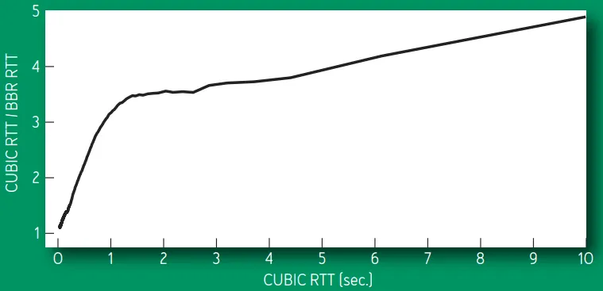

<font style="color:rgb(153, 153, 153);">Fig 9. BBR vs. CUBIC median RTT improvement.</font>

<font style="color:rgb(66, 75, 93);">图 10 比较（仿真）了 BBR 和 CUBIC 的 SGSN Internet-to-mobile delay。</font>

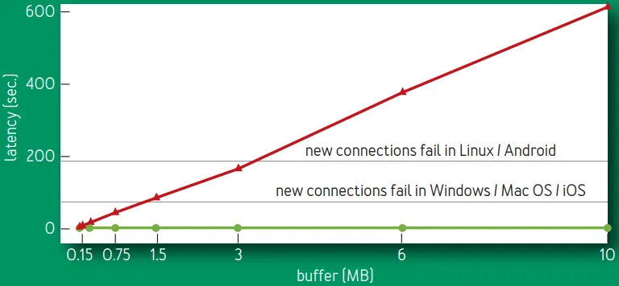

<font style="color:rgb(153, 153, 153);">Fig 10. Steady-state median RTT variation with link buffer size.</font>

<font style="color:rgb(66, 75, 93);">稳态时的 RTT 随链路缓冲区大小的变化，链路物理特性：128-Kbps/40-ms，8 BBR (green) / CUBIC (red) flows。  
</font><font style="color:rgb(66, 75, 93);">不管瓶颈缓冲区大小和活跃的 flow 数量如何，</font><font style="color:rgb(66, 75, 93);">BBR 几乎一直将队列（延迟）保持在最小</font><font style="color:rgb(66, 75, 93);">；  
</font><font style="color:rgb(66, 75, 93);">CUBIC flow 永远会填满缓冲区， 因此</font><font style="color:rgb(66, 75, 93);">延迟随着 buffer size 线性增长</font><font style="color:rgb(66, 75, 93);">。</font>

<font style="color:rgb(66, 75, 93);">  
</font>

<font style="color:rgb(66, 75, 93);">几条水平线处表示的含义非常重要：</font>

+ <font style="color:rgb(66, 75, 93);">除了连接建连时的 SYN 包之外，</font><font style="color:rgb(66, 75, 93);">TCP 已经适应到了一个非常大的 RTT 延迟</font><font style="color:rgb(66, 75, 93);">（初始 SYN 包延迟由操作系统 hardcode，因此不会很大）。</font>
+ <font style="color:rgb(66, 75, 93);">当移动设备通过一个大缓冲区的 SGSN 接收大块数据时（例如，手机软件自动更新）， 那这个设备就无法连接到互联网上的任何东西，直到队列被清空（SYN-ACK accept packet 被延迟的时间大于固定 SYN timeout）。</font>

<font style="color:black;">Linux 的初始超时时间是 1s，见 [</font><font style="color:black;">Customize TCP initial RTO (retransmission timeout) with BPF</font><font style="color:black;">]( "</font><font style="color:black;">Customize TCP initial RTO (retransmission timeout) with BPF</font><font style="color:black;">")。译注。</font>

## <font style="color:rgb(255, 255, 255);background-color:rgb(21, 166, 117);">6 问题讨论</font>
### <font style="color:rgb(66, 75, 93);">6.1 移动蜂窝网络中的自适应带宽</font>
<font style="color:rgb(66, 75, 93);">蜂窝网络会根据每个用户的数据包排队（queue of packets）情况来调整每个用户的带宽 （adapt per-subscriber bandwidth）。</font>

<font style="color:rgb(66, 75, 93);">早期版本的 BBR 通过针对性调优来产生非常小的队列，导致在低速情况下连接会卡住（stuck at low rates）。增大峰值 ProbeBW</font><font style="color:rgb(66, 75, 93);"> </font><font style="color:rgb(21, 166, 117);background-color:rgb(249, 242, 244);">pacing_gain</font><font style="color:rgb(66, 75, 93);"> </font><font style="color:rgb(66, 75, 93);">来产生更大的队列，会使得卡住的情况大大减少，这暗示 大队列（缓冲区）对某些网络也不是坏事。</font>

<font style="color:rgb(66, 75, 93);">使用当前的</font><font style="color:rgb(66, 75, 93);"> </font>_<font style="color:rgb(66, 75, 93);">1.25 × BtlBw</font>_<font style="color:rgb(66, 75, 93);">peak gain，</font><font style="color:rgb(66, 75, 93);">BBR 在任何网络上都不会比 CUBIC 差</font><font style="color:rgb(66, 75, 93);">。</font>

### <font style="color:rgb(66, 75, 93);">6.2 延迟和聚合应答</font>
<font style="color:rgb(66, 75, 93);">蜂窝、WIFI 和有线宽带网络经常会</font><font style="color:rgb(66, 75, 93);">延迟和聚合 ACK</font><font style="color:rgb(66, 75, 93);">（delay and aggregate）</font><sup><font style="color:rgb(66, 75, 93);">1</font></sup><font style="color:rgb(66, 75, 93);">。当 inflight 限制到单个 BDP 时，这会导致因为数据太少而导致的卡顿（ throughput-reducing stalls）。</font>

<font style="color:rgb(66, 75, 93);">将增大 ProbeBW cwnd_gain 增大到 2 使得 BBR 能在估计的传输速率上持续平稳发送，即使 ACK 被延迟了一个 RTT，这显着避免了卡顿（stalls）。</font>

### <font style="color:rgb(66, 75, 93);">6.3 入向流量整形（Token-Bucket Policers）</font>
<font style="color:rgb(66, 75, 93);">BBR 在 YouTube 部署之后，我们发现世界上大部分 ISP 都会用 TBP 来对接收到的流量进行处理（mangle）</font><font style="color:rgb(66, 75, 93);"> </font><sup><font style="color:rgb(66, 75, 93);">7</font></sup><font style="color:rgb(66, 75, 93);">。</font>

+ <font style="color:rgb(66, 75, 93);">连接刚启动时，bucket 通常是满的，因此 BBR 能学到底层网络的 BtlBw，</font>
+ <font style="color:rgb(66, 75, 93);">一旦 bucket 空了，所有发送速率快于（比 BtlBw 低一些的）bucket 填充速率的包，都会被丢弃，</font>
+ <font style="color:rgb(66, 75, 93);">BBR 最终会学到这个新的传输速率，但 ProbeBW gain cycle 会导致持续的、少量的丢包（continuous moderate losses）。</font>

<font style="color:rgb(66, 75, 93);">为最小化上游带宽浪费，以及最小化因为丢包而导致的应用延迟增加，我们给 BBR 添加了 policer detection 和一个显式 policer 模型，并还在持续研究更好的方式来减缓 policer 带来的损失。</font>

<font style="color:black;">更多入向流量整形（policing）内容，可参考：[</font><font style="color:black;">（译）《Linux 高级路由与流量控制手册（2012）》第九章：用 tc qdisc 管理 Linux 网络带宽</font><font style="color:black;">]( "</font><font style="color:black;">（译）《Linux 高级路由与流量控制手册（2012）》第九章：用 tc qdisc 管理 Linux 网络带宽</font><font style="color:black;">")。译注。</font>

### <font style="color:rgb(66, 75, 93);">6.4 与基于丢包的拥塞控制的竞争</font>
<font style="color:rgb(66, 75, 93);">不管是与其他 BBR flow 竞争，还是与基于丢包的拥塞控制竞争， BBR</font><font style="color:rgb(66, 75, 93);">都能收敛到瓶颈带宽的一个公平份额</font><font style="color:rgb(66, 75, 93);">。</font>

<font style="color:rgb(66, 75, 93);">即使基于丢包的拥塞控制填满了可用缓冲区，ProbeBW 仍然能健壮地将 BtlBw estimate 朝着 flow 的公平份额移动，ProbeRTT 也是类似。</font>

<font style="color:rgb(66, 75, 93);">但是，不受通信双方控制的</font><font style="color:rgb(66, 75, 93);">路由器缓冲区会比 BDP 大好几倍</font><font style="color:rgb(66, 75, 93);">，导致 long-lived loss-based competitors 占用大量队列，因此获得超出其公平的份额。如何解决（缓解）这个问题也是目前业内很热门的一个研究方向。</font>

## <font style="color:rgb(255, 255, 255);background-color:rgb(21, 166, 117);">7 总结</font>
<font style="color:rgb(66, 75, 93);">重新思考拥塞控制</font><font style="color:rgb(66, 75, 93);">让我们发掘出了这个古老世界的许多新东西。相比于使用</font><font style="color:rgb(66, 75, 93);">丢包、缓冲区大小</font><font style="color:rgb(66, 75, 93);">等等这些</font><font style="color:rgb(66, 75, 93);">与拥塞只是弱相关</font><font style="color:rgb(66, 75, 93);">的事件， BBR 以 Kleinrock 关于拥塞的规范化模型和与之相关的最佳工作位置作为出发点。</font>

<font style="color:rgb(66, 75, 93);">关键的两个参数</font><font style="color:rgb(66, 75, 93);">—— 延迟和带宽 ——</font><font style="color:rgb(66, 75, 93);">无法同时确定</font><font style="color:rgb(66, 75, 93);">， 这一结论看似绝望，但我们发现通过对二者进行</font><font style="color:rgb(66, 75, 93);">顺序估计</font><font style="color:rgb(66, 75, 93);">（estimated sequentially）能绕开这一限制。具体来说，我们使用控制与估计理论领域的一些最新进 展，创建了一个简单的分布式控制循环，后者能接近最优值，在充分利用网络的 同时还能保持一个很小的缓冲队列。</font>

<font style="color:rgb(66, 75, 93);">Google BBR 的实现已经合并到 Linux 内核，关于一些实现细节见本文附录。</font>

<font style="color:rgb(66, 75, 93);">BBR is deployed on Google's B4 backbone, improving throughput by orders of magnitude compared with CUBIC. It is also being deployed on Google and YouTube Web servers, substantially reducing latency on all five continents tested to date, most dramatically in developing regions.</font>

<font style="color:rgb(66, 75, 93);">BBR 只运行在发送端，无需协议、接收端或网络的改动</font><font style="color:rgb(66, 75, 93);">，因此可以做到 灰度（增量）部署。它只依赖 RTT 和应答包，因此大部分互联网传输协议都能实现这个算法。</font>

<font style="color:rgb(66, 75, 93);">The authors are members of Google's make-tcp-fast project, whose goal is to evolve Internet transport via fundamental research and open source software. Project contributions include TFO (TCP Fast Open), TLP (Tail Loss Probe), RACK loss recovery, fq/pacing, and a large fraction of the git commits to the Linux kernel TCP code for the past five years.</font>

<font style="color:rgb(66, 75, 93);">The authors can be contacted at</font><font style="color:rgb(66, 75, 93);"> </font><font style="color:rgb(66, 75, 93);">👉</font><font style="color:rgb(66, 75, 93);">bbr-dev@googlegroups.com.</font>

## <font style="color:rgb(255, 255, 255);background-color:rgb(21, 166, 117);">致谢</font>
+ <font style="color:rgb(66, 75, 93);">The authors are grateful to Len Kleinrock for pointing out the right way to do congestion control.</font>
+ <font style="color:rgb(66, 75, 93);">We are indebted to Larry Brakmo for pioneering work on Vegas</font><sup><font style="color:rgb(66, 75, 93);">2</font></sup><font style="color:rgb(66, 75, 93);"> </font><font style="color:rgb(66, 75, 93);">and</font><font style="color:rgb(66, 75, 93);">New Vegas congestion control that presaged many elements of BBR</font><font style="color:rgb(66, 75, 93);">, and for advice and guidance during BBR's early development.</font>
+ <font style="color:rgb(66, 75, 93);">We would also like to thank Eric Dumazet, Nandita Dukkipati, Jana Iyengar, Ian Swett, M. Fitz Nowlan, David Wetherall, Leonidas Kontothanassis, Amin Vahdat, and the Google BwE and YouTube infrastructure teams for their invaluable help and support.</font>

### <font style="color:rgb(66, 75, 93);">引用链接</font>
<font style="color:black;">[1]</font>

<font style="color:rgb(21, 166, 117);">BBR: congestion-based congestion control:</font><font style="color:rgb(21, 166, 117);"> </font>_<font style="color:rgb(153, 153, 153);">https://queue.acm.org/detail.cfm?id=3022184</font>_

<font style="color:black;">[2]</font>

<font style="color:rgb(21, 166, 117);">Wikipedia: Bias of an estimator:</font><font style="color:rgb(21, 166, 117);"> </font>_<font style="color:rgb(153, 153, 153);">https://en.wikipedia.org/wiki/Bias_of_an_estimator</font>_

<font style="color:black;">[3]</font>

<font style="color:rgb(21, 166, 117);">Understanding the Performance of TCP Pacing:</font><font style="color:rgb(21, 166, 117);"> </font>_<font style="color:rgb(153, 153, 153);">https://homes.cs.washington.edu/~tom/pubs/pacing.pdf</font>_

<font style="color:rgb(167, 130, 130);background-color:rgb(254, 255, 255);">原文链接：</font>**<font style="color:rgb(21, 166, 117);background-color:rgb(254, 255, 255);">https://arthurchiao.art/blog/bbr-paper-zh/</font>**


> 更新: 2024-05-06 17:36:22  
> 原文: <https://www.yuque.com/linuxer/gscfv1/as4oakf3nx2fp9vo>