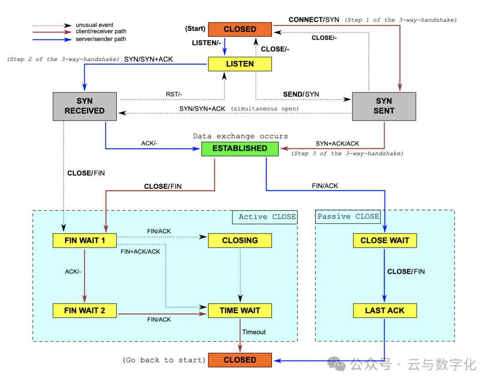

# 数据包｜协议分析｜TCP状态流转

原文地址：[数据包｜协议分析｜TCP状态流转](https://mp.weixin.qq.com/s/1fqBFC2mYRnDvY1PGukC8A)

这张图展示了 TCP（Transmission Control Protocol，传输控制协议）的状态转移图，描述了 TCP 连接在不同阶段之间的状态变化和相互转换。让我们解释这个图中各个状态的含义和转移过程：

### **TCP 状态图解释：**
1. CLOSED（关闭状态）：
    - 初始状态，表示 TCP 连接未建立或已关闭。
2. LISTEN（监听状态）：
    - 服务端进入的状态，表示服务端正在监听来自客户端的连接请求。
3. SYN_SENT（同步已发送状态）：
    - 客户端进入的状态，表示客户端已发送 SYN（同步）报文段，用于发起连接请求。
4. SYN_RCVD（同步已接收状态）：
    - 服务端进入的状态，表示服务端已接收到客户端发送的 SYN 报文段，并发送了 SYN+ACK（同步+确认）报文段作为响应。
5. ESTABLISHED（已建立状态）：
    - 表示 TCP 连接已经建立成功，客户端和服务端可以进行数据传输。
6. FIN_WAIT_1（终止等待状态1）：
    - 客户端进入的状态，表示客户端已经发送了连接关闭请求（FIN），等待服务端的确认或进一步数据传输。
7. CLOSE_WAIT（关闭等待状态）：
    - 服务端进入的状态，表示服务端收到了客户端的连接关闭请求（FIN），并已经发送确认（ACK），等待关闭连接。
8. FIN_WAIT_2（终止等待状态2）：
    - 客户端进入的状态，表示客户端已经收到了服务端对连接关闭请求的确认（ACK），继续等待服务端发送连接关闭请求。
9. LAST_ACK（最后确认状态）：
    - 客户端进入的状态，表示客户端发送了最后的确认报文（ACK），等待服务端的确认，确认后连接关闭。
10. TIME_WAIT（时间等待状态）：
    - 表示连接已经关闭，但为了确保网络中所有数据包都被正确处理，等待一段时间（2MSL，最长报文段寿命的两倍）后才彻底释放连接。
11. CLOSING（关闭状态）：
    - 表示在关闭过程中出现异常，客户端和服务端都同时发送了连接关闭请求（FIN）导致的状态。

### **状态转移说明：**
+ 连接建立过程：从 CLOSED 状态开始，客户端发送 SYN，服务端收到 SYN 后回复 SYN+ACK，最终进入 ESTABLISHED 状态，表示连接已建立。
+ 连接关闭过程：在数据传输完成后，一方发送 FIN 报文段，另一方收到后发送 ACK 确认，然后进入 FIN_WAIT_1（客户端）或 CLOSE_WAIT（服务端），接着根据情况进入 FIN_WAIT_2、LAST_ACK 和 TIME_WAIT 等状态，最终连接彻底关闭。

**SYN 和 ACK 报文：**

+ SYN（同步）：SYN 是 TCP 协议中用于建立连接的同步序列号（Synchronize Sequence Number）报文段。当客户端向服务端发起连接请求时，客户端会发送一个 SYN 报文段，其中包含一个随机的初始序列号（Sequence Number），表示客户端希望和服务端建立连接。
+ ACK（确认）：ACK 是 TCP 协议中用于确认收到数据或状态的报文段。在 TCP 连接建立过程中，服务端收到客户端发送的 SYN 报文段后，会回复一个 SYN+ACK 报文段，其中包含确认号（Acknowledgment Number）和服务端的初始序列号。服务端的 SYN 报文段中的 ACK 标志位被设置为 1，表示服务端已经收到了客户端的 SYN 报文段，并且同意建立连接。

  

TIME-WAIT 状态通常出现在 TCP 连接的一方，可以是服务端或客户端。具体取决于连接的关闭方和连接终止的原因。下面分别解释服务端和客户端在什么情况下会进入 TIME-WAIT 状态：

1. 服务端进入 TIME-WAIT 状态：
    - 当服务端收到客户端的 FIN 报文（表示客户端要关闭连接）后，服务端会发送 ACK 报文进行确认，然后进入 CLOSE-WAIT 状态。
    - 接着服务端也会发送自己的 FIN 报文给客户端，表示服务端也要关闭连接。
    - 服务端在发送完 FIN 报文后，进入 TIME-WAIT 状态。在 TIME-WAIT 状态下，服务端会等待一段时间（通常是 2MSL，即最长报文段寿命的两倍）以确保客户端收到了服务端发送的最后的 ACK 报文，从而防止之前的连接残留在网络中，避免数据包混乱。
    - 在 TIME-WAIT 状态结束后，服务端关闭连接，释放相关资源。
2. 客户端进入 TIME-WAIT 状态：
    - 当客户端主动发起关闭连接时，客户端会发送 FIN 报文给服务端，表示客户端要关闭连接。
    - 接着客户端进入 FIN-WAIT-1 状态，等待服务端的确认。
    - 当客户端收到服务端发送的 ACK 报文后，客户端进入 FIN-WAIT-2 状态，等待服务端发送自己的 FIN 报文。
    - 最后客户端收到服务端的 FIN 报文后，客户端发送 ACK 报文给服务端进行确认，然后客户端进入 TIME-WAIT 状态。
    - 客户端在 TIME-WAIT 状态下等待一段时间，以确保服务端收到了客户端发送的最后的 ACK 报文，之后客户端关闭连接，释放相关资源。

协议分析2

编程5

数据包2

linux81

协议分析 · 目录

**上一篇****协议分析｜数据包分析理解**

  

> 更新: 2024-05-06 17:57:35  
> 原文: <https://www.yuque.com/linuxer/gscfv1/gn6km92a59ptxvwi>