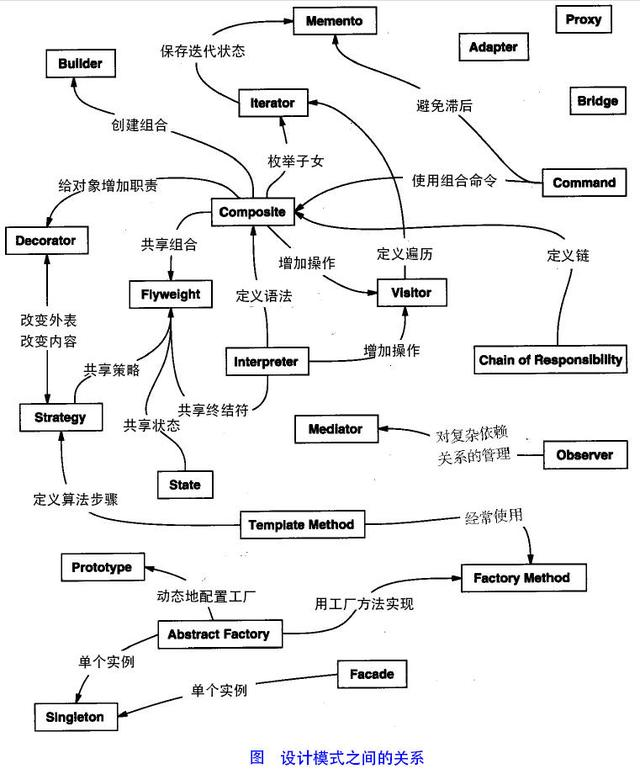
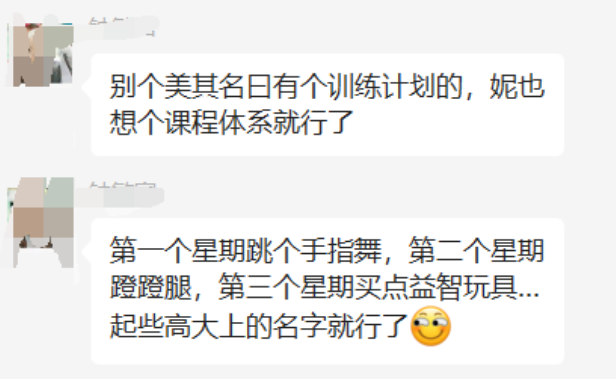
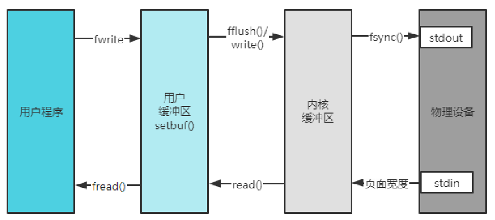
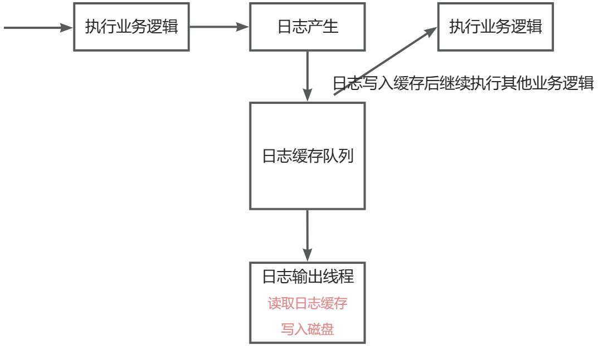

# 三、C/C++通用核心技术栈

b站链接：[https://space.bilibili.com/3494351095204205](https://space.bilibili.com/3494351095204205)


[音视频方向就业案例分析](https://www.yuque.com/linuxer/ks4fip/nwb4zib3lw4h3t82?singleDoc)

[Linux后台开发就业案例分析](https://www.yuque.com/lingshengxueyuan/0voice/rw8cgz#lmRCO)


<font style="color:#DF2A3F;">首先声明，本文内容主要是针对编程相关的内容，即是本文讨论的是编程重点。</font>

<font style="color:#DF2A3F;">有些这里说不是重点的内容可能在面试时一样要通过八股文重点准备。</font>

<font style="color:#DF2A3F;"></font>

<font style="color:#DF2A3F;background-color:#FBDE28;">本文档是可以评论的，有什么想法大家可以在评论区留言。</font>

<font style="color:#DF2A3F;"></font>

**可能听起来有些矛盾，但事实就是面试造火箭，工作拧螺丝。**


<font style="color:#DF2A3F;">   
</font>

<font style="color:rgb(51, 51, 51);">该文档持续更新，最新的链接在：</font>

[<font style="color:#DF2A3F;">https://www.yuque.com/linuxer/gscfv1/qcgiyxvdymvg9meu?singleDoc#</font>](https://www.yuque.com/linuxer/gscfv1/qcgiyxvdymvg9meu?singleDoc#)<font style="color:rgb(51, 51, 51);"> 《C++核心基础知识高效学习避雷指南》</font>

**<font style="color:rgb(51, 51, 51);">首先声明，本文内容主要是针对编程相关的内容，即是本文讨论的是编程重点。</font>**

**<font style="color:rgb(51, 51, 51);">有些这里说不是重点的内容可能在面试时一样要通过八股文重点准备。</font>**

**<font style="color:rgb(51, 51, 51);">可能听起来有些矛盾，但事实就是面试造火箭，工作拧螺丝。</font>**

<font style="color:rgb(51, 51, 51);">学习过程中主要存在的误区</font>

1. <font style="color:rgb(51, 51, 51);">C++ Primer的书籍能学半年</font>
2. <font style="color:rgb(51, 51, 51);">数据结构算法 跟风刷题</font>
3. <font style="color:rgb(51, 51, 51);">23种设计模式学习过程中没有侧重点</font>
4. <font style="color:rgb(51, 51, 51);">Linux编程，啃全部的《</font>**<font style="color:rgb(51, 51, 51);">UNIX环境高级编程</font>**<font style="color:rgb(51, 51, 51);">， 812页》或者《Linux/UNIX系统编程手册 1176页》</font>
5. <font style="color:rgb(51, 51, 51);">计算机网络抱着课本啃，比如抱着《</font>**<font style="color:rgb(51, 51, 51);">计算机网络（第8版） 谢希仁</font>**<font style="color:rgb(51, 51, 51);"> 484页》</font>

**<font style="color:rgb(51, 51, 51);">为什么说要先快速掌握核心的知识，是因为只有通过写项目才能把各种知识真正串起来，写项目中遇到一些之前没有遇到的语法或者技术点，可以再去查书籍和博客。</font>**

# <font style="color:rgb(51, 51, 51);">0 校招该如何准备</font>
<font style="color:rgb(51, 51, 51);">尽量至少提前半年准备，见过不少985的网友，在7/8月份才开始准备找工作，然后连C++新特性、Linux系统编程、网络编程都不了解的，读研两年时间都花在导师给的任务上，出现找算法工作力不从心，找开发工作又没有准备的尴尬状态。</font>

<font style="color:rgb(51, 51, 51);">校招时间：</font>

<font style="color:rgb(51, 51, 51);">3、4月就开始实习投递</font>

<font style="color:rgb(51, 51, 51);">6、7月就开始提前批了</font>

<font style="color:rgb(51, 51, 51);">8、9、10月秋招高峰期</font>

<font style="color:rgb(51, 51, 51);">11月大公司基本上招完了，只剩中小一些的公司</font>

<font style="color:rgb(51, 51, 51);">12月 只剩小公司了</font>

<font style="color:rgb(51, 51, 51);">第二年</font>

<font style="color:rgb(51, 51, 51);">3、4月春招，有些朋友大公司寄望补录（从目前的就业形势看，大公司补录的机会极少，因为这个时候以及开始招实习生了）</font>

**<font style="color:rgb(51, 51, 51);">所以一定要提前准备好 3、4月实习投递、7、8、9、10月的校招高峰。</font>**


如果秋招错过了怎么办？那也不要摆烂，准备好项目，春招继续投，后续也可以投社招岗位的。  
 

# <font style="color:rgb(51, 51, 51);">1 C++相关</font>
## <font style="color:rgb(51, 51, 51);">C++基础</font>
<font style="color:rgb(51, 51, 51);">c++面向对象之封装、继承、和多态</font>

## <font style="color:rgb(51, 51, 51);">C++ STL重点</font>
<font style="color:rgb(51, 51, 51);">先重点掌握容器的使用：</font>

+ <font style="color:rgb(51, 51, 51);">[string容器]</font>
+ <font style="color:rgb(51, 51, 51);">[vector容器</font>
+ <font style="color:rgb(51, 51, 51);">[deque容器]</font>
+ <font style="color:rgb(51, 51, 51);">[stack容器]</font>
+ <font style="color:rgb(51, 51, 51);">[queue容器] </font>
+ <font style="color:rgb(51, 51, 51);">[list容器] </font>
+ <font style="color:rgb(51, 51, 51);">[set/ multiset 容器] </font>
+ <font style="color:rgb(51, 51, 51);">[map/ multimap 容器] </font>

<font style="color:rgb(51, 51, 51);">容器算法可以先以了解为主。</font>

<font style="color:rgb(51, 51, 51);">对于不同容器的内部实现，后续看八股文的时候再深入。</font>

## <font style="color:rgb(51, 51, 51);">C++ 新特性重点</font>
1. 智能指针(先重点掌握shared_ptr)
2. 左右值引用（但不用太沉迷）、mov、forward
3. thread、condition、mutex、atomic
4. function、bind
5. future、aysnc、promise、packaged_task
6. 可变模版参数（variadic templates
7. decltype / auto
8. 实现一个C++11的线程池

<font style="color:rgb(51, 51, 51);">实现一个C++11的线程池 差不多就可以把C++常用新特性串联起来。</font>

<font style="color:rgb(51, 51, 51);">不建议把c++14、17、20等等特性都一次学完。（注意，可以大致先了解下有什么新的特性就行）</font>

# <font style="color:rgb(51, 51, 51);">2 数据结构算法</font>
## <font style="color:rgb(51, 51, 51);">校招是不是一定要刷力扣</font>
<font style="color:rgb(51, 51, 51);">大公司、中小公司对算法要求区别：</font>

+ <font style="color:rgb(51, 51, 51);">字节、腾讯、美团、百度、阿里这些公司是要好好刷题的，200道起</font>
+ <font style="color:rgb(51, 51, 51);">像深信服这级别的公司对算法要求没有那么搞，大部分还是数组、链表、排序、查找、二叉树等算法题。</font>
+ <font style="color:rgb(51, 51, 51);">像瑞芯微、全志、联发科这类的芯片公司，对于算法这块也是考核常规的数组、链表、排序、查找、二叉树等算法题</font>

**<font style="color:rgb(51, 51, 51);">建议</font>**<font style="color:rgb(51, 51, 51);">：</font>

1. <font style="color:rgb(51, 51, 51);">先平衡自己的能力，确定可以冲哪一类的公司，不要无脑地把大量的时间花在刷题上；</font>
2. <font style="color:rgb(51, 51, 51);">网上搜索对应公司历年的面试题，有针对性地做准备，不要跟风冲自己能力不及的公司；</font>

# <font style="color:rgb(51, 51, 51);">3 设计模式</font>
<font style="color:rgb(51, 51, 51);">常见设计模式23种，也不要全部重点去看，工作一般常用的就五六种，可以先重点看常用的设计模式，其他的以了解为主，</font>

<font style="color:rgb(51, 51, 51);">常用的设计模式：</font>

1. <font style="color:rgb(51, 51, 51);">单例模式 </font>
2. <font style="color:rgb(51, 51, 51);">工厂模式 </font>
3. <font style="color:rgb(51, 51, 51);">策略模式 </font>
4. <font style="color:rgb(51, 51, 51);">观察者模式 </font>
5. <font style="color:rgb(51, 51, 51);">责任链模式 </font>
6. <font style="color:rgb(51, 51, 51);">组合模式</font>

<font style="color:rgb(51, 51, 51);">但需要做些扩展，比如单例模式</font>

<font style="color:rgb(51, 51, 51);">可以到准备八股文的时候再进一步复习，前期学编程先别纠结那么多各种细节，即使花了时间，面试前还是得准备。</font>



# <font style="color:rgb(51, 51, 51);">4 Linux系统编程</font>
**<font style="color:#DF2A3F;">操作系统是一定要掌握的：</font>**

+ 进程/线程
+ 内存管理
+ 文件IO
+ 网络系统
+ CPU架构(至少了解一二级缓存的作用)

如果Linux没有基础，可以先学习Linux常用命令，但不要无脑照着 《linux菜鸟教程命令大全》来。

对于shell编程，有个入门经验就行，主要是知道shell脚本的作用，大致理解脚本的运行逻辑就行。

重点放在Linux api编程上。


<font style="color:#DF2A3F;">写代码不要用vim写，不要用vim写，可以使用vscode远程连接Linux系统写代码。</font>

## 多进程
目前进程间通信大部分都是用的socket，即使大部分的进程间通信学习的时候不用作为重点内容，常见的主要是pipe。

重点掌握的内容：

1. fork父子进程
2. exec系统调用
3. <font style="color:rgb(68, 68, 68);background-color:rgb(248, 249, 248);">僵尸进程</font>
4. <font style="color:rgb(68, 68, 68);background-color:rgb(248, 249, 248);">进程回收</font>
5. 进程间通信重点掌握pipe，其他不要花那么多时间，但八股文还是要背诵，比如喜欢问哪种进程间通信效率高
6. 掌握进程的基本信号处理方式

<font style="color:rgb(51, 51, 51);"></font>

<font style="color:rgb(51, 51, 51);"></font>

## <font style="color:rgb(51, 51, 51);">多线程</font>
<font style="color:rgb(51, 51, 51);">Linux系统里多线程最为重要，大部分程序都会使用多线程。</font>

<font style="color:rgb(51, 51, 51);">重点：</font>

1. <font style="color:rgb(68, 68, 68);background-color:rgb(248, 249, 248);">线程创建、销毁、退出等待</font>
2. <font style="color:rgb(68, 68, 68);background-color:rgb(248, 249, 248);">信号量</font>
3. <font style="color:rgb(68, 68, 68);background-color:rgb(248, 249, 248);">互斥锁，工作中主要使用互斥锁，但面试读写锁也会被问到</font>
4. <font style="color:rgb(68, 68, 68);background-color:rgb(248, 249, 248);">条件变量</font>
5. <font style="color:rgb(68, 68, 68);background-color:rgb(248, 249, 248);">自己实现一个消息队列（生产线程、消费线程、队列、互斥、阻塞、唤醒等）</font>
6. <font style="color:rgb(68, 68, 68);background-color:rgb(248, 249, 248);">在消息队列和stl的基础上，实现一个线程池</font>

<font style="color:rgb(68, 68, 68);background-color:rgb(248, 249, 248);"></font>

## <font style="color:rgb(68, 68, 68);background-color:rgb(248, 249, 248);">信号</font>
注意进程信号、线程信号的处理

重点：

1. 信号发送、信号处理、信号屏蔽
2. 特别需要留意的是网络编程相关的信号：
    1.  SIGHUP  
    2.  SIGPIPE  
    3. <font style="color:rgb(68, 68, 68);background-color:rgb(248, 249, 248);"> SIGURG  </font>
3. 大部分书籍里提到的信号还是得好好看，信号内容相对也比较少


<font style="color:rgb(68, 68, 68);background-color:rgb(248, 249, 248);">因为大部分开源项目会对这些信号（部分）设置，一定要理解其作用。</font>**<font style="background-color:rgb(248, 249, 248);">（可以在网络编程的时候再重点理解）</font>**

**<font style="background-color:rgb(248, 249, 248);"></font>**

## <font style="background-color:rgb(248, 249, 248);">其他</font>
比如mmap等，这个也是需要重点掌握


# <font style="color:rgb(51, 51, 51);">5 Linux网络编程和原理</font>
## 网络编程核心基础
核心是实现

1. tcp客户端和服务端的通信
2. udp 客户端和服务端的通信
3. 注意阻塞和非阻塞
4. select/poll/epoll实现服务端的io多路复用（客户端其实也可以使用select/poll/epoll）

## <font style="color:rgb(51, 51, 51);">Linux网络编程要掌握到什么程度</font>
网络编程核心基础 -> reactor网络模型 -> 构建业务。

顺序：

1. 实现reactor网络模型，实现echo业务
2. 然后接入线程池，实现echo业务
3. 构建http业务
4. 构建webserver
5. 添加日志（注意日志性能）

虽然很烂大街，但reactor网络模型是Linux开发的核心知识，可以把之前学到Linux编程串联起来。


优化代码 优化各种变量 增加设计模式


优化代码 代码性能 QPS  5000-》10000 是怎么优化


增加功能 

webserver 只支持页面展示 

+ **<font style="color:#DF2A3F;">注册登录功能 mysql</font>**<font style="color:#DF2A3F;">使用</font>
+ redis缓存热点
+ 增加连接池


只喜欢看文章，喜欢整理文章。

多写点代码，不能想着光背八股文。

工作找不太好，喜欢背，把资料准备，拿过来开始背。


## Linux网络编程进阶
### 多线程、多线程、epoll+线程池不同reactor网络模型的区别
不能单只学会epoll+线程池的reactor网络模型，也要进阶学习其他reactor网络模型。

### <font style="color:rgb(51, 51, 51);">百万连接该怎么处理</font>
怎么实现单机百万连接，是否需要优化操作系统参数，每条tcp链接占用多少资源


### udp可靠性设计
如何实现udp可靠性传输，可以帮助我们理解网络传输原理，这个需要深刻理解tcp的基础上才能实现。

kcp可靠性传输原理。

## <font style="color:rgb(51, 51, 51);">网络原理是不是要看教科书</font>
重点是理解tcp、udp传输原理。（这个需要多看一些八股文，计算机书籍讲的是比较一般的）

http1.0 1.1 2.0 3.0

websocket等。

<font style="color:#DF2A3F;">看书补充：可以看看  </font>**<font style="color:#DF2A3F;">图解HTTP + 图解TCP/IP + 图解网络硬件 系列书籍。</font>**

# <font style="color:rgb(51, 51, 51);">6 通信协议设计</font>
## <font style="color:rgb(51, 51, 51);">为什么要掌握通信协议设计</font>
其实tcp、udp本身就属于通信协议设计，目的是让发送方和接收方 能够按照一定的格式发送和处理数据。


我们讲的通信协议设计，比如微信， 发消息



如果一个人连续发送多条消息，服务器怎么识别？有些朋友说间隔时间那么大，但如果我们是用代码做测试？

连续调用send(消息1)， send(消息2)， 如果"消息1和消息2"有粘包，服务器是收到"消息1消息2"，那怎么拆分？

## <font style="color:rgb(51, 51, 51);">客户端和服务端该如何沟通</font>
要实现客户端和服务端的沟通，就需要两端约定好通信协议。

## <font style="color:rgb(51, 51, 51);">常见序列化协议</font>
 json > protobuf >  xml等

**<font style="color:rgb(25, 27, 31);">序列化的核心：把程序对象转为字节序列，以便后续再把字节序列还原为对象。</font>**

**<font style="color:rgb(25, 27, 31);">为什么要序列化，比如一个对象里有很多变成字段，比如name和address，如果不做序列化如何发送给对方。</font>**

```plain
{
  "name": "darren",
  "lastName": "Jai",
  "address": "长沙岳麓区 高新区麓谷企业广场",
  "age": 25,
 
 "password": "admin@123"
}
```

# <font style="color:rgb(51, 51, 51);">7 日志库</font>
## <font style="color:rgb(51, 51, 51);">日志性能和什么有关系</font>
注意fwrite和write的区别。

追求吞吐量：缓存后批量写入

追求实时性：每笔数据调用write写入。



## <font style="color:rgb(51, 51, 51);">什么是同步、异步日志</font>
同步日志：<font style="color:rgb(77, 77, 77);">指当</font>**<font style="color:rgb(77, 77, 77);">输出⽇志时，必须等待⽇志输出语句执⾏完毕后，才能执⾏后⾯的业务逻辑语句</font>**


异步日志：<font style="color:rgb(77, 77, 77);">⽇志输出语句与业务逻辑语句并不是在同⼀个线程中运⾏，⽽是</font>**<font style="color:rgb(77, 77, 77);">有专⻔的线程⽤于进⾏⽇志输出操作</font>**<font style="color:rgb(77, 77, 77);">。</font>



<font style="color:#DF2A3F;">如何实现日志的高吞吐量写入？</font>


# <font style="color:rgb(51, 51, 51);">8 持续更新中</font>
<font style="color:#DF2A3F;">要做什么项目？</font>


学习一定要有侧重点，20%是开发最常用的知识需要先掌握

<font style="color:#DF2A3F;">更多学习路线可以咨询 程序员老廖，微信： laoliao6668</font>


> 更新: 2025-07-25 15:29:46  
> 原文: <https://www.yuque.com/linuxer/gscfv1/sny069qf87kmhsdx>