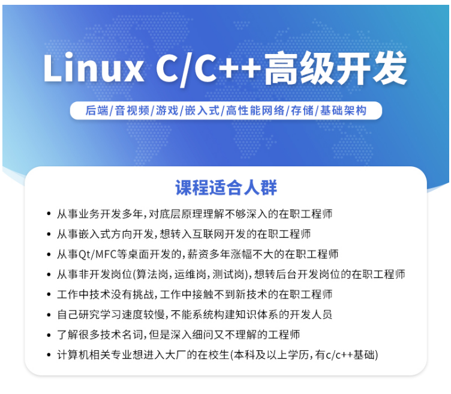
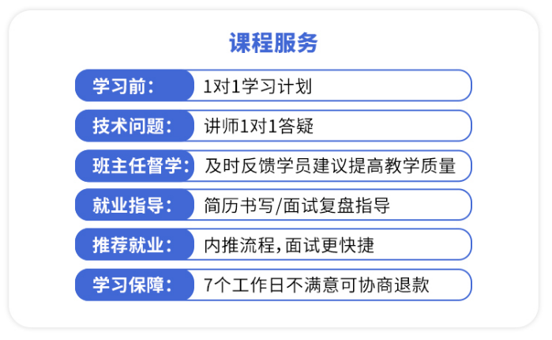
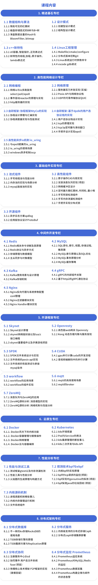
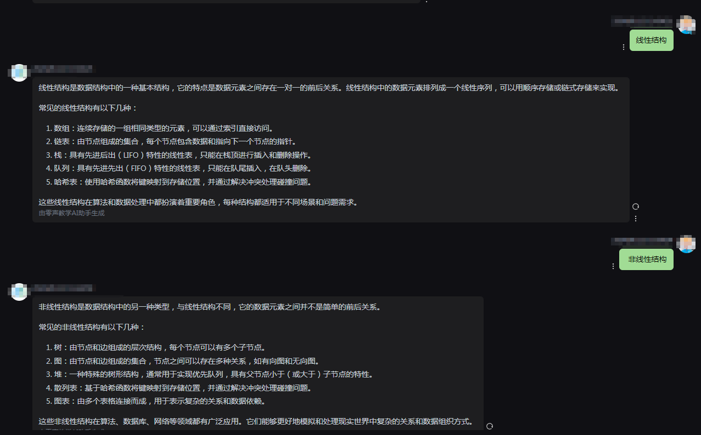

# Linux C/C++高级全栈开发（后端/游戏/嵌入式/高性能网络/存储/基础架构）

****

**一、分布式kvstore（基础架构开发方向）**

**1 kv存储的架构设计**

+ 存储节点定义
+ tcp server/client
+ hash数据存储
+ list数据存储
+ skiptable数据存储
+ rbtree数据存储

**2 网络同步与事务序列化**

+ 序列化与反序列化格式
+ 建立事务与释放事务
+ 线程安全的处理

**3 内存池的使用与LRU的实现**

+ 大块与小块分配策略
+ 内存回收机制
+ 数据持久化

**4 KV存储的性能测试**

+ 网络测试tps
+ 吞吐量测试
+ go, lua, java多语言支持
+ hash/I ist/skiptable/rbtree测试

添加图片注释，不超过 140 字（可选）

****

**二、zrpc的实现（基础架构开发方向）**

**1 rpc使用场景与架构设计**

+ 分布式核心调度业务
+ 网络与业务分离
+ 网络选型reactor， 协程，io_ uring

**2 rpc的协议与序列化**

+ json定义函数
+ 数据序列化
+ rpc处理流程
+ rpc的内存池的特性

**3 rpc代码自动生成器的实现**

+ 调用接口模式统一化
+ float与double调用的差异
+ 第三方语言的支持
+ 性能测试与业务上线

****

**三、DPDK的数据包测试仪（网络开发方向）**

**1 测试仪架构设计与使用场景**

+ 使用场景与测试方案
+ 多核与多线程亲缘性
+ 测试仪使用的命令行参数

**2 协议流组织**

+ arp数据组织
+ udp数据包
+ top的syn, rst, fin, ack包
+ icmp协议组织

**3 异常情况与测试标准**

+ 异常命令行参数的处理
+ 异常网络数据包的处理
+ cpu与内存不足的异常处理

****

**四、openresty的zv_waf的实现(网关防火墙开发)**

**1 WAF 基础架构与 IP/URL 防御**

+ OpenResty 与WAF架构设计
+ IP黑白名单实现
+ URL 基础过滤
+ 日志记录与监控

**2 WAF 请求头与基础参数防御**

+ User-Agent 智能识别
+ Referer 可信来源验证
+ Cookie 基础过滤
+ HTTP 方法限制

**3 WAF CC攻击防护与请求频率控制**

+ CC攻击原理与防御策略
+ 人机验证联动机制
+ IP动态好禁与放行
+ CC防护

**4 WAF 深度参数过滤与SOL注入/XSS防御**

+ Query参数过滤
+ POST数据过滤
+ SQL注入过滤
+ XSS 攻击防御

****

**五、qemu的virtio/vhost虚拟化实现(虚拟化开发)**

**1 virtio与vhost的工作原理**

+ vhost与qemu通信协议
+ vhost通信协议解析get features
+ vhost/virtio通信与reovmsg的作用

**2 virtio设备模型实现**

+ virtio的setmem与vring的设置
+ gpa.gva.hva.hpa之间的关系
+ ifreq的tap/tun创建

**3 vhost的性能优化与多队列网卡**

+ vring的物理内存与虚拟内存决射
+ 多队列网卡实现
+ vhost用户空间后端开发
+ vhost/virtio的总结

****

**六、SPDK助力MySQL数据落盘，让性能腾飞 (存储方向)**

**1 SPDK文件系统设计与实现**

+ NVMe与PCle的原理
+ NVMe Controller 与bdev之间的rpc
+ blobstore与blob的关系

**2 文件系统的posix api实现**

+ 4层结构设计vfs
+ spdk的异步改造posix同步api
+ open/wr ite/read/c lose的实现

**3 文件系统的性能测试与承接mysq|业务**

+ LD_ PRELOAD更 好mysql系统调用实现
+ iodepth讲解
+ 随机读，随机写，顺序读，顺序写

****

**七、魔兽世界后端TrinityCore（游戏方向）**

**1 TrinityCore开发调试环境安装**

+ linux开发调试环境安装
+ windows开发调试环境安装
+ SRP-6登录协议介绍
+ 基于openresty实现web注册服务

**2 TrinityCore 中高性能基础组件应用**

+ to高性能定时器方案设计
+ to线程模型以及锁、无锁队列应用
+ 数据库连接池设计
+ 日志库的设计

**3 TrinityCore 高性能网络模块设计**

+ boost. asio跨平台网络库
+ boost. asio核心命名空间以及异步io接口
+ boost. asio在to中的封装
+ 网络库应用实践

**4 TrinityCore 游戏技能模块设计**

+ 技能模块设计
+ 技术配置以及数据库表设计
+ 技能模块组成部分
+ 技能生成、处理以及生命周期管理
+ 暴风雪、背利等技能实现详解

**5 游戏AI模块设计**

+ Al模块实现层次
+ Al模块三种细分方向以及选择
+ 固定Al设计实现以及幼狼AI案例讲解
+ 脚本Al设计实现以及BossAl案例讲解

**6 游戏副本模块设计**

+ 副本模块:管理、匹配、积分结算逻辑实现
+ 副本模块实现的抽象，层次
+ 战歌峡谷副本实现
+ 阿拉希盆地副本实现

添加图片注释，不超过 140 字（可选）

添加图片注释，不超过 140 字（可选）

添加图片注释，不超过 140 字（可选）

****

**八、网络数据包过滤firewall（网络安全方向）**

**1 firewall内核空间netfilter架构设计**

+ 内核空间设计与实现分析
+ 设计数据包传递参数值
+ 封装端口及IP规则类型
+ 设计检测规则/IP/协议函数

**2 firewall内核空间架构实现**

+ 检测规则/IP/协议函数实现
+ 检查权限及规则函数实现
+ 数据包出入站过滤器实现
+ 读写规则/检查规则匹配实现
+ 删除规则/模块加载和知裁

**3 firewall用户空间架构设计**

+ 用户空间设计与实现分析
+ 设计数据包传递参与宏
+ 封装端口及|P规则类型

**4 firewall 应用程序调试与上线**

+ Hook入口函数设计与实现
+ IP/掩码/端口函教实现
+ 协议类型/解析/删除规则
+ 用户层访问及bug处理
+ 用户程序测试及调试技巧

****

**九、BPF网络数据包探测器（网关开发方向）**

**1 监控探测仪的场景与架构设计**

+ bpf.c实现tcp数据包探测
+ bpf.c解析tcp与http
+ 内核与应用层的通信数据格式

**2 tc数据流记录存储**

+ kv存储构建发送与按收的key-value
+ http请求实现集中式存储
+ 数据流记录表关系

**3 测试上线与前端显示**

+ 内核与应用程序的通信测试
+ kv的存储测试
+ 数据流记录表的qps测试
+ 前端显示与上线

****

**十、ROS+gazebo+TurtleBot3项目实践(自动驾驶与机器人方向)**

**1 ROS 基础认知与框架搭建**

+ 一在Ubuntu 系统上安装 ROS 的详细步骤
+ 搭建 ROS 开发环境，配里工作空间
+ ROS 的基本命令行工具

**2 TurtleBot3 初步操控**

+ TurtlsBot3 的硬件连接与网络设置
+ 启动 TurtleBot3 及相关节点的方法
+ 使用键盘控制 TurtleBot3 运动的指令
+ 在RViz 中显示 TurtlsBot3 模型及运动状态

**3 话题蘧信深入**

+ 话题遗信的底层原理与数搭流向
+ 自定义控制消息类型及多字段含义
+ 实现从 PC 端到 TurtleBot3 的话题通信与运动指令传输
+ 运用 rostopic 工具进行指令消息监测与分析

**4 服务与参数管理**

+ 服务通信的架构设计与应用场景
+ 编写用于控制 TurtleBot3 运动的服务端和客户端代码
+ 参数服务器在设至 TurtleBot3 运动参数中的作用
+ 利用 rosservice 工具调用服务实现运动控制

**5 导航基础与运动指令**

+ 导航功能包中与运动控制的租件
+ 配至导航功能包以核受外部运动指令
+ 苏于导航功能包求送精确的运动指令(如真线、转弯)
+ 实现 TurtleBot3 楼预设路径运动的指令编写

**6 高级运动控制与实践**

+ 苏于传感器反情调整运动指令的策略
+ 实现 TurtleBot3 在复杂环境下(如避障、循迹》的运动指令逻择
+ 多 TurtleBot3 协同运动的指令规划与通信实现
+ 设计并实现一个基于指令控制的 TurtleBot3 应用场景

****

**十一、图床共享云储存（云原生基础设施开发方向）**

**1 fastdfs架构分析和配置**

+ fastdfs架构分析
+ 快递配查fastdfs
+ 上传文件逻辑分析
+ 下载文件逻辑分析;

**2 文件传输和接口设计**

+ 数据库设计
+ 图床接口设计
+ reactor网络模型构建
+ 注册/登录/我的文件功能实现

**3 分布式fastdfs存储集群部署和HTTP上传**

+ storage存储原理分析.
+ 上传下载原理
+ 实现文件上传功能
+ 相同文件内容只保存一份

**4 图片分享和短链服务实现**

+ 图片分享功能实现
+ 图片分享数据库设计
+ 长链转短链机制
+ Redis缓存优化

**5 分布式FastDFS存储集群部署**

+ FastDFS集群部署
+ FastDFS同步原理
+ binlog机制
+ 水平扩容
+ 图床功能查漏补缺

**6 产品上云公网发布/测试用例**

+ 使用云服务器的各种坑分析
+ postman模拟请求
+ wrk测试接口吞吐量
+ jmeter压力测试

添加图片注释，不超过 140 字（可选）

### ****
**十二、****分布式推送系统项目实战(互联网产品项目)**

**1 项目框架分析和部署**

+ 分布式推进系统架构
+ 话题聊天家落地
+ 后端服务部署
+ Web部署

**2 注册/登录接口设计与实现**

+ HTTP RESTful API原理
+ MySQL用户表设计
+ 注册密码加密
+ redis骏存token
+ 客户端缓存token

**3 固定话题聊天实现**

+ websocket迹接用户校验
+ 话题/用户映射表结构设计
+ 聊天发布到服务器
+ redis缓存房间在线人员
+ 服务器广播新消息

**4 聊天记录拉取设计与实现**

+ MySQL消息表设计
+ 聊天消息存储
+ 分页拉取聊天消息
+ 鉴录自动拉取最新消息
+ 黑名单实现

**5 自定义话题聊天实现**

+ MySQL话题表设计
+ 管理员创建聊天话题
+ HTTP拉取所有话题
+ 用户自动加入新话题
+ 用户退出话题

**6 单机->分布式架构改进**

+ kafka队列削峰
+ Erpc远程调用
+ etcd注册和发现服务
+ job模块
+ nginx负载均衡

**7 产品上云发布和性能测试**

+ 使用云服务器要点
+ 测试接口性能
+ 数据库素引优化
+ 面试要点总结

**十三、****k8s二开内网穿透Tunnel(运维部署开发)**

**1 系统设计以及frp开源项目**

+ 项目背景与需求分析
+ 系统设计与数据库设计
+ frp TCPMUX代理与httpconnect复用器
+ frp ssh、http、https 内网穿造
+ frp AuthServerConfig token签权

**2 应用管理与应用配置**

+ ssh、http、https等类型的应用维护
+ 应用程序端口分配以及配至生成
+ 导出应用配置为yaml格式的配亚文件

**3 go客户端实现Kubernetes集群应用部署与更新**

+ go客户端追接Kubernetes api server
+ Eo客户端创建配置资源ConfigMap
+ 80苏户端创建部署资源Deployment
+ 20客户端创建服务资源Service

**4 vite/vue/elementUI实现前端页面**

+ Vue组件化开发与ElementUI
+ Typescript的interface的应用
+ axios实例与拦救器
+ get与post请求好装
+ 配置文件与api词用

**5 自动化域名解析与Kubernetes 集群部署tunnel服务**

+ 自动化域名解析与域名备注
+ 服务的部景与案户端配置的返回
+ Tunnel服务的容器化部是与更新
+ Tunnel客户端配置部署Tunnel客户端程序
+ certbot 生成通配将证书用于Tunnel应用

添加图片注释，不超过 140 字（可选）

**十四、零声教学Ai助手一代（AI部署落地开发方向）**

**1 AI助手架构设计与需求分析**

+ chatgpt的构想与需求分析
+ 基于开源项目初步构建项目
+ gin框架实现代理服务

**2 接口功能设计**

+ grpc与protobu的使用流程
+ token计数器 与tokenizer的服务封装
+ 敏感词识别服务

**3 向量数据库与连接池设计**

+ redis实现上下文管理
+ 问题记录保存
+ web端协议解析
+ OneBot协议

**4 服务部署上线**

+ docker stack服务部署
+ wrk接C吞吐量测试
+ 线上节点监控

**十五、Linux嵌入式多路监控系统项目实战(基于RV1126)**

**1 Linux嵌入式多路监控系统项目架构分析和部署**

+ 嵌入式多路监控架构分析
+ rv1126部署监控程序
+ 部署C++后端服务器
+ 部署web远程查看实时自击

**2 快速掌道Linux驱动开发**

+ Linux嵌入式系统架构
+ Linux字符驱动设备
+ Linux块设备驱动
+ 虚拟内存和物理内存决射
+ i2c驱动实战

**3 Linux并发和设备材**

+ 中断/自旋锁/互斥量
+ 阻塞/非阻塞
+ 异步通知和异步I/O
+ 设备树的特点和组成
+ 设备树语法和节点解析

**4 alsa驱动源码分析和应用实践**

+ alsa框架分析
+ alsa audio接寸
+ alsa 控制接口
+ alsa采集pom实战
+ aac音频编码

**5 v412驱动源码分析和应用实践**

+ v412架构分析
+ v412_device
+ vidso_device
+ v412来集yuv实战
+ yuv h264硬件编码

**6 RTMP实时推流**

+ ffmepg7.1裁剪和交叉编译
+ 采集/编码/推流时间戳转换
+ 推流队列设计
+ 推流音视频同步机制
+ 处理服务器实时任务

> 更新: 2025-05-12 22:15:50  
> 原文: <https://www.yuque.com/linuxer/gscfv1/wwf29x0miq6umb1p>