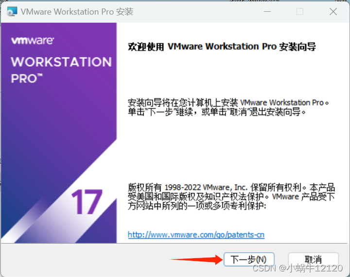
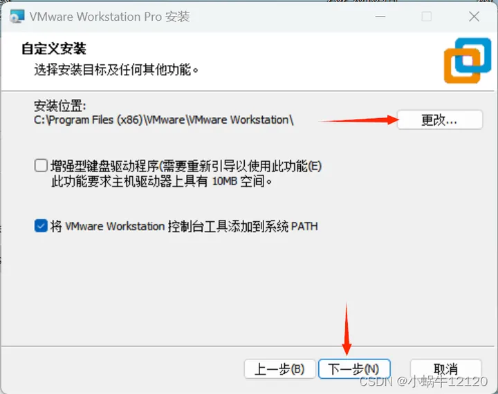
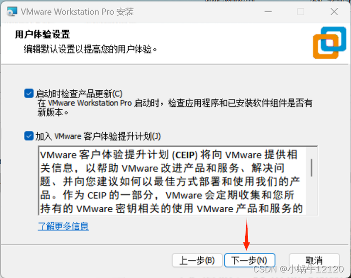
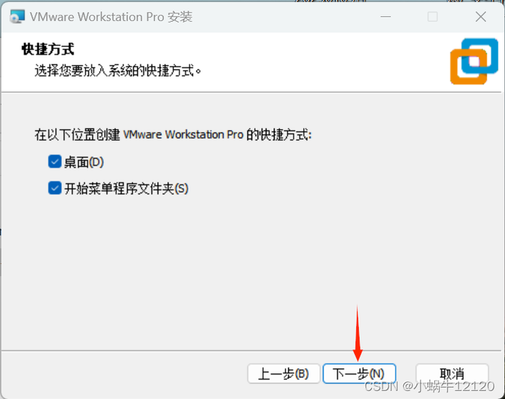
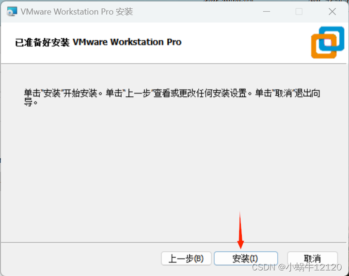
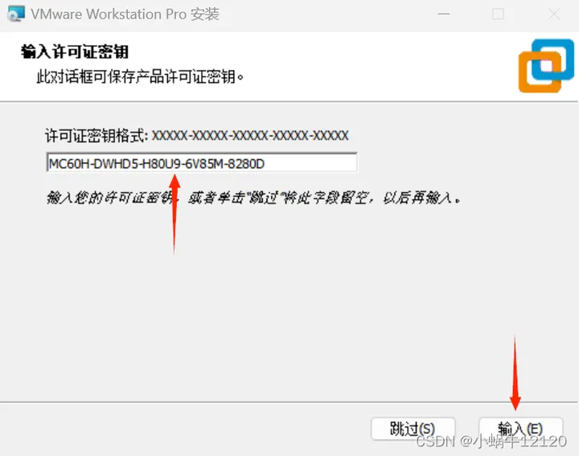
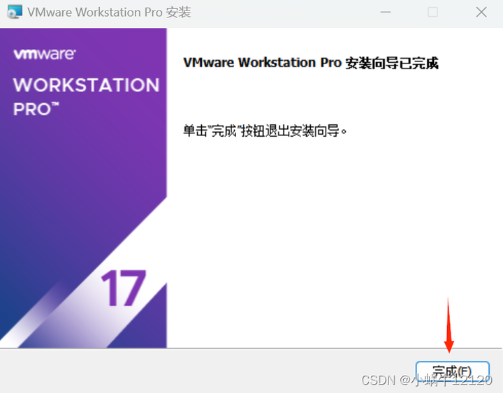
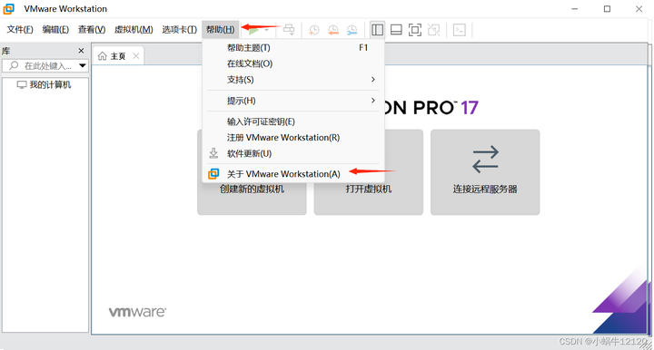
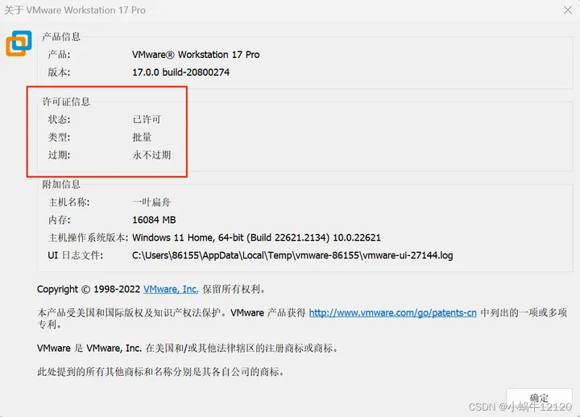

# 1.Vmware安装

老廖提供主流C/C++就业课程服务：

1. C/C++通用后台开发
2. 音视频开发
3. QT开发
4. 游戏开发

等课程，包括视频教学、资料代码、课程答疑、简历指导、面试复盘等服务，详情咨询**微信laoliao6668**

****

VMware是应用广泛的一款虚拟机，可以让我们在Windows或者mac电脑上安装Linux系统。

VMware17虚拟机永久破解安装及密钥分享

# 1 密钥问题
目前亲测有效的密钥：MC60H-DWHD5-H80U9-6V85M-8280D 

前往官网：

> [https://www.vmware.com/cn/products/workstation-pro.html](https://link.zhihu.com/?target=https%3A//www.vmware.com/cn/products/workstation-pro.html)

下载试用版workstation 17 pro

可以直接点击该链接下载： [https://download3.vmware.com/software/WKST-PLAYER-1751/VMware-player-full-17.5.1-23298084.exe](https://download3.vmware.com/software/WKST-PLAYER-1751/VMware-player-full-17.5.1-23298084.exe?AuthKey=exp=1713518769~hmac=555b8f584c3a381597dd8fa82fa91f5419a5c3dbde8b16662c18e2955a787c66&params=%7B%22sourcefilesize%22%3A%22562.71+MB%22%2C%22dlgcode%22%3A%22WKST-PLAYER-1751%22%2C%22languagecode%22%3A%22en%22%2C%22source%22%3A%22DOWNLOADS%22%2C%22downloadtype%22%3A%22manual%22%2C%22downloaduuid%22%3A%22929565f8-9f06-46bb-bc9b-72a85cf92997%22%2C%22dlgtype%22%3A%22Product+Binaries%22%2C%22productversion%22%3A%2217.5.1%22%2C%22productfamily%22%3A%22VMware+Workstation+Player%22%7D)

**官方已经要注册了，可以直接在这里点击下载：**[附件: VMware Workstation Pro 17.5.1.zip](./attachments/KsLtlkkmGJ0C6EmH/VMware Workstation Pro 17.5.1.zip)

如果这里不能直接下载，那就只能百度云下载了：

链接：[https://pan.baidu.com/s/1V-sq7TeycTEi00Qa9oBBjg](https://pan.baidu.com/s/1V-sq7TeycTEi00Qa9oBBjg) 

提取码：jt7o 

 

下载后双击运行“[VMware-player-full-17.5.1-23298084.exe](https://download3.vmware.com/software/WKST-PLAYER-1751/VMware-player-full-17.5.1-23298084.exe?AuthKey=exp=1713518769~hmac=555b8f584c3a381597dd8fa82fa91f5419a5c3dbde8b16662c18e2955a787c66&params=%7B%22sourcefilesize%22%3A%22562.71+MB%22%2C%22dlgcode%22%3A%22WKST-PLAYER-1751%22%2C%22languagecode%22%3A%22en%22%2C%22source%22%3A%22DOWNLOADS%22%2C%22downloadtype%22%3A%22manual%22%2C%22downloaduuid%22%3A%22929565f8-9f06-46bb-bc9b-72a85cf92997%22%2C%22dlgtype%22%3A%22Product+Binaries%22%2C%22productversion%22%3A%2217.5.1%22%2C%22productfamily%22%3A%22VMware+Workstation+Player%22%7D)”

点击“下一步”

勾选我接受许可协议中的条款，点击“下一步”

更改安装位置，建议不要装在C盘，点击“下一步”

> PS：软件安装良好习惯之一：**任何软件安装的安装路径都建议使用全英文路径**，许多软件的安装往往因为有中文路径的原因导致软件运行异常或功能异常

点击“下一步”

继续下一步

点击“安装”

等待VMware17pro虚拟机安装结束，安装结束后点击“许可证”

# 2 输入许可证密钥
MC60H-DWHD5-H80U9-6V85M-8280D

然后点击“输入”

点击“完成”

下面就是见证奇迹的时刻了！！

运行VMware虚拟机，进入“帮助”，进入“关于VMware Workstation（A）”

就可以看到你的虚拟机已经永久授权了，真真我剽某人的福利

> 更新: 2024-08-21 11:13:15  
> 原文: <https://www.yuque.com/linuxer/gscfv1/uxr9l0simingbh4i>