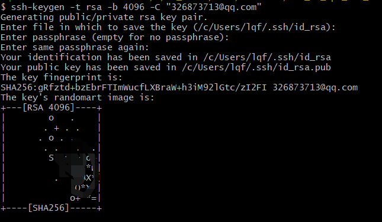
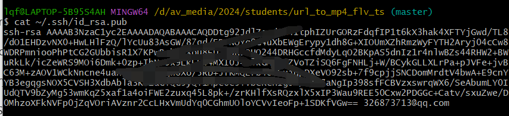
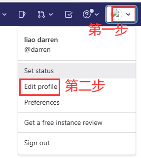
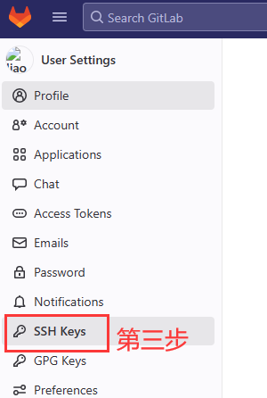
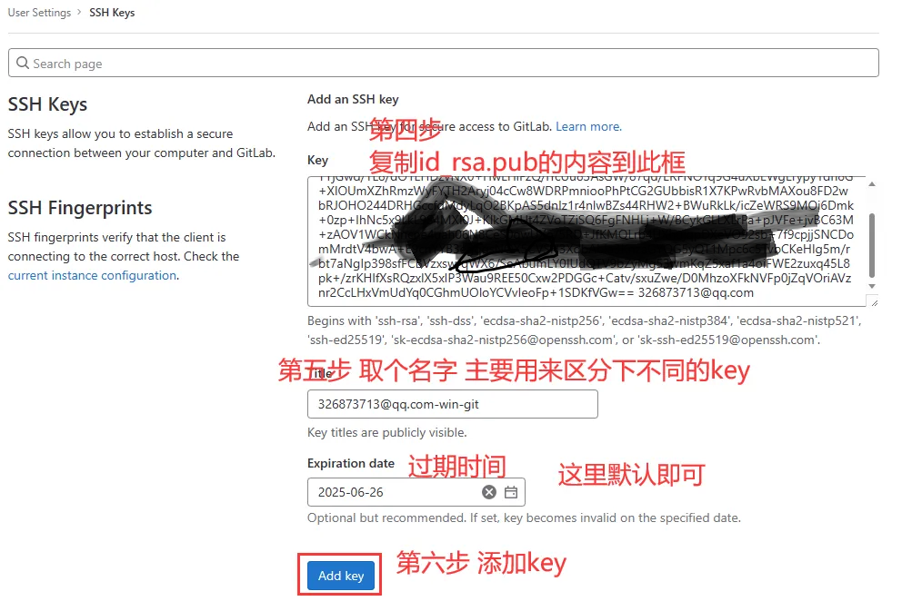
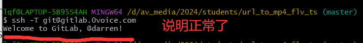

# 10-GitLab SSH密钥设置和使用

基于[GitLab SSH密钥设置和使用 – PingCode](https://docs.pingcode.com/ask/ask-ask/86414.html?p=86414)修改。


<font style="color:rgb(85, 85, 85);">GitLab使用SSH密钥可以大大提升开发人员与GitLab服务器之间交互的安全性和方便性。</font>**<font style="color:rgb(85, 85, 85);">关键步骤包括生成SSH密钥、添加SSH密钥到GitLab、以及测试SSH连接</font>**<font style="color:rgb(85, 85, 85);">，其中，生成SSH密钥是基础也是至关重要的一步。</font>

<font style="color:rgb(85, 85, 85);">生成SSH密钥通常涉及使用ssh-keygen命令，在用户的本地计算机上创建一对公钥和私钥文件。这一步骤不仅为用户提供了一种不需输入用户名和密码即可与GitLab服务器沟通的方法，同时也确保了所有传输的数据都经过加密，大幅增加了数据安全性。</font>

## <font style="color:rgb(51, 51, 51);">一、生成SSH密钥</font>
+ **<font style="color:rgb(85, 85, 85);">首先</font>**<font style="color:rgb(85, 85, 85);">，打开终端（对于Linux和Mac OS）或者Git Bash（对于Windows用户）并输入</font><font style="color:rgb(214, 51, 132);">ssh-keygen -t rsa -b 4096 -C "your_em</font>[AI](https://docs.pingcode.com/blog/59162.html)<font style="color:rgb(214, 51, 132);">l@example.com"</font><font style="color:rgb(85, 85, 85);">命令。</font>

比如

```bash
ssh-keygen -t rsa -b 4096 -C "326873713@qq.com"
```

     根据提示按回车即可：

     

+ **<font style="color:rgb(85, 85, 85);">其次</font>**<font style="color:rgb(85, 85, 85);">，系统会提示你保存密钥的位置（默认是在</font><font style="color:rgb(214, 51, 132);">~/.ssh/id_rsa</font><font style="color:rgb(85, 85, 85);">），可以直接按回车接受，或者指定一个新的存储路径。</font>
+ <font style="color:rgb(85, 85, 85);">接下来，系统会要求你设置一个密码，这一步是可选的。设置密码可以为你的SSH密钥增加一层安全保障，但在每次使用时都需要输入密码。</font>**<font style="color:#DF2A3F;">（一般不做这一步）</font>**

## <font style="color:rgb(51, 51, 51);">二、添加SSH密钥到GitLab</font>
+ **<font style="color:rgb(85, 85, 85);">首先</font>**<font style="color:rgb(85, 85, 85);">，你需要获取你的SSH公钥。如果你按照默认设置生成密钥，你的公钥将会保存在</font><font style="color:rgb(214, 51, 132);">~/.ssh/id_rsa.pub</font><font style="color:rgb(85, 85, 85);">文件中，可以通过</font><font style="color:rgb(214, 51, 132);">cat ~/.ssh/id_rsa.pub</font><font style="color:rgb(85, 85, 85);">命令来查看并复制公钥内容。</font>

比如：



+ **<font style="color:rgb(85, 85, 85);">其次</font>**<font style="color:rgb(85, 85, 85);">，登录到你的GitLab账户，进入个人设置中的"SSH密钥"页面，将你的公钥粘贴到相应的文本框中，并设置一个标题以便识别，之后点击"添加密钥"按钮即可。</font>



## <font style="color:rgb(51, 51, 51);">三、测试SSH连接</font>
+ **<font style="color:rgb(85, 85, 85);">开始</font>**<font style="color:rgb(85, 85, 85);">之前，为确保一切设置正确，你可以通过执行</font><font style="color:rgb(214, 51, 132);">ssh -T git@gitlab.com</font><font style="color:rgb(85, 85, 85);">命令来测试你的SSH连接。 比如零声教育的是gitlab.0voice.com，所以</font>

```bash
ssh -T git@gitlab.0voice.com
```

 打印：

+ <font style="color:rgb(85, 85, 85);">如果一切设置正确，你会看到一条欢迎信息。如果遇到问题，先检查你的SSH设置，再尝试重新生成密钥或重新添加到GitLab。</font>


> 更新: 2024-06-26 16:56:32  
> 原文: <https://www.yuque.com/linuxer/gscfv1/lodg4gup4pnss23e>