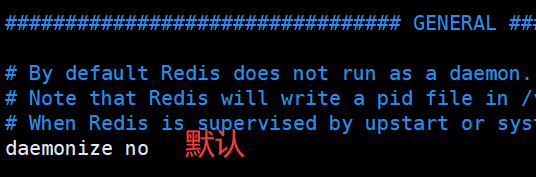
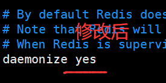

# 12-Linux安装redis服务和安装hiredis库

#   
1 redis的安装
## 1.1 下载redis版本
```shell
# 下载
wget https://download.redis.io/releases/redis-6.2.18.tar.gz --no-check-certificate
# 解压
tar -xvf redis-6.2.18.tar.gz
```

## 1.2 编译和安装
```shell
cd redis-6.2.18
make 
sudo make install
```

默认安装在 /usr/local/bin

+ redis-server 是服务端程序
+ redis-cli 是客户端程序


## 1.3 准备一个redis配置文件
在home目录创建redis-data

```shell
mkdir ~/redis-data
```

把redis文件夹下 redis.conf 拷贝到 redis-data

```shell
cp redis.conf  ~/redis-data
```

修改 redis.conf，将redis server改成后台运行

```shell
vim ~/redis-data/redis.conf
```

daemonize 改为 yes



修改后：



## 1.4 启动redis-server服务
```shell
# 进入新建的目录
cd ~/redis-data
# 启动redis server 
redis-server redis.conf
```

## 1.5 通过 redis-cli 访问 redis-server
```shell
redis-cli
```

 简单使用set 和get命令测试是否正常。

```shell
127.0.0.1:6379> set body xiaoming
OK
127.0.0.1:6379> get body
"xiaoming"

```


# 2 hiredis库的安装
hiredis库在redis源码的deps/hiredis目录下。

## 2.1 进到相应目录
```shell
cd redis-6.2.18/deps/hiredis/
```

##   
2.2 构建和编译安装
```shell
mkdir build
cd build
cmake ..
make
sudo make install
```


## 2.3 如何使用hiredis
程序代码编译的时候加上 -lhiredis

安装后：

+ 头文件/usr/local/include/hiredis/hiredis.h
+ 库文件 /usr/local/lib/libhiredis.so


> 更新: 2025-08-05 16:56:45  
> 原文: <https://www.yuque.com/linuxer/gscfv1/dy21kznni2911i57>