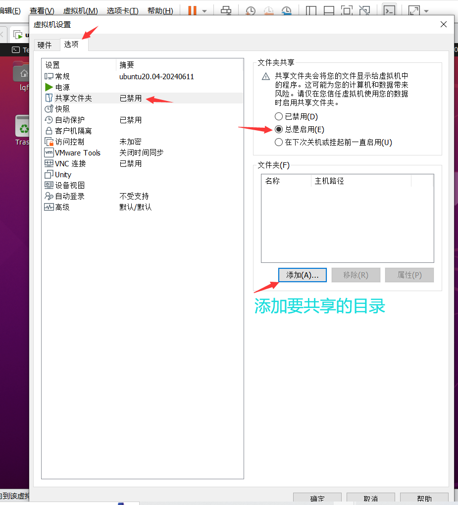
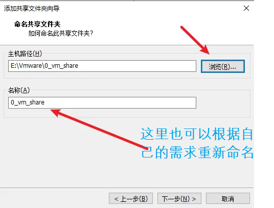
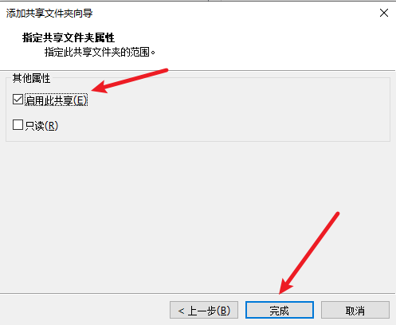
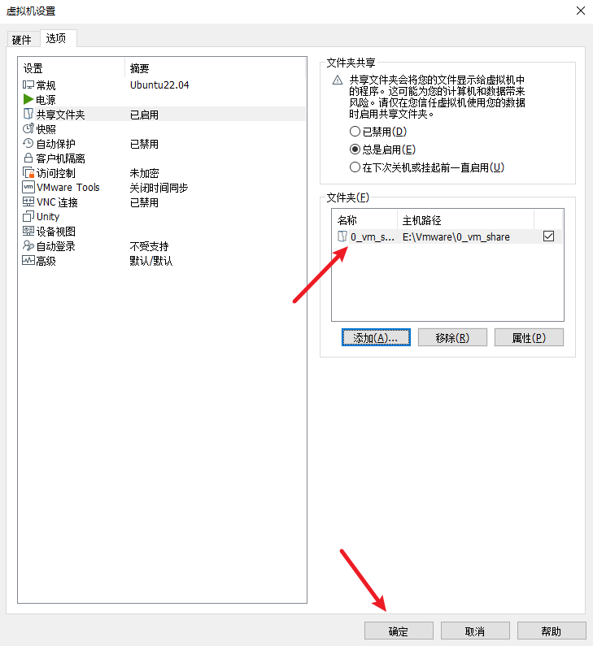
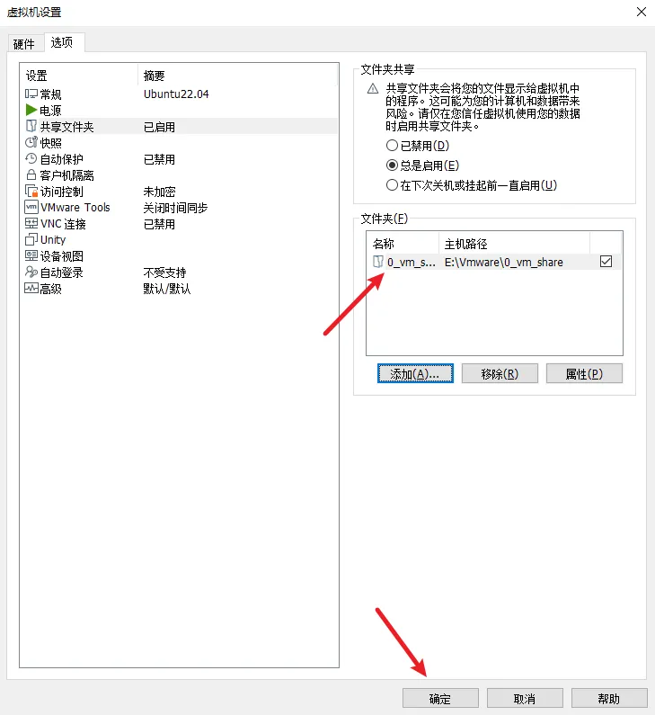

# 2.2 Vmware Pro 17 设置共享文件夹

参考链接：[https://blog.csdn.net/wkd_007/article/details/128717696](https://blog.csdn.net/wkd_007/article/details/128717696)

<font style="color:#DF2A3F;">老廖注：该方法同样适合于Ubuntu20.04</font>

# 一、概述
VMware 是运行在Windows系统上的，很多时候需要将 Windows 系统上的资料或代码复制到运行在VMware上的虚拟机，通常有两种方法可以完成复制：

+ 一个是在Vmware软件上设置共享文件夹，将Windows系统的文件夹共享到客户机；
+ 另一个是在客户机系统(Ubuntu20.04)安装samba，在Windows系统访问客户机的samba目录，参考：[https://blog.csdn.net/wkd_007/article/details/128908085](https://blog.csdn.net/wkd_007/article/details/128908085)。

**本文介绍将介绍怎样在 VMware Workstation Pro 17 设置共享文件夹**。

#  二、在VMware设置共享文件夹详细步骤
2.1 在客户机系统(Ubuntu20.04)运行的情况下，在VMware软件依次点击 **虚拟机 -> 设置 -> 选项 -> 共享文件夹**，然后勾选 **总是启用**，接着点击添加：



2.2 然后点击 下一步，在 Windows 系统 **浏览** 选择一个文件夹作为**共享文件夹**，并给这个文件夹命名，点击下一步：




2.3 勾选**启用此共享**，点击完成，




2.4 添加完成后，会看到有一个文件夹路径，点击确定。



**<font style="color:#DF2A3F;">老廖：可以同时添加多个路径的共享目录。</font>**


2.5 最后在客户机系统(Ubuntu20.04)打开终端，执行cd /mnt/hgfs/进入到/mnt/hgfs目录，可以看到前面设置的共享文件夹0_vm_share，下面截取一段终端的打印：

```bash
wkd@wkd-virtual-machine:~$ cd /mnt/hgfs/
wkd@wkd-virtual-machine:/mnt/hgfs$ ls
0_vm_share
wkd@wkd-virtual-machine:/mnt/hgfs$ 
```


# 三、/mnt/hgfs不存在或者看不到共享文件 解决方法
## <font style="color:rgb(34, 34, 38);">3.1 vmware 共享文件夹hgfs没有显示</font>
<font style="color:rgb(79, 79, 79);">挂载</font>[共享文件夹](https://so.csdn.net/so/search?q=%E5%85%B1%E4%BA%AB%E6%96%87%E4%BB%B6%E5%A4%B9&spm=1001.2101.3001.7020)



<font style="color:rgb(77, 77, 77);">当完成共享文件夹之后，会出现在</font><font style="color:rgb(199, 37, 78);background-color:rgb(249, 242, 244);">/mnt/hgfs</font><font style="color:rgb(77, 77, 77);">目录下（如</font>**<font style="color:rgb(77, 77, 77);">果没有hgfs文件夹则创建，然后进入虚拟机挂载文件夹</font>**<font style="color:rgb(77, 77, 77);">），然后执行</font><font style="color:rgb(199, 37, 78);background-color:rgb(249, 242, 244);">sudo vmhgfs-fuse .host:/ /mnt/hgfs</font><font style="color:rgb(77, 77, 77);">。但是有时候并不显示共享的文件夹。</font>

<font style="color:rgb(77, 77, 77);">但是如果使用root用户就可以看到挂载的文件夹了。但是这并不是我们想要的。</font>

<font style="color:rgb(77, 77, 77);">解决办法如下：</font>

1. <font style="color:rgba(0, 0, 0, 0.75);">首先执行：</font><font style="color:rgb(199, 37, 78);background-color:rgb(249, 242, 244);">sudo umount /mnt/hgfs</font><font style="color:rgba(0, 0, 0, 0.75);">，先把挂载删掉。</font>
2. <font style="color:rgba(0, 0, 0, 0.75);">重新用以下命令挂载即可下面命令中</font>**<font style="color:rgba(0, 0, 0, 0.75);">的uid和gid需要根据你的ubuntu用户uid来决定</font>**<font style="color:rgba(0, 0, 0, 0.75);">，输入</font><font style="color:rgb(199, 37, 78);background-color:rgb(249, 242, 244);">id</font><font style="color:rgba(0, 0, 0, 0.75);">命令即可查询。</font>

```plain
sudo /usr/bin/vmhgfs-fuse .host:/ /mnt/hgfs -o allow_other -o uid=1000 -o gid=1000 -o umask=022

```

<font style="color:rgb(77, 77, 77);">可以看到权限已经正常，非root下均可访问。</font>


版权声明：本文已经给出原文链接，如有侵权请告知删除。

原文链接：[https://blog.csdn.net/wkd_007/article/details/128717696](https://blog.csdn.net/wkd_007/article/details/128717696)


> 更新: 2024-09-10 19:48:13  
> 原文: <https://www.yuque.com/linuxer/gscfv1/gl1b9veg6ibvie52>