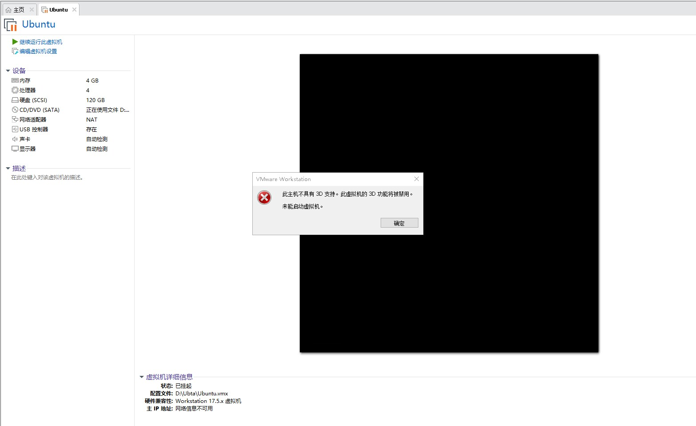
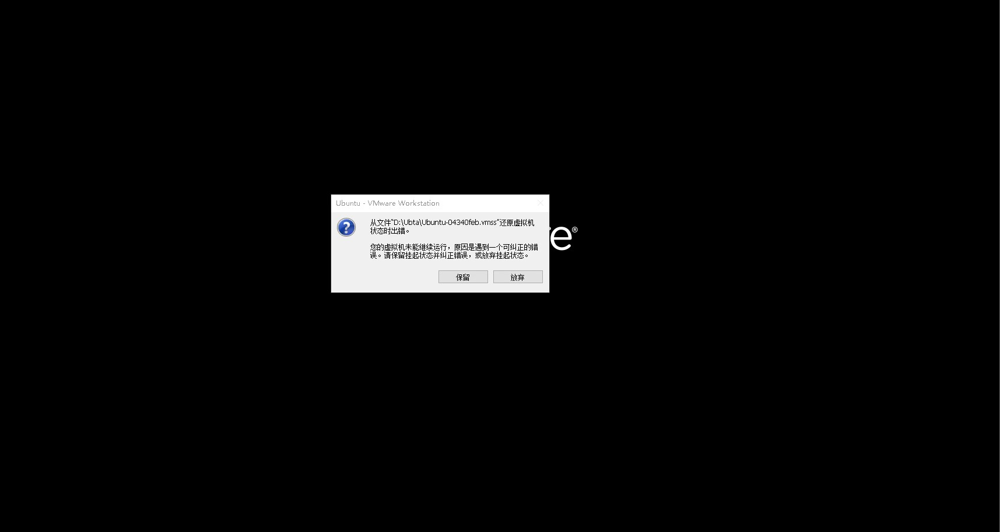
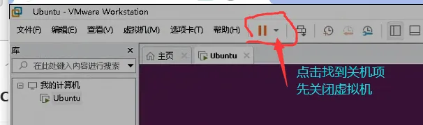
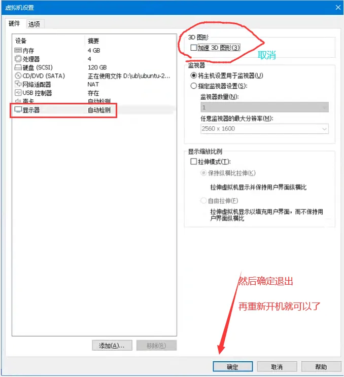

# 2.3 Vmware虚拟机开机显示不支持3D解决

问题：[vmware虚拟机](https://so.csdn.net/so/search?q=vmware%E8%99%9A%E6%8B%9F%E6%9C%BA&spm=1001.2101.3001.7020)开解显示不支持3D

先关闭虚拟机

然后虚拟机设置里面把 加速3D图形关闭。

> 更新: 2025-07-11 14:30:47  
> 原文: <https://www.yuque.com/linuxer/gscfv1/lyl4274pb4nx5vk8>