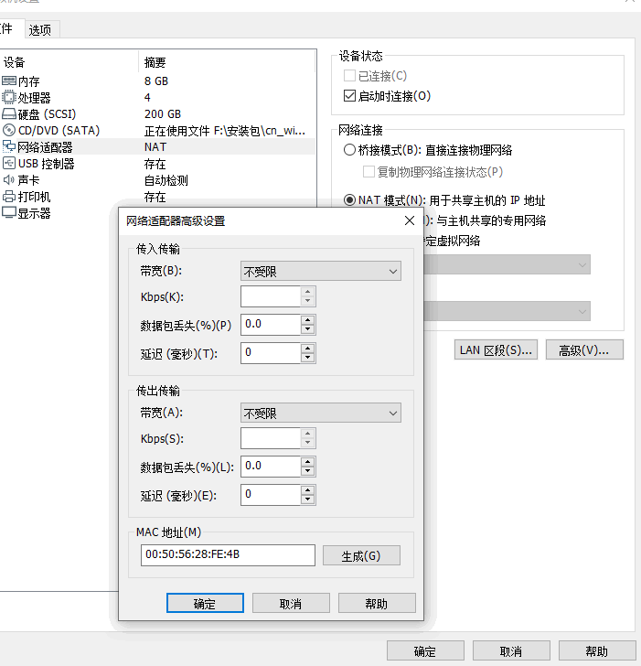

# 2.6 两台虚拟机，一台有网，一台没网

**原因是：**

**mac绑定的ip地址冲突了。俩个虚拟机的mac地址。在copy虚拟机打开的时候，没有点击【我已复制虚拟机】，而是选择了【我已移动虚拟机】**

**解决办法是：**  
**虚拟机关机**->编辑虚拟机设置->网络适配器->点击【生成】->确定好，开机了就都有网了。

只需要改一台就行，下次记得**选择我已复制**，这样不同的虚拟机mac地址才会有区别，才不会起冲突。  

原文地址：[俩台虚拟机，一台有网，一台没网_开两个虚拟机第二个没网络-CSDN博客](https://blog.csdn.net/qq_40795958/article/details/107981827)

> 更新: 2024-07-31 17:51:23  
> 原文: <https://www.yuque.com/linuxer/gscfv1/rebbuaugs49gqxvo>