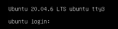
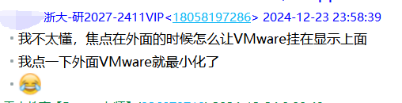
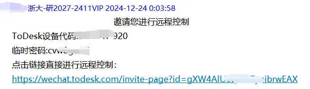
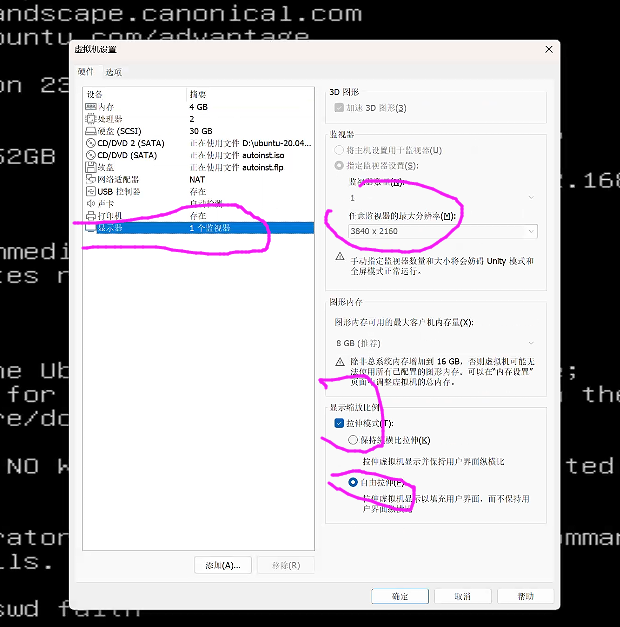
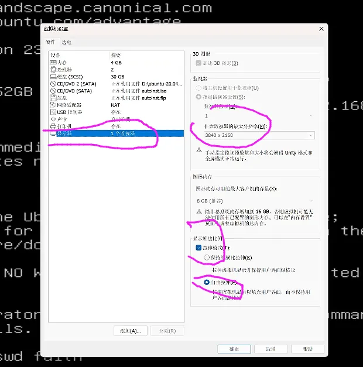

# 2.7 VMware Ubuntu命令行字体很小-高分辨率电脑

随着电脑屏幕分辨率越来越高，不少初学者在使用VMware安装Ubuntu后，发现命令行的字体特别小，不容易看清楚字体，那该如何解决这个问题？

作为晚上十二点的时候，远程一个同学帮他解决了这个问题。

这个图是我远程的时候从我桌面截取他的VMware的设置，因为从低分辨率屏幕截取高分辨率屏幕，所以这张图不是太清晰。

我给大家讲解下具体步骤：

1. 先在VMware菜单选项： 虚拟机 -> 电源 -> 关闭客户机

2. 然后在编辑对应Ubuntu系统的：虚拟机设置-> 显示器 
    1. 监视器 里选择 “指定监视器设置”，“任意监视器的最大分辨率”选择 >= 屏幕的分辨率。
    2. 勾选拉伸模式，可以选择 “自由拉伸”。

3. 然后再重启虚拟机，字体就很大了，但要注意，一般我们都是用ssh工具连接Ubuntu进行命令操作，比如xshell工具。

> 更新: 2024-12-24 11:14:28  
> 原文: <https://www.yuque.com/linuxer/gscfv1/bberq4vqlbspzxxo>