# 3.xshell

<font style="color:#117CEE;">老廖提供主流C/C++就业课程服务：</font>

1. <font style="color:#117CEE;">C/C++通用后台开发</font>
2. <font style="color:#117CEE;">音视频开发</font>
3. <font style="color:#117CEE;">QT开发</font>
4. <font style="color:#117CEE;">游戏开发</font>

<font style="color:#117CEE;">等课程，包括视频教学、资料代码、课程答疑、简历指导、面试复盘等服务，详情咨询</font>**<font style="color:#117CEE;">微信laoliao6668</font>**


xshell软件可以在这里直接下载[附件: xshell6 plus绿色永久版.zip](./attachments/KvcGN_zi0kG1Ygit/xshell6 plus绿色永久版.zip)


xshell可以用来连接Linux服务器，更方便进行命令行操作，也可以直接把文件通过xshell拖进Linux系统。


# 1 Ubuntu安装ssh服务
1. 更新源列表 

```bash
sudo apt-get update
```


2. 安装 openssh-server

```bash
sudo apt-get install openssh-server
```


 这里需要输入一下 y或者直接回车 ，表示确定


3. 检查 ssh 服务是否启动成功

```bash
sudo ps -e | grep ssh
```

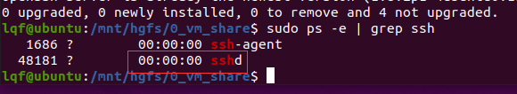

如果有 sshd 则说明 ssh 服务已启动，如果没有启动，输入下边命令启动 ssh 服务

```bash
sudo service ssh start
```

再次输入查询服务是否启动命令


至此，ssh 服务已正常启动


**禁用 ssh 命令**

```bash
sudo systemctl disable --now ssh
```

**启用 shh 命令**

```bash
sudo systemctl enable --now ssh
```

4. 查看本机的 ip 地址 ifconfig ，如果没有安装 net-tools，需要先安装，命令如下

```bash
sudo apt-get install net-tools
```


 安装成功后，输入 ifconfig 

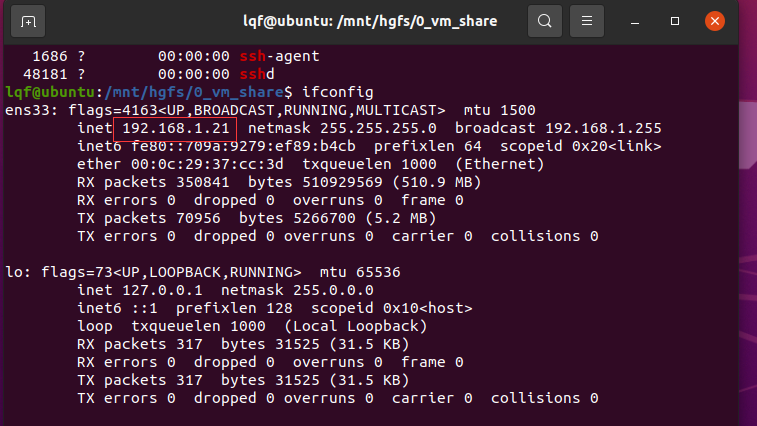

这里就是当前系统的ip

 


# 2 xshell连接Linux
## 2.1 长久保存会话信息方式
<font style="color:rgb(0, 0, 0);background-color:rgb(245, 247, 250);">1.双击运行程序，打开Xshell主界面。</font>

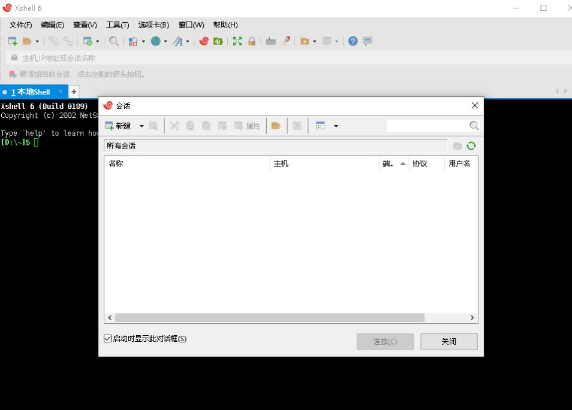

<font style="color:rgb(0, 0, 0);background-color:rgb(245, 247, 250);"> 2.点击“新建”，分别输入主机ip跟远程端口号，然后点击“确定”。 </font>

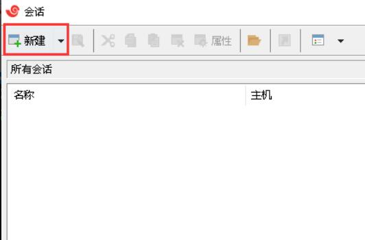

<font style="color:#DF2A3F;">端口使用默认的22即可， 主机填Linux系统的ip地址。</font>

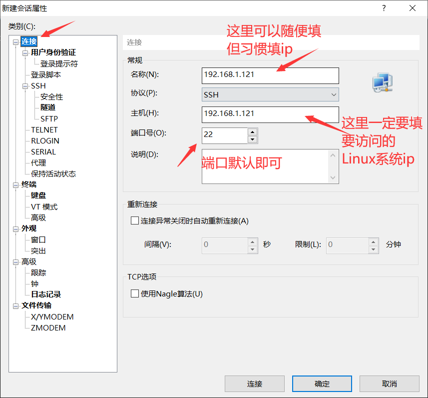

然后点击 【用户身份验证】切换界面。

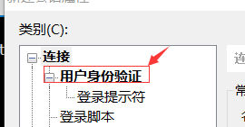


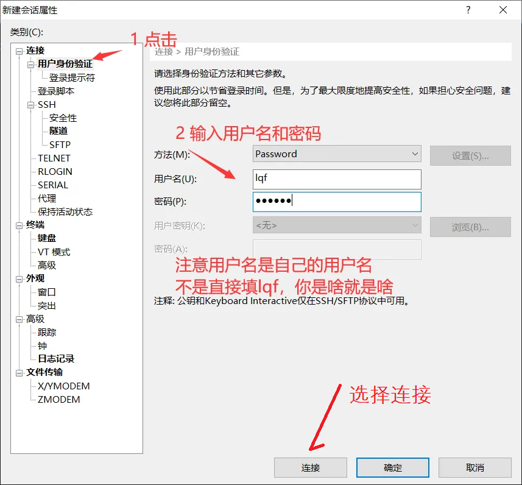


然后点击 **<font style="color:#DF2A3F;">【连接】 进入下一界面</font>**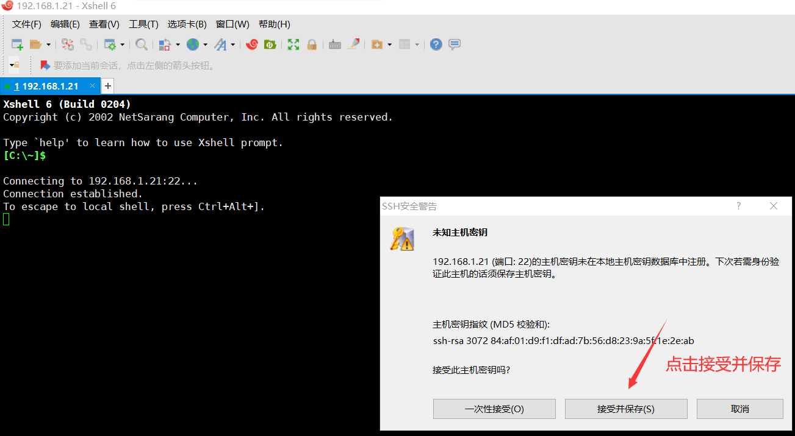

点击接受并保存

 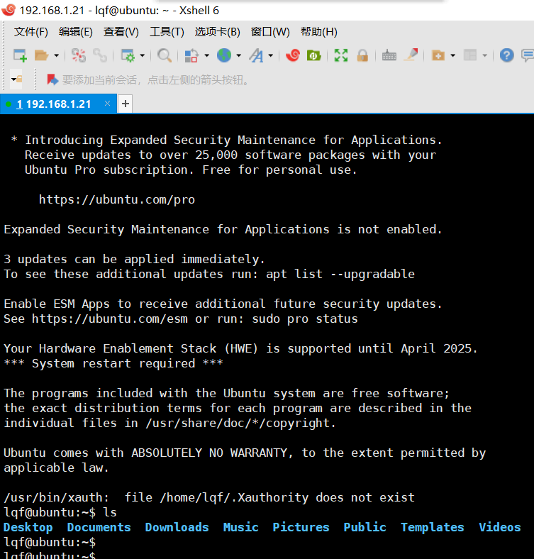

此时就可以在xshell操作Linux系统了。


后续如果需要重新打开该会话则。 **【文件】**-> **【打开】 **


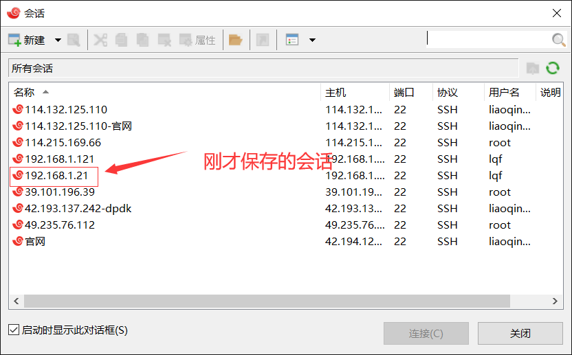

选中双击 即可打开。（但要注意：虚拟机安装的Linux ip不是一直固定不变的，如果访问不了则需要在Linux系统查看ip是否发生了变化）


## 2.2 快捷方式连接Linux
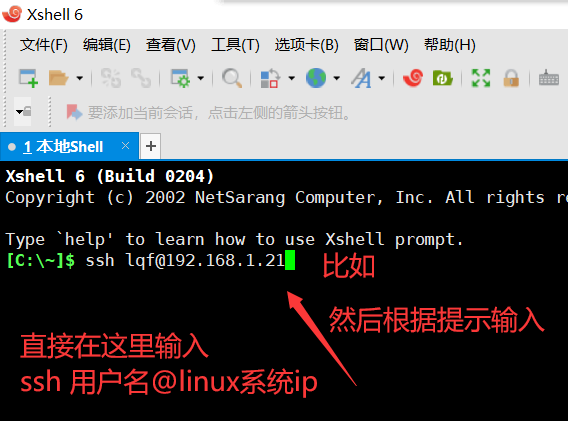

回车后提示

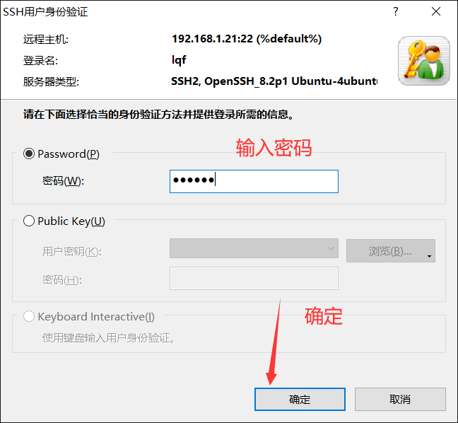

然后就可以访问Linux系统了。

## 2.3 在xshell利用命令行工具rz和sz实现Linux系统
### 安装lrzsz套件
首先，要在Linux服务器上启用文件的命令行上传与下载功能，我们需要安装lrzsz包，它包含了`rz`和`sz`命令。对于基于Debian和Ubuntu的系统，可以通过以下命令安装：

```plain
sudo apt-get update
sudo apt-get install lrzsz
```

打开Xshell终端，先切换到文件存放路径(你想把文件存放在哪个地方，就切到哪个路径)；

然后输入rz命令，即可弹出windows文件选择弹窗，可以选择一个文件，也可以选择多个文件(注意如果传输时遇到乱码，要重新传才可以)

### 上传文件至Linux服务器
当你需要从本地Windows计算机上传文件至Linux服务器时，使用rz命令。在Xshell中，确保已启用ZMODEM协议，并在终端中输入rz，然后回车。此时Xshell会弹出一个文件选择对话框，从中选择你要上传的文件，选择完毕后文件会被自动传输至当前Linux会话的工作目录。

```plain
[lqf@ubuntu~]$ rz
```

### 从Linux服务器下载文件至本地
下载文件的过程则是用`sz`命令。指定要下载的文件路径，Xshell同样会通过ZMODEM协议启动一个文件接收过程。

示例：

```plain
[lqf@ubuntu~]$ sz /path/to/file.txt
```

<font style="color:rgb(77,77,77);background-color:rgb(255,255,255);">执行此命令后，Xshell会在本地电脑上弹出保存对话框，你可以选择保存的位置并确定下载。</font>


> 更新: 2025-07-11 14:37:40  
> 原文: <https://www.yuque.com/linuxer/gscfv1/grynna6985xg87cf>