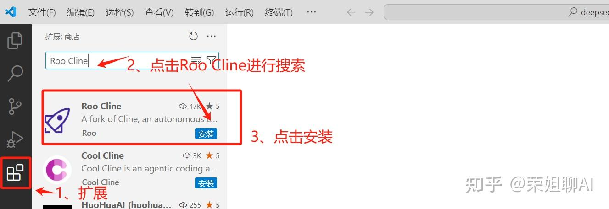
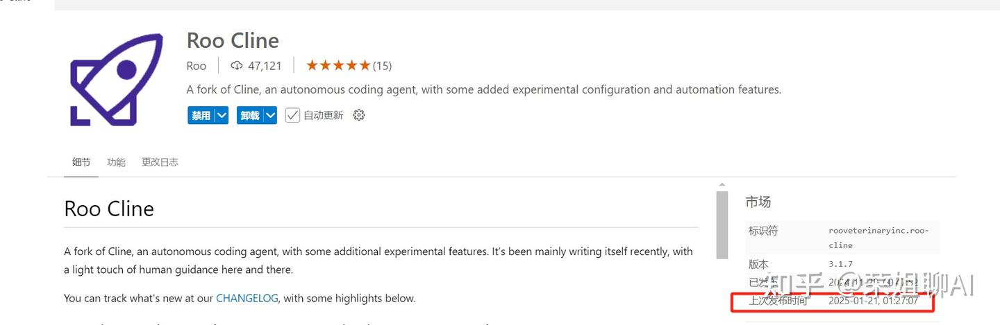
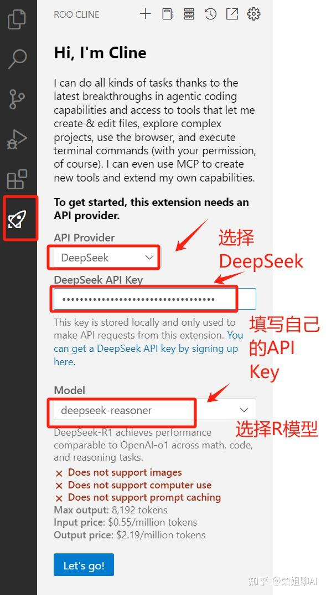
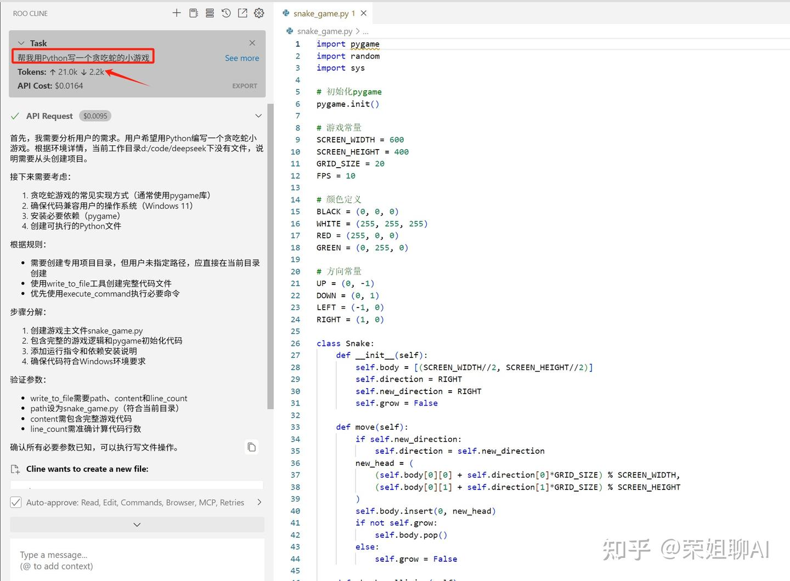
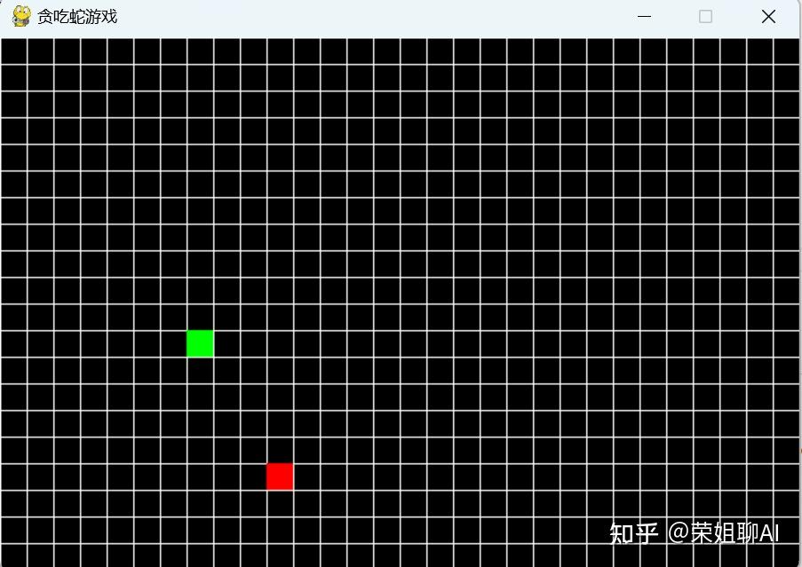

# DeepSeek R1接入Vscode

原文链接：[https://zhuanlan.zhihu.com/p/19702443211](https://zhuanlan.zhihu.com/p/19702443211)

这两天真的太热闹了，感觉国产AI模型都在憋着大招，[DeepSeek](https://zhida.zhihu.com/search?content_id=252962843&content_type=Article&match_order=1&q=DeepSeek&zhida_source=entity)才发布自己的V3版本，在1月20日马上正式发布 DeepSeek-R1，直接对标OpenAI o1模型。下图是官方发布的对比图。

那么作为普通大众的我们怎么利用好这波红利呢，大家都知道 [cursor](https://zhida.zhihu.com/search?content_id=252962843&content_type=Article&match_order=1&q=cursor&zhida_source=entity) 平台应该是最好的 AI 编程工具了，但是价格却不怎么美丽，荣姐教大家怎么把 DeepSeek-R1 接入[VScode](https://zhida.zhihu.com/search?content_id=252962843&content_type=Article&match_order=1&q=VScode&zhida_source=entity)中，为自己职场提效助力，增加自己的核心竞争力。

1、打开VScode，点击左侧扩展按钮，在搜索框输入：[Roo Cline](https://zhida.zhihu.com/search?content_id=252962843&content_type=Article&match_order=1&q=Roo+Cline&zhida_source=entity) 进行搜索。找到后点击安装。

2、安装完成后会看到如下界面，可以看到上次发布时间是2025年1月21日。

3、配置Roo Cline，填写DeepSeek 的API Key，选择[R1模型](https://zhida.zhihu.com/search?content_id=252962843&content_type=Article&match_order=1&q=R1%E6%A8%A1%E5%9E%8B&zhida_source=entity)。

DeepSeek后台地址如下，创建自己的API Key。

[https://platform.deepseek.com/](https://link.zhihu.com/?target=https%3A//platform.deepseek.com/)

4、享受DeepSeek带给你的体验吧！

我测试的任务是：帮我用python写一个贪吃蛇的小游戏。可以看到右侧的代码已经自动生成了。

看一下效果吧，一行代码没动，直接生成，cursor 平替，价格非常低廉。如果有不满意的地方可以在左侧的聊天窗口让 AI 反复修改即可。

 

跟多参考：[AI 编程组合之deepseek+vscode+cline插件，使用deepseek大模型实现代码自动生成_deepseek vscode插件-CSDN博客](https://blog.csdn.net/sadfasdfsafadsa/article/details/144893338)

> 更新: 2025-02-05 15:14:15  
> 原文: <https://www.yuque.com/linuxer/gscfv1/wzvqpfrxh85nz4yu>