# 5.sourceinsight

<font style="color:#117CEE;">老廖提供主流C/C++就业课程服务：</font>

1. <font style="color:#117CEE;">C/C++通用后台开发</font>
2. <font style="color:#117CEE;">音视频开发</font>
3. <font style="color:#117CEE;">QT开发</font>
4. <font style="color:#117CEE;">游戏开发</font>

<font style="color:#117CEE;">等课程，包括视频教学、资料代码、课程答疑、简历指导、面试复盘等服务，详情咨询</font>**<font style="color:#117CEE;">微信laoliao6668</font>**

**<font style="color:#117CEE;"></font>**

**<font style="color:#117CEE;">本文参考了多篇链接，如有侵权告知删除。</font>**

**<font style="color:#117CEE;"></font>**

<font style="color:rgb(34, 34, 38);">Source Insight 是一款强大的源代码分析工具，可以用于浏览、编辑、搜索、分析源代码。它支持多种编程语言，包括 C、C++、Java、Objective-C、Python、PHP、HTML 等。Source Insight 可以快速地分析源代码结构，并提供了一系列有用的功能，如代码导航、符号搜索、代码片段管理、自动完成、语法高亮等。</font>


# <font style="color:rgb(34, 34, 38);">1 安装sourceinsight</font>
## <font style="color:rgb(34, 34, 38);">1.1 概述</font>
<font style="color:rgb(34, 34, 38);">Source Insight 的主要特点包括：</font>

+ <font style="color:rgb(34, 34, 38);">代码导航：可以快速地浏览源代码结构，包括函数、类、变量、宏定义等，并支持跳转到定义、引用、声明等。</font>
+ <font style="color:rgb(34, 34, 38);">符号搜索：可以搜索源代码中的符号，包括函数、变量、宏定义等，并支持模糊搜索、正则表达式搜索等。</font>
+ <font style="color:rgb(34, 34, 38);">代码片段管理：可以管理常用的代码片段，包括代码块、函数模板、注释模板等，并支持自定义代码片段。</font>
+ <font style="color:rgb(34, 34, 38);">自动完成：可以自动完成代码，包括关键字、函数、变量等，并支持自定义自动完成规则。</font>
+ <font style="color:rgb(34, 34, 38);">语法高亮：支持对源代码进行语法高亮，包括关键字、注释、字符串等。</font>
+ <font style="color:rgb(34, 34, 38);">项目管理：可以管理多个项目，包括源代码、头文件、库文件等，并支持自动更新文件列表。</font>
+ <font style="color:rgb(34, 34, 38);">代码分析：可以对源代码进行分析，并生成代码分析报告，包括函数调用图、类继承图等。</font>

<font style="color:rgb(34, 34, 38);">总之，Source Insight 是一款功能强大、易于使用的源代码分析工具，可以大大提高开发效率。</font>


<font style="color:rgb(34, 34, 38);"></font>

## <font style="color:rgb(34, 34, 38);">1.2 安装步骤</font>
<font style="color:rgb(34, 34, 38);">安装包可以到官网下载，这是收费软件，需要自己找方法免费。</font>

[附件: sourceinsight4-202405.rar](./attachments/44549646_XTQpodE0HFZV7mWZ/sourceinsight4-202405.rar)

<font style="color:rgb(34, 34, 38);">Source Insight官网：</font>[<font style="color:rgb(34, 34, 38);">https://www.sourceinsight.com</font>](https://www.sourceinsight.com)

<font style="color:rgb(34, 34, 38);">安装包下载地址：</font>[<font style="color:rgb(34, 34, 38);">https://download.csdn.net/download/wkd_007/87910495</font>](https://download.csdn.net/download/wkd_007/87910495)

<font style="color:rgb(34, 34, 38);"></font>

<font style="color:rgb(34, 34, 38);">双击安装包 sourceinsight40124-setup.exe，出现下面界面，点击Next:</font>

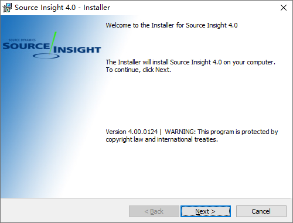

<font style="color:rgb(34, 34, 38);"></font>

<font style="color:rgb(34, 34, 38);">License Agreement</font>

<font style="color:rgb(34, 34, 38);">勾选 I accept the ....，点击Next:</font>

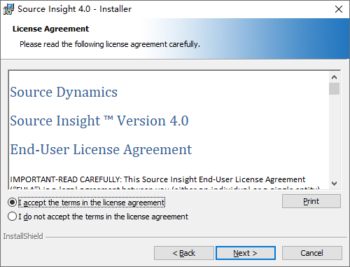

<font style="color:rgb(34, 34, 38);"></font>

<font style="color:rgb(34, 34, 38);">Destination Folder</font>

<font style="color:rgb(34, 34, 38);">安装目录，可以按照默认的，也可以点击Change按钮，选择一个目录，然后点击Next:</font>

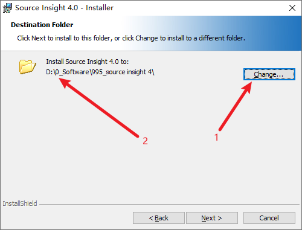

<font style="color:rgb(34, 34, 38);"></font>

<font style="color:rgb(34, 34, 38);">Ready to Install the Program</font>

<font style="color:rgb(34, 34, 38);">如果前面没有问题的话，直到点击Install按钮，进行安装：</font>

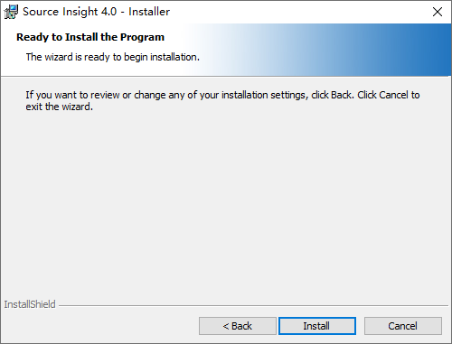

<font style="color:rgb(34, 34, 38);"></font>

<font style="color:rgb(34, 34, 38);">等待一会，安装完成了，点击Finish，完成安装。</font>

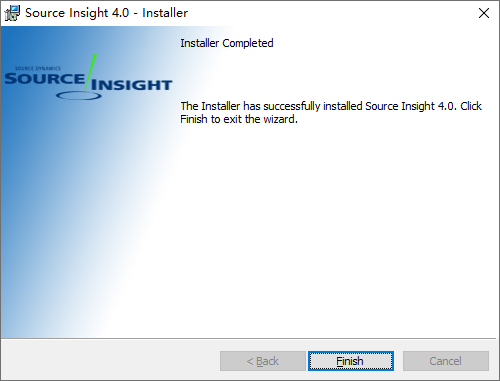


<font style="color:rgb(34, 34, 38);"></font>

<font style="color:rgb(34, 34, 38);">安装完成后，第一次运行，需要</font>

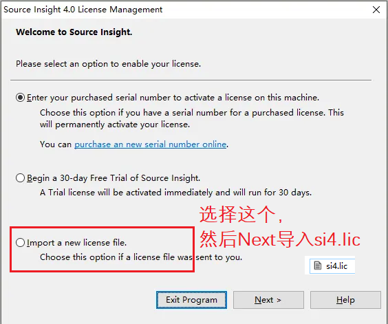

<font style="color:rgb(34, 34, 38);"></font>

 

# <font style="color:rgb(34, 34, 38);">2 阅读C/C++工程源码</font>
<font style="color:rgb(34, 34, 38);"></font>

## <font style="color:rgb(34, 34, 38);">2.1 创建C/C++工程</font>
source insight 看大型的代码，一般需要两个步骤：

+ 新建一个工程(Project) 。
+ 同步代码(Synchronize Files…) 。

### 2.1.1 新建工程
在菜单栏依次点击Project->New Project，打开新工程界面，填入工程名称并且指定一个目录来存储工程数据文件，我一般指定在源码目录，然后点击OK：


New Project Settings

工程设置，只需要设置源码目录，源码备份目录保持默认即可，按OK，到下一步

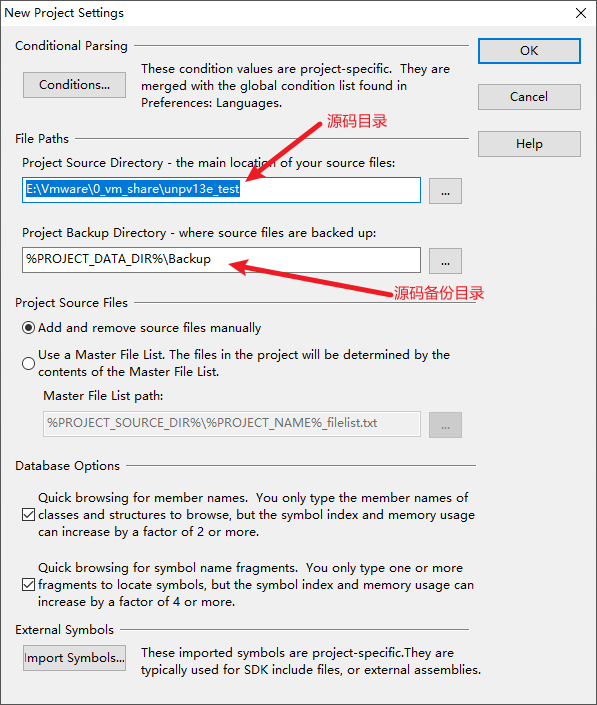


Add and Remove Project Files

添加工程文件，也就是添加源码文件，可以选择源码目录，直接按Add All添加整个源码目录；也可以在File Name 选择一个目录，然后Add Tree，添加单个目录；也可以添加单个文件。

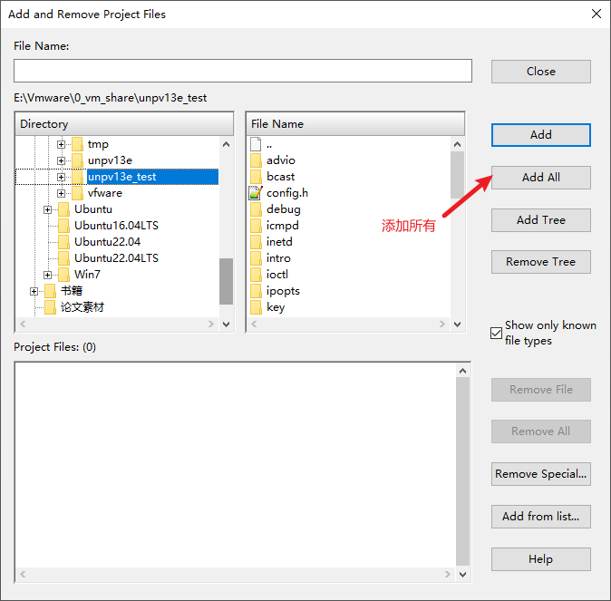

添加目录时，勾选Recursively add lower sub-directiories，递归添加子目录文件

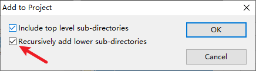

最后会弹出提示添加的文件数量，点击确定，完成添加，点击close

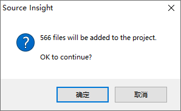


### 2.1.2 同步代码文件
在菜单栏依次点击Project -> Syncronize Files...，弹出同步文件界面，勾选Force all files to be re-parsed，强制重新分析所有文件，然后点击Start，等待分析完成即可：

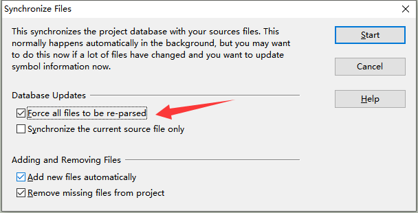

分析完成后，就可以跳转某个符号的定义、引用、声明了，也可以进行符号搜索等功能，也就是可以愉快地阅读代码了。

 

## <font style="color:rgb(34, 34, 38);">2.2 无法识别c++的 .cc文件的问题</font>


Source Insight默认情况下是不识别"*.cc"类型的c++文件的，需要进行如下的操作：


1、创建工程的时候，在文件识别选项中去掉“Show only known file types”的选项


2、文件加载完成后找到菜单选项中的 “Options-->File Type Options”：

(1)左端窗口选择"C/C++ Source File"

(2) 在右端窗口的方框中加入"*.cc"类型的文件标识。 

(3) 点击“Close”窗口即可。*.cc类型的c++文件就可以正确的识别了。

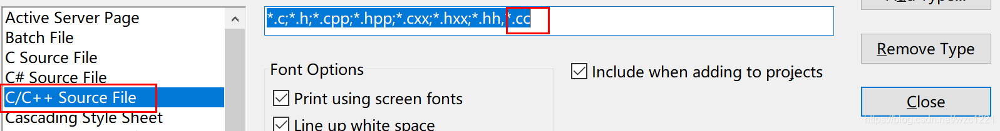

 

# <font style="color:rgb(34, 34, 38);">3 使用详解</font>


<font style="color:rgb(34, 34, 38);">本章主要从下面几个点介绍如何使用Source Insight 4，适合以前没有使用过该软件的新手：</font>

+ <font style="color:rgb(34, 34, 38);">常用的几个窗口；</font>
+ <font style="color:rgb(34, 34, 38);">常用的快捷键；</font>
+ <font style="color:rgb(34, 34, 38);">阅读代码常用功能；</font>
+ <font style="color:rgb(34, 34, 38);">其他设置。</font>

<font style="color:rgb(34, 34, 38);"></font>

<font style="color:rgb(34, 34, 38);">原文链接：</font>[<font style="color:rgb(34, 34, 38);">https://blog.csdn.net/wkd_007/article/details/131316924</font>](https://blog.csdn.net/wkd_007/article/details/131316924)


## <font style="color:rgb(34, 34, 38);">3.1 常用的几个窗口</font>
<font style="color:rgb(34, 34, 38);">Source Insight 4提供了多个窗口来帮助开发者更好地浏览和理解源代码。下面是几个常用的窗口的详细介绍：</font>

+ <font style="color:rgb(34, 34, 38);">符号窗口（Symbol Window）</font>
+ <font style="color:rgb(34, 34, 38);">项目文件窗口（Project Window）</font>
+ <font style="color:rgb(34, 34, 38);">关系窗口（Relation Window）</font>
+ <font style="color:rgb(34, 34, 38);">上下文窗口（Context Window）</font>

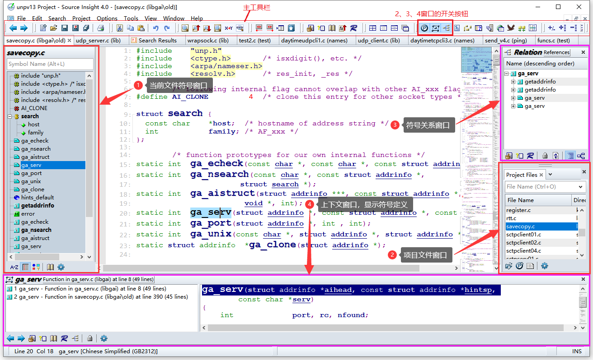

<font style="color:rgb(34, 34, 38);"></font>

### 3.1.1 <font style="color:rgb(34, 34, 38);">符号窗口（Symbol Window）</font>
**<font style="color:rgb(34, 34, 38);">符号窗口</font>**<font style="color:rgb(34, 34, 38);"> 显示了当前文件中的所有符号，比如变量、函数、类等。可以通过符号窗口快速定位和浏览代码中的不同符号，点击符号即可跳转到相应的位置。</font>

<font style="color:rgb(34, 34, 38);">符合窗口下面有几个图标分别是：按名称排序、按行号排序、按类型排序；</font>

<font style="color:rgb(34, 34, 38);">如果当前文件符号太多，可以通过顶部的搜索栏搜索并过滤。</font>

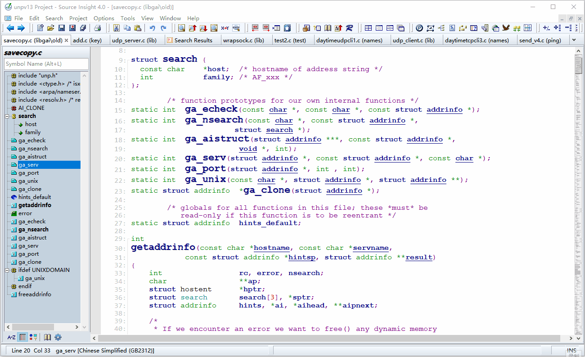

<font style="color:rgb(34, 34, 38);"></font>

### <font style="color:rgb(34, 34, 38);">3.1.2 项目文件窗口（Project Window）</font>
<font style="color:rgb(34, 34, 38);">项目文件窗口 显示了项目中的所有文件，并提供了文件夹结构的视图。可以通过文件窗口快速选择和切换文件，以及查看文件的层次结构。该窗口可以通过工具栏的图标  打开或关闭。</font>

+ <font style="color:rgb(34, 34, 38);">Project Files：会列出项目添加的所有文件，可以通过顶部搜索栏，搜索并过滤文件；</font>
+ <font style="color:rgb(34, 34, 38);">Floders：会显示项目文件夹结构，可以通过文件夹去打开文件；</font>
+ <font style="color:rgb(34, 34, 38);">Project Symbols：列出项目的所有符号，较少使用；</font>
+ <font style="color:rgb(34, 34, 38);">Symbol Categories：按类型列出项目的所有符号，较少使用。</font>

<font style="color:rgb(34, 34, 38);">如果这几个窗口不小心关闭了，可以依次点击菜单的View -> Panels -> Project Window，勾选Project Window后面的几个可以恢复窗口。</font>

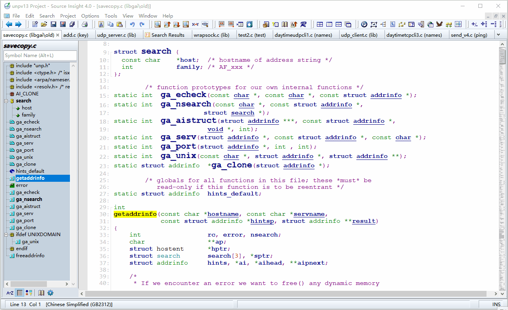

<font style="color:rgb(34, 34, 38);"></font>

<font style="color:rgb(34, 34, 38);"></font>

### 3.1.<font style="color:rgb(34, 34, 38);">3 关系窗口（Relation Window）</font>
**<font style="color:rgb(34, 34, 38);">关系窗口</font>**<font style="color:rgb(34, 34, 38);"> 显示了当前选中符号的所有引用位置。当选中一个符号时，可以通过关系窗口查看该符号在代码中的所有引用，方便进行全局搜索和代码分析。</font>

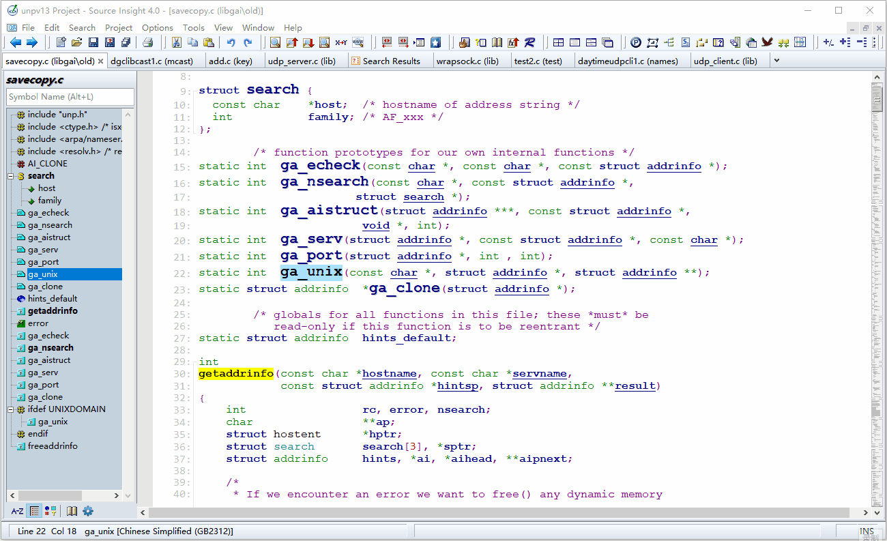

<font style="color:rgb(34, 34, 38);"></font>

### 3.1<font style="color:rgb(34, 34, 38);">.4 上下文窗口（Context Window）</font>
**<font style="color:rgb(34, 34, 38);">上下文窗口 </font>**<font style="color:rgb(34, 34, 38);">显示了当前选中符号的定义和引用位置。当您选中一个符号时，可以通过定义窗口查看该符号在代码中的具体定义和引用情况。</font>

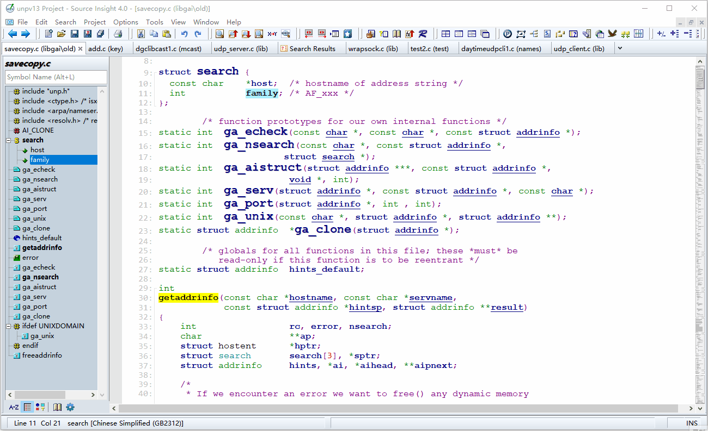


## <font style="color:rgb(34, 34, 38);">3.2 常用的快捷键</font>
<font style="color:rgb(34, 34, 38);">常用的快捷键有：</font>

+ <font style="color:rgb(34, 34, 38);">F8 ：使符号高亮显示</font>
+ <font style="color:rgb(34, 34, 38);">Alt+,(Alt键加逗号)：返回上一步（Go Back）</font>
+ <font style="color:rgb(34, 34, 38);">Alt+.(Alt键加句号)：前进一步（Go Forward）</font>
+ <font style="color:rgb(34, 34, 38);">Ctrl+F ：在当前文件搜索</font>
+ <font style="color:rgb(34, 34, 38);">F3：向前搜索</font>
+ <font style="color:rgb(34, 34, 38);">F4：向后搜索</font>
+ <font style="color:rgb(34, 34, 38);">Ctrl+H ：替换</font>
+ <font style="color:rgb(34, 34, 38);">Ctrl+G ：在当前文件跳转到某一行（Go to line… ）</font>
+ <font style="color:rgb(34, 34, 38);">Ctrl+/ ：在整个工程，搜索某个符号的引用</font>
+ <font style="color:rgb(34, 34, 38);">Ctrl+= ：跳到定义（Jump To Definition）</font>

<font style="color:rgb(34, 34, 38);"></font>

<font style="color:rgb(34, 34, 38);">下面是从Source Insight 4.00.124 导出的快捷键文件，去掉大部分没定义的，有哪些还需要用到的，可以在这个文件查找。（Help -> Create Key List）</font>

<font style="color:rgb(34, 34, 38);"></font>

```bash
Commands                                  :  Key Assignments
Application: Mono Font View               :  Alt+F12
Edit: Back Tab                            :  Shift+Tab
Edit: Comment Lines                       :  Alt+/
Edit: Complete Snippet                    :  Ctrl+E
Edit: Complete Symbol                     :  Ctrl+8
Edit: Copy                                :  L+R Click, Ctrl+C
Edit: Copy Line                           :  Ctrl+K
Edit: Copy Line Right                     :  Ctrl+Shift+K
Edit: Copy To Clip...                     :  Ctrl+Del
Edit: Cut                                 :  Shift+Del, Ctrl+X
Edit: Cut Line                            :  Ctrl+U
Edit: Cut Line Right                      :  Ctrl+;
Edit: Cut To Clip...                      :  Ctrl+Shift+X
Edit: Cut Word                            :  Ctrl+,
Edit: Delete Character                    :  (KeyPad) Del, Del
Edit: Drag Line Down                      :  Ctrl+Down
Edit: Drag Line Up                        :  Ctrl+Up
Edit: Enter                               :  (KeyPad) Enter, Enter, Enter
Edit: Indent Left                         :  F9
Edit: Indent Right                        :  F10
Edit: Insert Line                         :  Ctrl+I
Edit: Insert Line Before Next             :  Ctrl+Space
Edit: Insert New Line                     :  Ctrl+Enter
Edit: Join Lines                          :  Ctrl+J
Edit: Paste                               :  Shift+Ins, Ctrl+V
Edit: Paste From Clip...                  :  Ctrl+Ins
Edit: Paste Line                          :  Ctrl+P
Edit: Play Recording                      :  Ctrl+F3
Edit: Redo                                :  Ctrl+Y
Edit: Renumber...                         :  Ctrl+R
Edit: Repeat Typing                       :  Ctrl+\
Edit: Replace...                          :  Ctrl+H
Edit: Restore Lines                       :  Alt+D
Edit: Simple Tab                          :  Ctrl+Alt+Tab 
Edit: Smart Rename...                     :  Ctrl+'
Edit: Start Recording                     :  Ctrl+F1
Edit: Stop Recording                      :  Ctrl+F2
Edit: Tab                                 :  Tab
Edit: Toggle Insert Mode                  :  Ins
Edit: Un-Comment Lines                    :  Alt+Shift+?
Edit: Undo                                :  Alt+BackSpace, Ctrl+Z 
File: Close                               :  Ctrl+W
File: Close All                           :  Ctrl+Shift+W
File: New                                 :  Ctrl+N
File: Next File...                        :  Ctrl+Shift+N
File: Open...                             :  Ctrl+O
File: Reload File                         :  Ctrl+Shift+O
File: Save                                :  Ctrl+S
File: Save All                            :  Ctrl+Alt+A
File: Save As...                          :  Ctrl+Shift+S
File: Show File Status                    :  Shift+F10
Help: Help...                             :  F1
Help: SDK Help...                         :  Alt+F1
Menu: Activate Edit Menu                  :  Alt+E
Menu: Activate File Menu                  :  Alt+F
Menu: Activate Help Menu                  :  Alt+H
Menu: Activate Options Menu               :  Alt+O
Menu: Activate Project Menu               :  Alt+P
Menu: Activate Search Menu                :  Alt+S
Menu: Activate System Doc Menu            :  Alt+-
Menu: Activate System Menu                :  Alt+Space
Menu: Activate Tools Menu                 :  Alt+T
Menu: Activate View Menu                  :  Alt+V
Menu: Activate Window Menu                :  Alt+W
Menu: Activate Work Menu                  :  Alt+K
Navigation: Beginning Of Line             :  Home
Navigation: Beginning Of Selection        :  Ctrl+Alt+[
Navigation: Block Down                    :  Ctrl+Shift+]
Navigation: Block Up                      :  Ctrl+Shift+[
Navigation: Bookmark...                   :  Ctrl+M
Navigation: Bottom Of File                :  Ctrl+(KeyPad) End, Ctrl+End
Navigation: Bottom Of Window              :  (KeyPad) End
Navigation: Cursor Down                   :  (KeyPad) Down, Down
Navigation: Cursor Left                   :  (KeyPad) Left, Left
Navigation: Cursor Right                  :  (KeyPad) Right, Right
Navigation: Cursor Up                     :  (KeyPad) Up, Up
Navigation: End Of Line                   :  End
Navigation: End Of Selection              :  Ctrl+Alt+]
Navigation: Function Down                 :  (KeyPad) +
Navigation: Function Up                   :  (KeyPad) -
Navigation: Go Back                       :  Thumb 1 Click, Alt+,
Navigation: Go Back Toggle                :  Alt+M
Navigation: Go Forward                    :  Thumb 2 Click, Alt+.
Navigation: Go To First Link              :  Ctrl+Shift+L
Navigation: Go To Line...                 :  Ctrl+G, F5
Navigation: Go To Next Change             :  Alt+(KeyPad) +
Navigation: Go To Next Link               :  Shift+F9
Navigation: Go To Previous Change         :  Alt+(KeyPad) -
Navigation: Go To Previous Link           :  Shift+F8
Navigation: Jump To Link                  :  Ctrl+L
Navigation: Jump To Match                 :  Alt+]
Navigation: Make Column Selection         :  Alt+L Click
Navigation: Page Down                     :  (KeyPad) PgDn, PgDn
Navigation: Page Up                       :  (KeyPad) PgUp, PgUp
Navigation: Paren Left                    :  Ctrl+9
Navigation: Paren Right                   :  Ctrl+0
Navigation: Scroll Half Page Down         :  (KeyPad) *, Ctrl+(KeyPad) PgDn, Ctrl+PgDn
Navigation: Scroll Half Page Up           :  (KeyPad) /, Ctrl+(KeyPad) PgUp, Ctrl+PgUp
Navigation: Scroll Left                   :  Alt+Left
Navigation: Scroll Line Down              :  Alt+Down
Navigation: Scroll Line Up                :  Alt+Up
Navigation: Scroll Right                  :  Alt+Right
Navigation: Select All                    :  Ctrl+A
Navigation: Select Block                  :  Ctrl+-
Navigation: Select Char Left              :  Shift+Left
Navigation: Select Char Right             :  Shift+Right
Navigation: Select Line                   :  Shift+F6
Navigation: Select Line Down              :  Shift+Down
Navigation: Select Line Up                :  Shift+Up
Navigation: Select Match                  :  Alt+=
Navigation: Select Next Snippet Placehol  :  Ctrl+Shift+;
Navigation: Select Page Down              :  Shift+(KeyPad) PgDn, Shift+PgDn
Navigation: Select Page Up                :  Shift+(KeyPad) PgUp, Shift+PgUp
Navigation: Select Paragraph              :  
Navigation: Select Sentence               :  Ctrl+., Shift+F7
Navigation: Select To                     :  Shift+L Click
Navigation: Select To End Of File         :  Ctrl+Shift+End
Navigation: Select To End Of Line         :  Shift+End
Navigation: Select To Start Of Line       :  Shift+Home
Navigation: Select To Top Of File         :  Ctrl+Shift+Home
Navigation: Select Word                   :  Shift+F5
Navigation: Select Word Left              :  Ctrl+Shift+Left
Navigation: Select Word Right             :  Ctrl+Shift+Right
Navigation: Selection History...          :  Ctrl+Shift+M
Navigation: Top Of File                   :  Ctrl+(KeyPad) Home, Ctrl+Home
Navigation: Top Of Window                 :  (KeyPad) Home
Navigation: Word Left                     :  Ctrl+Left
Navigation: Word Right                    :  Ctrl+Right
Options: File Type Options...             :  Alt+Y
Project: Add File...                      :  Alt+Shift+A
Project: Close Project                    :  Alt+Shift+W
Project: New Project...                   :  Alt+Shift+N
Project: Open Project...                  :  Alt+Shift+P
Project: Remove File...                   :  Alt+Shift+R
Project: Synchronize Files...             :  Alt+Shift+S
Search: Incremental Search...             :  Ctrl+,, F12
Search: Replace Files...                  :  Ctrl+Shift+H
Search: Search Backward                   :  F3
Search: Search Backward for Selection     :  Shift+F3
Search: Search Engines...                 :  
Search: Search Files...                   :  Ctrl+Shift+F
Search: Search Forward                    :  F4
Search: Search Forward for Selection      :  Shift+F4
Search: Search Web...                     :  Ctrl+Alt+W
Search: Search...                         :  Ctrl+F
Symbol: Jump To Base Type                 :  Alt+0
Symbol: Jump To Caller                    :  Ctrl+Alt+C
Symbol: Jump To Definition                :  Ctrl+=
Symbol: Jump To Prototype...              :  Alt+-
Symbol: Lookup References...              :  Ctrl+/
Symbol: Parse File Now                    :  
Symbol: Project Symbols Dialog...         :  
Symbol: Symbol Info...                    :  Ctrl+R Click (select)
View: Activate Project Search Bar         :  Alt+Shift+P
View: Activate Project Symbol List        :  Alt+G, F7
View: Activate Search Bar                 :  Alt+Shift+F
View: Activate Search Results             :  
View: Activate Snippet Window             :  Ctrl+Alt+S
View: Activate Symbol Window              :  Alt+L
View: Full Screen                         :  F11
View: Highlight Word                      :  F8
View: Load Layout A                       :  Ctrl+Shift+F1
View: Load Layout B                       :  Ctrl+Shift+F2
View: Load Layout C                       :  Ctrl+Shift+F3
View: Load Layout D                       :  Ctrl+Shift+F4
View: Symbol Window                       :  Alt+F8
Windows: Close Window                     :  Ctrl+F4, Alt+F6
Windows: Last Window                      :  Ctrl+Shift+Tab, Ctrl+Tab 
Windows: New Window                       :  Alt+F5 
Windows: Select Next Window               :  Ctrl+F6, Shift+F2, F2
Windows: Select Previous Window           :  Shift+F1 
Windows: Tile Two Windows                 :  F6
Windows: Zoom Window                      :  Ctrl+F10, Alt+F10
```

 

<font style="color:rgb(34, 34, 38);"></font>

<font style="color:rgb(34, 34, 38);"></font>

## <font style="color:rgb(34, 34, 38);">3.3 阅读代码常用功能</font>
### 3.3.<font style="color:rgb(34, 34, 38);">1 跳转到符号(变量、函数等)定义</font>
<font style="color:rgb(34, 34, 38);">跳转到定义有两种方式：</font>

+ <font style="color:rgb(34, 34, 38);">按住Ctrl键，点击符号，就会跳转到定义；</font>
+ <font style="color:rgb(34, 34, 38);">将光标定位在符号处，按Alit+=。</font>

<font style="color:rgb(34, 34, 38);">跳转后，可以按 Alt+, 返回。或者点击工具栏的图标 ，进行前进、后退。</font>

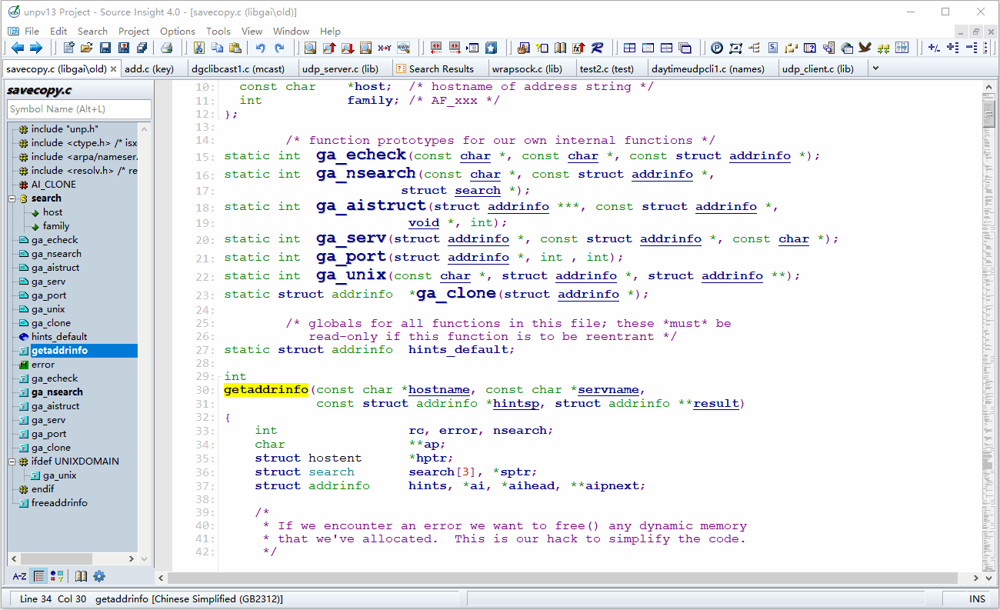

<font style="color:rgb(34, 34, 38);"></font>

### <font style="color:rgb(34, 34, 38);">3.3.2 当前文件搜索符号(变量、函数等)</font>
<font style="color:rgb(34, 34, 38);">选中某个符号(变量、函数等)后，按Ctrl+F，会出现搜索弹窗，如下图：</font>

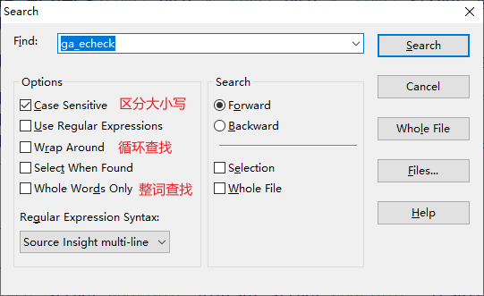

<font style="color:rgb(34, 34, 38);">搜索选项：</font>

<font style="color:rgb(34, 34, 38);">Case Sensitive：勾选表示区分大小写。例如，搜 ga_echeck 时勾选的话，就不会搜到 Ga_echeck ，不勾选就会搜到。</font>

<font style="color:rgb(34, 34, 38);">Use Regular Expressions：使用正则表达式进行搜索，我比较少用；</font>

<font style="color:rgb(34, 34, 38);">Wrap Around：循环搜索。勾选后，搜索到文件尾部后，会继续跳转到文件开头搜索；</font>

<font style="color:rgb(34, 34, 38);">Select When Found：查找到的时候，选中该符号，没太大用处；</font>

<font style="color:rgb(34, 34, 38);">Whole Words Only：勾选后会整词查找。例如，搜 ga_echeck 时勾选的话，就不会查找到 ga_echeck_new，不勾选会查找到。</font>

<font style="color:rgb(34, 34, 38);"></font>

<font style="color:rgb(34, 34, 38);"></font>

<font style="color:rgb(34, 34, 38);">搜索后，可以按快捷键F3查找上一个，或按F4查找下一个；</font>

<font style="color:rgb(34, 34, 38);">跳转后，可以按 Alt+, 返回。或者点击工具栏的图标 ，进行前进、后退。</font>

<font style="color:rgb(34, 34, 38);">工具栏图标  也是查找符号的，这三个图标相当于Ctrl+F、F3、F4。</font>

<font style="color:rgb(34, 34, 38);"></font>

### 3.3<font style="color:rgb(34, 34, 38);">.3 全局查找符号(变量、函数等)的引用</font>
<font style="color:rgb(34, 34, 38);">选中某个符号(变量、函数等)后，按Ctrl+/，会出现查找引用弹窗，如下图：</font>

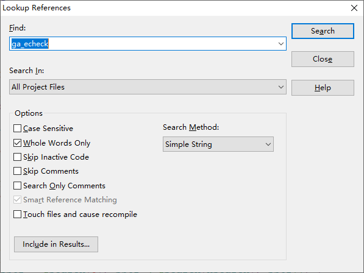

**<font style="color:rgb(34, 34, 38);">Search In</font>**<font style="color:rgb(34, 34, 38);">：可以选择搜索范围，可以选择在 整个工程 或 当前文件 或 某个类型的文件。</font>

**<font style="color:rgb(34, 34, 38);">Options</font>**<font style="color:rgb(34, 34, 38);">：</font>

+ <font style="color:rgb(34, 34, 38);">Case Sensitive：勾选表示区分大小写。例如，搜 ga_echeck 时勾选的话，就不会搜到 Ga_echeck ，不勾选就会搜到。</font>
+ <font style="color:rgb(34, 34, 38);">Whole Words Only：勾选后会整词查找。例如，搜 ga_echeck 时勾选的话，就不会查找到 ga_echeck_new，不勾选会查找到。</font>
+ <font style="color:rgb(34, 34, 38);">Skip Inactive Code：勾选后会跳过无效的代码。例如，ga_echeck 用 #if 0 括起来，那么就不会被搜到；</font>
+ <font style="color:rgb(34, 34, 38);">Skip Comments：勾选后会跳过注释。例如，单行注释//ga_echeck不会被搜到；</font>
+ <font style="color:rgb(34, 34, 38);">Search Only Comments：只在注释中去搜索。</font>


**<font style="color:rgb(34, 34, 38);">Search Method：</font>**

+ <font style="color:rgb(34, 34, 38);">Simple String：按照字符串去搜索，选择这个，连printf("ga_echeck\n")中的字符串也会被搜到；</font>
+ <font style="color:rgb(34, 34, 38);">Look Up Reference：查找引用，查找变量、函数等调用的地方；</font>
+ <font style="color:rgb(34, 34, 38);">Regular Expression：按照正则表达式去搜索，没使用过；</font>
+ <font style="color:rgb(34, 34, 38);">Key Expression：没使用过。</font>

<font style="color:rgb(34, 34, 38);">跳转后，可以按 Alt+, 返回。或者点击工具栏的图标 ，进行前进、后退。</font>


## <font style="color:rgb(34, 34, 38);">3.4 其他设置</font>
### <font style="color:rgb(34, 34, 38);">设置主题颜色</font>
<font style="color:rgb(34, 34, 38);">依次点击菜单栏Option -> Visual Theme，可以选择自己喜欢的主题配色。</font>

<font style="color:rgb(34, 34, 38);"></font>

### <font style="color:rgb(34, 34, 38);">设置编码</font>
<font style="color:rgb(34, 34, 38);">有时一些中文注释是 GB2312 的，使用默认的 UTF-8 编码打开就会编程乱码，可以依次点击菜单栏Option -> Preference -> Files，修改编码</font>

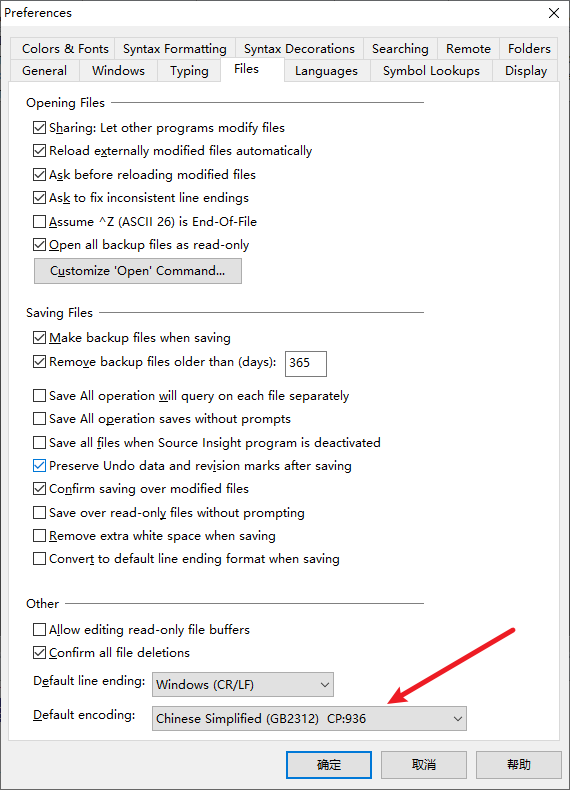

<font style="color:rgb(34, 34, 38);"></font>

 

<font style="color:rgb(34, 34, 38);"></font>

<font style="color:rgb(34, 34, 38);"></font>

# <font style="color:rgb(34, 34, 38);">参考</font>
[https://blog.csdn.net/wkd_007/article/details/131216858](https://blog.csdn.net/wkd_007/article/details/131216858)

[https://blog.csdn.net/wkd_007/article/details/131316924](https://blog.csdn.net/wkd_007/article/details/131316924)


> 更新: 2024-05-31 15:03:45  
> 原文: <https://www.yuque.com/linuxer/gscfv1/aoypq2koyvs4gsd8>