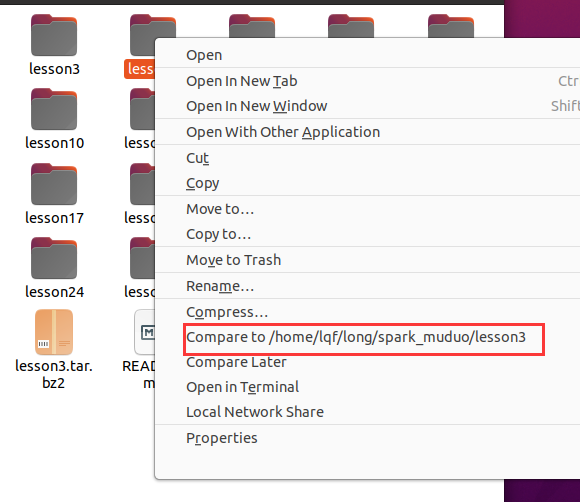

# Ubuntu下文件对比工具nautilus-compare


添加源

```bash
sudo add-apt-repository ppa:boamaod/nautilus-compare
sudo apt-get update
```

安装

```bash
sudo apt-get install nautilus-compare
```

<font style="color:rgb(77, 77, 77);">-安装完成后在文件或</font>[<font style="color:rgb(252, 85, 49);">文件夹</font>](https://so.csdn.net/so/search?q=%E6%96%87%E4%BB%B6%E5%A4%B9&spm=1001.2101.3001.7020)<font style="color:rgb(77, 77, 77);">上右键菜单会多一个Compare Later菜单；</font>

<font style="color:rgb(77, 77, 77);">点击菜单后，在需要比较的文件或文件夹上右击会出现Compare to /home/xx/xx菜单；</font>




> 更新: 2025-03-21 22:46:59  
> 原文: <https://www.yuque.com/linuxer/gscfv1/yrah2y7tdv74othx>