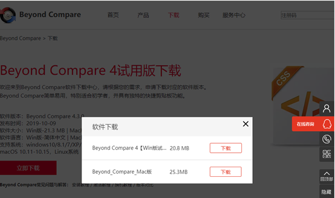
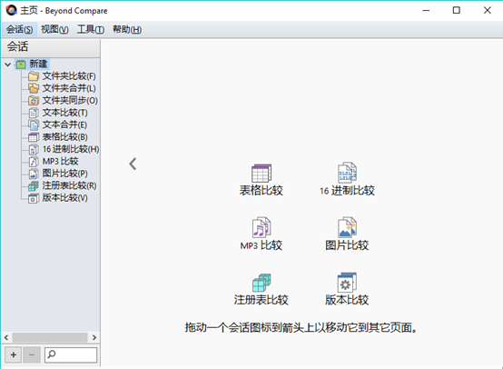
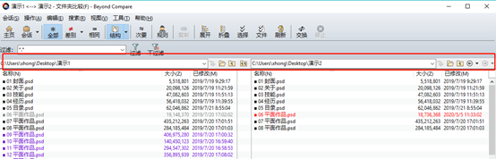
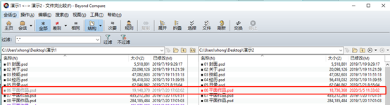
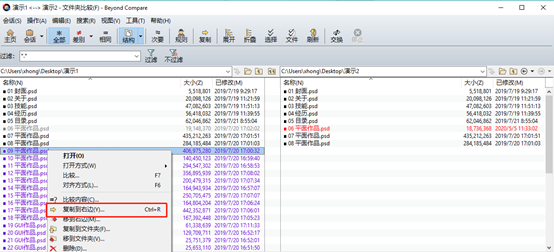
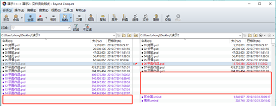

# 6.beyond compare

老廖提供主流C/C++就业课程服务：

1. C/C++通用后台开发
2. 音视频开发
3. QT开发
4. 游戏开发

等课程，包括视频教学、资料代码、课程答疑、简历指导、面试复盘等服务，详情咨询**微信laoliao6668**

****

使用它可以很方便地对比出两个文件夹或文件的不同之处。很大程度上提高校对的准确率。但是一些初级使用者可能对Beyond Compare不是很了解，不知道该如何使用。所以今天小编准备通过六个步骤快速讲解Beyond Compare软件的使用方法。

第一步：下载Beyond Compare软件

根据自己电脑的操作系统选择适合的版本，目前Win版本的Beyond Compare 4为简体中文版，而Mac版为英文版。

[Beyond Compare Mac](https://www.macw.com/mac/124.html?id=MzAyODgyJl8mMjcuMTg2LjEzLjgz)

[Beyond Compare win](https://soft.macxf.com/?id=Mjk1ODM%3D)

图1：下载页面

第二步：安装Beyond Compare软件

安装过程比较简单，运行安装文件包，根据安装提示依次完成即可。安装完成运行软件，主页上可以发现该软件除了对比文件之外，还可以进行表格比较、16进制比较、Mp3比较、图片比较、注册表比较等，只需要把对应的文件拖入对比框就行，可见Beyond Compare功能之强大。

图2：Beyond Compare的主界面

第三步：文件夹对比

首先确认好我们需要对比的两个文件夹，里面的文件有相同，也有不同的。点击主界面的文件夹对比会跳转至对比对话框，单击输入路径框后的文件夹图标分别导入两个文件夹。

页面对比左右两侧可以清晰看到有几种不同的颜色显示，黑色、紫色和红色。其中黑色代表两侧相同的文件，紫色代表左侧有而右侧没有的文件，红色代表两边都有，但不是完全相同的文件。

图3：导入文件夹对比页面

第四步：文件修改后也会显示差异

如果两个文件夹中都有相同文件，编辑之后忘记编辑了其中的哪个文件，也可以利用Beyond Compare软件来解决，点击菜单栏的刷新按钮之后，对比界面中文件也随之有所变化，被修改后的文件名颜色会变成红色，未被编辑的文件名也会变浅，而且可以清晰地看出两者区别在于编辑时间的不同。

图4：同一文件不同颜色

第五步：同步文件到另一文件夹

   上文中也提到了在左侧有而右侧没有该文件的情况下，颜色会呈紫色。有时候需要把该文件复制到另外一个文件夹中，之前一般是在文件夹中找到该文件后复制到另一个文件夹中。但使用Beyond Compare软件，只需要点击该紫色文件，右键弹出对话框选择复制到右侧即可。

图5：复制文件到另一侧

第六步：文件逐行对比

清楚地了解了文件不同的显示颜色之外，还可以通过界面显示快速看出不同之处，因为在Beyond Compare中进行文件对比是逐行对比的，只有左右两侧文件的位置和内容完全一样，才会显示为黑色，否则就是红色。如果是一侧有儿另一侧没有的文件，没有文件的那一侧也会留行，如下图6中所示。

图6：文件逐行对比

 关于Beyond Compare软件的使用小编就介绍到这里了，还有更多内容可以登陆[Beyond Compare中文网站](https://www.beyondcompare.cc/chanpin.html)访问了解，比如文件夹同步，文本合并以及其他类型文件对比等。可以下载自己操作试试哦！

                        

原文链接：[https://blog.csdn.net/2301_77962762/article/details/134162003](https://blog.csdn.net/2301_77962762/article/details/134162003)

> 更新: 2024-04-19 21:26:54  
> 原文: <https://www.yuque.com/linuxer/gscfv1/efb2k9bq6gnfhlz2>