# 7.everything

文件查找利器

老廖提供主流C/C++就业课程服务：

1. C/C++通用后台开发
2. 音视频开发
3. QT开发
4. 游戏开发

等课程，包括视频教学、资料代码、课程答疑、简历指导、面试复盘等服务，详情咨询**微信laoliao6668**

Everything一个本地文件文件搜索神器，是Windows的必装软件之一，使用Windows自带的文件搜索往往需要几十秒或者更长时间，还不一定能找到想要的文件

使用Everything只需要输入文件名字不到半秒结果就能麻烦呈现，输入需要查找的文件名即可获取结果，这是最简单也是最常用的使用方式

Everything其实还拥有很多实用的小技巧，最软库告诉你如何高效的使用Everything这款文件搜索神器

# 1.限定文件夹
我要搜索一个文件，却发现搜出来的文件有成百上千个，还是没办法快速找到我想要的文件，但我知道它是被放到D盘的下载文件夹，这时就可以在前边先输入它的路径加一个空格再输入文件名，这样就可以只搜索某个文件夹的内容

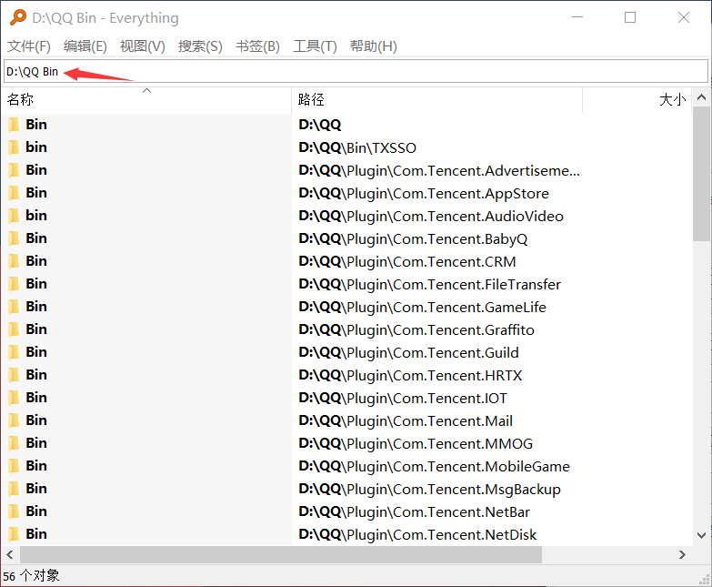

除了限定只搜索某个文件夹，还可以在文件夹路径前加一个英文感叹号，这样Everything就会在搜索时，排除掉这个文件夹中的内容，或者在设置的“排查搜索”选项中，永久排除掉某个文件或者文件夹的搜索

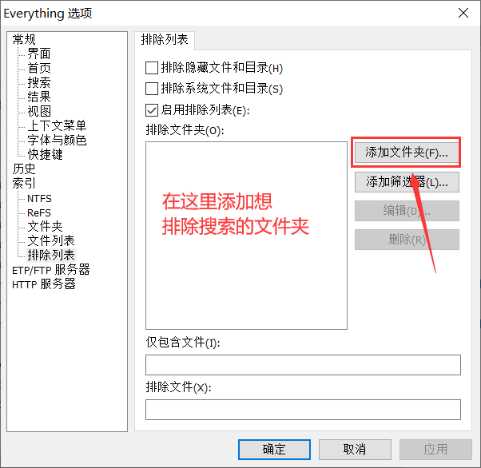

# 2.运算符
上面提到的英文感叹号其实是程序中常用的非运算符，表达否定的意思。类似的Everything中还有另外两个预算符与和或。我们在搜索框中输入abc空格123，此时会触发与，Everything会搜索文件名中包含abc和123的文件

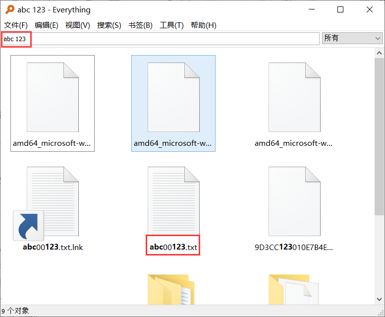

输入abc | 123会触发或，只要文件名中包含 abc 或 123 中的任意一个就会被搜索出来

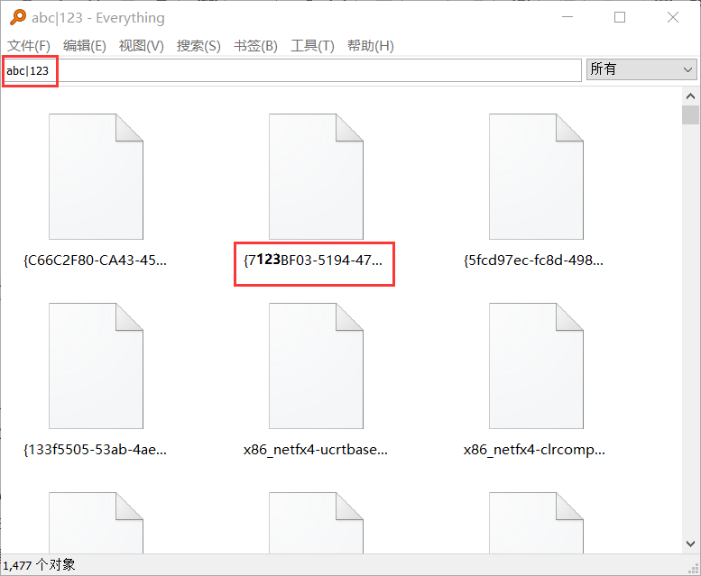

# 3.限制格式
我们可以在上方的搜索选项中限制搜索的格式，包括音频、压缩文件、文档等七种，但这些远远不能包含常用的所有格式

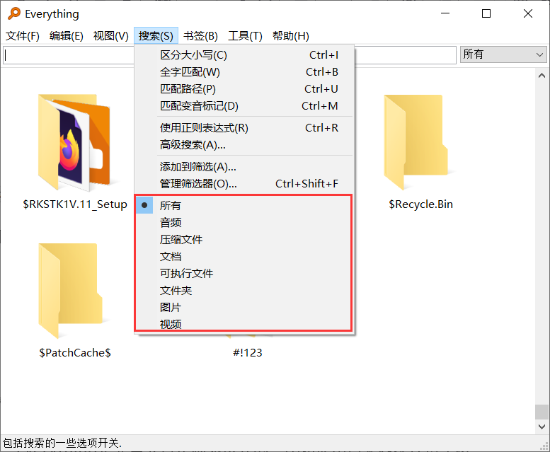

所以我们现在想要搜索一个apk文件，那要怎么搜呢？可以先输入文件的名字，敲一个空格，再输入 *.apk 这样就能搜出来符合条件的所有APK文件

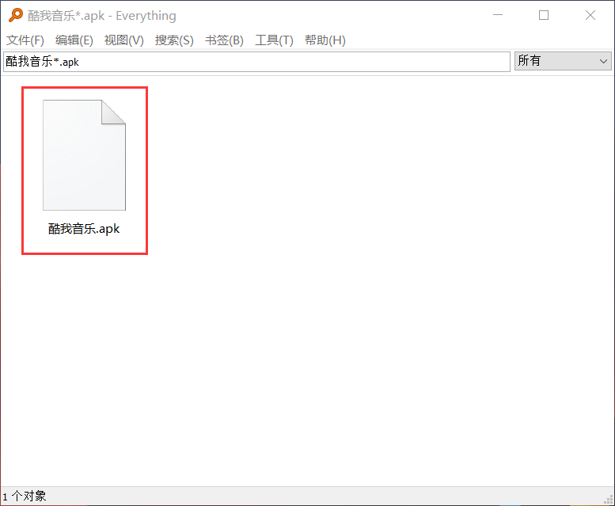

我们也可以把它和运作符一起用，比如说我想搜一张jpg格式或者png格式名称中包含abc的图片可以输入abc空格*.jpg|*.png

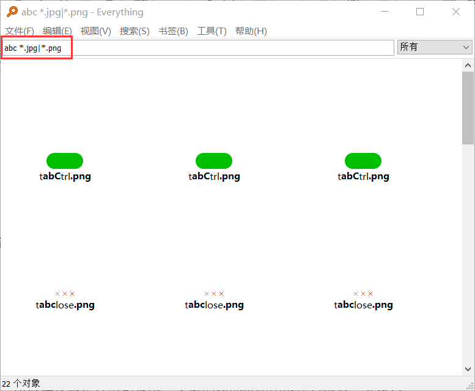

# 4.高级搜索语法
如果你用过正则表达式，一定很熟悉上面的写法。事实上，Everything是完全支持正则表达式的，比如使用 . 来匹配任意字符，使用中括号a-z表示a到z之间所有的字符，你可以在帮助正则表达式语法中看到他们。

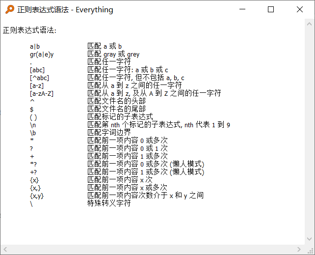

同样的，在帮助中还有另外两个特殊的形式，搜索语法和命令行选项。

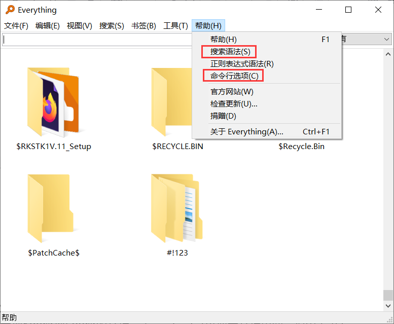

在搜索语法中，我感觉比较有用的是file folder size content等

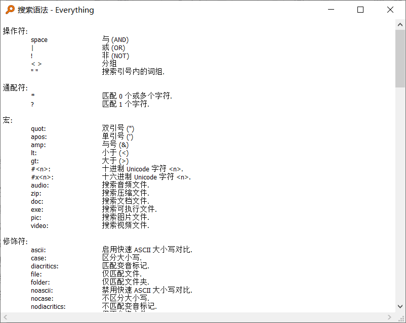

输入file冒号，再输入文件名，可以只搜索文件，folder冒号可以只搜索文件夹size可以限制文件的大小，比如先输入文件名，再输入size冒号，大于500MB可以只搜索大于500兆的文件。输入size冒号100MB-500MB可以搜索到100兆到500兆的文件，而content可以搜索文件内容，但因为没有索引会比较慢，所以建议限定好搜索范围，类似的修饰符和函数还有很多，大家可在帮助中查看

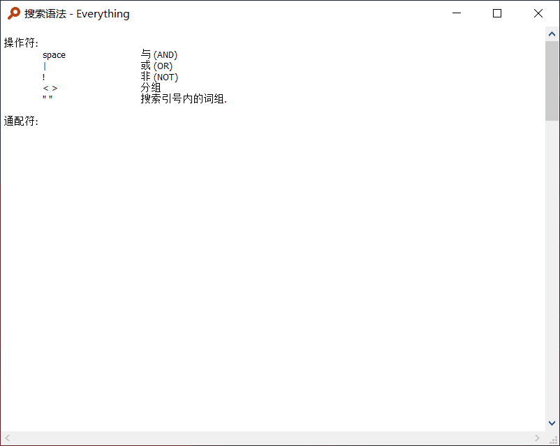

并且前面提到的所有语法都是可以一起使用的，你可以按需求把它们任意组合来更加精准的搜索。

# 5.服务器
除了搜索上的功能，Everything还可以配置服务器。比如我们在设置中开启HTTP服务器

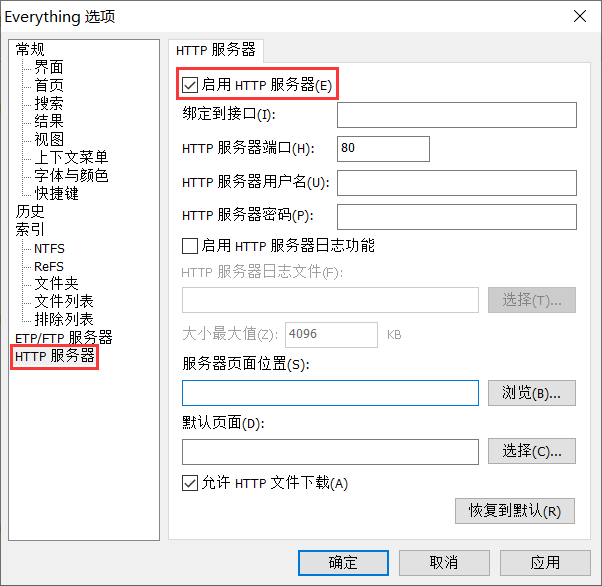

之后，在同一个网络下其他设备的浏览器里输入这台电脑的IP地址，可以打开一个网页，然后我们就可以在这个网页搜索和下载文件了

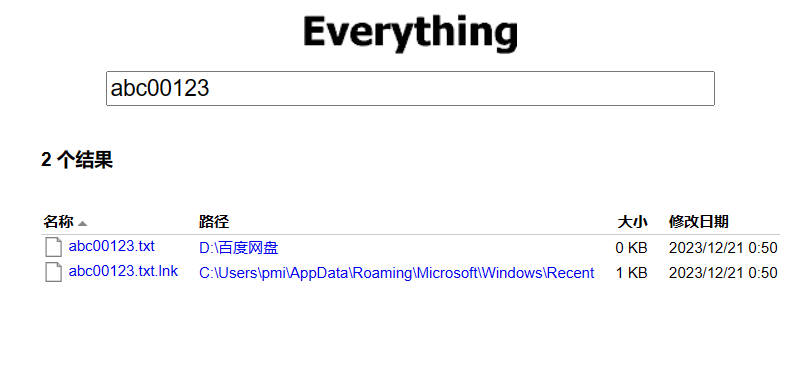

但需要注意的是，设置的时候一定要填写用户名和密码，保证安全。

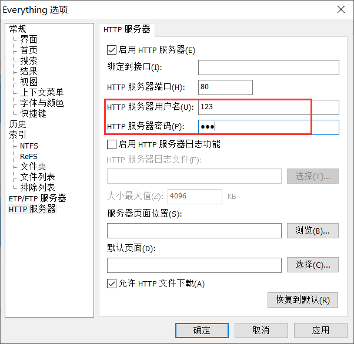

在设置里开启EP服务器

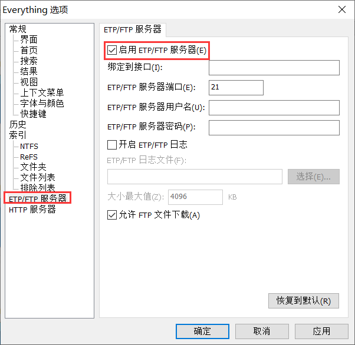

然后就可以在其他设备的everything里进行连接。管理搜索文件。

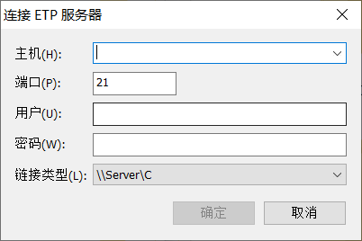

# 6.批量重命名
我们在everything中选中多个文件，然后选择重命名，可以对文件批量重命名，它同样支持各种语法，比Windows自带的重命名更好用

# 7 总结Everything 功能特色
1.可以快速索引并搜索计算机上存储的所有文件和文件夹，搜索结果准确、快速。

2.具有小巧、便捷的特点，安装文件非常小，并且使用非常简单。

3.采用实时更新技术，搜索结果在创建或修改文件时立即更新，这意味着搜索结果永远是最新的。

4.不仅支持基本的文件名搜索，还支持高级文件名搜索，如通配符（*和？）、正则表达式等搜索方式，可以快速定位需要的文件。

5.用户可以使用多种条件设置过滤器，以限制搜索结果的范围，例如按文件类型、大小、日期等属性过滤。

6.支持多种排序方式，比如按名称、大小、日期等标准排序，还支持自定义排序方式。

7.可以通过LAN（局域网）搜索其他网络计算机上的文件，支持对共享文件夹的搜索和管理。

8.可以轻松地分享文件和文件夹给他人，只需要将搜索结果复制到剪贴板即可。

9.支持多种外观设置，例如修改字体、颜色等，同时也支持多种语言和插件扩展。

10.还支持多种搜索方式，包括模糊搜索、全词搜索、大小写敏感搜索等。

11.可以通过自动运行功能，使 Everything 开机自动启动并开始索引文件，以便更快地进行搜索。

12.可以快速访问最近使用的文件和文件夹，同时还可以收藏最常用的文件和文件夹。

13.用户可以使用JavaScript编写脚本，并在 Everything 中执行，从而实现更高级的搜索和过滤功能。

14.能够记录用户的搜索历史，可以随时查看和编辑之前的搜索请求。

15.支持许多插件，用户可以根据需要安装和配置插件来实现更多的功能，如复制文件路径、打开 CMD 窗口等等。

16.提供了交互式的界面设计工具，可视化设计规则来过滤搜索结果。

17.内置文件浏览器，可以直接查看和操作搜索结果中的文件，避免了打开资源管理器的繁琐操作。

                          

                        

参考地址：[https://blog.csdn.net/zuiruanku/article/details/136247151](https://blog.csdn.net/zuiruanku/article/details/136247151)

> 更新: 2024-04-19 21:44:26  
> 原文: <https://www.yuque.com/linuxer/gscfv1/xuwqe71awpr5w3d7>