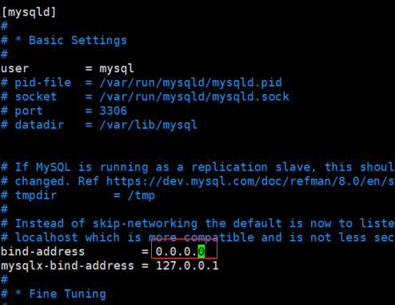

# MySQL 8 允许外网连接mysql

<font style="color:#DF2A3F;">Darren：云服务器的mysql允许外部网络比较容易被攻击，一定要注意风险。 </font>

<font style="color:#DF2A3F;"></font>

<font style="color:rgb(77, 77, 77);">在MySQL 8中允许外网连接，你需要完成以下几个关键步骤：</font>

# <font style="color:rgb(79, 79, 79);">1. 修改MySQL用户权限：</font>
<font style="color:rgb(77, 77, 77);">确保数据库用户拥有远程访问的权限。例如，创建一个新用户或修改现有用户的权限，允许从任意IP地址进行连接：</font>

```bash
#第一种方法
#连上mysql
CREATE USER 'your_user'@'%' IDENTIFIED WITH mysql_native_password BY 'your_password';
GRANT ALL PRIVILEGES ON *.* TO 'your_user'@'%';
FLUSH PRIVILEGES;


#第二种方法

mysql> use mysql;
Reading table information for completion of table and column names
You can turn off this feature to get a quicker startup with -A
Database changed

mysql> update user set host='%' where user='root';    更改主机
Query OK, 1 row affected (0.00 sec)
Rows matched: 1  Changed: 1  Warnings: 0

mysql> flush privileges;    //刷新
Query OK, 0 rows affected (0.00 sec)

mysql> grant select on test.* to root;  //授权成功
Query OK, 0 rows affected (0.00 sec)


```

如果已有用户需要更新权限，则可以只运行第二条命令。


# 2. 配置MySQL服务监听所有网络接口：
检查MySQL配置文件（通常是 /etc/mysql/my.cnf 或 /etc/my.cnf或 /etc/mysql/mysql.conf.d/mysqld.cnf），确认 bind-address 设置正确：

 

```bash
[mysqld]
...
bind-address = 0.0.0.0
...

```

<font style="color:rgb(77, 77, 77);">这会使得MySQL服务器监听所有网络接口，包括来自公网的请求。</font>

<font style="color:rgb(77, 77, 77);"></font>

<font style="color:rgb(77, 77, 77);">Darren：比如我修改的是</font>vim  /etc/mysql/mysql.conf.d/mysqld.cnf




这将允许MySQL接受来自所有IP地址的连接。

保存并关闭配置文件。

重新启动MySQL服务，使更改生效。使用适合您的操作系统的命令：

```bash
sudo service mysql restart
```

或

```bash
sudo systemctl restart mysql
```


现在，root用户应该具有外网访问权限。请注意，出于安全考虑，授予root用户远程访问权限可能会有风险。出于安全原因，建议使用具有更严格访问权限的用户，并限制远程访问仅限于需要的IP地址。

 

# <font style="color:rgb(79, 79, 79);">3. 开启防火墙端口：</font>
<font style="color:#DF2A3F;">（这里Ubuntu不用操作，Ubuntu已经默认关闭防火墙）</font>

<font style="color:rgb(77, 77, 77);">对于Linux服务器上的防火墙，比如使用iptables，允许外部通过3306端口连接到MySQL：</font>

```bash
sudo iptables -A INPUT -p tcp --dport 3306 -j ACCEPT
sudo iptables-save # (持久化iptables规则)
# 如果你使用的是firewalld防火墙
sudo firewall-cmd --permanent --add-port=3306/tcp
sudo firewall-cmd --reload

```

如果是<font style="color:#DF2A3F;">云服务器环境如AWS、Azure等</font>，还需要在控制台的安全组设置中为实例添加一条入站规则，<font style="color:#DF2A3F;">开放3306端口。</font>


# 4. 安全考虑：
允许外网连接MySQL可能会增加安全风险。强烈建议仅对特定IP范围开放访问，并启用SSL加密以保护数据传输安全。另外，定期审计和更新密码策略也很重要。


# 5. 重启MySQL服务：
应用以上更改后，请重启MySQL服务以使配置生效：

 

```bash
sudo systemctl restart mysql
#或者
sudo service mysqld restart

```

# 6. 远程连接报错：


用root 连接不上，可以新建一个用户，用新用户连接。

```bash
mysql> use mysql;
mysql> select host,user,plugin from user;
+-----------+------------------+-----------------------+
| host      | user             | plugin                |
+-----------+------------------+-----------------------+
| %         | root             | auth_socket           |
| %         | tusi             | mysql_native_password |
| localhost | debian-sys-maint | caching_sha2_password |
| localhost | mysql.infoschema | caching_sha2_password |
| localhost | mysql.session    | caching_sha2_password |
| localhost | mysql.sys        | caching_sha2_password |
+-----------+------------------+-----------------------+
6 rows in set (0.00 sec)


#添加新user，比如darren，密码为123456
mysql> CREATE USER 'darren'@'%' IDENTIFIED WITH mysql_native_password BY '123456';
#赋权
mysql> GRANT ALL PRIVILEGES ON *.* TO 'darren'@'%' WITH GRANT OPTION;
mysql> FLUSH PRIVILEGES;
```


完成这些步骤后，你的MySQL 8数据库应该可以从外网进行连接了。但请注意，生产环境中务必采取严格的安全措施来防止未授权访问。

————————————————

                        

原文链接：[https://blog.csdn.net/iteye_10392/article/details/135983265](https://blog.csdn.net/iteye_10392/article/details/135983265)


> 更新: 2024-08-26 21:28:19  
> 原文: <https://www.yuque.com/linuxer/gscfv1/cy79cpz4osrv3xlo>