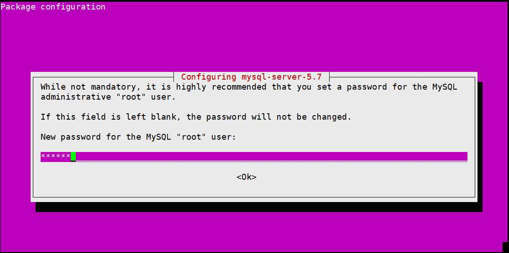
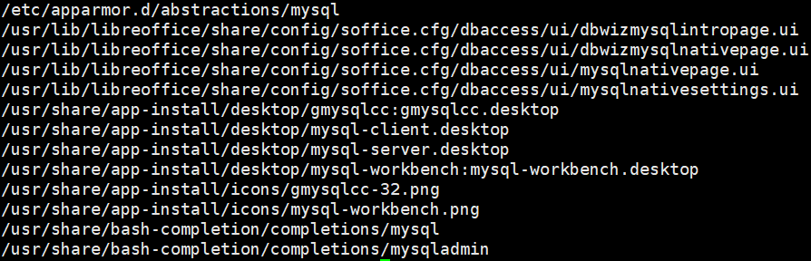
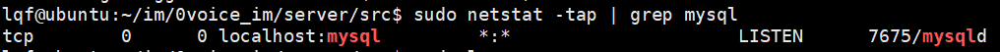

# ubuntu16.04/18.04/20.04安装MySQL

# 1 安装mysql


1. **安装mysql服务器端**

```bash
sudo apt-get -y install mysql-server
```

  
**如果是****<font style="color:#DF2A3F;">ubuntu18.04/20.04则不会提示输入密码，默认是没有密码</font>**  
配置root权限密码，然后按ok，根据提示再次输入密码即可  
  


2. **安装mysql客户端**

```bash
sudo apt-get -y install mysql-client
```

3. **安装mysql模块**

```bash
sudo apt-get -y install libmysqlclient-dev
```


4. **验证是否成功**

```bash
sudo netstat -tap | grep mysql
```

  
看到	  
或者用lsof查看数据库默认端口3306

```bash
sudo lsof -i:3306
```

看到

****

# 2 进入mysql
ubuntu16.04可以使用之前设置的密码进入，但是Ubuntu18.04和Ubuntu20.04都没有设置密码（需要进入厚后再设置密码，而且Ubuntu18.04和Ubuntu20.04设置密码方式又不一样）。

## ubuntu16.04
如果是**ubuntu16.04**直接输入安装时设置的密码

```bash
mysql -u root -p
```


## ubuntu18.04
如果是**ubuntu18.04**则以无密码的方式登录进去然后设置密码，**就得是在root权限下，比如加上sudo**

```plain
sudo mysql -u root -p 直接按回车登录然后设置密码
mysql>use mysql;   然后敲回车(注意下面字母的大小写)
#  更新 plugin 及 authentication_string 字段，比如密码123456
mysql> UPDATE user SET plugin="mysql_native_password", authentication_string=PASSWORD("123456") WHERE user="root";
#　输出以下结果
Query OK, 1 row affected, 1 warning (0.00 sec)
Rows matched: 1  Changed: 1  Warnings: １
 
＃ 保存更新结果
mysql> FLUSH PRIVILEGES;
# 退出并重启 mysql
mysql> exit;
sudo service mysql restart
```


**需要特别注意的是ubuntu18.04版本在操作数据库的时候需要sudo权限**

## <font style="color:#DF2A3F;">Ubuntu20.4 </font>
注意：**<font style="color:#DF2A3F;">Ubuntu20.4 的设置密码和16.04、18.04又不一样</font>**：

1. **<font style="color:rgb(77, 77, 77);">开始配置：</font>**

```plain
sudo mysql_secure_installation
```


```plain
...
# 1.询问是否安装密码插件，我选择 No
VALIDATE PASSWORD COMPONENT can be used to test passwords
and improve security. It checks the strength of password
and allows the users to set only those passwords which are
secure enough. Would you like to setup VALIDATE PASSWORD component?
Press y|Y for Yes, any other key for No: n

# 2.为root用户设置密码，不一定提示这个，特别强调不一定提示这个，如果不提示等会再通过mysql无密码进入配置
Please set the password for root here.

New password: 

Re-enter new password: 
#2.1 解决方法详见下一小节，解决bug
 ... Failed! Error: SET PASSWORD has no significance for user 'root'@'localhost' as the authentication method used doesn't store authentication data in the MySQL server. Please consider using ALTER USER instead if you want to change authentication parameters.

# 2.2 解决bug后，重新设置密码
New password: 

Re-enter new password: 

#3.删除匿名用户，我选No
By default, a MySQL installation has an anonymous user,
allowing anyone to log into MySQL without having to have
a user account created for them. This is intended only for
testing, and to make the installation go a bit smoother.
You should remove them before moving into a production
environment.

Remove anonymous users? (Press y|Y for Yes, any other key for No) : n

 ... skipping.

#4.禁止root管理员从远程登录，这里我选 No
Normally, root should only be allowed to connect from
'localhost'. This ensures that someone cannot guess at
the root password from the network.

Disallow root login remotely? (Press y|Y for Yes, any other key for No) : n

 ... skipping.
 
 #5.删除test数据库并取消对它的访问权限， 我选 No
By default, MySQL comes with a database named 'test' that
anyone can access. This is also intended only for testing,
and should be removed before moving into a production
environment.


Remove test database and access to it? (Press y|Y for Yes, any other key for No) : n

 ... skipping.
 
 #6.刷新授权表，让初始化后的设定立即生效, 选 Yes
Reloading the privilege tables will ensure that all changes
made so far will take effect immediately.

Reload privilege tables now? (Press y|Y for Yes, any other key for No) : y
Success.

All done! 

```


 解决配置MySQL中的bug（在上述操作中如果有问题，比如报错Failed! Error: SET PASSWORD has no significance for user ‘root’@‘localhost’ as the authentication me）

<font style="color:#DF2A3F;">或者不提示输入root密码，则无密码登录msyql，使用命令：</font>

```plain
sudo mysql
```

进入控制台后，修改密码 ，注意改成自己的密码

```plain
# 修改 root密码：ALTER USER 'root'@'localhost' IDENTIFIED WITH mysql_native_password BY 'your_password';
#比如把密码设置为123456
ALTER USER 'root'@'localhost' IDENTIFIED WITH mysql_native_password BY '123456';
```

然后输入 exit 退出 


退出后再使用

mysql -uroot -p  

根据提示输入刚才配置的密码。

  

## ubuntu24.04
和ubuntu20.04一样


 

# 3 启动/停止/重启mysql
常用命令，这里不是让大家关闭mysql，只是告知有这么些命令。

> service mysql start //启动mysql
>
> service mysql restart //重新启动mysql
>
> service mysql stop //关闭mysql
>


# <font style="color:rgb(38, 38, 38);">4 MySQL 如何允许外网连接mysql</font>
 建议新建一个账号。

用root 连接不上，可以新建一个用户，用新用户（比如darren）连接。

```plain
# 选择数据库并回车
mysql> use mysql;

mysql> select host,user,plugin from user;
+-----------+------------------+-----------------------+
| host      | user             | plugin                |
+-----------+------------------+-----------------------+
| localhost | debian-sys-maint | caching_sha2_password |
| localhost | mysql.infoschema | caching_sha2_password |
| localhost | mysql.session    | caching_sha2_password |
| localhost | mysql.sys        | caching_sha2_password |
| localhost | root             | mysql_native_password |
+-----------+------------------+-----------------------+
6 rows in set (0.00 sec)


#添加新user，比如darren，密码为123456， 可以改成自己的名字
mysql> CREATE USER 'darren'@'%' IDENTIFIED WITH mysql_native_password BY '123456';
#赋权，注意用户名是刚才新增的
mysql> GRANT ALL PRIVILEGES ON *.* TO 'darren'@'%' WITH GRANT OPTION;
mysql> FLUSH PRIVILEGES;
```


# 意外情况需要重装mysql-这里是意外才用
**移除当前的MySQL**

sudo apt-get remove --purge mysql-server mysql-client mysql-common -y

sudo rm -rf /etc/mysql /var/lib/mysql

sudo apt-get autoremove -y

sudo apt-get autoclean

 

**# 更新包管理器索引**

sudo apt-get update

**然后重新按照教程安装。**


> 更新: 2025-06-20 15:16:48  
> 原文: <https://www.yuque.com/linuxer/gscfv1/zluaxzzh98lrgy25>