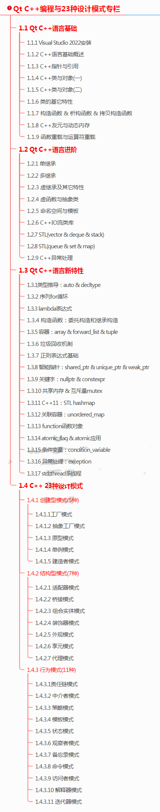
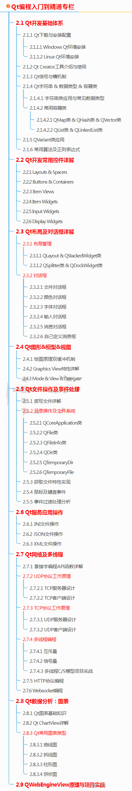
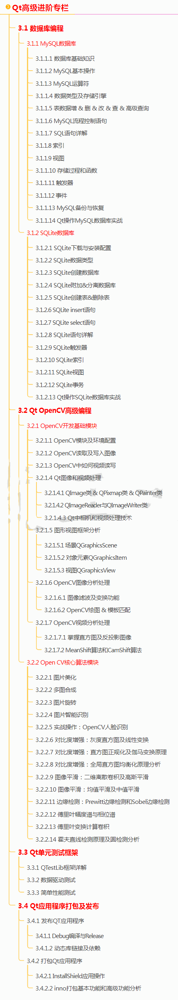
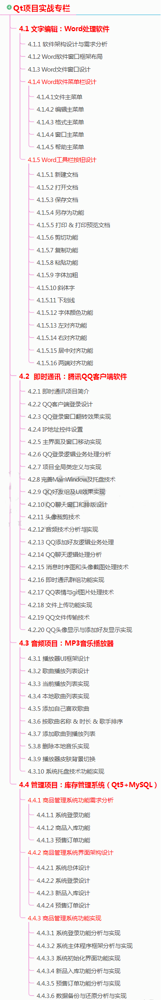

# QT方向

Qt 是一个强大的跨平台 C++ 图形用户界面应用程序开发框架，在桌面应用程序、移动应用程序和嵌入式系统等领域广泛应用。如果你对 Qt 感兴趣并想要学习它，以下是一份推荐的学习路线：

# 1. 基础知识学习
+ 学习 C++ 编程语言，掌握基本的编程概念和语法。
+ 了解面向对象编程（OOP）的基本原则和设计模式。

# 2. 安装和配置 Qt 
+ 下载并安装 Qt 开发环境，熟悉 Qt Creator 集成开发环境（IDE）。
+ 按照说明安装 Qt 开发环境，从官方网站下载适合你操作系统的 Qt 版本。

# 3. Qt 核心概念
+ 掌握 Qt 的核心概念，如信号与槽机制、窗口部件、布局管理等。
+ 理解信号与槽机制，用于组件之间的通信。
+ 学习 Qt 的布局管理，使界面布局更加灵活和美观。

# 4. 可视化设计
学习使用 Qt 的可视化设计工具，如 Qt Designer，来创建用户界面。

了解 Qt 的风格和主题，美化应用程序的外观。

学习常见的 GUI 设计模式和最佳实践。 通过按照这个学习路线逐步深入学习，你将能够掌握 Qt 开发所需的基本知识和技能，从而能够构建出功能强大、界面美观的应用程序。

# 5.实践案例
建议通过实际项目应用来巩固学习成果。例如可以尝试开发一些简易程序如计算器、闹钟等来将学到的理论知识应用于实践。学习文件操作、数据库访问、网络编程等基础应用程序功能，掌握 Qt 多线程编程以提高应用程序性能和响应度。必要时可学习将应用程序部署到不同操作系统平台，参与开源或个人项目以积累项目经验。

#  
# 6.阅读官方文档和教程
Qt 的官方文档和教程是学习 Qt 的重要资源，提供了详细的信息和示例。建议经常参考官方文档以深入了解各个模块和功能的使用方法，并不断实践和尝试新技术以拓宽技术视野。

# 7 QT开源项目推荐
+ **ProjectTox-Qt-GUI - 简版 IM**：简单版本的即时通讯应用，可作为 IM 应用的基础示例进行学习。
+ **qTox - IM 客户端**：功能强大的即时通讯客户端，可作为 IM 应用开发的参考。
+ **Clementine Music Player**：功能完善且跨平台支持做得很好的音乐播放器，具有较高的完成度，对于跨平台项目开发有参考价值。
+ **nitroshare-desktop - 网络文件传输客户端**：实现网络文件传输功能的客户端应用，可用于学习网络文件传输的相关技术。
+ **QFramer - UI 封装（国人作品）**：对 Qt 的 UI 进行了封装，提供了一些自定义的功能和组件，方便 UI 开发
+ **JQTools - Jason Qt Tools 的简称**：可能包含一些特定的 Qt 工具或功能集合
+ **QWidgetDemo**：包含了用 Qt 编写的一些开源 demo，预计会有 100 多个，一直持续更新完善，代码简洁易懂注释详细，每个都是独立项目，非常适合初学者，代码可随意传播使用。
    - 地址：[https://gitee.com/feiyangqingyun/qwidgetdemo](https://gitee.com/feiyangqingyun/qwidgetdemo)
+ **VNote**：基于 Qt 的免费开源笔记软件，适合寻找跨平台笔记解决方案的用户。
    - 地址：[https://github.com/vnotex/vnote](https://github.com/vnotex/vnote)
+ **Qt-Advanced-Stylesheets**：有丰富的主题样式表。
    - 地址：[https://github.com/githubuser0xffff/qt-advanced-stylesheets](https://github.com/githubuser0xffff/qt-advanced-stylesheets)

> 更新: 2024-08-21 12:12:49  
> 原文: <https://www.yuque.com/linuxer/gscfv1/vfvf00wy5swudgpu>