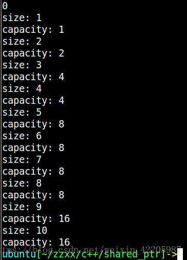
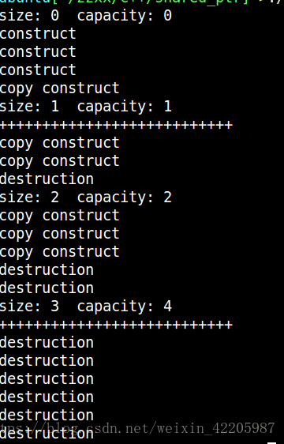

# 19.vector的原理，怎么扩容

# 19.vector的原理，怎么扩容


**扩容原理概述**  
新增元素：Vector通过一个连续的数组存放元素，如果集合已满，在新增数据的时候，就要分配一块更大的内存，将原来的数据复制过来，释放之前的内存，在插入新增的元素；  
对vector的任何操作，一旦引起空间重新配置，指向原vector的所有迭代器就都失效了 ；  
初始时刻vector的capacity为0，塞入第一个元素后capacity增加为1；  
不同的编译器实现的扩容方式不一样，VS2015中以1.5倍扩容，GCC以2倍扩容。  
**GCC下测试**


```plain
#include<iostream>
#include<vector>

using namespace std;

int main()
{
    vector<int> vec;
    cout << vec.capacity() << endl;
    for (int i = 0; i<10; ++i)
    {
        vec.push_back(i);
        cout << "size: " << vec.size() << endl;
        cout << "capacity: " << vec.capacity() << endl;
    }

    return 0;

}
```


输出结果：





从这里我认为vector的初始的扩容方式代价太大,初始扩容效率低， 需要频繁增长，不仅操作效率比较低，而且频繁的向操作系统申请内存容易造成过多的内存碎片，所以这个时候需要合理使用resize()和reserve()方法提高效率减少内存碎片的，  
**resize()**


1.  resize方法被用来改变vector中元素的数量，我们可以说，resize方法改变了容器的大小，且创建了容器中的对象； 
2.  如果resize中所指定的n小于vector中当前的元素数量，则会删除vector中多于n的元素，使vector得大小变为n；容量不会变（capacity） 
3.  如果所指定的n大于vector中当前的元素数量，小于capacity容量值，则会在vector当前的尾部插入适量的元素，使得vector的大小变为n，在这里，如果为resize方法指定了第二个参数，则会把第二个参数值初始化为该指定值，如果没有为resize指定第二个参数，则会初始化为默认的初始值 0；容量不会变（capacity） 
4.  如果resize所指定的n不仅大于vector中当前的元素数量，还大于vector当前的capacity容量值时，则会自动为vector重新分配存储空间； 容量会变（capacity） 


```plain
 当之前的size*2小于resize时，容量为resize的大小
 当之前的size*2大于resize时，容量为size*2
```


```plain
#include<iostream>
#include<vector>

using namespace std;

int main()
{
    vector<int> vec;
    cout << vec.capacity() << endl;
    for (int i = 0; i<6; ++i) //之前的容量为6    *2 = 12
    {
        vec.push_back(i+1);
        cout << "size: " << vec.size() << endl;
        cout << "capacity: " << vec.capacity() << endl;
    }
    for(int i = 0; i < vec.size(); i++)
    {
        cout << vec[i] << endl;
    }
    vec.resize(9);//  resize= 9
    for(int i = 0; i < vec.size(); i++)
    {
        cout << vec[i] << endl;
    }
    cout << "size: " << vec.size() << endl;
    cout << "capacity: " << vec.capacity() << endl;  容量=12
    return 0;
}
```


输出结果：


```plain
0
size: 1
capacity: 1
size: 2
capacity: 2
size: 3
capacity: 4
size: 4
capacity: 4
size: 5
capacity: 8
size: 6 //size = 6
capacity: 8
1
2
3
4
5
6
1
2
3
4
5
6
0
0
0
size: 9
capacity: 12
```


**reserve():**


1. reserve方法被用来重新分配vector的容量大小；
2. 只有当所申请的容量大于vector的当前容量时才会重新为vector分配存储空间；重新分配后的容量即reserve大小，size大小没有变，所以不会产生新的对象
3. 小于当前容量则没有影响,size、capacity都没有影响
4. reserve方法对于vector元素大小没有任何影响，不创建对象。


**vector中数据的随机存取效率很高**  
O(1)的时间的复杂度，但是在vector 中随机插入元素，需要移动的元素数量较多，效率比较低


```plain
#include <iostream>
#include <vector>
using namespace std;

class A
{
public:
    A()
    { 
    	cout << "construct" << endl; //构造函数
    }
    A(const A &a)
    { 
    	cout << "copy construct" << endl; //拷贝构造函数
    }
    ~A()
    { 
    	cout << "destruction" << endl; //析构函数
    }
};

int main(void)
{
    vector<A> p;
    cout <<"size: "<<p.size() << "  "<<"capacity: "<< p.capacity()<< endl;//size = 0 capacity=0
    A a;//调用构造函数
    A b;//调用构造函数
    A c;//调用构造函数
    p.push_back(a);//调用拷贝构函数放入p中
    cout <<"size: "<<p.size() << "  "<<"capacity: "<< p.capacity()<< endl;//size=1 capacity=1
    cout << "+++++++++++++++++++++++++++\n";
    p.push_back(b);//容量不够 扩容成2倍 将原来的a拷贝构造到新的位置 将b拷贝构造到新的位置 析构原来位置的a
    cout <<"size: "<<p.size() << "  "<<"capacity: "<< p.capacity()<< endl;//size=2 capacity=2
    p.push_back(c);//容量不够 扩容2倍 将a、b分别拷贝构造到新的位置 将c拷贝构造到新的位置 析构原来位置的a、b
    cout <<"size: "<<p.size() << "  "<<"capacity: "<< p.capacity()<< endl;//size=3 capacit=4
    cout << "+++++++++++++++++++++++++++\n";
	//析构a、b、c、以及析构向量中的三个对象
}
```


输出结果：





> 更新: 2024-04-19 15:30:16  
> 原文: <https://www.yuque.com/linuxer/gscfv1/5d686602c934da8ea616f1581bfe7e07>