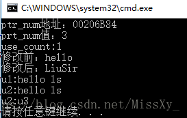

# 26.unique_ptr和shared_ptr区别

# 26.unique_ptr和shared_ptr区别


**shared_ptr 类**  
shared_ptr 允许多个指针指向同一个对象，智能指针也是模板，定义如下：


```plain
shared_ptr<string> p1;      //可以指向string
shared_ptr<list<int>> p2;   //可以指向int的list
```


智能指针的使用方式与普通指针类似，解引用一个智能指针返回它指向的对象。例如判断是否为空：


```plain
//如果p1不为空，检查它是否指向一个空string
if (p1 && p1->empty())
    *p1 = "liusir";         //如果p1指向一个空string，解引用p1，赋新值
```


**shared_ptr 和 unique_ptr 共有操作**


**shared_ptr 独有操作**


**make_shared 函数**  
最安全的分配和使用动态内存的方法是调用一个名为make_shared的标准库函数。此函数在动态内存中分配一个对象并初始化它，返回指向此对象的shared_ptr。


当要用make_shared时，必须指定想要创建的对象的类型，如下：


```plain
//指向一个值为42的int的shared_ptr
shared_ptr<int> p3 = make_shared<int>(42);
//p4指向一个值为"9999999999"的string
shared_ptr<string> p4 = make_shared<string>(10,'9');
//p5指向一个值初始化的int,值为0
shared_ptr<int> p5 = make_shared<int>();
```


也可以使用auto定义一个对象来保存make_shared的结果，更为简单：


```plain
//p6指向一个动态分配的空vector<string>
auto p6 = make_shared<vector<string>>();
```


当进行拷贝或赋值操作时，每个shared_ptr都会记录有多少个其他shared_ptr指向相同的对象：


```plain
auto p = make_shared<int>(42);      //p指向的对象只有p一个引用者
auto q(p);                         //p和q指向相同对象，此对象有两个引用者
```


我们可以认为每个shared_ptr都有一个关联的计数器，通常称其为引用计数。无论何时我们拷贝一个shared_ptr，计数器都会递增。


**unique_ptr 类**  
unique_ptr 独占所指向的对象。与shared_ptr不同，某个时刻只能有一个unique_ptr指向一个给定对象。当unique_ptr被销毁时，它所指向的对象也被销毁。


与shared_ptr不同，没有类似make_shared的标准库函数返回一个unique_ptr。所以初始化unique_ptr必须采用直接初始化形式，如下：


```plain
unique_ptr<double> p1;      //可以指向一个double的unique_ptr
unique_ptr<int> p2(new int(42));    //p2指向一个值为42的int
```


由于unique_ptr拥有它指向的对象，因此unique_ptr不支持普通的拷贝或赋值操作：


```plain
unique_ptr<string> p1(new string("hello"));
unique_ptr<string> p2(p1);          //错误：unique_ptr不支持拷贝
unique_ptr<string> p3;
p3 = p2;                           //错误：unique_ptr不支持赋值
```


**unique_ptr 独有操作**  
  
虽然我们不能拷贝或赋值unique_ptr，但可以通过调用release或者reset将指针的所有权从一个（非const)unique_ptr转移给两一个unique：


```plain
unique_ptr<string> u1(new string("hello ls"));
//将所有权从u1转移给u2;
unique_ptr<string> u2(u1.release());    //release将u1置空
unique_ptr<string> u3(new string("u3"));
//将所有权从u3转移给u2
u2.reset(u3.release());                 //reset释放了u2原来指向的内存
```


release成员返回unique_ptr当前保存的指针并将其置空。因此，u2被初始化为u1原来保存的指针，而u1被置空。


调用release会切断unique_ptr和它原来管理的对象间的联系。release返回的指针通常会被用来初始化另一个智能指针或给另一个智能指针赋值。如果我们不用另一个智能指针来保存release返回的指针，我们的程序就要负责资源的释放，如下：


```plain
auto u = u2.release();      //删除u2
delete(u);
```


**示例程序：**  
代码：


```plain
#include <iostream>
#include <memory>
#include <string>
using namespace std;
int main()
{
    shared_ptr<int> ptr_num;
    ptr_num = make_shared<int>(3);      //shared_ptr数字为3
    cout << "ptr_num地址：" << ptr_num << endl;
    cout << "prt_num值：" << *ptr_num << endl;
    cout << "use_count:" << ptr_num.use_count() << endl;        //查看计数器

    shared_ptr<string> ptrStr = make_shared<string>("hello");   //string 类型
    cout << "修改前：" << *ptrStr << endl;
    if (ptrStr && !ptrStr->empty())
    {
        *ptrStr = "LiuSir";
    }
    cout << "修改后：" << *ptrStr << endl;
    
    unique_ptr<string> u1(new string("hello ls"));
    cout << "u1:" << *u1 << endl;
    //将所有权从u1转移给u2;
    unique_ptr<string> u2(u1.release());    //release将u1置空
    cout << "u2:" << *u2 << endl;
    unique_ptr<string> u3(new string("u3"));
    //将所有权从u3转移给u2
    u2.reset(u3.release());                 //reset释放了u2原来指向的内存
    cout << "u2:" << *u2 << endl;
    
    auto u = u2.release();      //删除u2
    delete(u);
    
    return 0;

}
```


运行结果：





> 更新: 2024-04-19 15:30:26  
> 原文: <https://www.yuque.com/linuxer/gscfv1/f6bcdccaeeade302dda0ca2240ba1f0f>