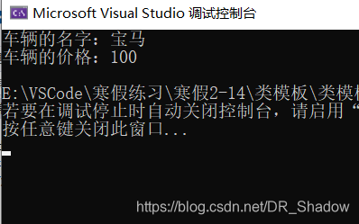
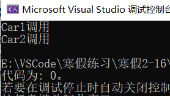
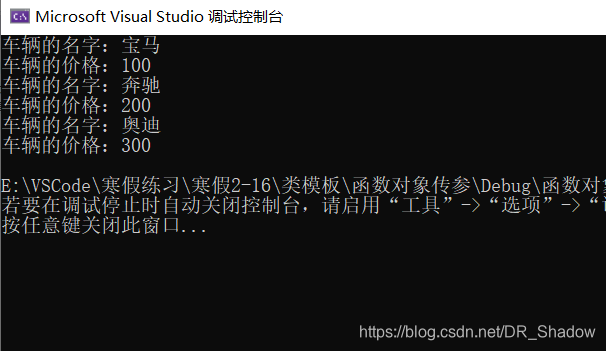

# 42.模版类的作用

# 42.模版类的作用


模板的作用我们已经知道了，类模板的作用就是建立一个可以公用的类，这个类模板里面的成员及其数据类型不用制定，同样是由一个虚拟的类型来表示的。类模板中的数据成员以及成员函数的参数和返回值都可以进行任意数据类型的选择，一个类模板定义好之后，可以减少定义声明符合该模板的类的数量。


类的使用如下：


```plain
template<class T>
类
```


由此可以看出函数模板和类模板之间的区别很简单，在template之后跟的是函数就是函数模板，跟的是类就是类模板。


来个简单的例子来看一下：


```plain
template<class nameType,class priceType>
class Car
{
public:
	Car(nameType name, priceType price)
	{
		this->C_name = name;
		this->C_price = price;
	}

	nameType C_name;
	priceType C_price;

};
```


需要多少种类型，就在尖括号<>中写入多少种类型的定义。在定义好类模板之后，要通过类模板来实例化对象：


```plain
Car<string, int> p1("宝马", 100);
```


尖括号<>中的string和int代表用到的参数类型吗，<>代表模板参数列表，就是将string和int等类型作为了参数，而“宝马”和“100”则是对象实例化后的数据成员，即string---->nameType,宝马---->name,int---->priceType，100---->price，这四个和模板中的是一一对应起来的。


下面定义一个函数将车辆的信息打印出来：


```plain
void Car<string,int>::printCar()
{
	cout << "车辆的名字：" << C_name << endl;
	cout << "车辆的价格：" << C_price << endl;
}
```


这是在类外定义，注意同样要加上尖括号<>，在类内定义则不需要，直接定义即可。整个代码如下：


```plain
#include<iostream>
#include<string>
using namespace std;

template<class nameType,class priceType>
class Car
{
public:
	Car(nameType name, priceType price)
	{
		this->C_name = name;
		this->C_price = price;
	}
	void printCar();
	nameType C_name;
	priceType C_price;
};

void Car<string,int>::printCar()
{
	cout << "车辆的名字：" << C_name << endl;
	cout << "车辆的价格：" << C_price << endl;
}
void test()
{
	Car<string, int> p1("宝马", 100);
	p1.printCar();
}

void main()
{
	test();
}
```


运行结果为：





## 1.类模板和函数模板的区别


类模板和函数模板的定义方式相近，在声明标识语句之后跟的是函数就是函数模板，跟的是类就是类模板，从上面的例子我们可以看出，类模板是没有办法自己推导出数据类型的，但是类模板在模板参数列表中可以有默认参数。


```plain
Car car1("宝马", 100); //报错
```


这样的语句是直接报错的，因为类模板没有办法进行数据类型的推导的。


```plain
template<class nameType,class priceType = int>
.
.
.
Car<string>car1("奔驰", 200);
```


模板参数列表为默认参数，因此后面的语句不会报错。整体代码如下。


```plain
#include <iostream>
using namespace std;
#include<string>
template<class nameType,class priceType = int>
class Car
{
public:

	Car(nameType name,priceType price)
	{
		this->C_name = name;
		this->C_price = price;
	}
	 
	void printCar()
	{
		cout << "车的名字是：" << C_name << endl;
		cout << "车的价格是：" << C_price << endl;
	}
	 
	nameType C_name;
	priceType C_price;

};


void test()
{
       // Car car1("宝马",100);//报错
	Car<string,int>car1("宝马", 100);
	car1.printCar();
}

void test01()
{
	Car<string>car1("奔驰", 200);//模板中有默认参数时候，尖括号的int可以省略不写
	car1.printCar();

}
void main()
{
	test();
	test01();

}
```


## 2.类模板成员函数的创建


在这里要提到的一点， 就是类模板中的成员函数在调用时候才被创建，不同于一般类中的成员函数，在一开始就可以创建。


```plain
#include<iostream>
#include<string>
using namespace std;


class Car1
{
public:
	void printCar1()
	{
		cout << "Car1调用" << endl;
	}
};

class Car2
{
public:
	void printCar2()
	{
		cout << "Car2调用" << endl;
	}
};

template<class T>
class Car
{
public:
	T m_car;

	void fun01()
	{
		m_car.printCar1();
	}
	void fun02()
	{
		m_car.printCar2();
	}

};

int main()
{
	

	return 0;

}
```


上面的代码是可以进行编译的，并且还可以通过，按照逻辑分析一波，在类模板中，我定义了一个参数m_carT，但是它的类型是T，是一个未知的数据类型，你并不知道它是Car1还是Car2的变量，问题就来了，一个未知类型的变量调用其他类中的成员函数为什么不会报错？


这是因为类模板中的成员函数只有在被调用的时候才会去创建，在未被调用的时候并不存在 ，类模板中的两个成员函数fun01和fun02都没有被调用，因此是没有被创建出来的，在这里我们如果加入一个test函数来对其进行调用，看一下是否报错：


```plain
void test()
{
	Car<Car1>car1;
	car1.fun01();
	car1.fun02();//编译不通过只要在于这一句，因为car1是Car1类型的对象
}
```


然后编译报错，因为car1是Car1类型的对象，再加上一个Car2类型的变量car2执行car2.fun02()即可通过。


```plain
void test()
{
	Car<Car1>car1;
	Car<Car2>car2;
	car1.fun01();
	car2.fun02();
}
```





## 3.类模板对象传参


类模板可以实例化的对象，如果将对象传入到函数，就是将类模板对象作为函数参数进行传参。


提到传参，我们肯定是比较熟悉的了。类模板对象作为函数参数进行传入的方式一般有三种:一、指定传入的类型，直接显示对象的数据类型；二、参数模板化，将对象中的参数变为模板进行传递；三、将整个类模板化，将对象模板化进行传参。上面的例子就是第三种方式的传参。


下面是指定传入的类型进行传参


```plain
//将car1作为一个实参传入到函数中,在函数体内调用类模板内的函数
void showcar1(Car<string, int> &p)  //指定传入的类型
{
	p.printCar();
}
...
void test()
{
	Car<string, int>car1("宝马", 100);
	showcar1(car1);
}
```


这种方式没有直接调用类模板中的printCar，而是通过一个新的函数将对象作为一个实参传入到一个显得函数中，并在新的函数中对类模板中的函数进行调用。


然后是第二种方式：


```plain
//实现参数模板化
template<class T1,class T2>
void showcar2(Car<T1,T2>&p)
{
	p.printCar();
}
...
void test01() //参数模板化的test
{
	Car<string, int>car2("奔驰", 200);
	showcar2(car2);
}
```


参数模板化的重点在于所需要的参数类型变为模板，同样是通过template来实现的，在尖括号中输入所需要的参数类型的个数，在具体的函数实现中使用模板来定义实例对象的类型。（我总感觉这一点不就是函数模板嘛！为啥非要这么写呢？）


接下来是第三种方式：


```plain
//整个类模板化
template<class T>
void showcar3(T &p)
{
	p.printCar();
}
....
void test02()  //整个类模板化的test
{
	Car<string, int>car3("奥迪", 300);
	showcar3(car3);
}
```


这种方式我们应该比较熟悉了，直接将整个类变成一个模板，需要什么类型的数据就取什么类型。


上面三种传参方式的全部代码和运行结果如下：


```plain
#include<iostream>
#include<string>
using namespace std;

template<class nameType, class priceType>
class Car
{
public:
	Car(nameType name, priceType price)
	{
		this->C_name = name;
		this->C_price = price;
	}
	void printCar();
	nameType C_name;
	priceType C_price;
};

void Car<string, int>::printCar()
{
	cout << "车辆的名字：" << C_name << endl;
	cout << "车辆的价格：" << C_price << endl;
}

//将car1作为一个实参传入到函数中,在函数体内调用类模板内的函数
void showcar1(Car<string, int> &p)
{
	p.printCar();
}
//实现参数模板化
template<class T1,class T2>
void showcar2(Car<T1,T2>&p)
{
	p.printCar();
}

//整个类模板化
template<class T>
void showcar3(T &p)
{
	p.printCar();
}

void test()//指定传入类型的test
{
	Car<string, int>car1("宝马", 100);
	showcar1(car1);
}

void test01() //参数模板化的test
{
	Car<string, int>car2("奔驰", 200);
	showcar2(car2);
}
void test02()  //整个类模板化的test
{
	Car<string, int>car3("奥迪", 300);
	showcar3(car3);
}

void main()
{
	test();
	test01();
	test02();
}
```





希望大家可以进行对比并理解他们之间的不同，能够给大家带来一些帮助！


> 更新: 2024-04-19 15:30:47  
> 原文: <https://www.yuque.com/linuxer/gscfv1/1a00a89487a0d04d5e684109d410752b>