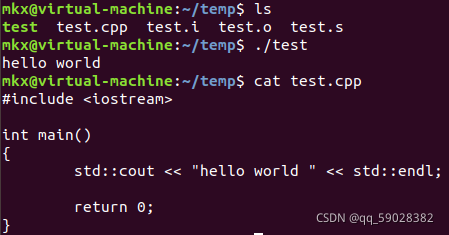
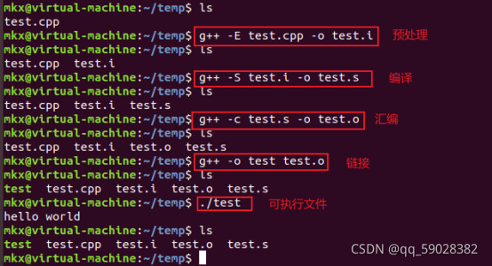
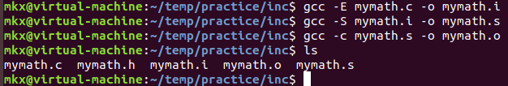
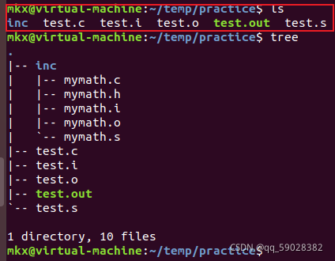
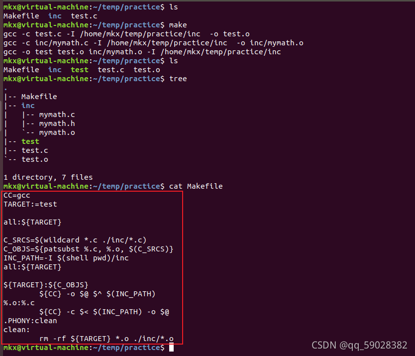
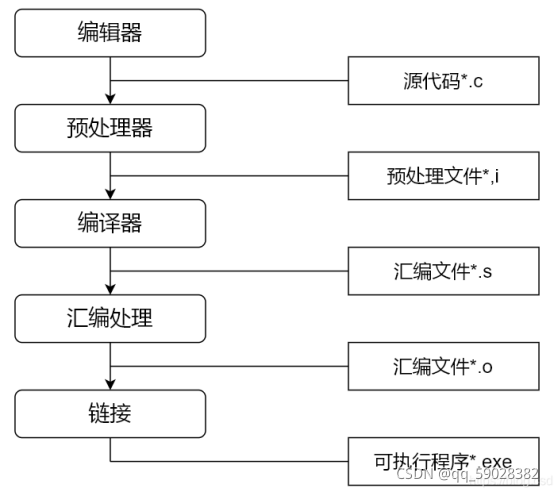

# 49.gcc编译的过程

# 49.gcc编译的过程


## 一、总体概述


GCC的编译流程分为四个步骤：  
1、预处理（Pre-Processing）  
2、编译（Compiling）  
3、汇编 (Assembliang)  
4、链接（Linking）


## 二、解释步骤


XXX为源文件  
YY为生成的文件  
1、预处理（Pre-Processing）  
预处理用于将所有的#include头文件以及宏定义替换成其真正的内容，预处理之后得到的仍然是文本文件，但文件体积会大很多。  
将 .c 文件转换为 .i 文件，使用gcc命令：gcc -E XXX -o YY  
对应于预处理命令 cpp  
2、编译（Compiling）  
将预处理之后的程序转换为特定的汇编代码 （assembly code） 的过程。  
将 .c/.h 文件转换为 .s 文件，使用gcc命令：gcc -S XXX -o YY  
对应于编译命令 cc -S  
3、汇编 (Assembliang)  
汇编过程将上一步的汇编代码转成机器码（machine code），这一步产生的文件叫 目标文件 ，是二进制格式。此步骤会为每一个源文件产生一个目标文件。  
将 .s 文件转换为 .o 文件，使用gcc命令：gcc -c XXX -o YY  
对应于汇编命令 as  
4、链接（Linking）  
链接过程将多个目标文件以及所需的库文件（ .so 等）链接成最终可执行文件（executable file）。  
将 .o 文件转换为 可执行程序，使用gcc命令： gcc -o YY XXX  
对应于链接命令 ld  
总结起来编译过程就上面的四个过程：预编译处理(.c) －－> 编译、优化程序（.s、.asm）－－> 汇编程序(.obj、.o、.a、.ko) －－> 链接程序（.exe、.elf、.axf等）。


## 三、案例








## 四、个人练习


目录结构


```plain
├── test.c
└── inc
    ├── mymath.h
    └── mymath.c
```


demo源文件


```plain
// test.c
#include <stdio.h>
#include "mymath.h"// 自定义头文件
int main(){
    int a = 2;
    int b = 3;
    int sum = add(a, b); 
    printf("a=%d, b=%d, a+b=%d\n", a, b, sum);
}
```


头文件定义


```plain
// mymath.h
#ifndef MYMATH_H
#define MYMATH_H
int add(int a, int b);
int sum(int a, int b);
#endif
```


头文件实现


```plain
// mymath.c
int add(int a, int b){
    return a+b;
}
int sub(int a, int b){
    return a-b;
}
```


--------------------------------------------------------------------分隔线------------------------------------------------------------  
编译过程  
1、预处理  
gcc -E -I./inc/ test.c -o test.i  
2、编译  
gcc -S -I./inc test.c -o test.s  
3、汇编  
gcc -c test.s -o test.o  
执行到此步骤时，需要生成其他目标文件，例如 mymath.o  
如下执行：  
cd inc/  
gcc -E mymath.c -o mymath.i  
gcc -S mymath.i -o mymath.s  
gcc -c mymath.s -o mymath.o  
4、链接  
gcc -o test.out test.o ./inc/mymath.o


结果图：








## 五、补充


Makefile





GCC的基本用法和选项  
GCC的最基本用法是：gcc [options] [filenames]  
-c，只编译，不连接成为可执行文件，编译器只是由输入的.c等源代码文件生成.o的后缀的目标文件，通常用于编译不包含主程序的子程序文件。  
-o output filename ，确定输出文件名称为output filename,同时这个名称不能和源文件同名。如果不给出这个选项，gcc就给出预设的可执行文件a.out。  
-g，产生符号调试工具（GUN的gdb）所必要的符号资讯，想要对源代码进行调试，我们必须加入这个选项  
-O，对程序进行优化编译、连接，采用这个选项，整个源代码会在编译、连接过程中进行优化处理，这样产生的可执行文件的执行效率可以提高，但是，编译、连接的速度会相对慢一些。  
-O2，比-O更好的优化编译、连接，当然整个编译、连接过程会很慢。  
-I dirname，将dirname所指出的目录加入到程序头文件目录列表中，是在预编译过程中使用的参数。  
-L dirname，将dirname 所指出的目录加入到程序函数档案库文件的目录列表中，是在链接过程中使用的参数。  
GCC的错误类型及对策  
第一类：C语法错误  
错误信息：文件source.c中第n行语法错误（systex error）。有些情况下，一个简单的语法错误，gcc会出一大堆错误，我们要保持头脑清醒，不要被吓到！  
第二类：头文件错误  
错误信息：找不到头文件head.h（Can not find include file head.h)。这类错误是源代码文件中的包含头文件有问题，可能的原因有头文件名错误、指定的头文件所在目录名错误等，也可能是错误的使用双引号和尖括号。  
第三类：档案库错误  
错误信息：链接程序找不到所需的函数库（ld:-lm:No such file or directory）。这类错误是与目标文件相连接的函数库有错误，可能的原因是函数库名错误、、指定的函数库所在目录名称错误等，检查的方法是使用find命令在可能的目录中寻找相应的函数库名，确定档案库及目录的名称并修改程序中及编译选项中的名称。  
第四类：未定义符号  
错误信息:有未定义的符号(Undefined symbo1)。这类错误是在连接过程中出现的，可能有两种原因:一是使用者自己定义的函数或者全局变量所在源代码文件，没有被编译连接，或者干脆还没有定义，这需要使用者根据实际情况修改源程序，给出全局变量或者函数的定义体;二是未定义的符号是一个标准的库函数，在源程序中使用了该库函数而连接过程中还没有给定相应的函数库的名称，或者是该档案库的目录名称有问题，这时需要使用档案库维护命令ar检查我们需要的库函数到底位于哪–个函数库中，确定之后，修改gcc连接选项中的-1和-L项。  
**其他介绍：**  
GNU工具  
编译工具：把一个源程序编译为一个可执行程序  
调试工具：能对执行程序进行源码或者汇编级调试  
软件工程工具：用于协助多人开发或者大型软件项目的管理。如make、CVS、Subvision  
其他工具：用于把多个文件链接成可执行文件的连接器，或者用作格式转换的工具  
GCC简介  
全称为GUN CC，GUN项目中符合ANSI C标准编译系统  
编译如C、C++、Object C、JAVA、Fortran、Pascal、Modula-3和Ada等多种语言  
GCC是可以在多种硬件平台上编译出可执行程序的超级编译器，其执行效率与一般的编辑器相比平均效率高出20%~30%  
一个交叉平台编译器，适合在嵌入式平台领域的开发编译  
gcc所支持后缀名解释


  
编译器的主要组件  
分析器：将源语言程序代码转换为汇编语言（C到汇编)，所以分析器需要知道目标机器的汇编语言。  
汇编器：汇编器将汇编语言代码转换为CPU可以执行的字节码。  
链接器：将汇编器生成的单独的目标文件组合成可执行的应用程序。连接器需要知道这种目标格式以便于工作。  
标准C库：核心的C语言库都有一个主要的C库来提供，如果在应用程序中用到了C库中的函数，这个库就会通过链接器和源代码连接来生成最终的可执行程序。





> 更新: 2024-04-19 15:30:56  
> 原文: <https://www.yuque.com/linuxer/gscfv1/e468bbadfd2a72f442999841722e917c>