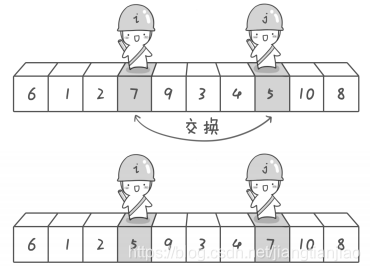
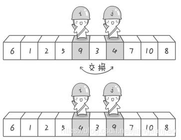
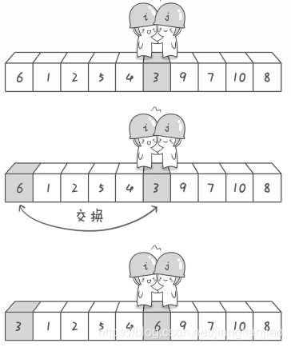
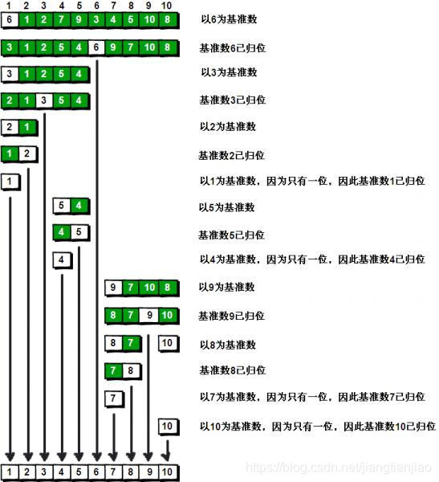
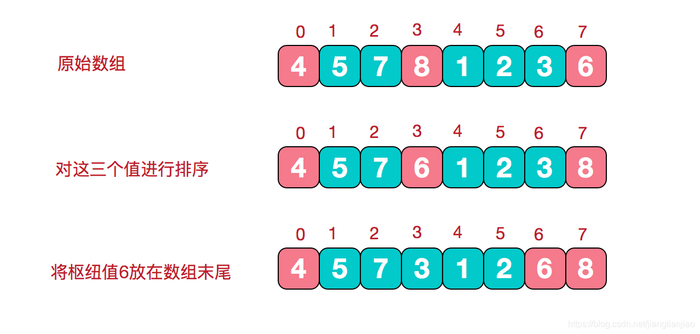
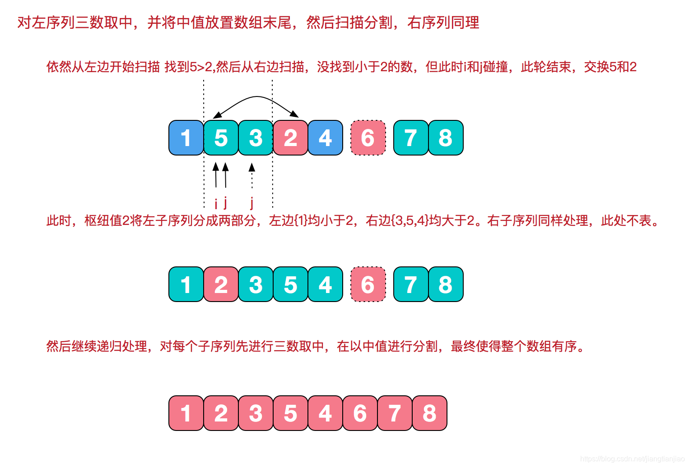

# 02.快速排序

# 02.快速排序


## 1.**简介**


快速排序是对[冒泡排序](https://so.csdn.net/so/search?q=%E5%86%92%E6%B3%A1%E6%8E%92%E5%BA%8F&spm=1001.2101.3001.7020)的一种改进， 它是不稳定的。由C. A. R. Hoare在1962年提出的一种划分交换排序，采用的是分治策略（一般与递归结合使用），以减少排序过程中的比较次数，它的最好情况为O(nlogn)，最坏情况为O(n^2)，平均时间复杂度为O(nlogn)。


## 2.**基本思想**


选择一个基准数，通过一趟排序将要排序的数据分割成独立的两部分，其中一部分的所有数据都比另外一部分的所有数据都要小。然后再按此方法对这两部分数据分别进行快速排序，整个排序过程可以递归进行，以达到全部数据变成有序。


## 3.**步骤**


(1) 从数列中挑出一个基准值。  
(2) 将所有比基准值小的摆放在基准前面，所有比基准值大的摆在基准的后面(相同的数可以到任一边)，在这个分区退出之后，该基准就处于数列的中间位置。  
(3) 递归地把基准值前面的子数列和基准值后面的子数列进行排序。


注意：基准元素/左游标/右游标都是针对单趟排序而言的， 也就是说在整个排序过程的多趟排序中，各趟排序取得的基准元素/左游标/右游标一般都是不同的。对于基准元素的选取，原则上是任意的，但是一般我们选取数组中第一个元素为基准元素（假设数组随机分布）。


排序过程示意图如下


选取上述数组的第一个元素6作为基准元，左游标是 i 哨兵，右游标是 j 哨兵，它们遵循的规则如下：  
一、左游标向右扫描， 跨过所有小于基准元素的数组元素, 直到遇到一个大于或等于基准元素的数组元素， 在那个位置停下。二、右游标向左扫描， 跨过所有大于基准元素的数组元素, 直到遇到一个小于或等于基准元素的数组元素，在那个位置停下。


第一步：哨兵 j 先开始出动。因为此处设置的基准数是最左边的数，所以需要让哨兵 j 先开始出动，哨兵 j 逐步向左挪动，直到找到一个小于 6 的元素停下来。接下来哨兵 i 再逐步向右挪动，直到找到一个大于 6 的元素停下来。最后哨兵 i 停在了数字 7 面前，哨兵 j 停在了数字 5 面前。





到此第一次交换结束，接着哨兵 j 继续向左移动，它发现 4 比基准数 6 要小，那么在数字4面前停下来。哨兵 i 也接着向右移动，然后在数字 9 面前停下来，然后哨兵 i 和 哨兵 j 再次进行交换。





第二次交换结束，哨兵 j 继续向左移动，然后在数字 3 面前停下来；哨兵 i 继续向右移动，但是它发现和哨兵 j 相遇了。那么此时说明探测结束，将数字 3 和基准数字 6 进行交换。





到此第一趟探测真正结束，此时以基准点6为分界线，左边的数组元素都小于等于6，右边的数组元素都大于等于6。左边序列为3，1，2，5，4。右边序列为9，7，10，8。此时对于左边序列而言，以数字3为基准元素，重复上面的探测，探测完毕之后的序列为2，1，3，5，4。对于右边序列而言，以数字9为基准元素，也重复上面的探测，一步一步的划分最后排序完全结束。


快速排序的每一轮处理其实就是将这一轮的基准数归位，直到所有的数都归位为止，排序就结束了。  
下图描述了整个算法的处理过程。





## 4.**常规快速排序法**


```java
public class QuickSort {


    // 数组array中下标为i和j位置的元素进行交换


    private static void swap(int[] array, int i, int j) {


        int temp = array[i];


        array[i] = array[j];


        array[j] = temp;


    }


 


    private static void recQuickSort(int[] array, int left, int right) {


        if (right <= left) {


            return;


        } else {


            int partition = partitionIt(array, left, right);


            recQuickSort(array, left, partition - 1); // 对上一轮排序(切分)时，基准元素左边的子数组进行递归


            recQuickSort(array, partition + 1, right); // 对上一轮排序(切分)时，基准元素右边的子数组进行递归


        }


    }


 


    private static int partitionIt(int[] array, int left, int right) {


        // 为什么j加一个1，而i没有加1，是因为下面的循环判断是从--j和++i开始的。


        // 而基准元素选的array[left]即第一个元素，所以左游标从第二个元素开始比较。


        int i = left;


        int j = right + 1;


        int pivot = array[left];// pivot为选取的基准元素


        while (true) {


            while (i < right && array[++i] < pivot) {


            }


            while (j > 0 && array[--j] > pivot) {


            }


            if (i >= j) { // 左右游标相遇时停止


                break;


            } else {


                swap(array, i, j); // 左右游标未相遇时交换各自所指元素


            }


        }


        swap(array, left, j); // 基准元素和游标相遇时所指元素交换为最后一次交换


        return j; // 一趟排序完成，返回基准元素位置（注意这里基准元素已经交换位置了）


    }


 


    public static void sort(int[] array) {


        recQuickSort(array, 0, array.length - 1);


    }


 


    public static void main(String[] args) {


        //int[] array = {7,3,5,2,9,8,6,1,4,7};


        int[] array = {9, 9, 8, 7, 6, 5, 4, 3, 2, 1};


        sort(array);


        for (int i : array) {


            System.out.print(i + " ");


        }


        // 打印结果为：1 2 3 4 5 6 7 7 8 9


    }


}
```


## 5.**三数取中法**


避免分组一边倒的情况，比如逆序数组，选取第一个元素作为基准点，即最大元素是基准点，那么第一次循环，左游标要执行到最右边，而右游标执行一次，然后两者进行交换。这也会划分成很多的子数组。


在快排的过程中，每一次我们要取一个元素作为枢纽值，以这个数字来将序列划分为两部分。在此我们采用三数取中法，也就是取左端、中间、右端三个数，然后进行排序，将中间数作为枢纽值。








```java
public class QuickSort {


 


    public static void main(String[] args) {


        int[] arr = {9, 8, 7, 6, 5, 4, 3, 2, 1, 0};


        quickSort(arr, 0, arr.length - 1);


        System.out.println("排序结果：" + Arrays.toString(arr));


    }


    


    /**


     * @param arr


     * @param left  左指针


     * @param right 右指针


     */


    public static void quickSort(int[] arr, int left, int right) {


        if (left < right) {


            // 获取枢纽值，并将其放在当前待处理序列末尾


            dealPivot(arr, left, right);


            // 枢纽值被放在序列末尾


            int pivot = right - 1;


            int i = left; // 左指针


            int j = right - 1; // 右指针


            while (true) {


                while (arr[++i] < arr[pivot]) {


                }


                while (j > left && arr[--j] > arr[pivot]) {


                }


                if (i < j) {


                    swap(arr, i, j);


                } else {


                    break;


                }


            }


            if (i < right) {


                swap(arr, i, right - 1);


            }


            quickSort(arr, left, i - 1);


            quickSort(arr, i + 1, right);


        }


    }


 


    /**


     * 处理枢纽值


     *


     * @param arr


     * @param left


     * @param right


     */


    public static void dealPivot(int[] arr, int left, int right) {


        int mid = (left + right) / 2;


        if (arr[left] > arr[mid]) {


            swap(arr, left, mid);


        }


        if (arr[left] > arr[right]) {


            swap(arr, left, right);


        }


        if (arr[right] < arr[mid]) {


            swap(arr, right, mid);


        }


        swap(arr, right - 1, mid);


    }


 


    /**


     * 交换元素通用处理


     *


     * @param arr


     * @param a


     * @param b


     */


    private static void swap(int[] arr, int a, int b) {


        int temp = arr[a];


        arr[a] = arr[b];


        arr[b] = temp;


    }


}
```


> 更新: 2024-04-19 15:31:06  
> 原文: <https://www.yuque.com/linuxer/gscfv1/6651fb0558541354036292996b03d919>