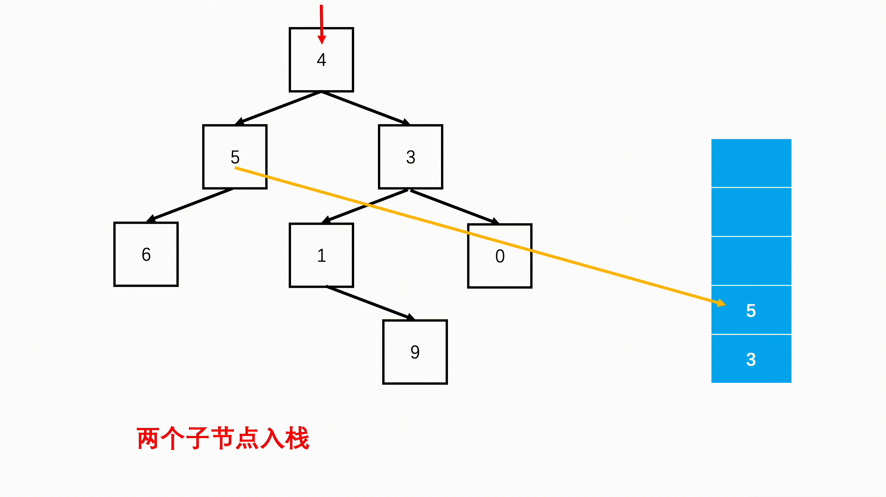

# 07.二叉树前序遍历非递归

# 07.二叉树前序遍历非递归


**二叉树前序遍历**





**口诀：根左右**


**知识点：栈**


栈是一种仅支持在表尾进行插入和删除操作的线性表，这一端被称为栈顶，另一端被称为栈底。元素入栈指的是把新元素放到栈顶元素的上面，使之成为新的栈顶元素；元素出栈指的是从一个栈删除元素又称作出栈或退栈，它是把栈顶元素删除掉，使其相邻的元素成为新的栈顶元素。


**思路：**


我们都知道递归，是不断调用自己，计算内部实现递归的时候，是将之前的父问题存储在栈中，先去计算子问题，等到子问题返回给父问题后再从栈中将父问题弹出，继续运算父问题。因此能够递归解决的问题，我们似乎也可以用栈来试一试。


根据前序遍历“根左右”的顺序，首先要遍历肯定是根节点，然后先遍历左子树，再遍历右子树。递归中我们是先进入左子节点作为子问题，等左子树结束，再进入右子节点作为子问题。


**具体做法：**


+ step 1：优先判断树是否为空，空树不遍历。
+ step 2：准备辅助栈，首先记录根节点。
+ step 3：每次从栈中弹出一个元素，进行访问，然后验证该节点的左右子节点是否存在，存的话的加入栈中，优先加入右节点。


```plain
import java.util.*;
public class Solution {
    public int[] preorderTraversal (TreeNode root) {
        //添加遍历结果的数组
        List<Integer> list = new ArrayList(); 
        Stack<TreeNode> s = new Stack<TreeNode>();
        //空树返回空数组
        if(root == null) 
            return new int[0];
        //根节点先进栈
        s.push(root); 
        while(!s.isEmpty()){
            //每次栈顶就是访问的元素
            TreeNode node = s.pop(); 
            list.add(node.val);
            //如果右边还有右子节点进栈
            if(node.right != null) 
                s.push(node.right);
            //如果左边还有左子节点进栈
            if(node.left != null) 
                s.push(node.left);
        }
        //返回的结果
        int[] res = new int[list.size()]; 
        for(int i = 0; i < list.size(); i++)
            res[i] = list.get(i);
        return res;
    }
}
```


**关键点：为了能保证下一轮优先访问左节点，优先将右节点推入栈中。**


优先将右子节点挂入栈中，然后下一轮先访问左子节点。同样将它挂入栈中，依据栈的后进先出原则，下一轮循环必然它要先出来，如此循环，原先父问题的右子节点被不断推入栈深处，只有左子树全部访问完毕，才会弹出继续访问。


**小结：**


    在二叉树的遍历中，尤其是深度优先搜索（DFS），递归是最常用的一种解法，但是往往有的时候，不要求我们用递归的方式进行求解。通过非递归的方式，去遍历二叉树，那么这个时候，我们一定要想到用栈去代替递归，记住遍历的顺序。就能解决这类的问题。


    同时，中序和后序也是利用栈的特点进行非递归的遍历。值得我们反复练习。


> 更新: 2024-04-19 15:31:12  
> 原文: <https://www.yuque.com/linuxer/gscfv1/b8c06c63152e1128b41e7be189d85c3b>