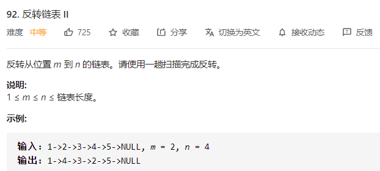

# 08.链表反转

# 08.链表反转


+  反转链表总体有两种方法，迭代与递归，在迭代过程中需要注意细节，比如反转链表需要同时跟踪两个节点，递归需要注意临界条件与递归函数的意义。 
+  本题中，迭代方法实时跟踪pre与cur节点，并实时更新，比较巧妙的是pre节点初始值的设置 
+  而递归，需要理解递归函数的意义，也就是返回的是反转链表的头节点，以及本节点next的设置  
 
+  本题相较上面一题控制为链表区间反转，同样有两个思路 
+  迭代： 
    -   
        *  将curr节点的下一个节点插入到pre节点之后 
        *  需要考量的是边界，如果整个链表反转，在原链表之上是无法进行的，需要加入哨兵 
        *  

```java
        // 设置 dummyNode 是这一类问题的一般做法
        ListNode dummyNode = new ListNode(-1);
        dummyNode.next = head;
        ListNode pre = dummyNode;
        for (int i = 0; i < left - 1; i++) {
            pre = pre.next; //跟踪到指定位置
        }
        ListNode cur = pre.next;
        ListNode next;
        for (int i = 0; i < right - left; i++) { //穿针引线
            next = cur.next;
            cur.next = next.next;
            next.next = pre.next; 
            pre.next = next;
        }
        return dummyNode.next;
```

 

    -  哨兵技巧 
        *   
        *  

```java
ListNode dummy = new ListNode(0);
dummy.next = head;

r -= l;
ListNode hh = dummy;
while (l-- > 1) hh = hh.next;

ListNode a = hh.next, b = a.next;
while (r-- > 0) {
    ListNode tmp = b.next;
    b.next = a;
    a = b;
    b = tmp;
}

hh.next.next = b;
hh.next = a;
return dummy.next;
```

 

    -  迭代方法的一点思考，迭代过程中需要至少跟踪两组信息方便反转，同时在本题中由于是区间反转，还需要记录反转开始，而反转的开始考虑到临界条件，可以通过设置哨兵解决。 
+  递归 
    -  反转整个链表是非常轻松的，如果反转链表前面指定长度的一部分呢？ 
    -  需要记录长度信息： 
    -  

```java
ListNode successor = null; // 后驱节点

// 反转以 head 为起点的 n 个节点，返回新的头结点
ListNode reverseN(ListNode head, int n) {
    if (n == 1) { 
        // 记录第 n + 1 个节点
        successor = head.next;
        return head;
    }
    // 以 head.next 为起点，需要反转前 n - 1 个节点
    ListNode last = reverseN(head.next, n - 1);

    head.next.next = head;
    // 让反转之后的 head 节点和后面的节点连起来
    head.next = successor;
    return last;
}
```

 

    -  现在我们已经知道了反转前N个节点，我们可以找到需要反转的部分链表的头信息，反转指定长度即可 
    -  

```java
ListNode reverseBetween(ListNode head, int m, int n) {
    // base case
    if (m == 1) {
        return reverseN(head, n);
    }
    // 前进到反转的起点触发 base case
    head.next = reverseBetween(head.next, m - 1, n - 1);
    return head;
}
```

 


> 更新: 2024-04-19 15:31:16  
> 原文: <https://www.yuque.com/linuxer/gscfv1/3010766c9daffa7185a6d97d03f609d7>