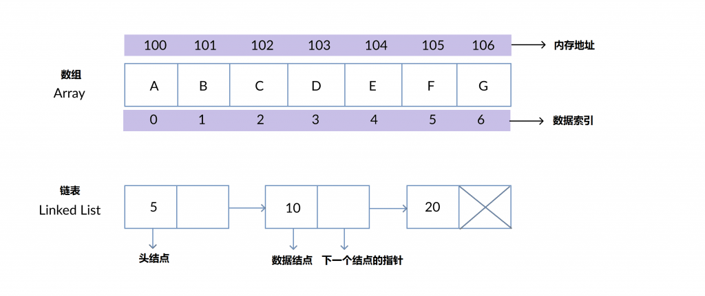

# 22.链表和数组的底层结构设计、关联、区别、应用场景

# 22.链表和数组的底层结构设计、关联、区别、应用场景

数组和链表都是线性数据结构，它们有什么优缺点？两者都有一些优点和缺点，现在我们来看看数组和链表有什么区别，以及它们的一些优缺点和相关的应用场景。

例如，一个数组通常是一个被广泛实现为一个默认类型的数据类型，也就是说，一个数组中的元素的数据类型通常都是相同类型的，而且长度通常都是固定的，除了在某些弱类型语言中可能又例外，如JavaScript，但是一般都是推荐使用存储同一种数据类型的数据，数组在现代编程中被大量用到。但是，某些应用场景使用链表则不合适，例如当我们需要存储大量数据而又不知道要存储多少数据的时候，对于这种情况，可以使用链表进行储存。

## 1、数组（Array）和链表（Linked List）的区别

下表是数组和链表区别的详细描述：

| 数组 | 链表 |
| --- | --- |
| 数组是一个相似数据类型的数据集合 | 链表是一个有相同数据类型的有续集，其中每个元素使用指针链接 |
| 数组元素可以使用数组索引随机访问 | 链表不允许随机访问，元素只能被有序或顺序访问 |
| 数组的数据元素在内存中连续储存 | 元素可能存储在内存的任意地方，链表创建一个指针指向相应的数据 |
| 插入和删除操作非常耗时，时间为O(n)，因为元素的内存地址是连续和固定的 | 链表的插入和删除操作非常快，时间为O(1) |
| 数组的内存是静态分配的，在编译期间完成 | 链表的内存分配是动态的，在运行时动态分配 |
| 数组的大小必须在数组的声明或初始化的时候指定 | 链表的大小随着元素的插入或删除变化 |

## **2**、链表的优点

链表的优点如下：

1. 链表的大小不固定，可以在运行时扩展或收缩。
2. 插入和删除操作更快更容易。
3. 内存分配在运行时的时候按照需要动态申请，比较灵活。
4. 其它数据结构例如栈、队列和树可以很容易使用链表实现。

## **3**、链表的缺点

链表的缺点如下：

1. 相对于数组，链表的内存消耗更大，因为在链表中的结点需要额外储存一个指针，指针的储存需要额外的内存空间。
2. 元素不能被随机访问。
3. 逆向遍历单链表比较困难（但是可以实现的）。

## **4**、链表的应用场景

链表的应用如下

1. 链表可以用于实现栈、队列、树等数据结构。
2. 链表也可以用于实现图，图邻接表的表示方式。
3. 链表可以用于实现散列表，散列表的每个位置可以存储一个链表（开放地址散列法）

以上就是数组和链表的区别、优缺点和应用场景的内容。

> 更新: 2024-04-19 15:31:35  
> 原文: <https://www.yuque.com/linuxer/gscfv1/3887fee7e03860d76f18dec1ef7080c2>