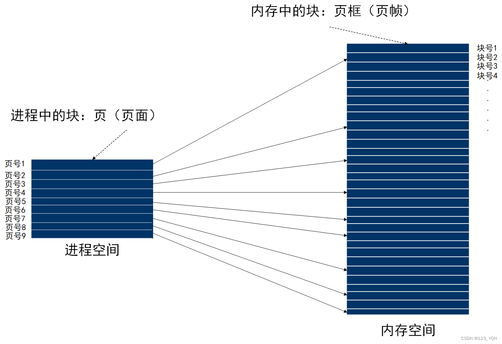
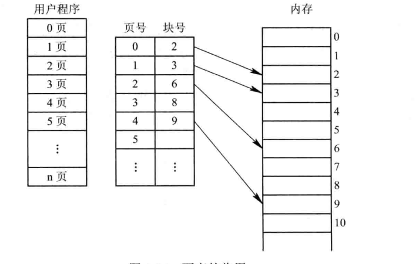
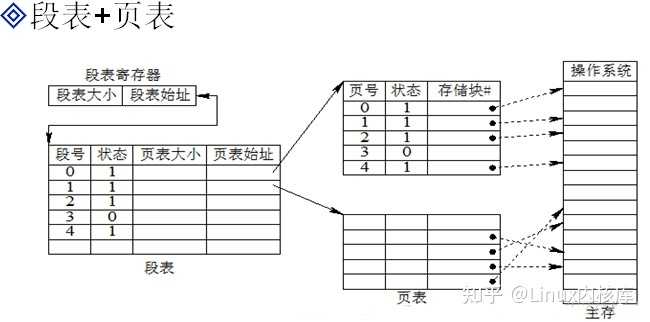
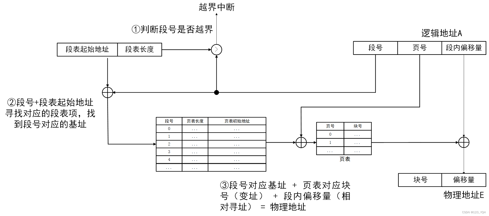

# 04.内存管理

# 04.内存管理

## 1.为什么要进行内存管理？

计算机内存虽然速度较快，但由于容量限制（一般8-32GB），不能一次性将所有的用户进程和系统程序全部装入内存，因此操作系统必须对内存空间进行合理的划分和有效的动态分配。

## 2.内存管理的主要功能：

+ 地址转换：将程序中的逻辑地址转换成内存中的物理地址（抽象）
+ 存储保护：保证个个作业在自己的内存空间内运行，互不干扰（保护）
+ 内存的分配与回收：当作业或进程创建后系统会为他们分配内存空间，当结束后内存空间也会被回收。
+ 内存空间的扩充：利用虚拟存储技术或自动覆盖技术，从逻辑上扩充内存（虚拟化）
+ 进程间通信（共享）

## 3.内存分配的两种方式

### 3.1 连续分配方式

连续分配方式是指为一个进程分配一个连续的内存空间；

连续分配方式主要包括单一连续分配、固定分区分配和动态分区分配。

#### 3.1.1 单一连续分配

整个内存直接交由一个程序独占，当其他程序需要使用的时候，需要覆盖（Overlay）整个内存，即一次只能运行一个程序;

优点：简单高效，无外部碎片。  
缺点：可能存在大量内部碎片，内存利用率低，且只能用于单用户。

#### 3.1.2 固定分区分配

将用户内存空间划分为若干固定大小的区域，每个区域只装入一个进程。

+  优点：程序可能太大放入不了任何一个分区。 
+  缺点：程序太小独占一个分区，造成内部碎片。 

#### 3.1.3 动态分区分配

在程序装入内存时，根据进程的大小动态地建立分区，并使得分区的大小正好适合进程的需要，因此系统中分区的大小和数目是可变的。

+  优点：一开始内存利用率较高。 
+  缺点：随着时间推移，内存中会产生越来越多的小的内存块，内存的利用率也随之下降，这些碎片成为外部碎片。操作系统可以通过对进程进行碎片整理来解决碎片问题。 

### 3.2 离散分配方式

由于连续分配方式会形成许多内存碎片，内存使用率极低；从而产生了离散分配方式，即将一个进程分散地装入到许多不相邻的内存分区中。把主存空间划分为大小相等且固定地块，块相对较小，作为主存地基本单位。每个进程以块为单位进行划分，进程在执行时，以块为单位逐个申请主存中地块空间。

#### 3.2.1 分页存储（页式存储）

##### 3.2.1.1 基本概念

+ 进程中的块：页或页面
+ 页或页面的编号：页号
+ 内存中的块：页框或页帧
+ 页框的编号：块号或页帧号
+ 页表：每个进程页号对应块号的映射表
+ 页表项：页号 + 块号
+ 逻辑地址：页号 + 页内偏移量
+ 物理地址：块号 + 块内偏移量
+ 块的大小=页的大小，所以块内偏移量=页内偏移量

##### 3.2.1.2 逻辑地址转换为物理地址

+ 根据页面大小（4K）可计算出页内地址的位数（4k=2的12次方，二进制位数是12位，等同于十六进制是3位）
+ 页内地址位数（3位十六进制）结合逻辑地址（5148H）计算出页内地址（148H）和页号（5H）
+ 页号结合页表，即可得出块号（假设页号5对应的块号7）
+ 块号（7H）+ 块内地址（等于页内地址，即148H）= 物理地址（7148H）

#### 3.2.2 分段存储（段式存储）

逻辑空间分为若干个段，每个段定义了一组有完整逻辑意义的信息（如主程序段、子程序段、数据段等），段长度不等

##### 3.2.2.1 基本概念

+ 逻辑地址：(段号, 段内偏移量)，（0，30）
+ 物理地址：（基址，段内地址），（40，70）

##### 3.2.2.2 地址映射

+ 根据段号从段表中找到段长和基址
+ 判断段内偏移量是否小于段长
+ 根据基址和段长计算出物理地址

##### 3.2.2.3 分段与分页的区别

#### 3.2.3 段页式存储

综合分段和分页存储方式，先按逻辑结构分段，再将每个段分页。

地址结构

地址映射

+  逻辑地址----- >（段号、段内页号、页内地址） 
+  段表寄存器--- >段表始址 
+  段号+段表始址---- >页表始址 
+  页表始址+段内页号----->存储块号 
+  块号+页内地址------>物理地址 

1. 在被调进程的PCB中取出段表始址和段表长度，装入段表寄存器
2. 段号与控制寄存器的页表长度比较，若页号大于等于段表长度，发生地址越界中断，停止调用，否则继续
3. 由段号结合段表始址求出页表始址和页表大小
4. 页号与段表的页表大小比较，若页号大于等于页表大小，发生地址越界中断，停止调用，否则继续
5. 由页表始址结合段内页号求出存储块号
6. 存储块号&页内地址，即得物理地址

> 更新: 2024-04-19 15:32:23  
> 原文: <https://www.yuque.com/linuxer/gscfv1/ae71a73c14671f72f4799983c44828a1>