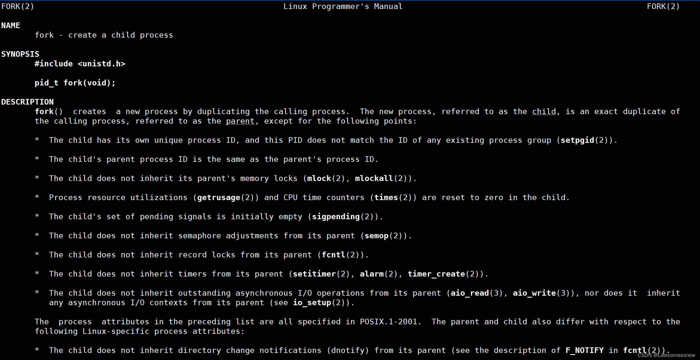
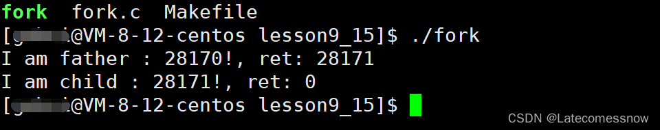
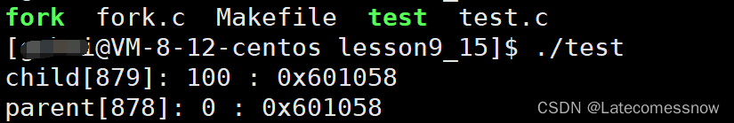

# 15.fork函数返回值是怎么实现的

# 15.fork函数返回值是怎么实现的


## 一、初识fork函数


        在Linux中fork函数时是非常重要的函数，它从已存在进程中创建一个新进程。新进程为子进程，而原进程为父进程。


```plain
man fork
```


在Linux下执行上述命令可以看到fork函数的相关信息如下：





    进程调用fork函数时会以该进程为父进程创建出子进程，父子进程代码共享，但进程具有独立性，父子进程也不例外，这里的共享只是指的是子进程采用写时拷贝去拷贝父进程的数据，父子进程的数据是两块不同的空间。


1.  分配新的内存块和内核数据结构给子进程 
2.  将父进程部分数据结构内容拷贝至子进程 
3.  添加子进程到系统进程列表当中 
4.  fork返回，开始调度器调度 


## 二、fork函数的返回值


        我们都知道一个函数有且只能有一个返回值，但fork函数是一个很特别的函数，fork函数可以有两个返回值，第一种情况fork函数调用失败时返回-1；第二种情况fork函数调用成功创建子进程时，父进程返回子进程的pid(pid指的是进程的编号)，子进程返回0。


在Linux下编译好如下代码后，跑起来就可以知道是不是如上所说了


```plain
int main()
{
	int ret = fork();
	if (ret < 0) {
		perror("fork");
		return 1;
	}
	else if (ret == 0) { //child
        // getpid是一个返回当前进程pid的函数
		printf("I am child : %d!, ret: %d\n", getpid(), ret);
	}
	else { //father
		printf("I am father : %d!, ret: %d\n", getpid(), ret);
	}
	sleep(1);
	return 0;
}
```


我们可以看到结果如下：





一个函数只能有一个返回值，按理说上边的if、else if、else三条语句中只会执行一条，但我们可可以看到的确有两条语句被执行了，打印出了两条信息，说明了fork函数确实是存在两个返回值的，fork函数的返回值也的确如我们所说父进程返回子进程的pid，子进程返回0，fork之前父进程独立执行，fork之后，父子两个执行流分别执行。注意，fork之后，谁先执行完全由调度器决定。


那一个函数是怎么能够有两个返回值的呢？ 先来看一段代码：


```plain
#include <stdio.h>
#include <unistd.h>
#include <stdlib.h>

int g_val = 0;

int main()
{
	pid_t id = fork();
	if (id < 0) {
		perror("fork");
		return 0;
	}
	else if (id == 0) { //child,子进程肯定先跑完，也就是子进程先修改，完成之后，父进程再读取
		g_val = 100;
		printf("child[%d]: %d : %p\n", getpid(), g_val, &g_val);
	}
	else { //parent
		sleep(3);
		printf("parent[%d]: %d : %p\n", getpid(), g_val, &g_val);
	}
	return 0;
}
```


在此代码中定义了一个全局变量g_val，全局变量是存在静态区的，生命周期是整个程序的生命周期，对其进行修改其值是会变为修改后的值的，父进程sleep了3秒钟，保证了子进程先跑完，然后再去执行父进程的，既然在子进程中已经将g_val的值修改为100，那么在父进程中的g_val是否也会是100呢？来看如下运行结果：





可以看到子进程和父进程中的g_val的地址都是一样的，可是这个相同的地址里存的值却不一样，我们平常对指针进行解引用操作拿到的都是这个指针指向的内容，指向的内容是唯一的，可这里的g_val却出现了两个值，未免太魔幻了！


其实，这里的地址都是虚拟的地址，父子进程的两个的地址只是在虚拟地址空间上是一样的，但通过父子进程各自的页表映射到真实的物理内存中的地址时，这两个g_val的物理内存的地址是不一样的，这就能够解释为什么g_val会存在两个值的问题了。


反过来再看fork函数的两个返回值也是类似的，fork函数之后，父进程创建了子进程，进程之间是独立的，父子进程都会有一块自己的虚拟地址空间，pid_t id = fork(); 这个id只是在父子进程的虚拟地址空间上是一样的，但通过各自的页表映射到物理内存时是两个不同的的地址，所以才会存在两个返回值。


> 更新: 2024-04-19 15:32:38  
> 原文: <https://www.yuque.com/linuxer/gscfv1/833935940a99c3544c05e18b42b0ec71>