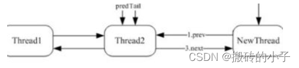
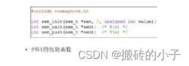
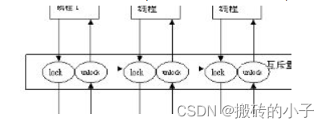

# 19.线程同步共享怎么实现

# 19.线程同步共享怎么实现

线程同步的方式主要有: 临界区（Critical Section）、互斥量（Mutex）、信号量（Semaphore）、事件（Event）。

他们的主要区别和特点如下：

1）临界区：通过对多线程的串行化来访问公共资源或一段代码，速度快，适合控制数据访问。在任意时刻只允许一个线程对共享资源进行访问， 如果有多个线程试图访问公共资源，那么在有一个线程进入后，其他试图访问公共资源的线程将被挂起，并一直等到进入临界区的线程离开，临界区在被释放后，其他线程才可以抢占。

2）互斥量：采用互斥对象机制。 只有拥有互斥对象的线程才有访问公共资源的权限，因为互斥对象只有一个，所以能保证公共资源不会同时被多个线程访问。

互斥不仅能实现同一应用程序的公共资源安全共享，还能实现不同应用程序的公共资源安全共享。

3）信号量：它允许多个线程在同一时刻访问同一资源，但是需要限制在同一时刻访问此资源的最大线程数目。

4）事 件： 通过通知操作的方式来保持线程的同步，还可以方便实现对多个线程的优先级比较的操作。

很多人可能不太了解线程同步什么意思，我们要怎么样才能保持他们同步，我们今天要讨论的就是这个问题，希望对大家有所帮助。

首先我们要知道什么是同步就是有时候在进行多线程的程序设计中需要实现多个线程共享同一段代码，接下来就是怎么设置同步。

接下来我们要做的第一步就是不要让多个线程无序地访问共享资源，对关键代码进行归结放在一个代码块，不要分离。

接下来就是保持关键 代码的 原子性，只要有访问时，同时只有一个关键代码可以使用，这样就同步了。

接下来还是利用互斥锁实现关键代码的同步访问，采用同步法，对关键字修饰做出相关设置

最后是将每一个线程的开始都从这个方法开始，这样只能等一个结束之后下一个再开始，这样就可以同步进行了。

> 更新: 2024-04-19 15:32:43  
> 原文: <https://www.yuque.com/linuxer/gscfv1/b5f902086d1761e916d97d83e73b97d4>