# 23.linux虚拟地址空间结构动态库地址无关代码

# 23.linux虚拟地址空间结构/动态库地址无关代码

本文主要描述了Linux系统上关于位置无关代码PIC,位置无关可执行程序PIE及地址空间布局随机化ASLR三个主要特性的原理及联系。第一部分首先介绍了应用程序地址空间的基础知识作为铺垫;第二部分重点讲解PIC的实现原理;第三部分简单介绍了PIE的概念;第四部分讲解ASLR和PIE如何配合工作，以实验的方式来说明二者的联系。

本文主要基于Linux X86平台和X64平台讲解,水平有限,如果有错误,敬请指正。

## 一、程序虚拟地址空间及位置有关代码概述

Linux进程从磁盘加载到内存中运行的过程中，内核会为进程分配虚拟地址空间，虚拟地址空间被划分为一块块的区域(Segment)，其中最重要的几个区域如下：

图1 - 应用程序虚拟地址空间说明

内核地址空间，对所有应用来说都是相同的，这部分地址空间应用无法直接访问。内核地址空间不是本文关注的重点，我们重点关注应用程序的重要的一些SEGMENT。

表1 - 应用程序重要segment描述

如果系统没有开启地址随机化(ASLR - Address Space Layout Randomization，地址随机化，后文会介绍)，则Linux会将上面表格中的各个segment的地址空间放到一个固定的地址上面。

我们写一个实际的程序来看看在一个Linux X86_64的机器上各个segment的地址是如何排布的，程序如下，覆盖了我们关心的segment。

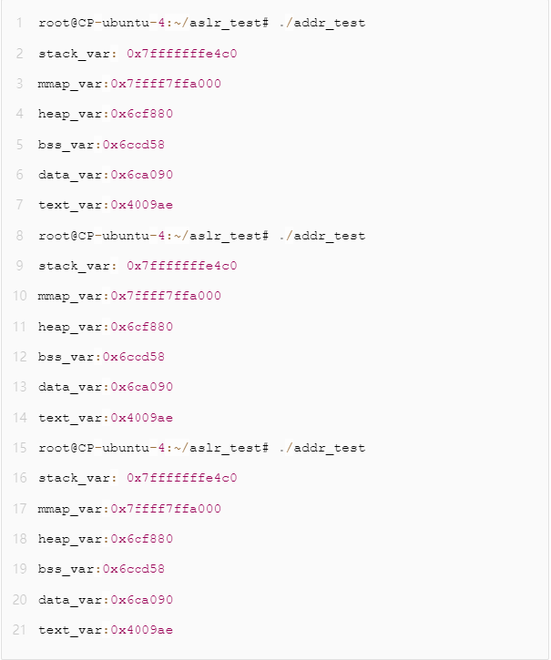

图2 - 虚拟地址空间演示程序

编译

gcc -o addr_test addr_test.c -static

（此处使用静态链接，以便演示位置相关代码的特征）

我们运行这个程序3次，会发现所有的地址都是一个固定值。这是因为在没有开ASLR特性时，系统不会随机化分配程序的虚拟地址空间，程序所有的地址都是按照固定的规则来生成。

图3 - 固定segment地址分布

通过objdump命令反汇编后可以看到，对于全局变量和函数调用的访问，汇编指令跟的地址都是固定的，这样的代码我们就称它为位置相关的。

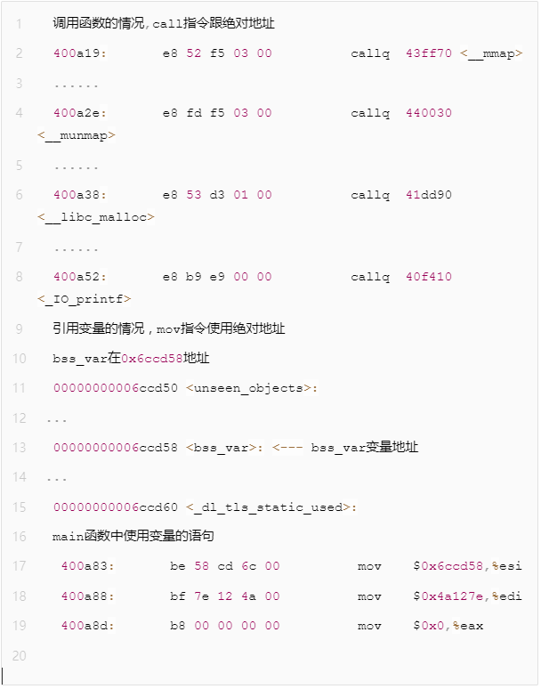

图4 - 位置相关代码汇编语句实例

这种代码，由于地址是写死的，只能加载到指定地址上运行，一旦加载地址有变化，由于代码里访问的变量、函数地址是固定的,加载地址变化后程序无法正常执行。

固定地址的方式虽然简单，但是无法实现一些高级特性比如动态库支持。动态库的代码会通过mmap()系统调用来映射到进程的虚拟地址空间，不同的进程中，同一个动态库映射的虚拟地址是不确定的。如果动态库的实现上使用位置相关的代码，则无法达到其任意地址运行的目的，这种情况下我们就需要引入位置无关代码PIC的概念了。

另外，我们可以看到，在没有开启地址随机化特性的系统上，由于程序各个segment的地址是固定的，黑客在攻击时会更加简单(感兴趣的同学可以搜索一下Ret2shellcode或Ret2libc攻击)，此时需要引入PIE的概念搭配ASLR一起来防护。

## 二、位置无关代码PIC和动态库的实现

PIC，全称Position Independent Code。位置无关代码是指代码无论被加载到哪个地址上都可以正常执行。gcc选项中添加-fPIC会产生相关代码。

关键点#1 - 代码段和数据段的偏移

代码段和数据段之间的偏移，在链接的时候由链接器给出，对于PIC来说非常重要。当链接器将各个目标文件的所有p组合到一起的时候，链接器完全知道每个p的大小和它们之间的相对位置。

图5 - 代码段和数据段偏移示例

如上图所示，示例中这里TEXT和DATA时紧紧挨着的，其实无论DATA和TEXT是否是相邻的，链接器都能知道这两个段的偏移。根据这个偏移，可以计算出在TEXT段内任意一条指令相对于DATA段起始地址的相对偏移量。如上图，无论TEXT段被放到了哪个虚拟地址上，假设一条mov指令在TEXT内部的0xe0偏移处，那么我们可以知道，DATA段的相对偏移位置就是:TEXT段的大小 - mov指令在TEXT内部的偏移 = 0xXXXXE000 - 0xXXXX00E0 = 0xDF20

关键点#2 - X86上指令相对偏移的计算

如果使用相对位置进行处理，可以看到代码能够做到位置无关。但在X86平台上mov指令对于数据的引用需要一个绝对地址，那应该怎么办呢？

从“关键点1”里的描述来看，我们如果知道了当前指令的地址，那么就可以计算出数据段的地址。X86平台上没有获取当前指令指针寄存器IP的值的指令（X64上可以直接访问RIP），但可以通过一个小技巧来获取。来看一段伪代码：

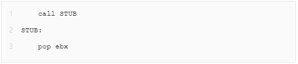

图6 - X86平台获取指令地址汇编

这段代码在实际运行时，会有以下的事情发生：

+  当cpu执行 call STUB的时候，会将下一条指令的地址保存到stack上，然后跳到标签STUB处执行。 
+  STUB处的指令是pop ebx,这样就将 "pop ebx"这条指令所在的地址从stack弹出放到了ebx寄存器中，这样就得到了IP寄存器的值。 

### 1.全局偏移表GOT

在理解了前面的几点后，来看看在X86上是如何实现位置无关的数据引用的，此特性是通过全局偏移表global offset table（GOT）来实现的。

GOT是一张在data p中保存的一张表，里面记录了很多地址字段 (entry)。假设一条指令想要引用一个变量，并不是直接去用绝对地址，而是去引用GOT里的一个entry。GOT表在data p中的地址是明确的，GOT的entry包含了变量的绝对地址。

图7 - 代码地址和GOT表entry关系

如上图，根据"关键点1"和“关键点2”，我们可以先获取到当前IP的值，然后计算得到GOT表的绝对地址，由于变量的地址entry在GOT表中的偏移也是已知的，因此可以实现位置无关的数据访问。

以一条绝对地址的mov指令的伪代码为例（X86平台）：

图8 - 位置相关mov指令示例

如果要变成位置无关的代码，则要多几个步骤

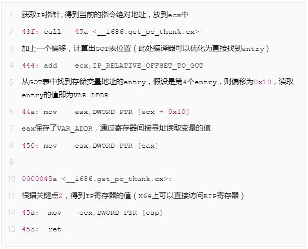

图9 - 结合GOT实现位置无关的mov指令示例

通过上面的步骤，就可以实现代码访问变量的地址无关化。但是还有一个问题，这个GOT表里存储的VAR_ADDR值又是怎么变成实际的绝对地址的呢？

假设有一个libtest.so,有一个全局变量g_var,我们通过readelf -r libtest.so后，会看到如下的输出

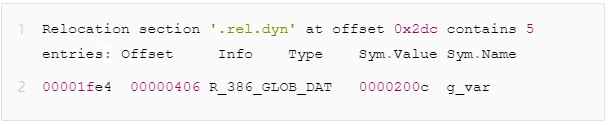

图10 - rel.dyn段全局变量重定向描述字段

动态加载器会解析rel.dyn段，当它看到重定向类型为R_386_GLOB_DAT的时候，会做如下操作：将符号g_var实际的地址值替换到偏移0x1fe4处（也就是将Sym.Value的值替换为实际地址值）

### 2.函数调用的位置无关化实现

从理论上讲，函数的PIC实现也可以通过和数据引用GOT表相同的方式实现位置无关。不直接使用函数的地址，而是通过查GOT来找到实际的函数绝对地址。但实际上函数的PIC特性并不是这么做的，实际情况会复杂一些。为什么不按照和数据引用一样的方式，先来看一个概念：延迟绑定。

对于动态库的函数来说，在没有加载到程序的地址空间前，函数的实际地址都是未知的，动态加载器会处理这些问题，解析出实际地址的过程,这个过程称之为绑定。绑定的动作会消耗一些时间，因为加载器要通过特殊的查表、替换操作。

如果动态库有成百上千个函数接口，而实际的进程只用到了其中的几十个接口，如果全部都在加载的时候进行绑定操作，没有意义并且非常耗时。因此提出了延迟绑定的概念，程序只有在使用到对应接口时才实时地绑定接口地址。

因为有了延迟绑定的需求，所以函数的PIC实现和数据访问的PIC有所区别。为了实现延迟绑定，就额外增加了一个间接表PLT（过程链接表）。

PLT搭配GOT实现延迟绑定的过程如下：

第一次调用函数

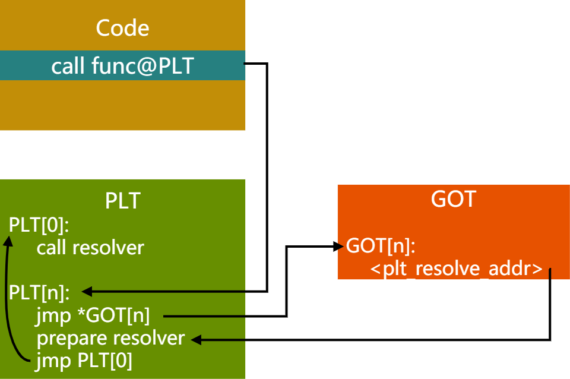

图11 - 首次调用PIC函数时PLT,GOT关系

首先跳到PLT表对应函数地址PLT[n],然后取出GOT中对应的entry。GOT[n]里保存了实际要跳转的函数的地址，首次执行时此值为PLT[n]的prepare resolver的地址，这里准备了要解析的函数的相关参数，然后到PLT[0]处调用resolver进行解析。

resolver函数会做几件事情：

（1）解析出代码想要调用的func函数的实际地址A

（2）用实际地址A覆盖GOT[n]保存的plt_resolve_addr的值

（3）调用func函数

首次调用后，上图的链接关系会变成下图所示：

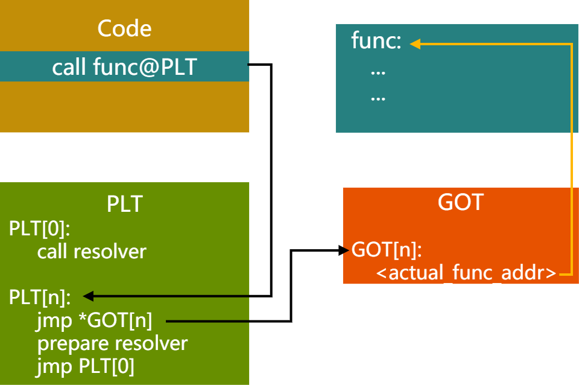

图12 - 首次调用PIC函数后PLT,GOT关系

随后的调用函数过程，就不需要再走resolver过程了

## 三、位置无关可执行程序PIE

PIE，全称Position Independent Executable。2000年早期及以前，PIC用于动态库。对于可执行程序来讲，仍然是使用绝对地址链接，它可以使用动态库，但程序本身的各个segment地址仍然是固定的。随着ASLR的出现，可执行程序运行时各个segment的虚拟地址能够随机分布，这样就让攻击者难以预测程序运行地址，让缓存溢出攻击变得更困难。OS在使能ASLR的时候，会检查可执行程序是否是PIE的可执行程序。gcc选项中添加-fPIE会产生相关代码。

## 四、Linux ASLR机制和PIE的关系

ASLR的全称为 Address Space Layout Randomization。在Linux 2.6.12 中被引入到 Linux 系统，它将进程的某些虚拟地址进行随机化，增大了入侵者预测目的地址的难度，降低应用程序被攻击成功的风险。

在Linux系统上，ASLR有三个级别

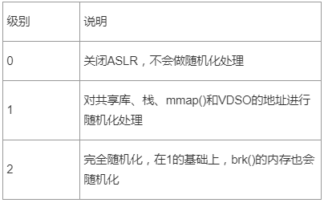

表2 - ASLR级别描述

ASLR的级别通过两种方式配置：

echo level > /proc/sys/kernel/randomize_va_space

或

sysctl -w kernel.randomize_va_space=level

例子:

echo 0 > /proc/sys/kernel/randomize_va_space 关闭地址随机化

或

sysctl -w kernel.randomize_va_space=2 最大级别的地址随机化

我们还是以文章开头的那个程序来说明ASLR在不同级别下时如何表现的，首先在ASLR关闭的情况下，相关地址不变，输出如下：

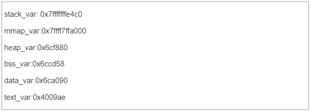

图13 - ASLR=0时虚拟地址空间分配情况

我们把ASLR级别设置为1，运行两次，看看结果：

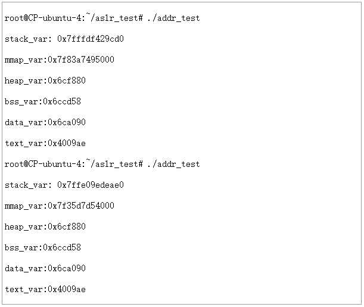

图14 - ASLR=1时虚拟地址空间分配情况

可以看到STACK和MMAP的地址发生了变化。堆、数据段、代码段仍然是固定地址。

接下来我们把ASLR级别设置为2，运行两次，看看结果:

图15 - ASLR=2,PIE不启用时虚拟地址空间分配情况

可以看到此时堆的地址也发生了变化，但是我们发现BSS,DATA,TEXT段的地址仍然是固定的，不是说ASLR=2的时候，是完全随机化吗？

这里就引出了PIE和ASLR的关系了。从上面的实验可以看出，如果不对可执行文件做一些特殊处理，ASLR即使在设置为完全随机化的时候，也仅能对STACK,HEAP，MMAP等运行时才分配的地址空间进行随机化，而可执行文件本身的BSS,DATA,TEXT等没有办法随机化。结合文章前面讲到的PIE相关知识，我们也很容易理解这一点，因为编译和链接过程中，如果没有PIE的选项，生成的可执行文件里都是位置相关的代码。如果OS不管这一点，ASLR=2时也将BSS,DATA,TEXT等随意排布，可想而知程序根本不能正常运行起来。

明白了原因，我们在编译时加入PIE选项，然后在ASLR=2时重新运行一下看看结果如何

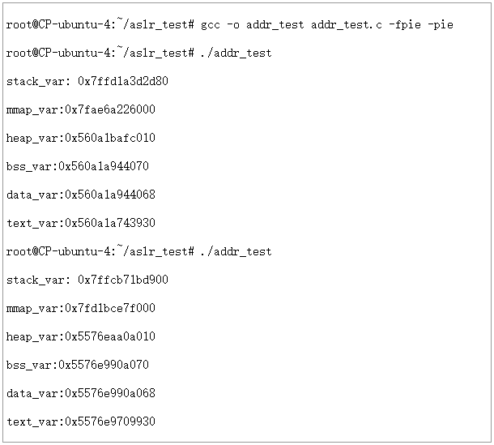

图16 - ASLR=2,PIE启用时虚拟地址空间分配情况

可以看到在PIE打开的情况下，搭配ASLR=2，可以实现各个段的虚拟地址完全随机化分布。

> 更新: 2024-04-19 15:32:48  
> 原文: <https://www.yuque.com/linuxer/gscfv1/cbc42fcdbef7d8604303dc4f7d803be5>