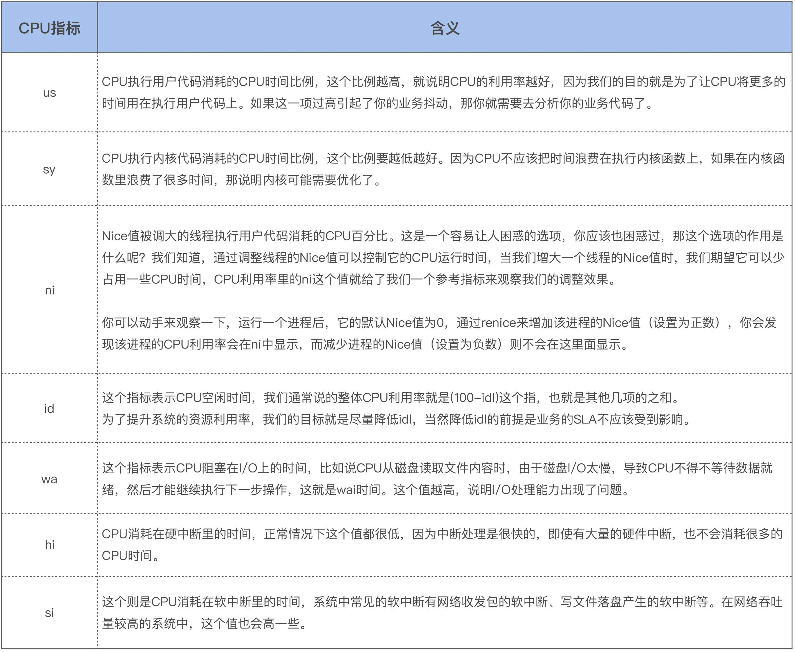
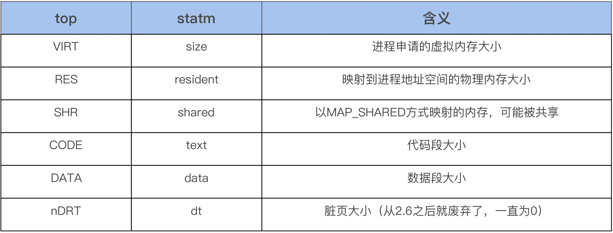

# 24.top命令排查高占有率进程top命令的占用率怎么算的

# 24.top命令排查高占有率进程/top命令的占用率怎么算的


#### Linux top命令的cpu使用率和内存使用率


## 前言


```plain
NAME
       top - display Linux processes
```


## 一、cpu使用率


### 1.1 top简介


top程序提供当前运行系统的动态实时视图，它可以显示系统概要信息以及当前由Linux内核管理的进程或线程列表。


```plain
top - 17:25:17 up 20:23,  2 users,  load average: 0.03, 0.04, 0.05
Tasks: 214 total,   1 running, 213 sleeping,   0 stopped,   0 zombie
%Cpu(s):  0.3 us,  0.2 sy,  0.0 ni, 99.4 id,  0.0 wa,  0.0 hi,  0.0 si,  0.0 st
```


其中cpu这一行中各个字段的意思：


```plain
 us, user    : time running un-niced user processes
 sy, system  : time running kernel processes
 ni, nice    : time running niced user processes
 id, idle    : time spent in the kernel idle handler
 wa, IO-wait : time waiting for I/O completion
 hi : time spent servicing hardware interrupts
 si : time spent servicing software interrupts
 st : time stolen from this vm by the hypervisor
```


us、sy、ni、id、wa、hi、si 和 st 这几个指标之和为 100。


其中 us 和 ni字段都是表示CPU执行用户态程序的时间，普通任务的优先级范围是：nice 可取值范围是 -20 到 19，数值越大，优先级反而越低。一般默认进程的nice值都是0，ni字段代表低优先级用户态 CPU 时间，也就是进程的 nice 值被调整为 1-19 之间时的 CPU 时间。us字段代表较高优先级用户态 CPU 时间，也就是进程的 nice 值为 -20-0 之间时的 CPU 时间。


us + ni 表示 CPU执行用户态程序的总时间。


CPU 使用率，就是除了空闲时间外的其他时间占总 CPU 时间的百分比：


事实上，为了计算 CPU 使用率，性能工具一般都会取间隔一段时间（比如 3 秒）的两次值，作差后，再计算出这段时间内的平均 CPU 使用率，即:





图片来自于 极客时间：Linux内核技术实战


CPU 利用率监控通常是去解析 /proc/stat 文件，而这些文件中就包含了这些细化的指标：


```plain
[root@localhost ~]# cat /proc/stat
cpu  362243 144 278184 132387798 6781 0 326 0 0 0
cpu0 80305 9 63425 33112465 1511 0 196 0 0 0
cpu1 90016 61 69153 33099320 1089 0 34 0 0 0
cpu2 96296 54 73135 33089050 464 0 38 0 0 0
cpu3 95625 19 72468 33086963 3715 0 56 0 0 0
```


各个字段的含义：


```plain
user（通常缩写为 us），代表用户态 CPU 时间。注意，它不包括下面的 nice 时间，但包括了 guest 时间。
nice（通常缩写为 ni），代表低优先级用户态 CPU 时间，也就是进程的 nice 值被调整为 1-19 之间时的 CPU 时间。这里注意，nice 可取值范围是 -20 到 19，数值越大，优先级反而越低。包括了 guest_nice 时间。
system（通常缩写为 sys），代表内核态 CPU 时间。
idle（通常缩写为 id），代表空闲时间。注意，它不包括等待 I/O 的时间（iowait）。
iowait（通常缩写为 wa），代表等待 I/O 的 CPU 时间。
irq（通常缩写为 hi），代表处理硬中断的 CPU 时间。
softirq（通常缩写为 si），代表处理软中断的 CPU 时间。
steal（通常缩写为 st），代表当系统运行在虚拟机中的时候，被其他虚拟机占用的 CPU 时间。
guest（通常缩写为 guest），代表通过虚拟化运行其他操作系统的时间，也就是运行虚拟机的 CPU 时间。
guest_nice（通常缩写为 gnice），代表以低优先级运行虚拟机的时间。
```


与top命令显示的字段意义一样，只不过多显示了两个字段 guest 和 guest_nice


但我们按1后，top命令会显示每个cpu的使用率：


```plain
top - 17:42:13 up 20:40,  2 users,  load average: 0.00, 0.01, 0.05
Tasks: 213 total,   1 running, 212 sleeping,   0 stopped,   0 zombie
%Cpu0  :  0.0 us,  0.0 sy,  0.0 ni,100.0 id,  0.0 wa,  0.0 hi,  0.0 si,  0.0 st
%Cpu1  :  0.0 us,  0.0 sy,  0.0 ni,100.0 id,  0.0 wa,  0.0 hi,  0.0 si,  0.0 st
%Cpu2  :  1.0 us,  0.7 sy,  0.0 ni, 98.3 id,  0.0 wa,  0.0 hi,  0.0 si,  0.0 st
%Cpu3  :  0.0 us,  0.0 sy,  0.0 ni,100.0 id,  0.0 wa,  0.0 hi,  0.0 si,  0.0 st
```


### 1.2 cpu使用率的来源


使用strace跟踪 top系统调用：


```plain
[root@localhost]# strace -e open top -n 1 2>top_log
```


top命令默认3S刷新一次，我这里加了 -n 1 只输出一次结果，不随时间刷新，方便跟踪 top 命令：


```plain
NAME
       top - display Linux processes

   -n  :Number-of-iterations limit as:  -n number
        Specifies the maximum number of iterations, or frames, top should produce before ending.
```


关于cpu的信息是解析/proc/stat获取：


```plain
[root@localhost]# cat top_log | grep /proc/stat
open("/proc/stat", O_RDONLY)            = 4
```


关于每个进程的cpu使用情况是从/proc/pid/stat文件中获取：


```plain
open("/proc/stat", O_RDONLY)            = 4
open("/proc/uptime", O_RDONLY)          = 5
open("/proc/1/stat", O_RDONLY)          = 7
open("/proc/1/statm", O_RDONLY)         = 7
open("/etc/nsswitch.conf", O_RDONLY|O_CLOEXEC) = 7
open("/etc/ld.so.cache", O_RDONLY|O_CLOEXEC) = 7
open("/lib64/libnss_files.so.2", O_RDONLY|O_CLOEXEC) = 7
open("/etc/passwd", O_RDONLY|O_CLOEXEC) = 7
open("/proc/2/stat", O_RDONLY)          = 7
open("/proc/2/statm", O_RDONLY)         = 7
open("/proc/3/stat", O_RDONLY)          = 7
open("/proc/3/statm", O_RDONLY)         = 7
open("/proc/5/stat", O_RDONLY)          = 7
open("/proc/5/statm", O_RDONLY)         = 7
open("/proc/7/stat", O_RDONLY)          = 7
open("/proc/7/statm", O_RDONLY)         = 7
open("/proc/8/stat", O_RDONLY)          = 7
open("/proc/8/statm", O_RDONLY)         = 7
open("/proc/9/stat", O_RDONLY)          = 7
open("/proc/9/statm", O_RDONLY)         = 7
open("/proc/10/stat", O_RDONLY)         = 7
open("/proc/10/statm", O_RDONLY)        = 7
open("/proc/11/stat", O_RDONLY)         = 7
open("/proc/11/statm", O_RDONLY)        = 7
open("/proc/12/stat", O_RDONLY)         = 7
open("/proc/12/statm", O_RDONLY)        = 7
open("/proc/13/stat", O_RDONLY)         = 7
open("/proc/13/statm", O_RDONLY)        = 7
open("/proc/14/stat", O_RDONLY)         = 7
open("/proc/14/statm", O_RDONLY)        = 7
open("/proc/16/stat", O_RDONLY)         = 7
open("/proc/16/statm", O_RDONLY)        = 7
open("/proc/17/stat", O_RDONLY)         = 7
open("/proc/17/statm", O_RDONLY)        = 7
open("/proc/18/stat", O_RDONLY)         = 7
open("/proc/18/statm", O_RDONLY)        = 7
open("/proc/19/stat", O_RDONLY)         = 7
open("/proc/19/statm", O_RDONLY)        = 7
open("/proc/21/stat", O_RDONLY)         = 7
open("/proc/21/statm", O_RDONLY)        = 7
open("/proc/22/stat", O_RDONLY)         = 7
open("/proc/22/statm", O_RDONLY)        = 7
open("/proc/23/stat", O_RDONLY)         = 7
open("/proc/23/statm", O_RDONLY)        = 7
open("/proc/24/stat", O_RDONLY)         = 7
```


### 1.3 内核相关源码


```plain
// linux-3.10/include/linux/kernel_stat.h

/*

 * 'kernel_stat.h' contains the definitions needed for doing
 * some kernel statistics (CPU usage, context switches ...),
 * used by rstatd/perfmeter
   */

enum cpu_usage_stat {
	CPUTIME_USER,
	CPUTIME_NICE,
	CPUTIME_SYSTEM,
	CPUTIME_SOFTIRQ,
	CPUTIME_IRQ,
	CPUTIME_IDLE,
	CPUTIME_IOWAIT,
	CPUTIME_STEAL,
	CPUTIME_GUEST,
	CPUTIME_GUEST_NICE,
	NR_STATS,
};

struct kernel_cpustat {
	u64 cpustat[NR_STATS];
};

DECLARE_PER_CPU(struct kernel_cpustat, kernel_cpustat);

/* Must have preemption disabled for this to be meaningful. */
#define kcpustat_this_cpu (&__get_cpu_var(kernel_cpustat))
#define kcpustat_cpu(cpu) per_cpu(kernel_cpustat, cpu)
```


```plain
// linux-3.10/kernel/sched/core.c

DEFINE_PER_CPU(struct kernel_cpustat, kernel_cpustat);
EXPORT_PER_CPU_SYMBOL(kernel_cpustat);
```


```plain
[root@localhost ~]# cat /proc/kallsyms | grep '\<kernel_cpustat\>'
0000000000015b00 A kernel_cpustat
```


```plain
[root@localhost ~]# cat /proc/kallsyms | grep '\<__per_cpu_start\>'
0000000000000000 A __per_cpu_start
[root@localhost ~]# cat /proc/kallsyms | grep '\<__per_cpu_end\>'
000000000001d000 A __per_cpu_end
```


kernel_cpustat 在 _per_cpu_start 和 __per_cpu_end 范围内，是内核中的per-cpu变量。


更新cpu的使用率数据 cpu_usage_stat ，是在时钟中断中完成的，时钟中断处理程序每次都会调用 account_process_tick 函数来更新 cpu_usage_stat结构体：


+  

```plain

```

 


// linux-3.10/kernel/sched/cputime.c


/*


```plain
 * Account a single tick of cpu time.

 * @p: the process that the cpu time gets accounted to
```


+  @user_tick: indicates if the tick is a user or a system tick  
*/  
void account_process_tick(struct task_struct *p, int user_tick)  
{  
cputime_t one_jiffy_scaled = cputime_to_scaled(cputime_one_jiffy);  
struct rq *rq = this_rq();  
if (vtime_accounting_enabled())  
return;  
if (sched_clock_irqtime) {  
irqtime_account_process_tick(p, user_tick, rq);  
return;  
}  
// 统计CPUTIME_STEAL  
if (steal_account_process_tick())  
return;  
if (user_tick)  
(1) 统计用户时间(包括 CPUTIME_USER 和 CPUTIME_NICE )  
account_user_time(p, cputime_one_jiffy, one_jiffy_scaled);  
else if ((p != rq->idle) || (irq_count() != HARDIRQ_OFFSET))  
(2) 统计内核时间(包括 CPUTIME_SYSTEM、CPUTIME_IRQ 和 CPUTIME_SOFTIRQ )  
account_system_time(p, HARDIRQ_OFFSET, cputime_one_jiffy,  
one_jiffy_scaled);  
else  
(3) 统计空闲时间(包括 CPUTIME_IOWAIT 和 CPUTIME_IDLE)  
account_idle_time(cputime_one_jiffy);  
} 


```plain


(1) 统计用户时间(包括 CPUTIME_USER 和 CPUTIME_NICE )

* ```
// linux-3.10/kernel/sched/cputime.c

   /*

    * Account user cpu time to a process.

    * @p: the process that the cpu time gets accounted to
   
    * @cputime: the cpu time spent in user space since the last update
   
 * @cputime_scaled: cputime scaled by cpu frequency
      */
   void account_user_time(struct task_struct *p, cputime_t cputime,
      	       cputime_t cputime_scaled)
      {
   int index;
   
      /* Add user time to process. */
   p->utime += cputime;
   p->utimescaled += cputime_scaled;
   account_group_user_time(p, cputime);

   index = (TASK_NICE(p) > 0) ? CPUTIME_NICE : CPUTIME_USER;

   /* Add user time to cpustat. */
   task_group_account_field(p, index, (__force u64) cputime);

   /* Account for user time used */
   acct_account_cputime(p);
   }
```


(2) 统计内核时间(包括 CPUTIME_SYSTEM、CPUTIME_IRQ 和 CPUTIME_SOFTIRQ )


+  

```plain

```

 


// linux-3.10/kernel/sched/cputime.c


```plain
 * Account system cpu time to a process.

 * @p: the process that the cpu time gets accounted to

 * @hardirq_offset: the offset to subtract from hardirq_count()

 * @cputime: the cpu time spent in kernel space since the last update

 * @cputime_scaled: cputime scaled by cpu frequency
*/
   void account_system_time(struct task_struct *p, int hardirq_offset,
   		 cputime_t cputime, cputime_t cputime_scaled)
   {
   int index;

   if ((p->flags & PF_VCPU) && (irq_count() - hardirq_offset == 0)) {
	// 统计 CPUTIME_GUEST 和 CPUTIME_GUEST_NICE
   	account_guest_time(p, cputime, cputime_scaled);
	return;
}

if (hardirq_count() - hardirq_offset)
	index = CPUTIME_IRQ;
else if (in_serving_softirq())
	index = CPUTIME_SOFTIRQ;
else
	index = CPUTIME_SYSTEM;

__account_system_time(p, cputime, cputime_scaled, index);
}
```


```plain

(3) 统计空闲时间(包括 CPUTIME_IOWAIT 和 CPUTIME_IDLE)

* ```
// linux-3.10/kernel/sched/cputime.c

/*
   
    * Account for idle time.

    * @cputime: the cpu time spent in idle wait
      */
      void account_idle_time(cputime_t cputime)
      {
   u64 *cpustat = kcpustat_this_cpu->cpustat;
   struct rq *rq = this_rq();

   if (atomic_read(&rq->nr_iowait) > 0)
   	cpustat[CPUTIME_IOWAIT] += (__force u64) cputime;
   else
   	cpustat[CPUTIME_IDLE] += (__force u64) cputime;
   }
```


（4）统计CPUTIME_STEAL


+  

```plain

```

 


/*


+  Account for involuntary wait time. 
+  @cputime: the cpu time spent in involuntary wait  
*/  
void account_steal_time(cputime_t cputime)  
{  
u64 *cpustat = kcpustat_this_cpu->cpustat;  
cpustat[CPUTIME_STEAL] += (__force u64) cputime;  
} 


```plain


（5）统计 CPUTIME_GUEST 和 CPUTIME_GUEST_NICE

（5）统计 CPUTIME_GUEST 和 CPUTIME_GUEST_NICE

* ```
// linux-3.10/kernel/sched/cputime.c

   /*

    * Account guest cpu time to a process.

    * @p: the process that the cpu time gets accounted to
   
    * @cputime: the cpu time spent in virtual machine since the last update
   
    * @cputime_scaled: cputime scaled by cpu frequency
   */
      static void account_guest_time(struct task_struct *p, cputime_t cputime,
      		       cputime_t cputime_scaled)
      {
      u64 *cpustat = kcpustat_this_cpu->cpustat;
   
      /* Add guest time to process. */
      p->utime += cputime;
      p->utimescaled += cputime_scaled;
   account_group_user_time(p, cputime);
   p->gtime += cputime;

   /* Add guest time to cpustat. */
   if (TASK_NICE(p) > 0) {
   	cpustat[CPUTIME_NICE] += (__force u64) cputime;
   	cpustat[CPUTIME_GUEST_NICE] += (__force u64) cputime;
   } else {
   	cpustat[CPUTIME_USER] += (__force u64) cputime;
   	cpustat[CPUTIME_GUEST] += (__force u64) cputime;
   }
   }
```


从 account_guest_time 函数中我们可以看到 guest cpu time 是被统计到了 用户态 cpu 时间中，即：  
user（通常缩写为 us），代表用户态 CPU 时间，包括了 guest 时间。CPUTIME_NICE成员中包含了CPUTIME_GUEST_NICE成员。  
nice（通常缩写为 ni），代表低优先级用户态 CPU 时间，包括了 guest_nice 时间。CPUTIME_USER成员包含了CPUTIME_GUEST成员。


## 二、内存使用率


### 2.1 总内存有关的数据


```plain
KiB Mem :  7890812 total,  6313084 free,   501864 used,  1075864 buff/cache
KiB Swap:  8126460 total,  8126460 free,        0 used.  7008280 avail Mem
```


默认情况下，第1行显示物理内存：total = free + used + buff/cache


运行top后，按E可以切换内存大小显示的单位：


```plain
GiB Mem :      7.5 total,      6.0 free,      0.5 used,      1.0 buff/cache
GiB Swap:      7.7 total,      7.7 free,      0.0 used.      6.7 avail Mem
```


### 2.2 进程使用内存有关的数据


```plain
  PID USER      PR  NI    VIRT    RES    SHR S  %CPU %MEM     TIME+ COMMAND
17487 root      20   0  162148   2324   1548 R   6.2  0.0   0:00.01 top
    1 root      20   0  193800   6972   4200 S   0.0  0.1   0:18.30 systemd
    2 root      20   0       0      0      0 S   0.0  0.0   0:00.17 kthreadd
    3 root      20   0       0      0      0 S   0.0  0.0   0:01.04 ksoftirqd/0
    5 root       0 -20       0      0      0 S   0.0  0.0   0:00.00 kworker/0:0H
```


其中与进程内存有关的字段VIRT、RES、SHR和%MEM


```plain
 VIRT  --  Virtual Memory Size (KiB)
           The total amount of virtual memory used by the task.  It includes all code, data and shared libraries plus pages that have been swapped out and pages that have  been  mapped  but  not
           used.
```


```plain
RES  --  Resident Memory Size (KiB)
           The non-swapped physical memory a task is using.
```


RES 中有一些物理内存是被一些进程给共享的。


```plain
 SHR  --  Shared Memory Size (KiB)
           The amount of shared memory available to a task, not all of which is typically resident.  It simply reflects memory that could be potentially shared with other processes.
```


```plain
 %MEM  --  Memory Usage (RES)
           A task's currently used share of available physical memory.
```


运行top后，按g，在按3进入内存模式：


```plain
  PID %MEM    VIRT    RES   CODE    DATA    SHR nMaj nDRT  %CPU COMMAND
 5736  1.3 3269676 100932     16 2134452  40200   85    0   0.0 gnome-shell
 4635  0.4  358196  29168      4   94984   7028    1    0   0.0 firewalld
 5265  0.3  264324  26332   2284   90140  10616    0    0   0.0 X
 5184  0.3 1012032  21440    468  641332  12948    0    0   0.0 libvirtd
 4533  0.2  620088  17908    108  529600   5352    2    0   0.0 polkitd
 5177  0.2  573828  17408      4  304768   6116    1    0   0.0 tuned
 ......
```


在内存模式中，我们可以看到各个进程内存的 %MEM、VIRT、RES、CODE、DATA、SHR、nMaj、nDRT，这些信息通过 strace 来跟踪 top 进程，你会发现这些信息都是从 /proc/[pid]/statm 和 /proc/[pid]/stat 这个文件里面读取的。  
除了 nMaj（Major Page Fault， 主缺页中断，指内容不在内存中然后从磁盘中来读取的页数）外，%MEM 则是从 RES 计算而来的，其余的内存信息都是从 statm 文件里面读取的，如下是 top 命令中的字段和 statm 中字段的对应关系：


```plain
[root@localhost]# cat /proc/1/statm
48450 1743 1050 353 0 37524 0
```





```plain
CODE  --  Code Size (KiB)
           The amount of physical memory devoted to executable code, also known as the Text Resident Set size or TRS.
```


```plain
DATA  --  Data + Stack Size (KiB)
           The amount of physical memory devoted to other than executable code, also known as the Data Resident Set size or DRS.
```


```plain
nMaj  --  Major Page Fault Count
           The number of major page faults that have occurred for a task.  A page fault occurs when a process attempts to read from or write to a virtual page that is not  currently  present  in
           its address space.  A major page fault is when auxiliary storage access is involved in making that page available.
```


与nMaj相对应的还有nMin：


```plain
nMin  --  Minor Page Fault count
           The  number  of  minor page faults that have occurred for a task.  A page fault occurs when a process attempts to read from or write to a virtual page that is not currently present in
           its address space.  A minor page fault does not involve auxiliary storage access in making that page available.
```


major fault与minor fault的区别：


major fault：  
user space address触发缺页异常时，若被访问的地址映射的物理页已经被swap到磁盘空间，需要从磁盘中将页面换入。  
user space address触发缺页异常时，若被访问的地址空间是被mmap映射到磁盘文件的话且page cache中还未缓存文件内容，需要通过磁盘IO将内容读入page cache。


minor fault：  
当user space address触发缺页异常时，kernel可直接从buddy system中分配出内存用来满足该缺页异常即minor page fault  
简单来说，major fault和minor fault的区别就是是否会触发读写磁盘的动作。


来源于Linux内存管理：缺页异常(一)


```plain
nDRT  --  Dirty Pages Count
           The number of pages that have been modified since they were last written to auxiliary storage.  Dirty pages must be written to auxiliary storage before the corresponding physical mem‐
           ory location can be used for some other virtual page.
```


### 2.3 内存使用率的来源


总的内存使用率数据来源：/proc/meminfo


```plain
open("/proc/meminfo", O_RDONLY)         = 6
open("/proc/meminfo", O_RDONLY|O_CLOEXEC) = 8
```


每个进程内存使用率数据来源：/proc/pid/statm


```plain
open("/proc/2/stat", O_RDONLY)          = 7
open("/proc/2/statm", O_RDONLY)         = 7
open("/proc/3/stat", O_RDONLY)          = 7
open("/proc/3/statm", O_RDONLY)         = 7
open("/proc/5/stat", O_RDONLY)          = 7
open("/proc/5/statm", O_RDONLY)         = 7
open("/proc/7/stat", O_RDONLY)          = 7
open("/proc/7/statm", O_RDONLY)         = 7
open("/proc/8/stat", O_RDONLY)          = 7
open("/proc/8/statm", O_RDONLY)         = 7
open("/proc/9/stat", O_RDONLY)          = 7
open("/proc/9/statm", O_RDONLY)         = 7
open("/proc/10/stat", O_RDONLY)         = 7
open("/proc/10/statm", O_RDONLY)        = 7
open("/proc/11/stat", O_RDONLY)         = 7
open("/proc/11/statm", O_RDONLY)        = 7
open("/proc/12/stat", O_RDONLY)         = 7
open("/proc/12/statm", O_RDONLY)        = 7
open("/proc/13/stat", O_RDONLY)         = 7
open("/proc/13/statm", O_RDONLY)        = 7
open("/proc/14/stat", O_RDONLY)         = 7
open("/proc/14/statm", O_RDONLY)        = 7
open("/proc/16/stat", O_RDONLY)         = 7
open("/proc/16/statm", O_RDONLY)        = 7
open("/proc/17/stat", O_RDONLY)         = 7
open("/proc/17/statm", O_RDONLY)        = 7
open("/proc/18/stat", O_RDONLY)         = 7
open("/proc/18/statm", O_RDONLY)        = 7
open("/proc/19/stat", O_RDONLY)         = 7
open("/proc/19/statm", O_RDONLY)        = 7
open("/proc/21/stat", O_RDONLY)         = 7
open("/proc/21/statm", O_RDONLY)        = 7
open("/proc/22/stat", O_RDONLY)         = 7
open("/proc/22/statm", O_RDONLY)        = 7
......
```


三、 pmap  
pmap可以查看进程的内存使用情况：


```plain
NAME
       pmap - report memory map of a process
```


```plain
DESCRIPTION
       The pmap command reports the memory map of a process or processes.
```


```plain
    -x, --extended
              Show the extended format.
       -X     Show even more details than the -x option.  format changes according to /proc/PID/smaps
```


pmap 来展示 sshd 进程地址空间里的部分内容：


```plain
17873:   sshd: root@notty
Address           Kbytes     RSS   Dirty Mode  Mapping
00005651ff6d4000     800     464       0 r-x-- sshd
00005651ff99b000      16      16      16 r---- sshd
00005651ff99f000       4       4       4 rw--- sshd
00005651ff9a0000      36      36      36 rw---   [ anon ]
000056520036b000     276     176     176 rw---   [ anon ]
00007f80cad53000      32      28       0 r-x-- libnss_sss.so.2
00007f80cad5b000    2044       0       0 ----- libnss_sss.so.2
00007f80caf5a000       4       4       4 r---- libnss_sss.so.2
00007f80caf5b000       4       4       4 rw--- libnss_sss.so.2
00007f80caf5c000     120      24       0 r-x-- libgssrpc.so.4.2
00007f80caf7a000    2048       0       0 ----- libgssrpc.so.4.2
00007f80cb17a000       4       4       4 r---- libgssrpc.so.4.2
00007f80cb17b000       4       4       4 rw--- libgssrpc.so.4.2
00007f80cb17c000     108      40       0 r-x-- proxymech.so
00007f80cb197000    2048       0       0 ----- proxymech.so
00007f80cb397000       4       4       4 r---- proxymech.so
00007f80cb398000       4       4       4 rw--- proxymech.so
00007f80cb399000      12      12       0 r-x-- pam_lastlog.so
00007f80cb39c000    2044       0       0 ----- pam_lastlog.so
00007f80cb59b000       4       4       4 r---- pam_lastlog.so
00007f80cb59c000       4       4       4 rw--- pam_lastlog.so
00007f80cb59d000      12       8       0 r-x-- libpam_misc.so.0.82.0
00007f80cb5a0000    2044       0       0 ----- libpam_misc.so.0.82.0
00007f80cb79f000       4       4       4 r---- libpam_misc.so.0.82.0
00007f80cb7a0000       4       4       4 rw--- libpam_misc.so.0.82.0
......
```


每一行表示一种类型的内存（Virtual Memory Area），每一列的含义如下：  
（1）Mapping，用来表示文件映射中占用内存的文件，比如 sshd 这个可执行文件，或者堆[heap]，或者栈[stack]，或者其他，等等。  
（2）Mode，它是该内存的权限，比如，“r-x”是可读可执行，它往往是代码段 (Text Segment)；“rw-”是可读可写，这部分往往是数据段 (Data Segment)；“r–”是只读，这往往是数据段中的只读部分。  
（3）Address、Kbytes、RSS、Dirty，Address 和 Kbytes 分别表示起始地址和虚拟内存的大小，RSS（Resident Set Size）则表示虚拟内存中已经分配的物理内存的大小，Dirty 则表示内存中数据未同步到磁盘的字节数。


其中 RSS是指进程地址空间已映射的物理内存（进程地址空间与物理内存页面建立了页表映射），这个物理内存有可能是Shared方式来映射的，那这块物理内存就是Shared memory。也就是说RSS的本质是物理内存是否映射到了进程的地址空间，而和映射属性无关，因此 RSS会包括Shared memory。


可以看到，通过 pmap 我们能够清楚地观察一个进程的整个的地址空间，包括它们分配的物理内存大小，这非常有助于我们对进程的内存使用概况做一个大致的判断。比如说，如果地址空间中[heap]太大，那有可能是堆内存产生了泄漏；再比如说，如果进程地址空间包含太多的 vma（可以把 maps 中的每一行理解为一个 vma），那很可能是应用程序调用了很多 mmap 而没有 munmap；再比如持续观察地址空间的变化，如果发现某些项在持续增长，那很可能是那里存在问题。


pmap 同样也是解析的 /proc 里的文件，具体文件是 /proc/[pid]/maps 和 /proc/[pid]/smaps，其中 smaps 文件相比 maps 的内容更详细，可以理解为是对 maps 的一个扩展。你可以对比 /proc/[pid]/maps 和 pmaps 的输出，你会发现二者的内容是一致的。


通过strace命令可以看到pmap解析的是/proc/[pid]/maps文件：


```plain
strace -e open pmap -x `pidof sshd` 2>pmap_log
```


```plain
open("/proc/self/maps", O_RDONLY)       = 3
open("/proc/17873/stat", O_RDONLY)      = 3
open("/proc/17873/cmdline", O_RDONLY)   = 3
open("/proc/17873/smaps", O_RDONLY)     = 3
open("/usr/lib64/gconv/gconv-modules.cache", O_RDONLY) = 4
open("/proc/17869/stat", O_RDONLY)      = 3
open("/proc/17869/cmdline", O_RDONLY)   = 3
open("/proc/17869/smaps", O_RDONLY)     = 3
open("/proc/17239/stat", O_RDONLY)      = 3
open("/proc/17239/cmdline", O_RDONLY)   = 3
open("/proc/17239/smaps", O_RDONLY)     = 3
open("/proc/17235/stat", O_RDONLY)      = 3
open("/proc/17235/cmdline", O_RDONLY)   = 3
open("/proc/17235/smaps", O_RDONLY)     = 3
open("/proc/17141/stat", O_RDONLY)      = 3
open("/proc/17141/cmdline", O_RDONLY)   = 3
open("/proc/17141/smaps", O_RDONLY)     = 3
open("/proc/17137/stat", O_RDONLY)      = 3
open("/proc/17137/cmdline", O_RDONLY)   = 3
open("/proc/17137/smaps", O_RDONLY)     = 3
open("/proc/5174/stat", O_RDONLY)       = 3
open("/proc/5174/cmdline", O_RDONLY)    = 3
open("/proc/5174/smaps", O_RDONLY)      = 3
```


> 更新: 2024-04-19 15:32:49  
> 原文: <https://www.yuque.com/linuxer/gscfv1/38911be473141db58949861c865fba8f>