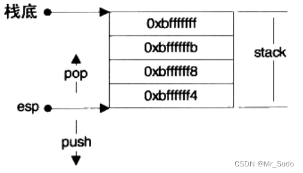
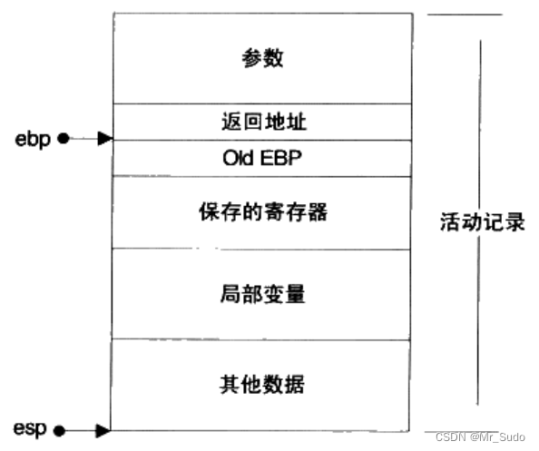

# 25.谈谈进程创建后在Linux中的内存分布？（回答内存四区，虚拟地址空间，栈内存堆内存）

# 25.谈谈进程创建后在Linux中的内存分布？（回答内存四区，虚拟地址空间，栈内存堆内存）

## 1.内存分布

以32位系统为例，共有4G的寻址能力，进程在内存中的分布如下图所示。Linux默认将高地址的1G空间分配给内核，称为内核空间，剩下的3G空间分配给进程使用，称为用户空间。

用户空间从低地址空间到高地址空间包含如下5个部分：

+ 代码段（text segment）：存放程序的可执行二进制代码
+ 数据段（data segment）：存放程序中已经初始化且初值不为0的全局变量和静态局部变量，数据段属于静态内存分配
+ BSS段：存放未初始化的全局变量和静态局部变量；初值为0的全局变量和静态局部变量
+ 堆（heap）：用于存放程序运行时动态分配的内存段，可动态扩张或者缩减
+ 栈（stack）：由编译器自动分配释放，它存放如下信息：
+ 函数内部声明的非静态局部变量
+ 记录函数调用过程的相关维护信息（称为栈帧）
+ 内存映射区域：可以用于内存映射，或者装在动态链接库

## 2.栈

一个栈的实例如下图所示：

esp寄存器指向栈顶，通过控制esp寄存器可以实现数据的压缩和弹出。栈在程序的运行中非常重要，保存了一个函数调用所需维护的信息，通常被称为栈帧（Stack Frame），一个栈帧通常包含如下几个部分：

+  函数的返回地址和参数 
+  临时变量：函数的非静态局部变量和编译器自动生成的其他临时变量 
+  保存的上下文：函数在调用前后需要保持不变的寄存器 

一个函数的栈帧通常使用ebp和esp这两个寄存器来划定范围。esp寄存器始终指向栈的顶部，ebp指向栈帧的一个固定位置，ebp寄存器又被称为帧指针。一个常见的栈帧如下图所示：

## 3.堆

程序可以在堆上自由地申请空间使用，例如使用malloc申请内存空间。在实际实现过程中，程序会像操作系统申请一块适当大小的堆空间，然后由程序自己管理这块空间。这样可以避免每次申请内存都使用系统调用，带来的性能开销。

堆空间管理涉及到如下两个系统调用：

+ brk()： 设置进程数据段的结束地址，即它可以扩大和缩小数据段。如果将数据段的结束地址向高地址移动，扩大的那部分空间可以被程序使用。Glibc中还有一个函数叫sbrk()，它以一个增量作为参数，即增加（或减少）的空间大小，返回值是增加（减少）后数据段的结束地址，sbrk()是对brk()系统调用的包装。
+ mmap()： 它的作用是向操作系统申请一段虚拟地址空间，该虚拟空间可以映射到某个文件，如果不将该地址映射到某个文件时，这块虚拟空间称为匿名空间，匿名空间可以拿来作为堆空间。

> 更新: 2024-04-19 15:32:51  
> 原文: <https://www.yuque.com/linuxer/gscfv1/9a240afaa3aee0555cc33f9dfa82860c>