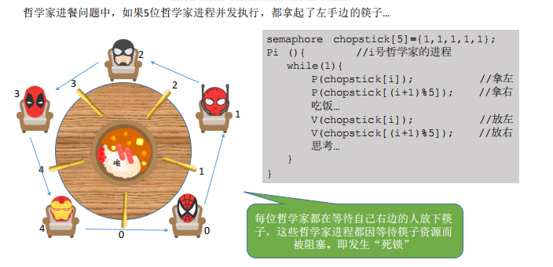
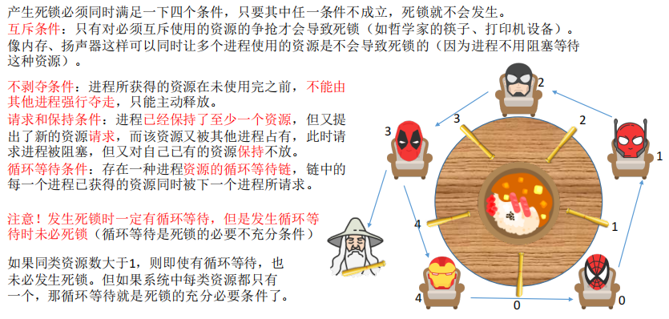
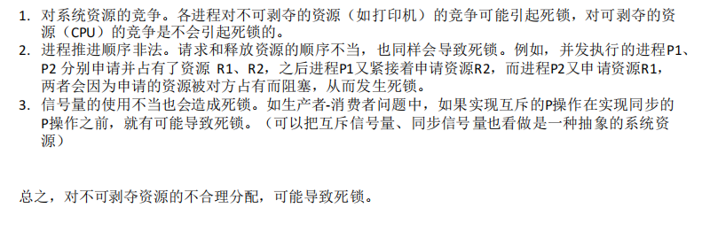
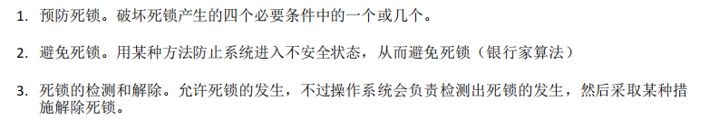
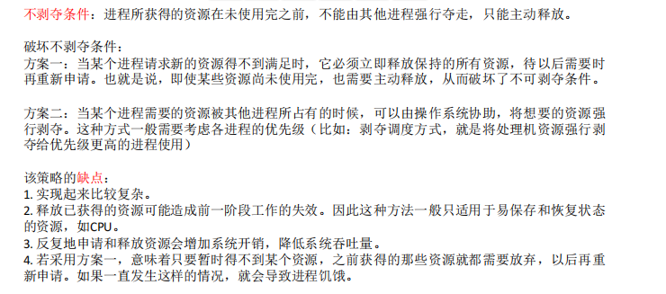
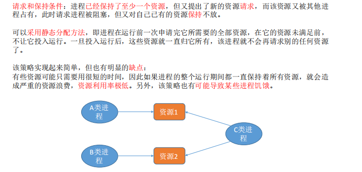
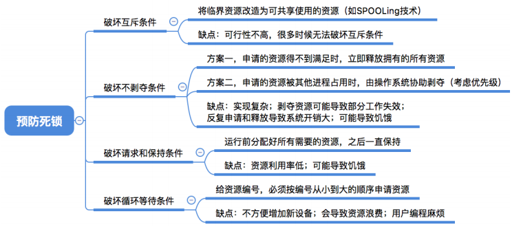
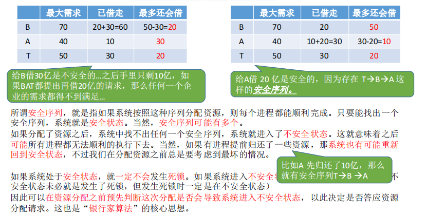
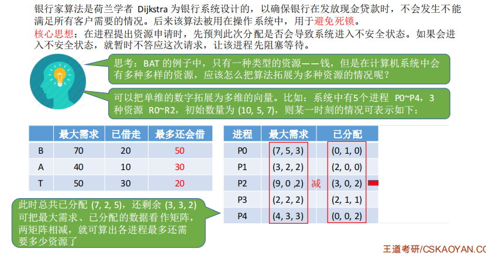

# 27.死锁的概念，进程调度算法怎么解决死锁

# 27.死锁的概念，进程调度算法怎么解决死锁


## 一、什么是死锁





**死锁（Deadlock）：**是指两个或两个以上的进程在执行过程中，因争夺资源而造成的一种互相等待的现象，若无外力作用，它们都将无法推进下去。称此时系统处于死锁状态或系统产生了死锁。  
称这些永远在互相等待的进程为死锁进程。  
所占用的资源或者需要它们进行某种合作的其它进程就会相继陷入死锁，最终可能导致整个系统处于瘫痪状态。


学到这里，我们可能会对前面提到的几个名词感到困惑，**死锁，饥饿，死循环**一样吗？都代表什么意思呢？


死锁和饥饿是操作系统导致的问题，而死循环则是被管理者的问题，也就是程序员的问题。


针对上面银行家算法，防止死锁发生可采取的措施：


（1）最多允许4个哲学家同时坐在桌子周围。  
（2）仅当一个哲学家左右两边的筷子都可用时，才允许他拿筷子。


（3）给所有哲学家编号，奇数号的哲学家必须首先拿左边的筷子，偶数号的哲学家则反之。


这里给出一个不会发生死锁的哲学家进餐过程的算法描述。


[](javascript:void(0);)


```plain
semaphore S[5] = {1,1,1,1,1};//5双筷子
semaphore mutex = 4;//最多允许4个哲学家
Pi()
{
    while(1)
    {
        P(mutex);
        P(S[i]);
        拿起左边的叉子;
        P(S[i＋1]mod5);
        拿起右边的叉子;
        吃通心粉;
        放下左边的叉子;
        V(S[i]);
        放下右边的叉子;
        V(S[i＋1]mod5);
        V(mutex);
    }
}
```


[](javascript:void(0);)


## 二、产生死锁的必要条件





**互斥条件**


**不可剥夺条件**


**占有并请求条件**


**循环等待条件**


## 三、产生死锁的原因





主要原因有两个：竞争临界资源和进程推进顺序不当。


总之就是对不可剥夺资源的不合理分配，可能导致死锁。


一个小问题：


一个OS有20个进程，竞争使用65个同类资源，申请方式是逐个进行的，一旦某个进程获得它所需要的全部资源，则立即归还所有资源。每个进程最多使用三个资源。若仅考虑这类资源，该系统有无可能产生死锁，为什么？


**答：不可能。**因为死锁产生的原因有两点：系统资源不足或推进顺序不当，在本题中，进程所需的最大资源数为60，而系统共有该类资源65个，其资源数已足够系统内各进程使用。


## 四、死锁的处理策略





## 五、死锁概念总结


## 六、死锁的预防


死锁的预防是通过破坏产生死锁的必要条件之一，是系统不会产生死锁。简单方法是在系统运行之前就采取措施，即在系统设计时确定资源分配算法，消除发生死锁的任何可能性。该方法虽然比较保守、资源利用率低，但因简单明了并且安全可靠，仍被广泛采用。**这是一种预先的静态策略。**


### 破坏互斥条件


### 破坏不可剥夺条件





### 破坏请求和保持条件





### 破坏循环等待条件


**产生死锁的四个必要条件中，互斥条件和不可剥夺条件由共享资源本身的使用特性所决定的，因此不好破坏，相反还应加以保证，实用的死锁预防办法就是通过破坏产生死锁的占用并请求条件和循环等待条件。**


### 总结





## 七、死锁的避免


### 安全序列


王道考研的老师在将安全序列的时候，举了一个银行给BAT三家公司借钱的例子用来引出银行家算法，很有意思。


这时候如果将30亿借给了B公司，那么手里还有10亿元，这10亿已经小于3家公司最小的最多还会借的钱数，没有公司能够达到提出的最大要求，这样银行的钱就会打水漂了！！！


如果是这种情况呢？


这样按照T->B->A的顺序借钱是没有问题的，是安全的。


按照A->T->B的顺序借钱也是没有问题的。


这样我们就会得到安全序列、不安全序列和死锁的关系了。





**注意：**


（1）系统在某一时刻的安全状态可能不唯一，但这不影响对系统安全性的判断。  
（2）安全状态是非死锁状态，而不安全状态并不一定是死锁状态。即系统处于安全状态一定可以避免死锁，而系统处于不安全状态则仅仅可能进入死锁状态。


原因是如果进入了不安全状态，但是没有进程去请求资源，并且有进程提前归还了一些资源，这样就不会死锁。


### 银行家算法





**银行家问题的本质：**


要设法保证系统动态分配资源后不进入不安全状态，以避免可能产生的死锁。  
即：每当进程提出资源请求且系统的资源能够满足该请求时，系统将判断如果满足此次资源请求，系统状态是否安全，如果判断结果为安全，则给该进程分配资源，否则不分配资源，申请资源的进程将阻塞。  


当Pi发出资源请求后，系统按下述步骤进行检查：  
1.如果Requesti > Needi,则出错。  
2.如果Requesti>Available,则Pi 阻塞；  
3.系统试探把要求的资源分配给进程Pi，并修改下面数据结构中的数值：  
Availablei=Availablei-Requesti;  
Allocationi=Allocationi+Requesti;  
Needi = Needi- Requesti;  
\4. 系统执行安全性算法，检查此次资源分配后，系统是否处于安全状态。若安全，正式将资源分配给进程Pi，以完成本次分配；否则，将试探分配作废，恢复原来的资源分配状态，让进程Pi等待。  


银行家算法从避免死锁的角度上说是非常有效的，但是，从某种意义上说，它缺乏实用价值，因为很少有进程能够在运行前就知道其所需资源的最大值，而且进程数也不是固定的，往往在不断地变化（如新用户登录或退出），况且原本可用的资源也可能突然间变成不可用（如磁带机可能坏掉）。因此，在实际中，如果有，也只有极少的系统使用银行家算法来避免死锁。


## 八、死锁的检测和解除


死锁的检测和恢复技术是指定期启动一个软件检测系统的状态，若发现有死锁存在，则采取措施恢复之。


### 死锁的检测


检查死锁的办法就是由软件检查系统中由进程和资源构成的有向图是否构成一个或多个环路，若是，则存在死锁，否则不存在。  
由于死锁是系统中的恶性小概率事件，死锁检测程序的多次执行往往都不会调用一次死锁解除程序，而这却增加了系统开销，因此在设计操作系统时需要权衡检测精度与时间开销。


### 死锁的解除


常见的死锁解除方法有以下两种：  
**（1）撤消进程法**  
撤消全部死锁进程：代价太大，该做法很少用。  
最小代价撤消法：首先计算死锁进程的撤消代价，然后依次选择撤消代价最小的进程，逐个地撤消死锁进程，回收资源给其他进程，直至死锁不复存在。进程的撤消代价往往与进程的优先级、占用处理机的时间等成正比。  
**（2）挂起进程法 （剥夺资源）**  
使用挂起/激活机构挂起一些进程，剥夺它们的资源以解除死锁，待条件满足时，再激活进程。目前挂起法比较受到重视。


显然，无论哪一种解除死锁的方法，都需要很大的开销。但是死锁的检测与解除办法不对系统的资源分配等加任何限制，因此是对付死锁的诸办法中导致资源利用率最高的一种办法，在对安全性要求高的大型系统中常用。


根据银行家算法，引出了这样一个公式的证明。  


> 更新: 2024-04-19 15:32:52  
> 原文: <https://www.yuque.com/linuxer/gscfv1/9cbd878b2f604f58a347a06bb7acc9b4>