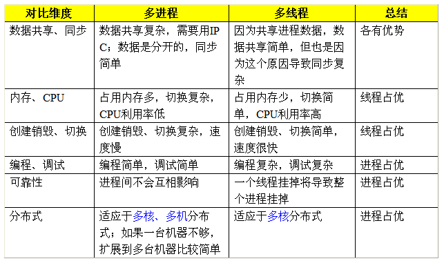

# 02.为什么要用多线程。多进程可以吗（webserver的）

# 02.为什么要用多线程。多进程可以吗（webserver的）

》多线程是为了使得多个线程并行的工作以完成多项任务，以提高系统的效率。线程是在同一时间需要完成多项任务的时候被实现的。  
使用线程的好处有以下几点：  
·使用线程可以把占据长时间的程序中的任务放到后台去处理  
·用户界面可以更加吸引人，这样比如用户点击了一个按钮去触发某些事件的处理，可以弹出一个进度条来显示处理的进度  
·程序的运行速度可能加快  
·在一些等待的任务实现上如用户输入、文件读写和网络收发数据等，线程就比较游泳了。在这种情况下我们可以释放一些珍贵的资源如内存占用等等。

》在Windows中，进行CPU分配是以线程为单位的，一个进程可能由多个线程组成，这时情况更加复杂，但简单地说，有如下关系：  
总线程数<= CPU数量：并行运行  
总线程数> CPU数量：并发运行  
并行运行的效率显然高于并发运行，所以在多CPU的计算机中，多任务的效率比较高。但是，如果在多CPU计算机中只运行一个进程(线程)，就不能发挥多CPU的优势。

多任务操作系统(如Windows)的基本原理是:操作系统将CPU的时间片分配给多个线程,每个线程在操作系统指定的时 间片内完成(注意,这里的多个线程是分属于不同进程的).操作系统不断的从一个线程的执行切换到另一个线程的执行,如此往复,宏观上看来,就好像是多个线 程在一起执行.由于这多个线程分属于不同的进程,因此在我们看来,就好像是多个进程在同时执行,这样就实现了多任务.

》 [架构设计：多进程还是多线程](2ab531c34028217937e98146c29b21c5)？

进程间通讯（以下简称IPC）问题

既然不可能把整个系统放入一个进程，那就必然会碰到IPC的问题。下面就来说一下该如何选择IPC。

各种操作系统里面，有很多稀奇古怪的IPC类型。由于要考虑跨平台，首先砍掉一批（关于IPC的跨平台问题，我在“跨平台开发”系列中会提 到）。剩下的IPC类型中，能够进行数据传输的IPC就不多了，主要有如下几种：套接字（以下简称Socket）、共享内存、管道、文件。

其中Socket是我强烈推荐的IPC方式，理由如下：使用Socket可以天然地支持分布式部署；使用Socket可以比较容易地实现多种编 程语言的混合（比如C++、Java、Python、Flex都支持Socket）；使用Socket还可以省掉了一大坨“锁操作”的代码。

列位看官中，或许有人在担心Socket的性能问题，其实大可不必多虑。当两个进程在本机上进行Socket通讯时，由于可以使用 localhost环回地址，数据不用经过物理网卡，操作系统内核还可以进行某些优化。这种情况下，Socket相对其它几种IPC机制，不会有太大的性 能偏差。

最后再补充一下，Socket方式也可以有效防止扯皮问题。举个例子：张三写了一个进程A，李四写了一个进程B，进程A通过Socket方式发 数据给进程B。突然有一天，两个进程的通讯出故障了。然后张三就说是李四接收数据出错；李四就说张三发送数据出错。这时候怎么办捏？很简单，随便找个 Sniffer软件当场抓一下数据包并Dump出来看，问题就水落石出了。

为啥还要线程？

上面说了这么多进程的好处，有同学要问了：“那线程有什么用捏？”总的来说，使用线程出于两方面的考虑：性能因素和编码方便。

1、性能因素

由于某些操作系统（比如Windows）中的进程比较重型，如果频繁创建进程或者创建大量进程，会导致操作系统的负载过高。举例如下：

假设你要开发一个类似Web Server的应用。你针对每一个客户端请求创建一个对应的进程用于进行数据交互（是不是想起了古老的CGI :-）。一旦这个系统扩容，用户的并发连接数一增加，你的应用立马死翘翘。

上面的例子表明，跨平台软件系统的进程数要保持相对稳定。如果你的进程数会随着某些环境因素呈线性增长，那就相当不妙了（顺带说一下，如果线程数会随着环境因素呈线性增长，也相当不妙）。而根据业务逻辑的单元划分进程，顺便能达到“进程数的相对稳定”的效果。

2、编码方面

由于业务逻辑内部的数据耦合比较紧密。如果业务逻辑内部的并发也用进程来实现，可能会导致大量的IPC编码（任意两个进程之间只要有数据交互，就得写一坨IPC代码）。这或许会让相关的编程人员怨声载道。

当然，编码方面的问题也不是绝对的。假如你的系统有很成熟且方便易用的IPC库，可以比较透明地封装IPC相关操作，那这方面的问题也就不存在了。

》[鱼还是熊掌：浅谈多进程多线程的选择](http://software.intel.com/zh-cn/blogs/2010/07/20/400004478/)。

关于多进程和[多线程](https://so.csdn.net/so/search?q=%E5%A4%9A%E7%BA%BF%E7%A8%8B&spm=1001.2101.3001.7020)，教科书上最经典的一句话是“进程是资源分配的最小单位，线程是CPU调度的最小单位”，这句话应付考试基本上够了，但如果在工作中遇到类似的选择问题，那就没有这么简单了，选的不好，会让你深受其害。  
经常在网络上看到有的XDJM问“多进程好还是多线程好？”、“Linux下用多进程还是多线程？”等等期望一劳永逸的问题，我只能说：没有最好，只有更好。根据实际情况来判断，哪个更加合适就是哪个好。  
我们按照多个不同的维度，来看看多线程和多进程的对比（注：因为是感性的比较，因此都是相对的，不是说一个好得不得了，另外一个差的无法忍受）。  

》多进程和多线程：没有绝对的好与坏，只有哪个更加合适的问题。我们来看实际应用中究竟如何判断更加合适。

1）需要频繁创建销毁的优先用线程  
原因请看上面的对比。  
这种原则最常见的应用就是Web服务器了，来一个连接建立一个线程，断了就销毁线程，要是用进程，创建和销毁的代价是很难承受的  
2）需要进行大量计算的优先使用线程  
所谓大量计算，当然就是要耗费很多CPU，切换频繁了，这种情况下线程是最合适的。  
这种原则最常见的是图像处理、算法处理。  
3）强相关的处理用线程，弱相关的处理用进程  
什么叫强相关、弱相关？理论上很难定义，给个简单的例子就明白了。  
一 般的Server需要完成如下任务：消息收发、消息处理。“消息收发”和“消息处理”就是弱相关的任务，而“消息处理”里面可能又分为“消息解码”、“业务处理”，这两个任务相对来说相关性就要强多了。因此“消息收发”和“消息处理”可以分进程设计，“消息解码”、“业务处理”可以分线程设计。  
当然这种划分方式不是一成不变的，也可以根据实际情况进行调整。  
4）可能要扩展到多机分布的用进程，多核分布的用线程  
原因请看上面对比。  
5）都满足需求的情况下，用你最熟悉、最拿手的方式  
至于“数据共享、同步”、“编程、调试”、“可靠性”这几个维度的所谓的“复杂、简单”应该怎么取舍，我只能说：没有明确的选择方法。但我可以告诉你一个选择原则：如果多进程和多线程都能够满足要求，那么选择你最熟悉、最拿手的那个。  
需要提醒的是：虽然我给了这么多的选择原则，但实际应用中基本上都是“进程+线程”的结合方式，千万不要真的陷入一种非此即彼的误区。

> 更新: 2024-04-19 15:32:56  
> 原文: <https://www.yuque.com/linuxer/gscfv1/7ceb63de0291206c3e77f81c3ce4e5e3>