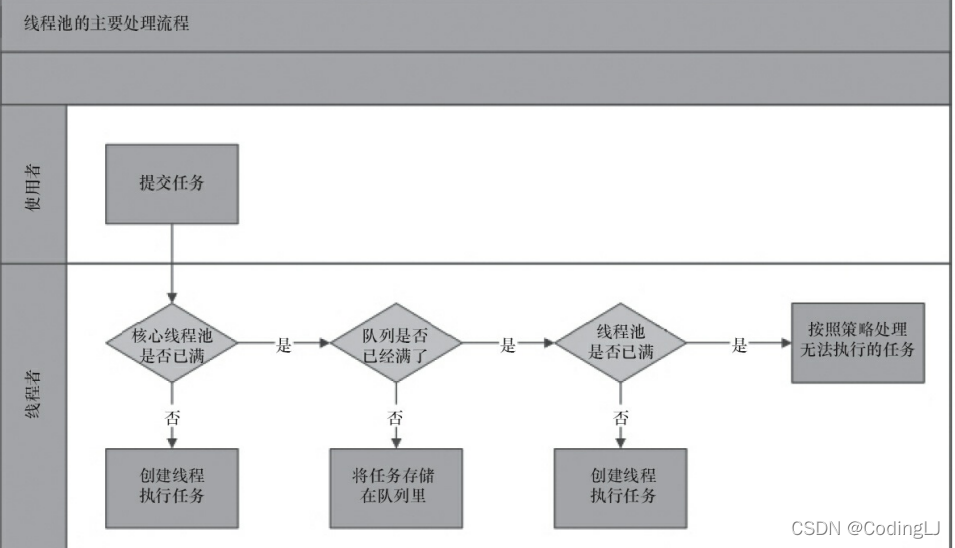
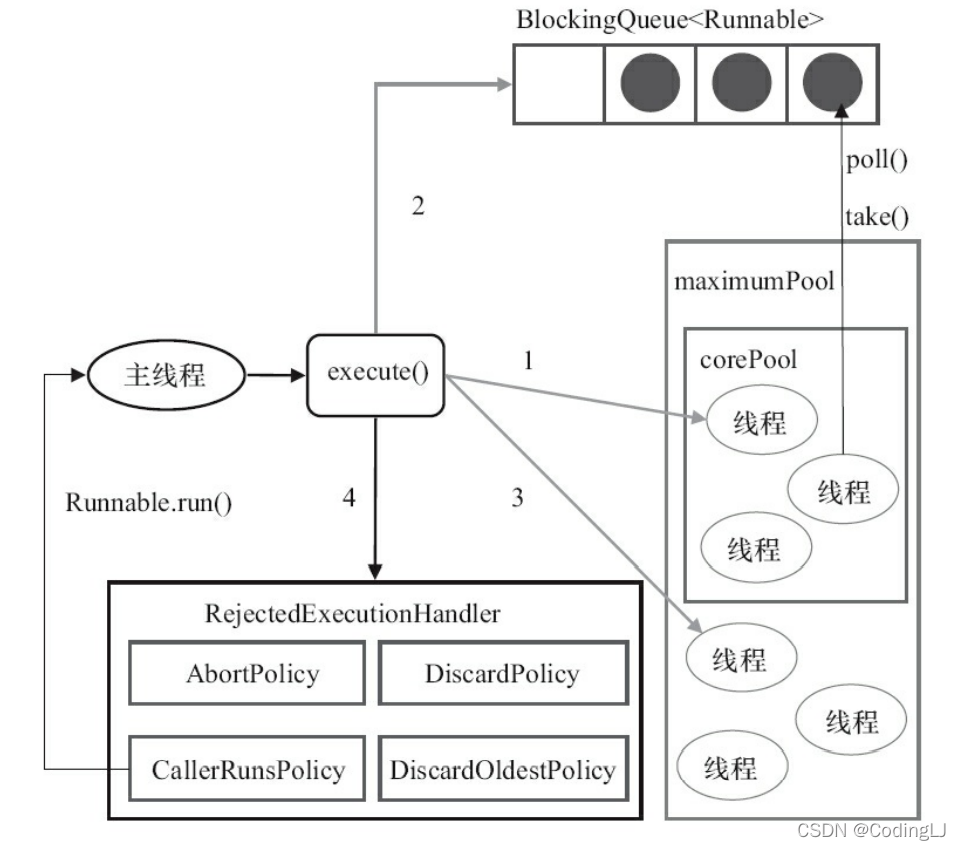

# 03.为什么要用线程池，线程池中的线程是怎么运作的

# 03.为什么要用**线程池**，线程池中的线程是怎么运作的?

## 1、为什么使用线程池？

线程池是运用场景最多的并发框架，几乎所有需要一步或者并发执行任务的程序都可以使用线程池。使用线程池一般有以下三个好处：

①降低资源的消耗，通过重复利用已经创建的线程降低线程创建和销毁造成的消耗。

②提高相应速度，当任务到达的时候，任务可以不需要等到线程创建就能立刻执行。

③提高线程的可管理性，线程是稀缺资源，使用线程池可以统一的分配、调优和监控。

## 2、线程池的实现原理

当线程池提交一个任务到线程池后，执行流程如下：

线程池先判断核心线程池里面的线程是否都在执行任务。如果不是都在执行任务，则创建一个新的工作线程来执行任务。如果核心线程池中的线程都在执行任务，则判断工作队列是否已满。如果工作队列没有满，则将新提交的任务存储到这个工作队列中，如果工作队列满了，线程池则判断线程池的线程是否都处于工作状态。如果没有，则创建一个新的工作线程来执行任务。如果已经满了，则交给饱和策略来处理 ，也就是拒接策略。

具体：

（1）如果当前线程少于corePoolSize，就创建新的线程来执行任务，但是这一步会获取全局锁。

（2）如果当前运行的线程大于等于corePoolSize，则将任务加入BlockingQueue。

（3）如果无法将任务加入队列中， 队列已满的话，则创建新的线程处理任务。这一步需要全局锁。

（4）如果创建新线程将使当前运行的线程超出maximumPoolSize，任务将被拒绝，并调用 RejectedExecutionHandler.rejectedExecution()方法。

执行execute()方法时，尽可能 地避免获取全局锁。

线程池参数介绍：

1）corePoolSize（线程池的基本大小）：当提交一个任务到线程池时，线程池会创建一个线 程来执行任务，即使其他空闲的基本线程能够执行新任务也会创建线程，等到需要执行的任 务数大于线程池基本大小时就不再创建。如果调用了线程池的prestartAllCoreThreads()方法， 线程池会提前创建并启动所有基本线程。

2）runnableTaskQueue（任务队列）：用于保存等待执行的任务的阻塞队列。可以选择以下几 个阻塞队列。

ArrayBlockingQueue：是一个基于数组结构的有界阻塞队列，此队列按FIFO（先进先出）原 则对元素进行排序。

LinkedBlockingQueue：一个基于链表结构的阻塞队列，此队列按FIFO排序元素，吞吐量通 常要高于ArrayBlockingQueue。静态工厂方法Executors.newFixedThreadPool()使用了这个队列。

SynchronousQueue：一个不存储元素的阻塞队列。每个插入操作必须等到另一个线程调用 移除操作，否则插入操作一直处于阻塞状态，吞吐量通常要高于Linked-BlockingQueue，静态工 厂方法Executors.newCachedThreadPool使用了这个队列。

PriorityBlockingQueue：一个具有优先级的无限阻塞队列。

3）maximumPoolSize（线程池最大数量）：线程池允许创建的最大线程数。如果队列满了，并 且已创建的线程数小于最大线程数，则线程池会再创建新的线程执行任务。值得注意的是，如 果使用了无界的任务队列这个参数就没什么效果。

4）ThreadFactory：用于设置创建线程的工厂，可以通过线程工厂给每个创建出来的线程设 置更有意义的名字。使用开源框架guava提供的ThreadFactoryBuilder可以快速给线程池里的线 程设置有意义的名字。

5）RejectedExecutionHandler（饱和策略）：当队列和线程池都满了，说明线程池处于饱和状 态，那么必须采取一种策略处理提交的新任务。这个策略默认情况下是AbortPolicy，表示无法 处理新任务时抛出异常。在JDK 1.5中Java线程池框架提供了以下4种策略。

AbortPolicy：直接抛出异常。

CallerRunsPolicy：只用调用者所在线程来运行任务。

DiscardOldestPolicy：丢弃队列里最近的一个任务，并执行当前任务。

DiscardPolicy：不处理，丢弃掉。

keepAliveTime（线程活动保持时间）：线程池的工作线程空闲后，保持存活的时间。所以， 如果任务很多，并且每个任务执行的时间比较短，可以调大时间，提高线程的利用率。 ·TimeUnit（线程活动保持时间的单位）：可选的单位有天（DAYS）、小时（HOURS）、分钟 （MINUTES）、毫秒（MILLISECONDS）、微秒（MICROSECONDS，千分之一毫秒）和纳秒 （NANOSECONDS，千分之一微秒）

> 更新: 2024-04-19 15:32:57  
> 原文: <https://www.yuque.com/linuxer/gscfv1/4da61ef12ff0d553fd9835787d01573b>