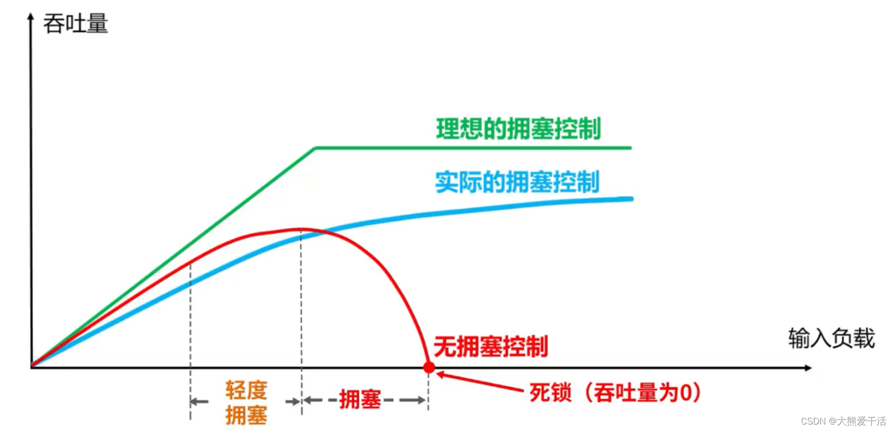
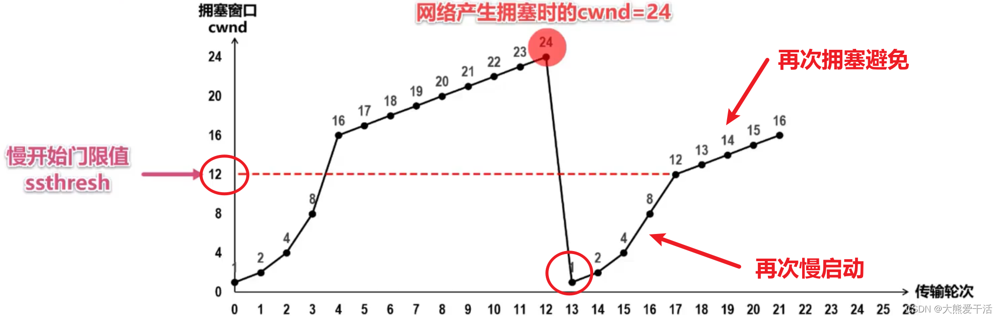
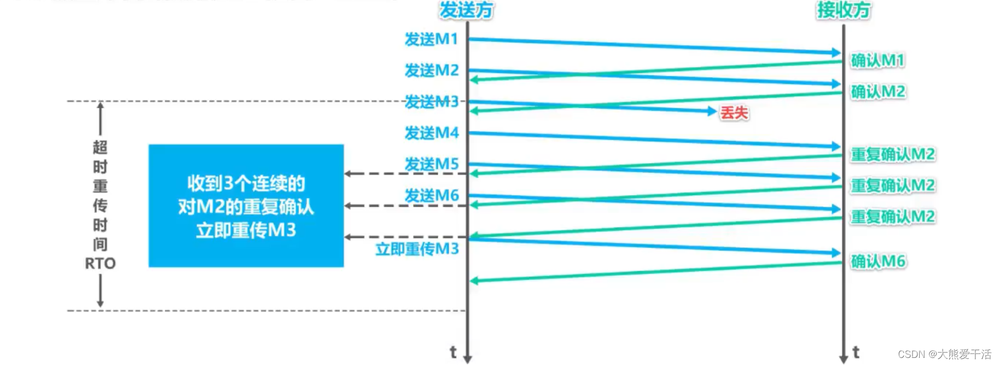
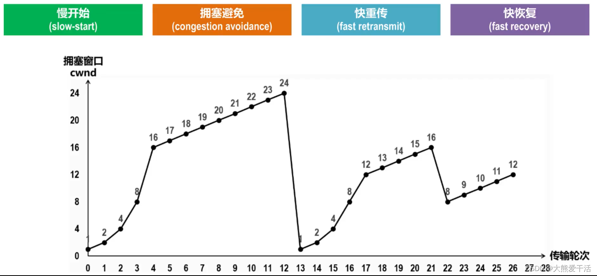

# 03.TCP慢启动，拥塞控制实现

# 03.**TCP**慢启动，拥塞控制实现

## TCP的拥塞控制

## 一、前言：什么是拥塞？什么是拥塞控制？

+ 拥塞：随着网络中的主机增加其发送速率并使网络变得十分拥挤，此时会经常发生丢包现象，导致网络的传输效率急剧降低。分组的超时重传通常被作为网络拥塞的标志。
+ 如果不对网络拥塞进行控制，整个网络的吞吐量将随着输入负荷的增大而下降，降低网络的传输效率，如下图：

## 二、TCP的4种拥塞控制算法(慢开始、拥塞避免、快重传、快恢复)

+ 为了便于讨论做一下假设

1. 数据是单方向传送的，另一个方向只传输确认
2. 接收方的总是有足够大的缓冲区，因此发送方的发送窗口仅由网络的拥塞程度决定，事实上发送窗口的大小由拥塞窗口和接收方的接收窗口大小共同控制，也即发送窗口 = min[接收窗口, 拥塞窗口]；
3. 以最大报文段MSS的个数作为讨论单位，而不是以字节为单位

+ 发送方维护一个叫做拥塞窗口cwnd(congestion window)的状态变量，其值取决于网络的拥塞状况，动态变化

1. 拥塞窗户的维护原则：只要网络没有出现拥塞，cwnd就增大一些；但只要网络出现拥塞，拥塞窗口就减小一些
2. 以分组发生超时重传作为发生网络拥塞的依据

+ TCP还维护一个慢开始门限ssthresh状态变量

1. 当cwnd < ssthresh时，使用慢开始算法
2. 当cwnd > ssthresh时，使用拥塞避免算法
3. 当cwnd = ssthresh时，既可以使用慢开始算法，也可以使用拥塞避免算法

+ 当发生数据正常丢包，但又不是网络拥塞时，使用快重传算法和快恢复算法

1. 如何判断是发生了正常丢包而不是网络拥塞呢？
2. 当发送方连续接收到3次重复确认时，说明这网络不拥塞，只是正常丢包了

① 慢启动(慢开始)  
传输轮次：指把发送窗口内可以发送的数据全部发送并接收到最后一个TCP报文的确认报文这样一个来回

+ 通常在一条TCP连接开始时，cwnd被设置为1个MSS（最大报文段），也即cwnd=1
+ 该阶段，每当TCP发送方将发送窗口的数据发送完，并顺利接收到所有的确认后，就会将拥塞窗口大小翻倍，也即慢启动阶段，cwnd以指数形式增长，如上图所示；注意这里忽略了接收窗口的影响，上文也提到了。
+ 拥塞窗口会一直增长直到到达慢开始门限ssthresh，开始执行拥塞避免算法

② 拥塞避免

+ 该阶段的拥塞窗口变为线性增长，每次cwnd+1，也即每次增加一个MSS

+ 随着拥塞窗口的增加，发送速率不断提高，当TCP遇到分组超时重传时，即认为发生了网络拥塞

1. 此时将更新ssthresh的值为当前拥塞窗口的一半，上图中是更新为24的一半即12
2. 更新cwnd的值为1
3. 然后继续执行慢启动—拥塞避免，如上图所示

+ 如果TCP发送方接收到连续的3个重复确认，则认为是正常的网络包丢失，而不是网络拥塞造成的（这正是快重传算法的功劳）

1. 重传丢失的分组
2. 执行快恢复算法

③ 快重传

+ 所谓的快重传算法，就是让发送方尽快重传，而不是等待超时重传计时器超时再重传

1. 要求接收方不要等待自己发送数据时才捎带确认，而是要立即发送确认
2. 即使是失序的报文段，也要立即发送对已收到的报文段的重复确认
3. 发送方一旦收到3个连续的重复确认，就将相应的报文段立即重传，而不是等待该报文的重传计时器超时再重传

如下图所示：

④ 快恢复

+ 如果发送方收到了3个重复确认，就执行快恢复算法

1. 将慢开始门限sstresh和拥塞窗口cwnd都设置为当前拥塞窗口的一半，然后执行拥塞避免算法

## 三、一个糅合了4种拥塞控制算法的例子

1. 最初cwnd=1，ssthresh=16，执行慢开始算法，cwnd大小指数增长
2. cwnd到达慢开始门限ssthresh后，转而执行拥塞避免算法，cwnd线性加一增长
3. 随着发送速率的增加，若发生超时重传，则将慢开始门限ssthresh减小为当前拥塞窗口的一半、再将拥塞窗口cwnd设置为1，然后执行慢开始-–拥塞避免，重复1、2
4. 若发送方收到3个重复确认，则表示分组丢失，发送方立刻重传相应分组；然后执行快恢复算法
5. 将慢开始门限ssthresh和拥塞窗口cwnd重新设置为当前拥塞窗口的一半，然后执行拥塞避免算法

> 更新: 2024-04-19 15:33:14  
> 原文: <https://www.yuque.com/linuxer/gscfv1/2da455404582a76f30f73f4f16428ec3>