# 07.http1.0  1.1  2  3

# 07.http1.0 / 1.1 / 2 / 3

## 1.HTTP1.0

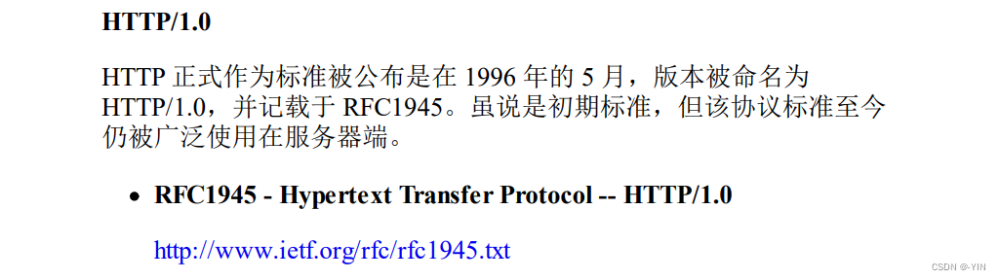

HTTP/1.0是无状态、无连接的应用层协议。

### 无连接

无连接：每次请求都要建立连接，需要使用 keep-alive 参数建立长连接、HTTP1.1默认长连接keep-alive  
  无法复用连接，每次发送请求都要进行TCP连接，TCP的连接释放都比较费事，会导致网络利用率低

### 队头阻塞

队头阻塞(head of line blocking)，由于HTTP1.0规定下一个请求必须在前一个请求响应到达之前才能发送，假设前一个请求响应一直不到达，那么下一个请求就不发送，后面的请求就阻塞了。

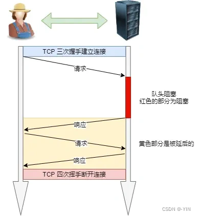

### 缓存

在HTTP1.0中主要使用header里的协商缓存 last-modified\if-modified-since，强缓存 Expires来做为缓存判断的标准

If-Modified-Since

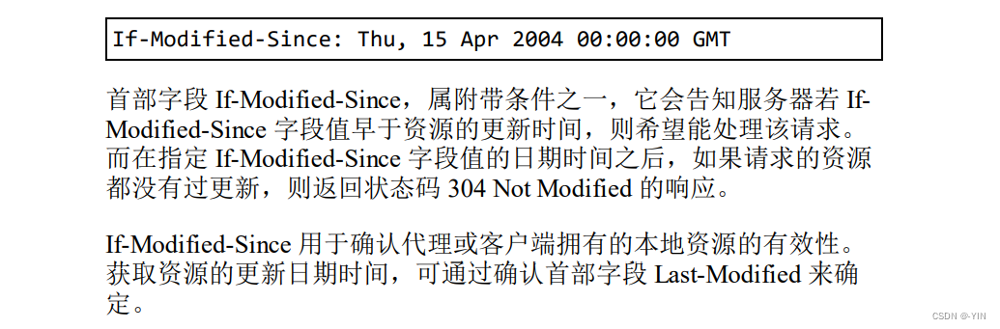

Expires是RFC 2616（HTTP/1.0）协议中和网页缓存相关字段。用来控制缓存的失效日期。

Expires 字段声明了一个网页或 URL 地址不再被浏览器缓存的时间，一旦超过了这个时间，浏览器都应该联系原始服务器。RFC告诉我们：“由于推断的失效时间也许会降低语义透明度，应该被谨慎使用，同时我们鼓励原始服务器尽可能提供确切的失效时间。”

### 其他问题

HOST域：认为每个服务器绑定唯一一个IP地址，因此在请求消息的URL中没有主机名，HTTP1.0没有host域。而现在在一台服务器上可以存在多个虚拟主机，并且它们共享一个IP地址。

HTTP1.0不支持断点续传功能，每次都会传送全部的页面和数据。如果只需要部分数据就会浪费多余带宽

## 2.HTTP/1.1

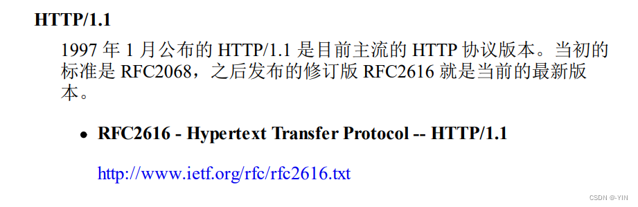

### 特点

**简单**  
HTTP 基本的报文格式就是 header + body，头部信息也是 key-value 简单文本的形式，易于理解

**灵活、易扩展**  
各类请求方法、URL、状态码，等每个组成都没有固定死，开发者可以自定义与扩充  
HTTP在应用层其下层可以灵活变化（https就是HTTP与TCP之间增加SSL/TSL安全传输协议）

应用广泛、支持跨平台

### 优缺点

1.无状态  
好处：服务器不用额外资源记录，减轻服务器负担，提高CPU内存利用效率  
坏处：每次都要确认验证信息；一般通过Cookie解决（Cookie 通过在请求和响应报文中写入 Cookie 信息来控制客户端的状态。）  
2.明文传输： 传输过程中信息可以抓包直接获取，信息暴露、安全性差  
3.不安全：  
通信使用明文传输、信息泄露  
不验证通信双方身份、有可能进入伪装网站  
无法证明报文完整性都导致不安全的问题  
解决方式：可以用 HTTPS 的方式解决，也就是通过引入 SSL/TLS 层，使得更安全。

### 长连接

为了解决早期HTTP/1.0每次都要建立连接导致通信效率低的性能问题，因为HTTP基于TCP/IP协议  
为了解决上述 TCP 连接问题，HTTP/1.1 提出了长连接的通信方式，也叫持久连接。这种方式的好处在于减少了 TCP 连接的重复建立和断开所造成的额外开销，减轻了服务器端的负载。

持久连接的特点是，只要任意一端没有明确提出断开连接，则保持 TCP 连接状态。如果某个 HTTP 长连接超过一定时间没有任何数据交互，服务端就会主动断开这个连接。

短连接和长连接对比

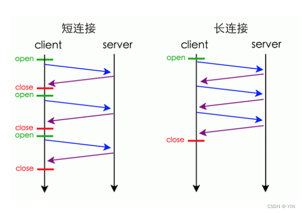

### 管道传输

因为HTTP/1.1 采用了长连接的方式，这使得管道（pipeline）网络传输成为了可能。

即可在同一个 TCP 连接里面，客户端可以发起多个请求，只要第一个请求发出去了，不必等其回来，就可以发第二个请求出去，可以减少整体的响应时间。  
但是服务器必须按照接收请求的顺序发送对这些管道化请求的响应。

如果服务端在处理 A 请求时耗时比较长，那么后续的请求的处理都会被阻塞住，这称为「队头堵塞」。

所以，HTTP/1.1 管道解决了请求的队头阻塞，但是没有解决响应的队头阻塞。

注意：实际上 HTTP/1.1 管道化技术不是默认开启，而且浏览器基本都没有支持，所以后面讨论HTTP/1.1 都是建立在没有使用管道化的前提。

## 3.HTTP/1.0 比较 HTTP/1.1

HTTP/1.1 相比 HTTP/1.0 提高了什么性能？

1.  使用长连接的方式改善了 HTTP/1.0 短连接造成的性能开销。 
2.  支持管道（pipeline）网络传输，只要第一个请求发出去了，不必等其回来，就可以发第二个请求出去，可以减少整体的响应时间 

### HTTP协议层次结构图

现在主流浏览器大部分使用的都是HTTP/1.1协议，也有部分支持HTTP/2.0；绝大部分网站都升级为HTTPS更保证安全性

## 4.HTTP/2.0

详见该文章：深入理解HTTP/2.0  
HTTP/2.0协议是基于HTTPS的，更加安全

相比与HTTP/1.1，HTTP/2.0增加如下几点的重大优化

### 头部压缩

HTTP2.0会压缩（Header）部分；如果同时多个请求其头部一样或相似，那么协议会消除重复部分。  
利用HPAK算法：在客户端和服务器同时维护一张头信息表，所有字段都会存入这个表，生成一个索引号，就不用重复发送同样字段了，只发送索引号，减少数据量提高速度

### 二进制格式

HTTP/1.0和HTTP/1.1中，报文都是纯文本的格式简单易读；而在2.0中采用了二进制的格式  
报头和数据体称为：帧（frame）-》头信息帧（Headers Frame）和数据帧（Data Frame）

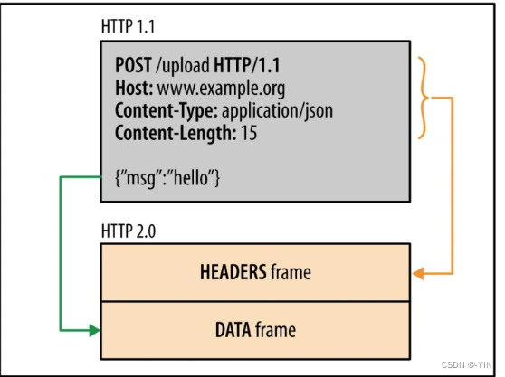

文本形式信息保存为一个一个字符，占用空间多，每个字符对应比特位多，接受方还需要将报文转换为二进制，而直接用二进制减少了传输数据量，提高数据传输效率

1.0：  
2.0：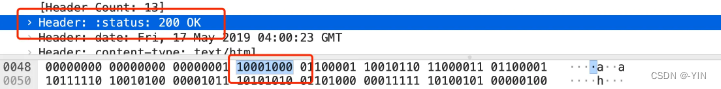

数据以数据流（stream）的形式以字节单位发送，数据包可以不按顺序发送

在 HTTP/2 中每个请求或响应的所有数据包，称为一个数据流（Stream）。每个数据流都标记着一个独一无二的编号（Stream ID）；  
所有HTTP2.0通信都在一个TCP链接上完成，这个链接可以承载任意流量的双向数据流。每个数据流以消息的形式发送，而消息由一或多个帧组成。不同 Stream 的帧是可以乱序发送的（因此可以并发不同的 Stream ），因为每个帧的头部会携带 Stream ID 信息，所以接收端可以通过 Stream ID 有序组装成 HTTP 消息

客户端还可以指定数据流的优先级。优先级高的请求，服务器就先响应该请求

### 多路复用

HTTP2.0实现了真正的并行传输，它能够在一个TCP上进行任意数量的HTTP请求，由于其二进制分帧特性

HTTP/2 是可以在一个连接中并发多个请求或回应，而不用按照顺序一一对应。

移除了 HTTP/1.1 中的串行请求，不需要排队等待，彻底解决「队头阻塞」问题，降低了延迟，大幅度提高了连接的利用率。

### 服务端推送

HTTP/2 还在一定程度上改善了传统的「请求 - 应答」工作模式，服务端不再是被动地响应，可以主动向客户端发送消息、推送额外的资源。

例如：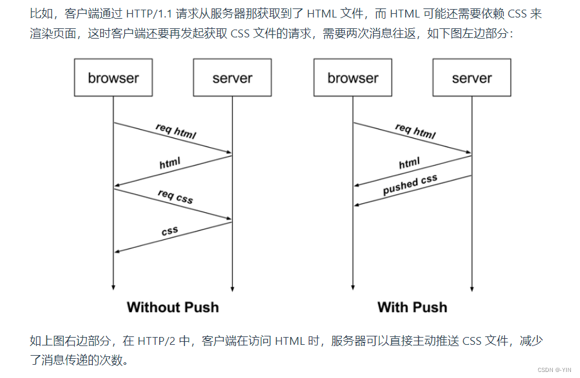

### TCP导致队头阻塞

因为TCP面向字节流传输，而且保证传输可靠性和数据的完整性  
只有TCP拿到完整连续的数据时，内核才会将数据从缓冲区交给HTTP应用，而只要前一个字节没有收到，HTTP就无法从内核缓冲区中得到数据，直到其到达，所以在此过程仍然会导致队头阻塞

图中发送方发送了很多个 packet，每个 packet 都有自己的序号，你可以认为是 TCP 的序列号，其中 packet 3 在网络中丢失了，即使 packet 4-6 被接收方收到后，由于内核中的 TCP 数据不是连续的，于是接收方的应用层就无法从内核中读取到，只有等到 packet 3 重传后，接收方的应用层才可以从内核中读取到数据，这就是 HTTP/2 的队头阻塞问题，是在 TCP 层面发生的。

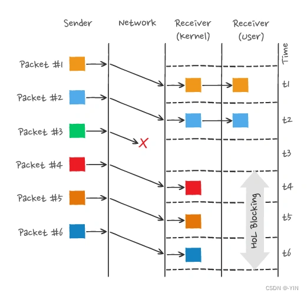

因此如果出现丢包就会触发TCP的超时重传，这样后续缓冲队列中所有数据都得等丢了的重传

## 5.HTTP/3.0

（仍在学习中…后续完善）

基于Google的QUIC，HTTP3 背后的主要思想是放弃 TCP，转而使用基于 UDP 的 QUIC 协议。

为了解决HTTP/2.0中TCP造成的队头阻塞问题，HTTP/3.0直接放弃使用TCP，将传输层协议改成UDP；但是因为UDP是不可靠传输，所以这就需要QUIC实现可靠机制

QUIC 也是需要三次握手来建立连接的，主要目的是为了确定连接 ID。

可以学一下这篇文章：QUIC详解（用UDP实现可靠协议）

在 UDP 报文头部与 HTTP 消息之间，共有 3 层头部：

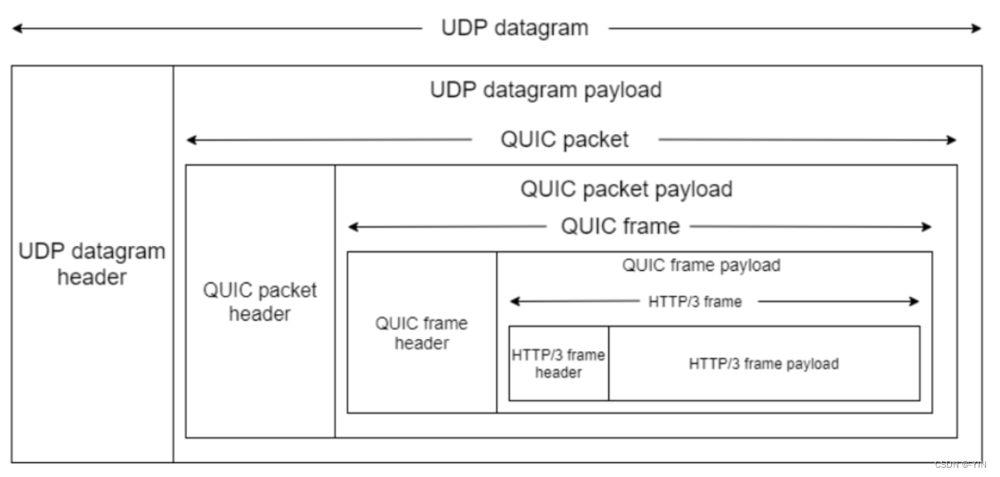

QUIC特点：

### 无队头阻塞

QUIC 协议也有类似 HTTP/2 Stream 与多路复用的概念，也是可以在同一条连接上并发传输多个 Stream，Stream 可以认为就是一条 HTTP 请求。

QUIC 有自己的一套机制可以保证传输的可靠性的。当某个流发生丢包时，只会阻塞这个流，其他流不会受到影响，因此不存在队头阻塞问题。这与 HTTP/2 不同，HTTP/2 只要某个流中的数据包丢失了，其他流也会因此受影响。

所以，QUIC 连接上的多个 Stream 之间并没有依赖，都是独立的，某个流发生丢包了，只会影响该流，其他流不受影响。

### 连接建立

HTTP/3 在传输数据前虽然需要 QUIC 协议握手，这个握手过程只需要 1 RTT，握手的目的是为确认双方的「连接 ID」，连接迁移就是基于连接 ID 实现的。

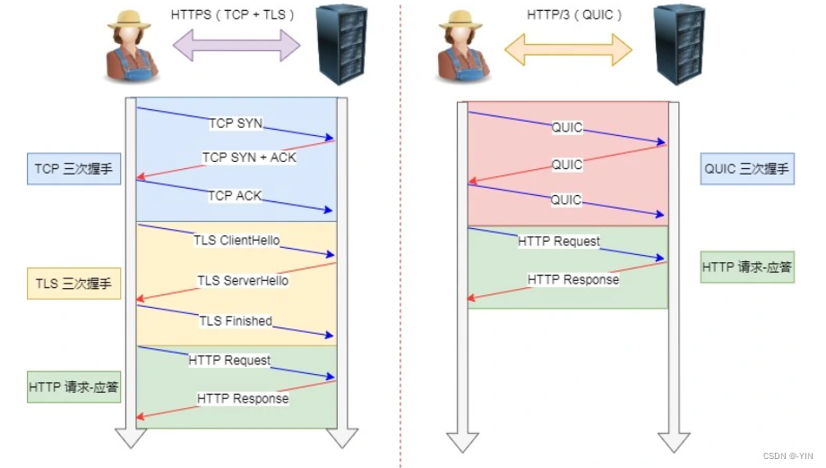

### 连接迁移

基于 TCP 传输协议的 HTTP 协议，由于是通过四元组（源 IP、源端口、目的 IP、目的端口）确定一条 TCP 连接，例如设备要连接wifi（IP地址改变）就必须要重新建立连接，而建立连接包含TCP三次握手和TSL四次握手，以及TCP慢启动所以会造成使用者卡顿的感觉

而QUIC通过连接ID标记自己，客户端和服务器可以各自选择一组 ID 来标记自己，因此即使移动设备的网络变化后，导致 IP 地址变化了，只要有上下文信息（比如连接 ID、TLS 密钥等），就可以“无缝”地复用原连接，消除重连的成本，没有丝毫卡顿感，达到了连接迁移的功能。

其实， QUIC 是一个在 UDP 之上的伪 TCP + TLS + HTTP/2 的多路复用的协议。

> 更新: 2024-04-19 15:33:20  
> 原文: <https://www.yuque.com/linuxer/gscfv1/b933426a4a1e8267f00452eda9ad3ae4>