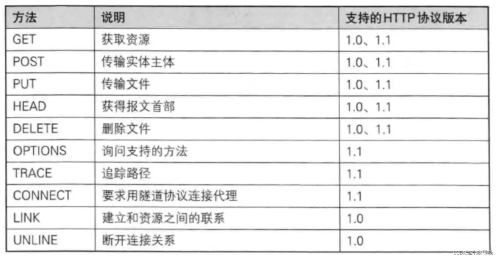
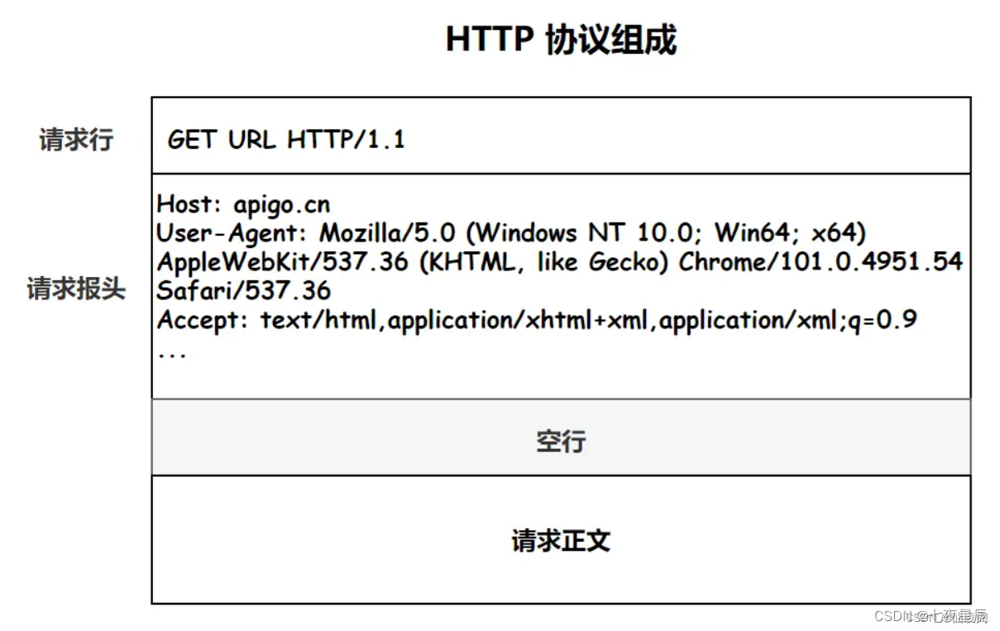

# 08.get和post区别

# 08.get和post区别

GET 和 POST 是 HTTP 请求中最常用的两种请求方法，在日常开发的 RESTful 接口中，都能看到它们的身影。而它们之间的区别，也是一道常见且经典的面试题，所以我们本文就来详细的聊聊。  
HTTP 协议定义的方法类型总共有以下 10 种：  

PS：目前大部分的网站使用的都是 HTTP 1.1 的协议。

但在日常开发中，使用频率最高的就属 GET 请求和 POST 请求了，尤其是在中、小型公司，基本只会使用这两种请求来实现一个项目。

## 1.相同点和最本质的区别

### 1.1 相同点

GET 请求和 POST 请求底层都是基于 TCP/IP 协议实现的，使用二者中的任意一个，都可以实现客户端和服务器端的双向交互。

### 1.2 最本质的区别

GET 和 POST 最本质的区别是“约定和规范”上的区别，在规范中，定义 GET 请求是用来获取资源的，也就是进行查询操作的，而 POST 请求是用来传输实体对象的，因此会使用 POST 来进行添加、修改和删除等操作。  
当然如果严格按照规范来说，删除操作应该使用 DELETE 请求才对，但在实际开发中，使用 POST 来进行删除的用法更常见一些。  
按照约定来说，GET 和 POST 的参数传递也是不同的，GET 请求是将参数拼加到 URL 上进行参数传递的，而 POST 是将请参数写入到请求正文中传递的，如下图所示：  

## 2.非本质区别

### 2.1 缓存不同

GET 请求一般会被缓存，比如常见的 CSS、JS、HTML 请求等都会被缓存；而 POST 请求默认是不进行缓存的。

### 2.2 参数长度限制不同

GET 请求的参数是通过 URL 传递的，而 URL 的长度是有限制的，通常为 2k，当然浏览器厂商不同、版本不同这个限制的大小值可能也不同，但相同的是它们都会对 URL 的大小进行限制；而 POST 请求参数是存放在请求正文（request body）中的，所以没有大小限制。

### 2.3 回退和刷新不同

GET 请求可以直接进行回退和刷新，不会对用户和程序产生任何影响；而 POST 请求如果直接回滚和刷新将会把数据再次提交，如下图所示：  

### 2.4 历史记录不同

GET 请求的参数会保存在历史记录中，而 POST 请求的参数不会保留到历史记录中。

### 2.5 书签不同

GET 请求的地址可被收藏为书签，而 POST 请求的地址不能被收藏为书签。

## 3.总结

GET 和 POST 是 HTTP 请求中最常用的两种请求方法，它们的底层都是基于 TCP/IP 实现的。它们的区别主要体现在 5 个方面：缓存不同、参数长度限制不同、回退和刷新不同、历史记录不同、能否保存为书签不同，但它们最大的区别是规范和约定上的不同，规范中定义 GET 是用来获取信息的，而 POST 是用来传递实体的，并且 GET 请求的参数要放在 URL 上，而 POST 请求的参数要放在请求正文中。

> 更新: 2024-04-19 15:33:21  
> 原文: <https://www.yuque.com/linuxer/gscfv1/2347654426e96ca28acbd0b21734513f>