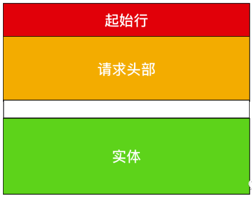
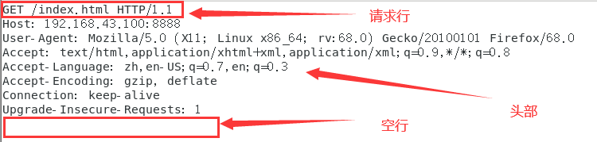
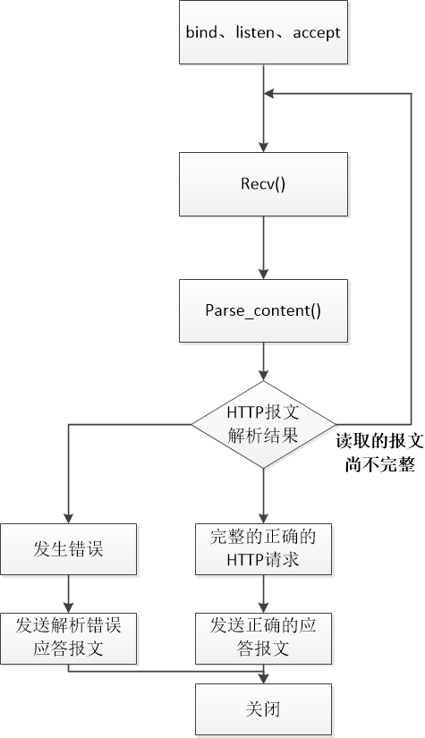
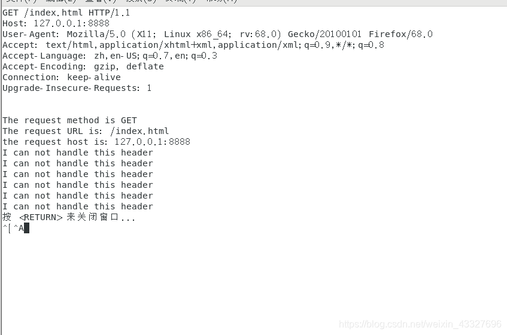

# 13.能详细讲一下有限状态机怎么解析http报文吗

# 13.能详细讲一下有限状态机怎么解析http报文吗


## 一、HTTP报文


HTTP的报文格式：


起始行  
头部字段  
空 行  
消息正文  
其中起始行和头部字段成为Header，消息正文称为body。Header和body之间一定要有空行隔开。








请求行的格式：


如下：  
GET /index.html HTTP/1.1  
请求方法为GET, url为/index.html，版本为HTTP/1.1


而请求头部就是用 key:value 更详细的方式说明HTTP报文。  
而我们要做的就是解析这样的http请求，并发送应答报文给客户端。


## 二、程序结构


主程序：





recv() 是从套接字中读取http报文数据到buffer中


解析HTTP请求的主函数：


```plain
parse_content()
```


在parse_content中首先通过parse_line()读取一行，  
主状态有解析请求行和解析头部两种状态，初始状态为解析请求行，当解析请求行完毕，状态转移到解析头部字段


```plain
//部分代码，非完整代码
HTTP_CODE parse_content(char* buffer, int& checked_index, CHECK_STATE& checkstate, int& read_index, int& start_line)
{
//每次读取一行解析
    while ((linestatus = parse_line(buffer, checked_index, read_index)) == LINE_OK)
    {
        switch (checkstate)
        {
        case CHECK_STATE_REQUESTLINE://解析请求行
        {
        //调用解析请求行函数，解析完成后在函数中完成状态转移
            retcode = parse_requestline(szTemp, checkstate);
            break;
        }
        case CHECK_STATE_HEADER://解析头部字段
        {
            retcode = parse_headers(szTemp);
            //解析结果被省略了
            break;
        }
        }
    }
    if (linestatus == LINE_OPEN)//不能读取到完整行
    {
        return NO_REQUEST;
    }
    else
    {
        return BAD_REQUEST;
    }
}
```


## 三、完整代码


```plain
#include <sys/socket.h>
#include <netinet/in.h>
#include <arpa/inet.h>
#include <assert.h>
#include <stdio.h>
#include <stdlib.h>
#include <unistd.h>
#include <errno.h>
#include <string.h>
#include <fcntl.h>
#include <iostream>
using namespace  std;
constexpr auto BUFFER_SIZE = 4096;
//主状态机状态
//CHECK_STATE_REQUESTLINE 解析请求行；CHECK_STATE_HEADER 解析头部字段
enum CHECK_STATE { CHECK_STATE_REQUESTLINE = 0, CHECK_STATE_HEADER, CHECK_STATE_CONTENT };
//从状态机状态，LINE_OK 完整的一行；LINE_OPEN该行尚未读完；LINE_BAD 该行有错误
enum LINE_STATUS { LINE_OK = 0, LINE_BAD, LINE_OPEN };
//处理http请求的结果 NO_REQUEST 表示读取的请求结果不完整；GET_REQUEST 读取了完整正确的http请求；BAD_REQUEST表示客户请求有错
enum HTTP_CODE { NO_REQUEST, GET_REQUEST, BAD_REQUEST, FORBIDDEN_REQUEST, INTERNAL_ERROR, CLOSED_CONNECTION };
static const char* szret[] = { "I get a correct result\n", "Something wrong\n" };
//次状态机，每次读取一行，通过读取到/r/n来判断是不是完整的一行
LINE_STATUS parse_line(char* buffer, int& checked_index, int& read_index)
{
    char temp;
    for (; checked_index < read_index; ++checked_index)
    {
        temp = buffer[checked_index];
        if (temp == '\r')
        {
            if ((checked_index + 1) == read_index)
            {
                return LINE_OPEN;
            }
            else if (buffer[checked_index + 1] == '\n')
            {
                buffer[checked_index++] = '\0';
                buffer[checked_index++] = '\0';
                return LINE_OK;
            }
            return LINE_BAD;
        }
        else if (temp == '\n')
        {
            if ((checked_index > 1) && buffer[checked_index - 1] == '\r')
            {
                buffer[checked_index - 1] = '\0';
                buffer[checked_index++] = '\0';
                return LINE_OK;
            }
            return LINE_BAD;
        }
    }
    return LINE_OPEN;
}
//解析请求行  GET url HTTP/1.1 
HTTP_CODE parse_requestline(char* szTemp, CHECK_STATE& checkstate)
{
    char* szURL = strpbrk(szTemp, " \t");
    if (!szURL)
    {
        return BAD_REQUEST;
    }
    *szURL++ = '\0';

    char* szMethod = szTemp;
    if (strcasecmp(szMethod, "GET") == 0)
    {
        printf("The request method is GET\n");
    }
    else
    {
        return BAD_REQUEST;
    }
    
    szURL += strspn(szURL, " \t");
    char* szVersion = strpbrk(szURL, " \t");
    if (!szVersion)
    {
        return BAD_REQUEST;
    }
    *szVersion++ = '\0';
    szVersion += strspn(szVersion, " \t");
    if (strcasecmp(szVersion, "HTTP/1.1") != 0)
    {
        return BAD_REQUEST;
    }
    
    if (strncasecmp(szURL, "http://", 7) == 0)
    {
        szURL += 7;
        szURL = strchr(szURL, '/');
    }
    
    if (!szURL || szURL[0] != '/')
    {
        return BAD_REQUEST;
    }
    
    //URLDecode( szURL );
    printf("The request URL is: %s\n", szURL);
    checkstate = CHECK_STATE_HEADER;
    return NO_REQUEST;

}
//解析头部字段，读取到空行说明头部正确
HTTP_CODE parse_headers(char* szTemp)
{
    if (szTemp[0] == '\0')
    {
        return GET_REQUEST;
    }
    else if (strncasecmp(szTemp, "Host:", 5) == 0)
    {
        szTemp += 5;
        szTemp += strspn(szTemp, " \t");
        printf("the request host is: %s\n", szTemp);
    }
    else
    {
        printf("I can not handle this header\n");
    }

    return NO_REQUEST;

}
//解析报文主函数
HTTP_CODE parse_content(char* buffer, int& checked_index, CHECK_STATE& checkstate, int& read_index, int& start_line)
{
    LINE_STATUS linestatus = LINE_OK;
    HTTP_CODE retcode = NO_REQUEST;
    while ((linestatus = parse_line(buffer, checked_index, read_index)) == LINE_OK)
    {
        char* szTemp = buffer + start_line;
        start_line = checked_index;
        switch (checkstate)
        {
        case CHECK_STATE_REQUESTLINE:
        {
            retcode = parse_requestline(szTemp, checkstate);
            if (retcode == BAD_REQUEST)
            {
                return BAD_REQUEST;
            }
            break;
        }
        case CHECK_STATE_HEADER:
        {
            retcode = parse_headers(szTemp);
            if (retcode == BAD_REQUEST)
            {
                return BAD_REQUEST;
            }
            else if (retcode == GET_REQUEST)
            {
                return GET_REQUEST;
            }
            break;
        }
        default:
        {
            return INTERNAL_ERROR;
        }
        }
    }
    if (linestatus == LINE_OPEN)
    {
        return NO_REQUEST;
    }
    else
    {
        return BAD_REQUEST;
    }
}

int main(int argc, char* argv[])
{
    const char *ip = "127.0.0.1";
    int port = 8888;
//    if (argc <= 2)
//    {
//        printf("usage: %s ip_address port_number\n", basename(argv[0]));
//        return 1;
//    }
//    const char* ip = argv[1];
//    int port = atoi(argv[2]);

    struct sockaddr_in address;
    bzero(&address, sizeof(address));
    address.sin_family = AF_INET;
    inet_pton(AF_INET, ip, &address.sin_addr);
    address.sin_port = htons(port);
    
    int listenfd = socket(PF_INET, SOCK_STREAM, 0);
    assert(listenfd >= 0);
    
    int ret = bind(listenfd, (struct sockaddr*) & address, sizeof(address));
    assert(ret != -1);
    
    ret = listen(listenfd, 5);
    assert(ret != -1);
    
    struct sockaddr_in client_address;
    socklen_t client_addrlength = sizeof(client_address);
    int fd = accept(listenfd, (struct sockaddr*) & client_address, &client_addrlength);
    if (fd < 0)
    {
        printf("errno is: %d\n", errno);
    }
    else
    {
        char buffer[BUFFER_SIZE];
        memset(buffer, '\0', BUFFER_SIZE);
        int data_read = 0;
        int read_index = 0;
        int checked_index = 0;
        int start_line = 0;
        CHECK_STATE checkstate = CHECK_STATE_REQUESTLINE;
        while (1)
        {
            data_read = recv(fd, buffer + read_index, BUFFER_SIZE - read_index, 0);
            cout<<buffer<<endl;
            if (data_read == -1)
            {
                printf("reading failed\n");
                break;
            }
            else if (data_read == 0)
            {
                printf("remote client has closed the connection\n");
                break;
            }
    
            read_index += data_read;
            HTTP_CODE result = parse_content(buffer, checked_index, checkstate, read_index, start_line);
            if (result == NO_REQUEST)
            {
                continue;
            }
            else if (result == GET_REQUEST)
            {
                send(fd, szret[0], strlen(szret[0]), 0);
                break;
            }
            else
            {
                send(fd, szret[1], strlen(szret[1]), 0);
                break;
            }
        }
        close(fd);
    }
    
    close(listenfd);
    return 0;

}
```


## 四、运行


首先服务器上运行解析HTTP请求的代码，


客户端发送HTTP请求：  
1、可以通过命令行：  
curl 127.0.0.1:8888/url  
url可以随便写，也可以空着


2、可以通过浏览器发起http请求：  
地址栏输入：  
127.0.0.1:8888/index.html


服务器运行结果：





> 更新: 2024-04-19 15:33:28  
> 原文: <https://www.yuque.com/linuxer/gscfv1/ed860834bb0573a473a971cda548ddd5>