# 24.抓包工具？（wireshark，紧张又给忘了靠）

# 24.抓包工具？（wireshark，紧张又给忘了靠）

## 一、Wireshark抓包介绍

### 1、WireShark简介

Wireshark是一个网络封包分析软件。网络封包分析软件的功能是撷取网络封包，并尽可能显示出最为详细的网络封包资料。Wireshark使用WinPCAP作为接口，直接与网卡进行数据报文交换。

### 2、 WireShark的应用

网络管理员使用Wireshark 来检测网络问题，  
网络安全工程师使用Wireshark来检查资讯安全相关问题，  
开发者使用Wireshark 来为新的通讯协议除错，  
普通使用者使用Wireshark来学习网络协议的相关知识。  
当然，有的人也会“居心叵测”的用它来寻找一些敏感信息…

### 3、 WireShark抓数据包技巧

+ (1)确定Wireshark的物理位置。如果没有一个正确的位置，启动Wireshark后会花费很长的时间捕获一些与自己无关的数据。
+ (2)选择捕获接口。一般都是选择连接到Internet网络的接口，这样才可以捕获到与网络相关的数据。否则，捕获到的其它数据对自己也没有任何帮助。
+ (3)使用捕获过滤器。通过设置捕获过滤器，可以避免产生过大的捕获数据。这样用户在分析数据时，也不会受其它数据干扰。而且，还可以为用户节约大量的时间。e
+ (4)使用显示过滤器。通常使用捕获过滤器过滤后的数据，往往还是很复杂。为了使过滤的数据包再更细致，此时使用显示过滤器进行过滤。火
+ (5)使用着色规则。通常使用显示过滤器过滤后的数据，都是有用的数据包。如果想更加突出的显示某个会话，可以使用着色规则高亮显示。
+ (6)构建图表。如果用户想要更明显的看出一个网络中数据的变化情况，使用图表的形式可以很方便的展现数据分布情况。
+ (7)重组数据。当传输较大的图片或文件时，需要将信息分布在多个数据包中。这时候就需要使用重组数据的方法来抓取完整的数据。Wireshark的重组功能，可以重组一个会话中不同数据包的信息，或者是重组一个完整的图片或文件。

## 二、Wireshark抓包入门操作

### 1、常见协议包

本节课主要分析以下几种协议类型。

+ ARP协议
+ ICMP协议
+ TCP协议
+ UDP协议
+ DNS协议
+ HTTP协议

### 2、查看本机要抓包的网络

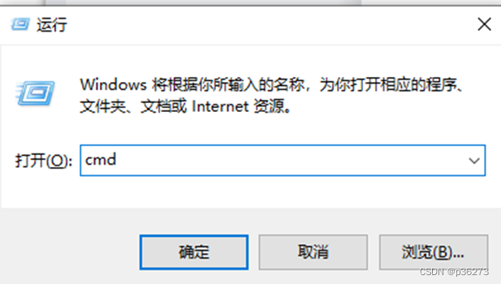

+ 输入指令ipconfig找到对应的网络

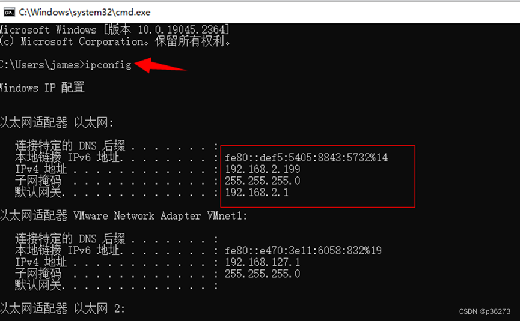

### 3、混杂模式介绍

+ 混杂模式概述:混杂模式就是接收所有经过网卡的数据包，包括不是发给本机的包，即不验证MAC地址。普通模式下网卡只接收发给本机的包（包括广播包）传递给上层程序，其它的包一律丢弃。
+ 一般来说，混杂模式不会影响网卡的正常工作，多在网络监听工具上使用。

### 4、如何开起混杂模式

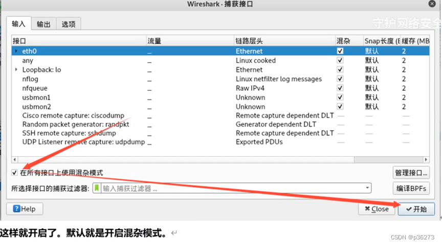

## 三、Wireshark过滤器使用

### 1、开启以上的混淆模式，抓取接口上使用混杂模式直接进行抓包

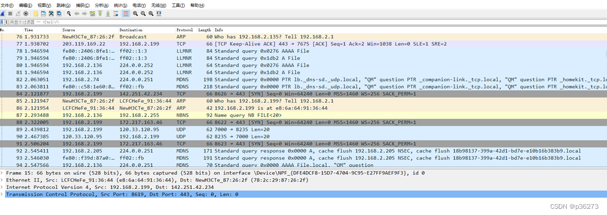

例1：对TCP协议的包进行筛选

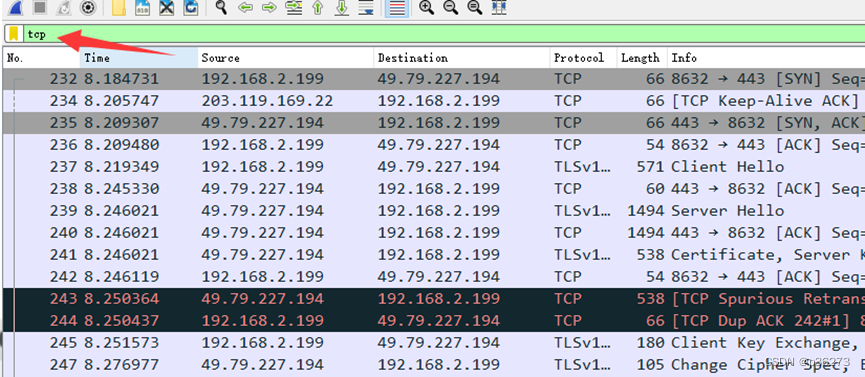

例2：筛选出ACK相关的包 。SYN=1、ACK=0：客户端请求向服务端建立连接。

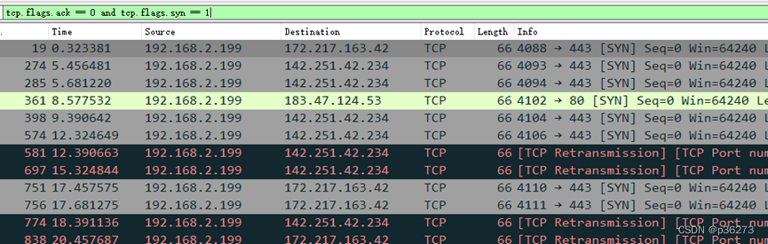

例3：抓取指定条件的包。tcp.flags.fin == 1 当 FIN=1 时，表明数据已经发送完毕，要求释放连接

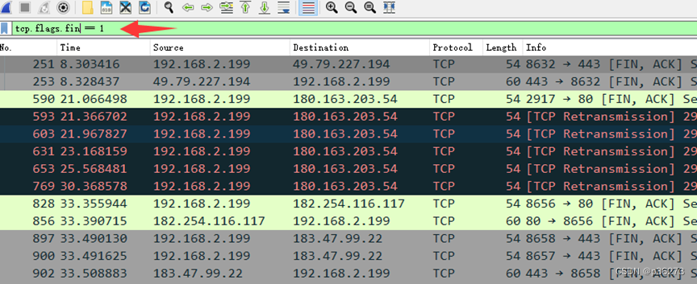

例4：筛选出ARP数据包

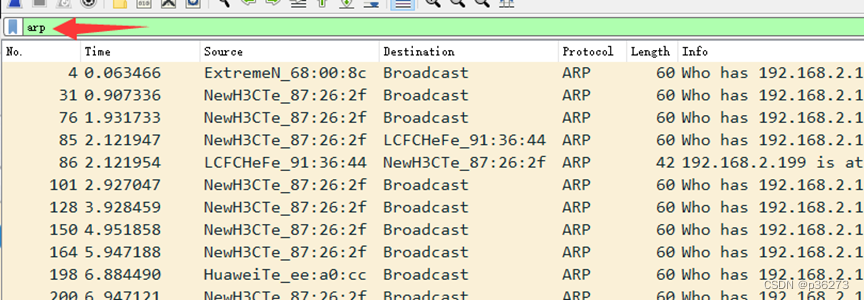

例5：筛选出udp属于传输层的数据包

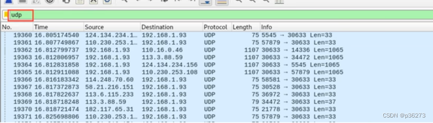

我们使用过滤器输入“udp”以筛选出udp报文。但是为什么输入udp之后出现那么多种协议呢?原因就是oicq以及dns都是基于udp的传输层之上的协议

扩展:客户端向DNS服务器查询域名，一般返回的内容都不超过512字节，用UDP传输即可。不用经过三次握手，这样DNS服务器负载更低，响应更快。理论上说，客户端也可以指定向DNS服务器查询时用TCP，但事实上，很多 DNS服务器进行配置的时候，仅支持UDP查询包。

例6：http请求

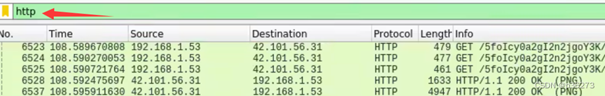

例7：dns数据包

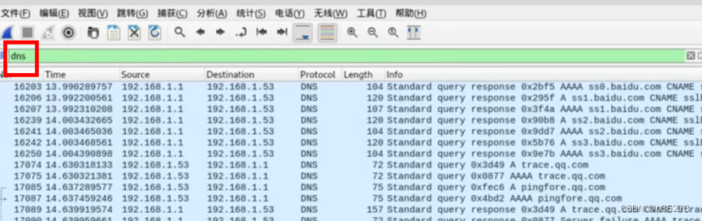

例8：数据包条件筛选  
其实我们不仅可以对协议类型进行筛选，我们还有跟多的筛选条件，比如源地址目的地址等等例6:筛选源地址是192.168.1.53或目的地址是192.168.1.1

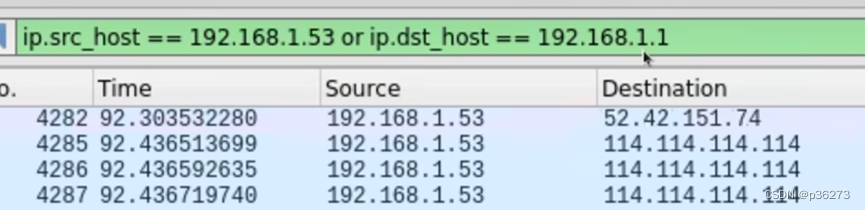

例9：本机向外发或接受的所有数据包

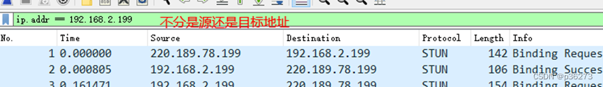

## 四、ARP协议

### 1、Arp协议解读

+ 协议分析的时候我们关闭混淆模式，避免一些干扰的数据包存在常用协议分析-ARP协议(英语:Address Resolution Protocol，细与︰AKP) 是一个通过解析网层地址来找寻数据链路层地址的网络传输协议，它在IPv4中极其重要。ARP是通过网络地址来定位MAC地址。
+ 主机向目标机器发送信息时，ARP请求广播到局域网络上的所有主机，并接收返回消息，以此确定目标的物理地址；收到返回消息后将该IP地址和物理地址，存入本机ARP缓存中并保留一定时间，下次请求时直接查询ARP缓存以节约资源。

### 2、分析ARP包

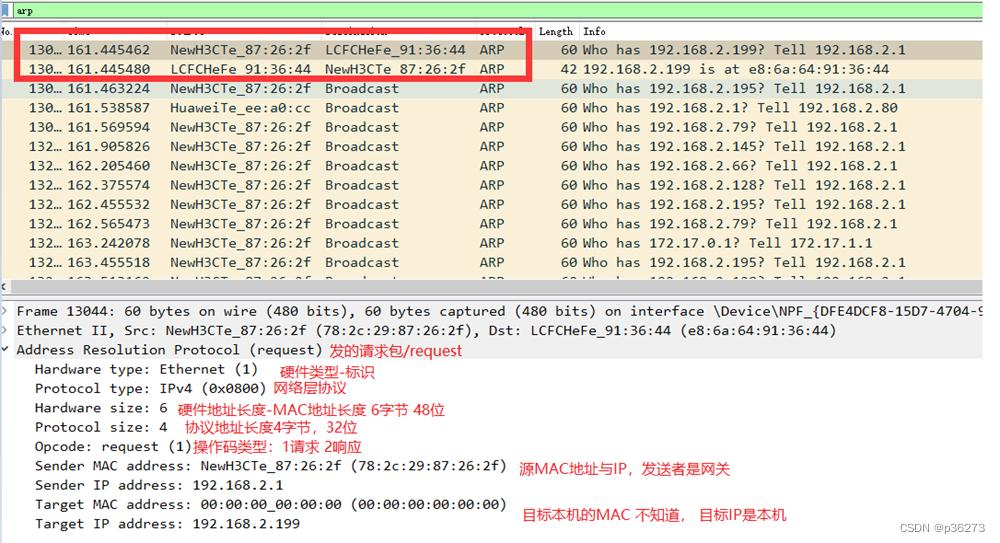

## 五、ICMP抓包与解读

### 1、先Ping一个地址，获得ICMP包

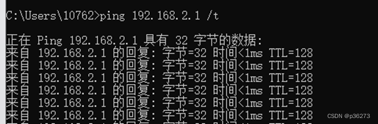

### 2、再筛选过滤icmp格式包

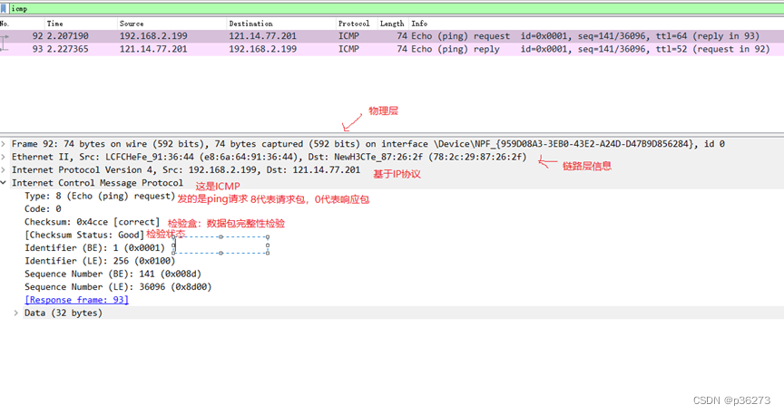

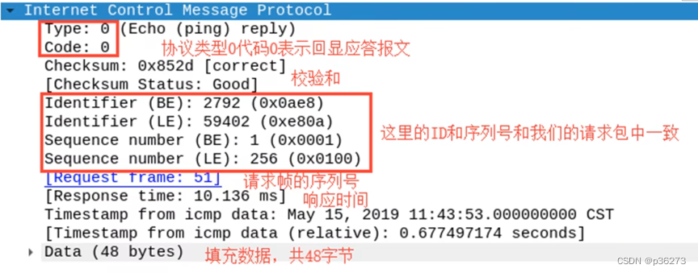工作过程:

+ 本机发送一个ICMP Echo Request的包
+ 接收方返回一个ICMP Echo Reply，包含了接受到数据拷贝和一些其他指令

## 六、TCP的3次握手协议

### 1、清空数据包然后筛选tcp开始抓包

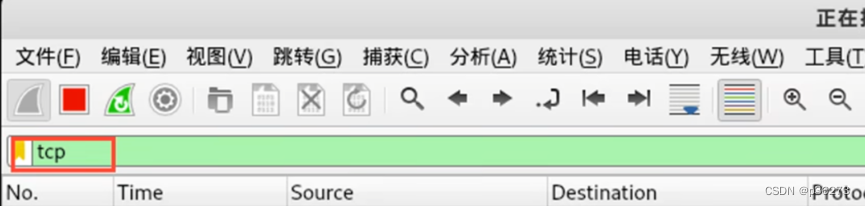

+ 选中一个包，进行解读

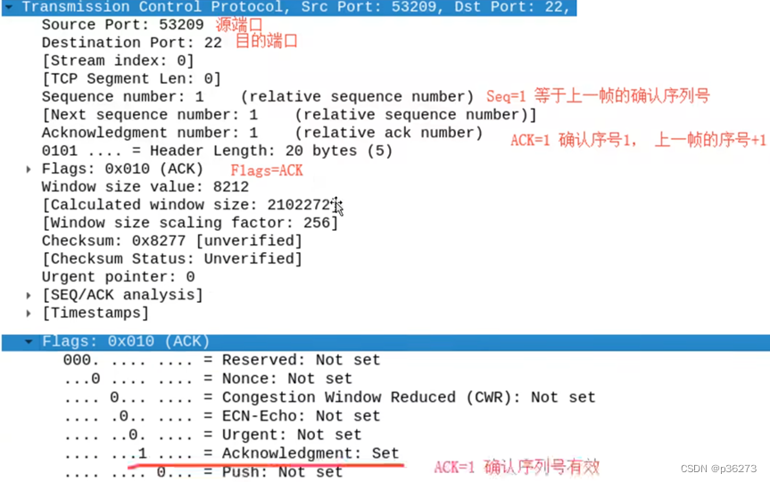

## 七、TCP连接断开的4次挥手

我们分析一下过程，我们在终端输入EXIT实际上是在我们Kali 上执行的命令，表示我们SSHD的Server端向客户端发起关闭链接请求。

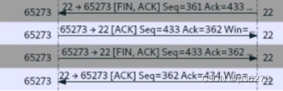

+ 我们分析一下过程，我们在终端输入EXIT实际上是在我们Kali上执行的命令，表示我们SSHD的Server端向客户端发起关闭链接请求。
+ 第一次挥手:
+ 服务端发送一个[FIN+ACK]，表示自己没有数据要发送了，想断开连接,并进入FIN_WAIT_1状态
+ 第二次挥手:
+ 客户端收到FIN后，知道不会再有数据从服务端传来，发送ACK进行确认，确认序号为收到序号+1(与SYN相同，一个FIN占用一个序号)，客户端进入CLOSE_WAIT状态.
+ 第三次挥手:
+ 客户端发送[FIN+ACK]给对方，表示自己没有数据要发送了，客户端进入LAST_ACK状态，然后直接断开TCP会话的连接，释放相应的资源。
+ 第四次挥手:
+ 服务户端收到了客户端的FIN信令后，进入TIMED_WAIT 状态并发迂
+ ACK确认消息。服务端在TIMED_WAIT 状态下，等待一段时间，没有数据到来，就认为对面已经收到了自己发送的ACK并正确关闭了进入 CLOSE状态，自己也断开了TCP连接，释放所有资源。当客户端收到服务端的ACK回应后，会进入CLOSE状态并关闭本端的会话接口，释放相应资源。

数据流的统计

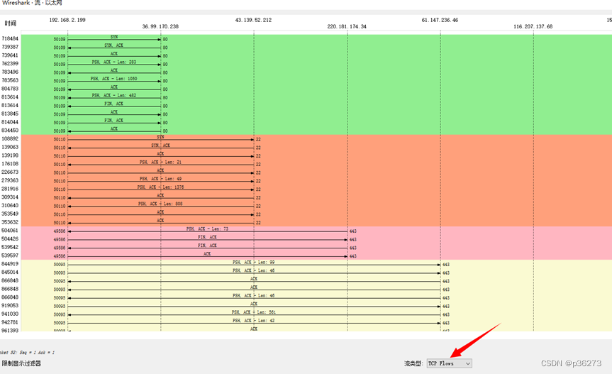

## 八、wireshark常用过滤条件

### 1、常用条件

+ ‘eq’和’==’ 等同
+ and 并且
+ or 或者
+ ‘!’ 和’not’ 取反

### 2、针对IP地址过滤

1.源地址：ip.src == 192.168…  
2.目的地址：ip.dst == 192.168.xx  
3.不看源或目的地址：ip.addr == 192.168.xx

### 3、针对协议过滤

1.某种协议的数据包 直接输入协议名字  
如：http  
2.排除某种协议  
not tcp 或者 ！tcp

### 4、针对端口过滤

1.捕获某端口的数据包  
tcp.port == 80  
tcp.srcport == 80  
tcp.dstport == 80  
2.捕获多端口  
udp.port >=2048

### 5、针对长度和内容过滤

1.长度过滤  
data.len > 0  
udp.lenth < 30  
http.content_lenth <= 20  
2.数据包内容过滤  
http.request.uri matches “vipscu”(匹配http请求中含有vipscu字段的请求信息)

> 更新: 2024-04-19 15:33:43  
> 原文: <https://www.yuque.com/linuxer/gscfv1/364489a34a230a294cb184576d8b6d81>