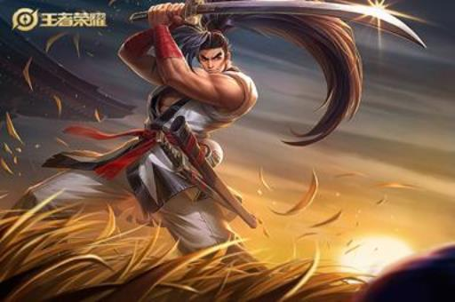

# 09.游戏中数据传输用啥协议（有没有改进的协议，基于UDP的可靠传输）

# 09.游戏中数据传输用啥协议（有没有改进的协议，基于UDP的可靠传输）

## 一、TCP协议

TCP协议是一种面向连接的协议，它通过三次握手建立连接，保证数据传输的可靠性。TCP协议主要用于游戏数据的传输，例如游戏中的聊天信息、玩家位置等。TCP协议能够保证数据的完整性和可靠性，但是由于需要建立连接，会增加网络延迟，影响游戏体验。

## 二、UDP协议

UDP协议是一种无连接的协议，它不需要建立连接，直接将数据包发送到目的地。UDP协议主要用于游戏的实时交互，例如游戏中的战斗、移动等。UDP协议具有传输速度快、延迟低等优点，但是由于没有保证数据的可靠性，会出现数据丢失的情况。

## 三、HTTP协议

HTTP协议是一种应用层协议，主要用于Web浏览器和Web服务器之间的数据传输。HTTP协议主要用于游戏的更新和下载等操作。HTTP协议具有简单、易用等优点，但是由于需要建立连接和传输大量数据，会增加网络延迟，影响游戏体验。

## 四、WebSocket协议

WebSocket协议是一种基于TCP协议的协议，它提供了双向通信的能力，可以实现实时交互。WebSocket协议主要用于游戏的实时通信，例如游戏中的多人对战等。WebSocket协议具有传输速度快、延迟低等优点，但是由于需要建立连接，会增加网络延迟。

综上所述，游戏中常用的网络协议有TCP协议、UDP协议、HTTP协议和WebSocket协议。不同的协议有不同的优缺点，游戏需要根据游戏的实际需求选择合适的协议。同时，游戏也可以结合多种协议，提高游戏的网络性能和用户体验。

> 更新: 2024-04-19 15:33:56  
> 原文: <https://www.yuque.com/linuxer/gscfv1/a270ea0b5a676471c855f794bd39f22c>