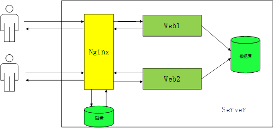
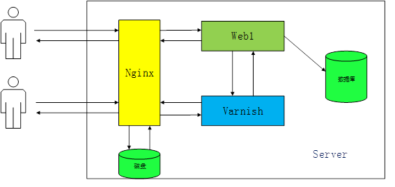
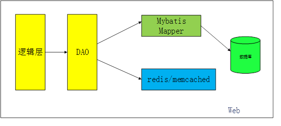
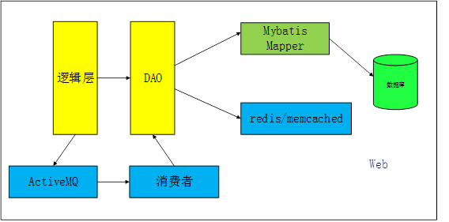
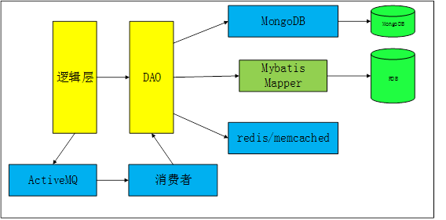
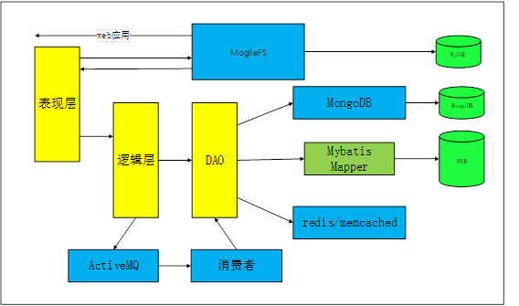

# 10.项目架构（webserver）两种高并发模式（问的很细）

# 10.项目架构（webserver）两种高并发模式（问的很细）

本文从网站架构层面介绍不同性能需求阶段，网络架构的演变和设计思考。

## 一、Nginx反向代理，实现负载均衡。

对于传统的低流量应用，基本够用，具有一定可扩展性。其中Nginx可以嵌套已经实现性能和服务扩展。

## 二，Varnish提升性能

为了方便画图，我只写了一个web，多数情况下都是多个web，其中增加了varnish对静态、动态资源进行缓存，以提高性能，大体可提供数倍的性能。Varnish也有反向代理的能力，但Nginx更优秀，所以建议采用两者配合的方式搭建架构。

## 三、缓存的使用以提升web性能

此处只是web服务本身性能提升，即图2中的web1服务，不涉及整体架构。架构设计中增加了缓存数据库，并不是每次访问都去数据库，从而大大提高效率，目前redis用的比较多，网上也很多对比资料，这里就不废话了。

## 四、消息中间件进一步提升web服务性能

ActiveMQ 是一个 MOM，具体来说是一个实现了 JMS 规范的系统间远程通信的消息代理。用于以分布式应用或系统中的异步、松耦合、可靠、可扩展和安全通信。这类的通讯组件很多，基本架构也大同小异，这里也不多说了，简单架构示意如下：

## 五、使用MongoDB

MongoDB 是一个基于分布式文件存储的数据库。旨在为 WEB 应用提供可扩展的高性能数据存储解决方案。应用后架构如下

## 六、应用MogileFS

MogileFS是一个开源的分布式文件存储系统,用来分担海量小文件的存取工作，架构如下：

## 七、总结

1. 使用Ngnix做负载均衡，以应对高并发的访问
2. 使用varnish和Memcached/redis来再不同层面做缓存，以提高性能
3. 使用ActiveMQ来实现异步业务处理，来提高系统性能和可伸缩性。
4. 使用MongoDB来支持海量数据处理，同时也提高系统可伸缩性。
5. 使用MogileFS来支持海量小文件的存储。

> 更新: 2024-04-19 15:33:57  
> 原文: <https://www.yuque.com/linuxer/gscfv1/f2f3309e0260245ca2376df74a869c00>